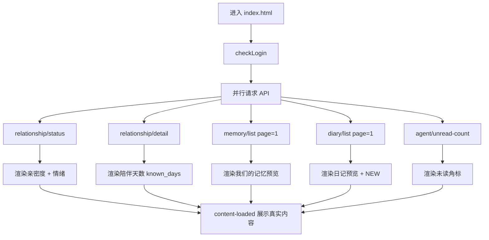

# 林小梦主页改版 PRD

> 版本：v1.7
> 状态：**需求已全部对齐**（C1–C19、Q1–Q4、R1–R4、N1–N5 已确认；K1–K7 已闭合，见 §12）
> 涉及模块：H5 主页（`frontend/pages/index.html`）、关系模块、记忆模块、日记模块、聊天入口、主题样式层
> 基准代码：`lxm_for/frontend/pages/index.html`
> 目标参照：深夜版主页设计稿（深色玻璃拟态 / 赛博紫调）

---

# 1. 功能背景

## 当前功能是什么

当前主页为**浅色漫画风**竖屏布局，结构为：

1. **Hero 区**：角色顶图 + 叠层顶栏（用户首字母头像、设置）+ 角色名「林小梦」+ 状态气泡
2. **关系进度卡**：等级文案 + 成长值进度条（调用 `GET /api/relationship/status`）
3. **三宫格功能入口**：我的记忆 / 她的日记 / 关系状态（跳转子页）
4. **底部主 CTA**：「进入聊天」+ 未读主动消息角标（`GET /api/agent/unread-count`）

## 当前存在的问题

| 问题 | 说明 |
|---|---|
| 视觉风格偏差大 | 当前为浅紫渐变 + 白卡；目标为深色夜景 + 玻璃拟态 + 霓虹紫蓝 |
| 信息密度不足 | 目标在主页直接展示记忆/日记/关系预览卡，当前仅为小入口按钮 |
| 交互入口缺失 | 目标有 5 项快捷互动（语音/视频/听歌/入睡/更多），当前全无 |
| 氛围感不足 | 目标有时间段（深夜）、角色台词、波形、心情标签；当前仅有单行状态语 |
| 指标命名不一致 | 目标「默契值」；当前展示为成长值进度，关系页称「亲密度」 |
| 主 CTA 文案不一致 | 目标「和她说说话吧」；当前「进入聊天」 |

## 改造目标

将主页从「功能入口聚合页」升级为「角色陪伴沉浸首页」，在**不破坏现有子页面与 API 能力**的前提下，对齐目标设计稿的布局、视觉与信息架构。

---

# 2. 方案确认决策记录

| 编号 | 问题 | 决策 |
|---|---|---|
| C1 | 改造基准项目 | ✅ 以 `lxm_for` 生产 H5 为准；`Ulxm-main` React 原型不同步改 |
| C2 | 视觉主题切换范围 | ✅ 主页独立深色主题（`index.html` 局部样式），**不**全局改 `h5-theme.css` |
| C3 | 设计稿「默契值」与现有成长值关系 | ✅ **已确认（2026-06-07）**：产品展示名统一为「**亲密度**」（与 `relationship.html` 亲密进度同义）；数据仍复用 `growth_value` + `progress_percent`，**仅改 label，不改算法** |
| C4 | 「陪伴你的第 N 天」数据来源 | ✅ **已确认（2026-06-07）**：使用 **`known_days`（相识天数）**，取自 `GET /api/relationship/detail` → `milestones.known_days` |
| C5 | 快捷互动 5 项（语音/视频/听歌/入睡/更多） | ✅ **已确认（2026-06-07）**：**首期做 UI 入口**；已登录点击 → Toast「敬请期待」。未登录分支见 **N1**（本期不实现，首页沿用 `checkLogin()`） |
| C6 | 记忆卡标题 | ✅ **已确认（2026-06-07）**：主页标题为「**我们的记忆**」（当前为「我的记忆」，需改名；子页 `memory.html` 标题可保持现状） |
| C7 | 关系阶段文案 | ✅ **已确认（2026-06-07）**：**沿用现有四级**（陌生 / 朋友 / 亲密 / 知己），**不**采用设计稿示意「朋友以上·暧昧未满」等副标题体系 |
| C8 | 波形 / Good night 装饰 | ✅ 首期纯视觉装饰，不接真实语音流；Good night 显示时段见 **Q2-B**（§4.8.1） |
| C9 | 底部 CTA | ✅ 文案改为「和她说说话吧」+ 副文案「她在等你哦」，跳转 `/pages/chat.html` 不变 |
| C10 | 设置入口 | ✅ **已确认（2026-06-07）**：右上角「**亲密度**」胶囊/进度组件 **即设置入口**，点击跳转 `/pages/settings.html`；**移除**现网独立 ⚙️ 按钮 |
| C11 | 时段与时钟 | ✅ **已确认（2026-06-07）**：按北京时间分 8 段；Hero 展示 **24h 时钟**（冒号闪动）+ **时段词**（见 §4.8）；§4.8 配套句 **本期无展示位**（关怀卡已移除，Q1） |
| C12 |「她此刻的心情」| ✅ **已确认（2026-06-07）**：**不展示**（DOM 隐藏或不做该模块） |
| C13 | 关怀语独立卡 | ✅ **已确认（2026-06-07，Q1）**：**整卡移除**，本期不做设计稿底部 Avatar 关怀语卡 |
| C14 | 亲密度数字 | ✅ **已确认（2026-06-07）**：指右上角亲密度组件；**可显示** `current_growth / next_threshold` 数值 |
| C15 | 关系状态卡副文案 | ✅ **已确认（2026-06-07）**：**C15-C** — 等级名下**无**第二行说明；仅保留卡片固定副标题「你们的关系在慢慢升温」+ 四级 `level_name` |
| C16 | 日记预览文案与时间 | ✅ **Q3-C + R4**：固定句 + `formatTime`（刚刚 / N分钟前 / N小时前 / M月D日）；**不**展示正文摘要 |
| C17 | 记忆/日记配图 | ✅ **已确认（2026-06-07）**：静态占位图路径已定——记忆 `/static/images/Index/in_memery/sunset.png`；日记 `/static/images/Index/in_diary/diary_1.png` |
| Q2 | Good night 手写装饰 | ✅ **已确认（2026-06-07）**：**Q2-B** — **深夜**（00:00–04:59）与 **晚上**（20:00–23:59）显示；其余时段隐藏（§4.8.1） |
| Q4 | 日记卡 Lv0 锁 | ✅ **已确认（2026-06-07）**：关系 **Lv0** 时预览卡显示 **锁图标**；点击仍可进 `diary.html`（与现网日记页逻辑一致） |
| C18 | Hero 立绘资源 | ✅ **已确认（2026-06-07）**：**沿用**现网 `/static/images/Index/index.png`，靠深色 CSS 遮罩/滤镜适配夜景主题 |
| C19 | 中部关系横卡 | ✅ **已确认（2026-06-07）**：**C19-A** — **删除**现网 `.home-rel-card` 横卡；亲密度仅在顶栏，等级仅在「关系状态」预览卡 |
| R1 | 顶栏林小梦头像 | ✅ **R1-B**：随 `ai_current_emotion` 切换（`updateAvatarEmotion` / `AVATAR_MAP`，与 `settings.html` 一致） |
| R2 | 记忆预览取条规则 | ✅ **R2-C**：本期接受 API 首条（`doc_id` 序，非时间序）；空列表走空态；语义「最近一条」留 TD-HOME-06 |
| R3 | Lv3 亲密度数字 | ✅ **R3-A**：`next_threshold` 为 `null` 时显示 `{growth_value} / 已满级`，进度条 100% |
| R4 | 日记相对时间口径 | ✅ **R4**：严格复用 `api.js` 的 `formatTime`（刚刚 / N分钟前 / N小时前 / M月D日）；**不**做「今天」或 HH:mm 时刻 |
| N1 | 首页登录策略 vs C5 | ✅ **已确认（2026-06-09）**：**本期**维持全站 `checkLogin()`（首页无 token 即跳登录）；快捷互动**仅**实现已登录 → Toast，C5 未登录列本期不验收。token 中途失效由 `request()` 401 跳登录。**远期**首页游客浏览单独立项（N1-B backlog，见 TD-HOME-08） |
| N2 | Hero 黄粉装饰球 | ✅ **已确认（2026-06-09）**：**移除**现网 `h5-theme.css` 黄粉装饰球（`.h5-home-decor::before/::after`）；`index.html` 局部隐藏或删除 DOM，不改全局 theme |
| N3 | 记忆预览是否展示 key | ✅ **已确认（2026-06-09）**：预览卡**仅** `(value \|\| content)` **单行**截断 ~40 字，**不展示** `key`；子页 `memory.html` 仍保持 key+value 双行 |
| N4 | 状态语兜底抽取 | ✅ **已确认（2026-06-09）**：`EMOTION_STATUS_MAP` + `resolveStatusText(data)` **上收** `api.js`；`index.html` 与 `settings.html` 共用；settings 删除本地重复定义（清偿 TD-HOME-07） |
| N5 | contract / 静态测试同步 | ✅ **已确认（2026-06-09）**：与 `index.html` **同 PR** 三联更新——`test_index_html_home_surface_contract` + `docs/contract.md` 文首首页摘要（废止 2026-05-23 旧摘要表述） |

---

# 3. 功能改动说明

## 改动前（当前）

```
[顶栏: 用户首字母 | 设置]
[Hero 角色大图]
  └ 林小梦 + 状态气泡
[关系进度卡 - 横向]
[记忆 | 日记 | 关系状态] ← 三宫格小按钮
[进入聊天] ← 底部固定
```

- 风格：浅色、白卡、圆角阴影
- 数据：仅 `relationship/status` + `agent/unread-count`
- 子模块：无预览，需跳转才看内容

## 改动后（目标）

```
[顶栏: 情绪头像+名+♥+陪伴第N天 | 亲密度→设置]
[Hero: 立绘 + Good night(条件) + 时钟时段 + 台词 + 波形]
[快捷互动栏: 语音|视频|听歌|入睡|更多]
[我们的记忆卡 | 她的日记卡 | 关系状态卡]  ← 三张纵向预览卡
[和她说说话吧 - 渐变底栏 CTA]
```

- 风格：深色、玻璃拟态、紫蓝霓虹、纵向滚动
- 数据：聚合 `relationship/status`、`relationship/detail`、`memory/list`、`diary/list`
- 子模块：主页内嵌预览，点击整卡跳转子页
- **不做**：关怀语卡（Q1）、心情标签（C12）、中部关系横卡（C19）

## 核心变化汇总

| 维度 | 改动前 | 改动后 |
|---|---|---|
| 色彩 | 浅紫渐变 `#f8f4ff` | 深黑紫 `#0a0a1a` ~ `#1A1A2E` + `#A855F7` 强调 |
| 布局 | Hero + 2 行模块 + CTA | Hero + 互动栏 + **3** 张信息卡 + CTA |
| 顶栏信息 | 用户头像 + 设置 | 情绪头像 + 角色信息 + 亲密度（点进设置） |
| 关系展示 | 单行进度卡 | 独立「关系状态」预览卡 + 顶栏亲密度 |
| 记忆/日记 | 图标按钮 | 富文本预览卡 |
| 新增能力 | — | 时间感知、快捷互动（占位）、Good night 装饰 |

---

# 4. 功能详细逻辑

## 4.1 功能对比总表（目标设计稿 vs 当前 `index.html`）

图例：**目标有** = 设计稿是否包含；**当前有** = 现网是否已实现；**对齐** = 已有或部分已有能力如何映射到目标。

| # | 功能模块 | 目标有 | 当前有 | 差异状态 | 功能对齐方案 |
|---|---|:---:|:---:|---|---|
| 1 | 深色夜景 + 玻璃拟态主题 | ✅ | ❌ | 缺失 | 重写 `index.html` 局部 CSS，不改全局 `h5-theme.css`（C2） |
| 2 | 顶栏：林小梦头像 + 名 + ♥ | ✅ | ⚠️ | 需改造 | 情绪头像（R1-B）+「林小梦」+ 紫色心形；名从 Hero 上移至顶栏 |
| 3 | 顶栏：「陪伴你的第 N 天」 | ✅ | ❌ | 缺失 | 新增；数据 `GET /api/relationship/detail` → `milestones.known_days`（C4） |
| 4 | 顶栏：亲密度进度条 | ✅ | ⚠️ | 需改造 | 上移至顶栏；label「亲密度」；**可显示** `current_growth/next_threshold`（C14）；**点击跳转设置页**（C10） |
| 5 | 顶栏：设置入口 | ✅ | ✅ | 需合并 | 不单独放 ⚙️；**亲密度组件即设置入口** → `settings.html`（C10） |
| 6 | 顶栏：用户首字母头像 | ❌ | ✅ | 目标无/当前有 | 从顶栏移除；用户入口可经设置页或远期「更多互动」 |
| 7 | Hero 角色立绘大图 | ✅ | ✅ | 需改造视觉 | **沿用** `index.png`（C18）+ 深色遮罩/滤镜，不改图片文件 |
| 8 | Hero：实时时钟 + 时段标签 | ✅ | ❌ | 缺失 | 北京时间 24h，`HH:mm` 冒号闪动 + 时段词（§4.8 八段表） |
| 9 | Hero：角色台词/欢迎语 | ✅ | ⚠️ | 需改造 | 大字号引号台词；`api.js` `resolveStatusText`（**N4**）：`status_text` → `EMOTION_STATUS_MAP` → 默认文案 |
| 10 | Hero：音频波形装饰 | ✅ | ❌ | 缺失 | CSS/SVG 纯装饰动画，不接语音流（C8） |
| 11 | Hero：「她此刻的心情」标签 | ✅ | ❌ | **不做** | C12：**隐藏**，首期不展示 |
| 12 | Hero：Good night 手写装饰 | ✅ | ❌ | 缺失 | Hero 左侧手写「Good night」；**深夜+晚上**显示（Q2-B）；纯装饰（C8） |
| 13 | 快捷互动栏（5 项） | ✅ | ❌ | 缺失 | 新增 UI：语音/视频/听歌/入睡/更多；已登录 Toast「敬请期待」（C5 + **N1**：本期不测未登录分支） |
| 14 | 「我们的记忆」预览卡 | ✅ | ⚠️ | 需改造 | 现网为三宫格小按钮「**我的记忆**」无预览；改为纵向富卡片 + `GET /api/memory/list` 首条 `content` 截断（C6）；标题改「我们的记忆」 |
| 15 | 「她的日记」预览卡 | ✅ | ⚠️ | 需改造 | 固定句 + 相对时间（Q3-C）；Lv0 显示锁（Q4-A）；`diary/list` 取 `created_at` / `is_read` |
| 16 | 「关系状态」预览卡 | ✅ | ⚠️ | 需改造 | 独立预览卡：固定副标题 + 四级 `level_name`（C7）；等级下无第二行（C15-C） |
| 17 | 角色关怀语独立卡 | ✅ | ❌ | **不做** | Q1 / C13：**整卡移除** |
| 18 | 底部 CTA「和她说说话吧」 | ✅ | ⚠️ | 需改造 | 现网为「进入聊天」跳转 `chat.html`；改主副文案 + 渐变底栏样式；**保留** `#unread-badge` 未读角标（C9） |
| 19 | 纵向滚动多卡布局 | ✅ | ⚠️ | 需改造 | 现网基本一屏（Hero + 关系卡 + 三宫格 + CTA）；改为 Hero 沉浸 + 下方卡片区可滚动 |
| 20 | 骨架屏加载态 | — | ✅ | 需改造 | 现网有 skeleton；结构需匹配新卡片布局 |
| 21 | 记忆/日记/关系子页跳转 | ✅ | ✅ | 已有 | 现网已跳转 `memory.html` / `diary.html` / `relationship.html`；主页改为整卡点击，路径不变 |
| 22 | 未读主动消息角标 | — | ✅ | 保留 | 现网 `GET /api/agent/unread-count`；迁移到新 CTA 按钮上 |
| 23 | 关系 API 数据加载 | ⚠️ | ⚠️ | 需扩展 | 现网仅 `relationship/status` + `unread-count`；改版后并行加 `detail`、`memory/list`、`diary/list` |

### 4.1.1 统计摘要

| 维度 | 数量 |
|---|---|
| 目标有、当前无（纯新增） | 8 项（#1、#3、#8、#10–#13）；#17 关怀卡不做 |
| 双方都有、需视觉/布局改造 | 8 项（#2、#4、#7、#9、#14–#16、#18–#19） |
| 当前有、目标无（需处理） | 2 项（#5 设置、#6 用户头像） |
| 双方都有、基本保留 | 3 项（#21–#23） |

## 4.1.2 已有功能对齐明细

以下为**当前已实现**且改版后**保留能力**的逐项对齐，避免重复造轮子。

| 现有能力 | 当前表现 | 目标对齐方式 |
|---|---|---|
| Hero 角色图 | `index.png` 浅色场景 | **不换图**（C18）；深色主题靠 CSS 遮罩；保留 `cover` 沉浸占比 |
| 角色名「林小梦」 | Hero 下缘白字 + 星标 | 上移至顶栏左侧，与头像、心形、陪伴天数组合 |
| 状态语 `#status-text` | 白色小气泡，单行；兜底与 settings **不一致** | 升级为 Hero 大台词样式；`api.js` 的 `resolveStatusText`（**N4**）：`status_text` → `EMOTION_STATUS_MAP` → 默认文案 |
| Hero 黄粉装饰球 | `.h5-home-decor` 动画球（`h5-theme.css`） | **移除**（**N2**）；深色夜景不与漫画风装饰共存 |
| 关系进度 | `.home-rel-card` 横卡：`LEVEL_LABELS[level]` + 进度条 + `current_growth/next_threshold` | 进度条上移至顶栏「亲密度」；等级名下沉至「关系状态」预览卡；**删除**中部横卡（C19-A） |
| 三宫格入口 | 「我的记忆」「她的日记」「关系状态」仅图标+标题 | 拆为三张纵向预览卡；跳转 URL **不变** |
| 进入聊天 | `btn-primary` 胶囊「进入聊天」→ `chat.html` | 改文案为「和她说说话吧」+「她在等你哦」；保留未读角标动画 |
| 设置 | 右上角 ⚙️ → `settings.html` | ⚙️ **移除**；改由右上角「亲密度」组件点击进入设置（C10） |
| 登录校验 | `checkLogin()` 页头调用 | **本期维持**页头 `checkLogin()`（**N1**）；快捷互动仅实现已登录 Toast |
| 骨架屏 | 关系卡 + 三宫格占位 | 扩展为互动栏 + **三张**信息卡占位（无关怀卡） |

## 4.2 快捷互动栏逻辑（C5 + N1）

| 入口 | 已登录（本期实现） | 未登录（本期不验收） |
|---|---|---|
| 语音通话 | Toast「敬请期待」 | —（首页 `checkLogin()` 已拦截，见 N1） |
| 视频通话 | 同上 | 同上 |
| 一起听歌 | 同上 | 同上 |
| 陪我入睡 | 同上 | 同上 |
| 更多互动 | 同上（远期可收纳设置等） | 同上 |

**登录态（N1）**：本期首页保留页头 `checkLogin()`，无 token 用户无法进入主页，**不单独实现** C5 未登录跳转逻辑。token 中途失效时，`request()` 返回 401 仍会清 token 并跳转 `/pages/login.html`。

**远期（N1-B / TD-HOME-08）**：放开首页游客浏览后，快捷互动、预览卡、底部 CTA 统一「未登录 → 跳登录」。

## 4.3 亲密度展示逻辑（C3）

| 字段 | 来源 | 展示 |
|---|---|---|
| 进度百分比 | `GET /api/relationship/status` → `progress_percent` | 顶栏亲密度进度条 |
| 数值 | `current_growth` / `next_threshold` | **展示**（C14），如 `344 / 800`；满级显示 `{value} / 已满级`（R3-A） |
| 文案 | 固定 label | 「亲密度」 |
| 点击行为 | — | 整卡可点 → `/pages/settings.html`（C10） |

## 4.4 陪伴天数逻辑（C4）

| 字段 | 来源 | 展示 |
|---|---|---|
| `known_days` | `GET /api/relationship/detail` → `milestones.known_days` | 「陪伴你的第 {N} 天」 |

**加载策略**：主页 `loadPage()` 并行请求 `status` + `detail`（或后端后续将 `known_days` 并入 `status`，见 §6.2）。

## 4.5 记忆卡逻辑（C6）

| 项 | 规则 |
|---|---|
| 标题 | 「我们的记忆」 |
| 副标题 | 「她记得你们的点点滴滴」 |
| 预览 | `GET /api/memory/list?page=1&page_size=1` 首条；**单行**展示 `(value \|\| content)` 截断 ~40 字（**N3**：不展示 `key`；取条字段同 memory，版式为摘要非列表复刻） |
| 取条规则 | API 按 `doc_id` 排序，**非**时间序最近一条（R2-C，见 TD-HOME-06） |
| 配图 | `/static/images/Index/in_memery/sunset.png` |
| 空态 | 「她还在了解你，暂无记忆」 |
| 点击 | 跳转 `/pages/memory.html` |

## 4.5.1 日记卡预览逻辑（C16 + Q3-C + Q4-A）

| 项 | 规则 |
|---|---|
| 预览内容 | **仅两行**：① 固定句「今天记录点什么好呢...」② 最新日记相对时间 |
| 正文摘要 | **不展示** `items[0].content` |
| 时间行 | 有日记时：`formatTime(items[0].created_at)`（R4：刚刚 / N分钟前 / N小时前 / M月D日）；无日记时隐藏或「—」 |
| NEW 角标 | 有未读日记（`is_read === false`）时显示 |
| 锁图标 | 关系等级 **Lv0** 时显示锁（Q4-A）；Lv1+ 不显示 |
| 配图 | `/static/images/Index/in_diary/diary_1.png` |
| 点击 | 跳转 `/pages/diary.html`（Lv0 亦同） |

## 4.6 关系状态卡逻辑（C7 + C15）

| 层级 | 文案 | 来源 |
|---|---|---|
| 卡片副标题 | 「你们的关系在慢慢升温」 | 前端固定文案（设计稿） |
| 等级主文案 | 陌生 / 朋友 / 亲密 / 知己 | API `level_name` 或 `status.level` 映射（C7） |
| 等级下第二行 | **无** | C15-C：不展示 `description` / `LEVEL_LABELS` |

**不**引入「朋友以上·暧昧未满」等设计稿示意副标题。

## 4.8 北京时间时段表（C11 / C13）

**时区**：`Asia/Shanghai`（北京时间）。**时钟**：24 小时制 `HH:mm`，中间冒号按电子表样式周期性闪动（CSS 动画，`prefers-reduced-motion` 下常亮）。

| 时段词 | 时间范围（含起止） | 配套文案（备查，本期无 UI） |
|---|---|---|
| 深夜 | 00:00 – 04:59 | 这么晚还没休息呀？ |
| 清晨 | 05:00 – 07:59 | 今天起得很早呢 |
| 上午 | 08:00 – 11:59 | 你在做什么？ |
| 中午 | 12:00 – 13:59 | 记得按时吃午饭 |
| 下午 | 14:00 – 17:59 | 要不要来点下午茶？ |
| 傍晚 | 18:00 – 19:59 | 今天堵车么？ |
| 晚上 | 20:00 – 23:59 | 今天过得怎么样？ |

**展示分工**：

- **Hero 区**：时钟 + 时段词（如 `01:24  深夜`）；大台词走 `status_text` 链路。
- **配套文案**：关怀语卡已移除（Q1），上表配套句 **本期不展示**，仅作日后扩展备查。

**实现提示**：前端用 `Intl` 或手动 offset 取北京时间小时/分钟，避免仅依赖用户本机非北京时区。

## 4.8.1 Good night 装饰逻辑（Q2-B）

| 项 | 规则 |
|---|---|
| 位置 | Hero 立绘区 **左侧**，半透明手写体英文 `Good night`，叠在背景上 |
| 显示时段（北京时间） | **深夜** 00:00–04:59 **或** **晚上** 20:00–23:59 |
| 隐藏时段 | 清晨 / 上午 / 中午 / 下午 / 傍晚（05:00–19:59） |
| 判定式 | 北京时间 `hour >= 20` 或 `hour < 5`（`hour` 为 0–23 整数） |
| 交互 | 无，纯 CSS/字体装饰；`prefers-reduced-motion` 下仍展示（无动画要求） |
| 字体 | 手写/script 风格（可用 `Ma Shan Zheng` 或相近 web font，与关系页一致） |

## 4.7 完整页面加载流程



---

# 5. 边界情况

## 数据为空

| 场景 | 处理 |
|---|---|
| 记忆列表为空 | 卡片显示「她还在了解你，暂无记忆」 |
| 日记列表为空 | 仍显示固定句「今天记录点什么好呢...」；时间行隐藏或「—」；无 NEW |
| `detail` 请求失败 | 陪伴天数显示「—」或隐藏；其余模块正常 |
| `status_text` 缺失 | `api.js` `resolveStatusText`：`EMOTION_STATUS_MAP[ai_current_emotion]` → 默认文案（**N4**） |

## 权限与等级

| 场景 | 处理 |
|---|---|
| Lv0 日记未解锁 | 预览卡显示锁图标（Q4-A）；固定句+时间仍展示；点击仍可进 diary 页 |
| 快捷互动未登录 | 本期不可达（**N1**：`checkLogin()` 页头拦截）；远期游客模式见 TD-HOME-08 |
| 未读 >99 | 沿用 `formatBadgeCount` |

## 视觉与设备

| 场景 | 处理 |
|---|---|
| 安全区 | `env(safe-area-inset-*)` |
| 小屏 | Hero `min-height: 50vh`；卡片区可滚动 |
| `prefers-reduced-motion` | 波形动画可关闭；Good night 装饰仍显示 |
| Good night 时段切换 | 跨 05:00 / 20:00 边界时随北京时间刷新（可与时钟共用 `setInterval` 或每分钟 tick） |

## 不改动范围

- `memory.html` / `diary.html` / `relationship.html` / `chat.html` 子页面业务逻辑
- 后端关系成长算法、记忆检索、日记生成
- 全局 `h5-theme.css` 与其他页面主题

---

# 6. 数据结构

## 6.1 现有 API

```json
// GET /api/relationship/status
{
  "level": 1,
  "level_name": "朋友",
  "growth_value": 344,
  "current_growth": 344,
  "next_threshold": 800,
  "progress_percent": 24,
  "silence_days": 0,
  "ai_current_emotion": "想念"
}

// GET /api/relationship/detail
{
  "milestones": {
    "known_days": 27,
    "consecutive_login_days": 5,
    "total_conversation_rounds": 120
  },
  "level_info": {
    "level": 1,
    "name": "朋友",
    "description": "已经是熟悉的朋友..."
  }
}

// GET /api/memory/list?page=1&page_size=1
{ "list": [{ "content": "用户喜欢喝咖啡" }] }

// GET /api/diary/list?page=1&page_size=1
// 注意：日记列表字段为 items（非 list），见 contract.md
{ "items": [{ "content": "...", "is_read": false, "created_at": "...", "covers_beijing_date": "2026-06-07" }] }
```

## 6.2 建议后续优化（非本期必做）

| 项 | 说明 | 优先级 |
|---|---|---|
| `known_days` 并入 `/api/relationship/status` | 减少主页一次 `detail` 请求 | P2 |
| `status_text` 写入 `status` 响应 | 与 settings 页一致 | P2 |
| `GET /api/home/summary` 聚合接口 | 一次返回全部预览数据 | P3 |

---

# 7. 改造范围与文件索引

| 文件 | 改动内容 | 改动量 |
|---|---|---|
| `frontend/pages/index.html` | 结构、深色 CSS、卡片、快捷栏、数据加载；移除装饰球 DOM/样式（**N2**） | **大** |
| `frontend/static/js/api.js` | 新增 `EMOTION_STATUS_MAP`、`DEFAULT_STATUS_TEXT`、`resolveStatusText`（**N4**） | 小 |
| `frontend/pages/settings.html` | 删除本地状态语 map，改引 `api.js`（**N4**） | 小 |
| `tests/test_h5_static_contract.py` | 重写 `test_index_html_home_surface_contract`（K6 + **N5**） | 小 |
| `docs/contract.md` | 文首追加首页深色改版摘要，废止 2026-05-23 旧首页表述（**N5**） | 小 |
| `frontend/static/images/Index/in_memery/sunset.png` | 记忆卡占位图（C17） | 已有 |
| `frontend/static/images/Index/in_diary/diary_1.png` | 日记卡占位图（C17） | 已有 |
| `frontend/static/images/Index/index.png` | Hero 立绘（C18，不换图） | 已有 |
| `frontend/static/css/common.css` | 可选：主页色板变量 | 小 |
| `backend/routers/relationship.py` | 可选：`status` 补字段 | 小（非本期必做） |
| 子页面及其他前端 | 不改 | — |

### 7.1 静态契约测试锚点（N5，DOM 定稿后微调）

| 动作 | 锚点 |
|---|---|
| **保留** | `unread-badge`、`/api/agent/unread-count`、`home-hero`、`index.png`、`linxiaomeng-avatar`、`status-text` |
| **新增** | `updateAvatarEmotion`、`resolveStatusText`（或 `api.js` 引用）、`/api/relationship/detail`、`/api/memory/list`、`/api/diary/list`、CTA「和她说说话吧」 |
| **删除** | `home-rel-card`、`home-feature-grid`、`h5-home-decor::before`、theme `.home-rel-card .progress-bar` 渐变断言 |

---

# 8. 技术债标注

| 编号 | 说明 |
|---|---|
| TD-HOME-01 | `status_text` 在 `status` 接口可能未返回，需前端映射兜底 |
| TD-HOME-02 | 快捷互动 5 项无后端能力，本期仅 UI + Toast（C5） |
| TD-HOME-03 | 记忆/日记预览无配图 API，均为静态占位图（C17） |
| TD-HOME-05 | Hero 时钟须按北京时间计算，勿仅用 `new Date()` 本地时区 |
| TD-HOME-04 | voice/image 多模态在 contract 中标注未实现 |
| TD-HOME-06 | 记忆预览取 API 首条（`doc_id` 序），非语义「最近记忆」（R2-C） |
| TD-HOME-07 | Hero 台词须复用 `api.js` 的 `resolveStatusText`（**N4** 落地后关闭） |
| TD-HOME-08 | **远期**：首页游客浏览模式（**N1-B**）；放开 `checkLogin` 后快捷互动/预览卡/CTA 统一未登录引导 |

---

# 9. 检查项

| 项目 | 状态 |
|---|---|
| C1–C19、Q1–Q4、R1–R4、N1–N5 全部确认 | ✅ |
| K1–K7 潜在冲突已闭合（§12） | ✅ |
| 功能对比表完整（§4.1） | ✅ |
| 北京时间时段表（§4.8） | ✅ |
| 最终页面结构示意（§10） | ✅ |
| 子页面与后端核心逻辑不受影响 | ✅ |

---

# 10. 最终页面结构（定稿）

```
┌─────────────────────────────────────┐
│ [林小梦头像] 林小梦 ♥     [亲密度 ▓▓░ 344/800] → 设置
│           陪伴你的第 27 天              │
├─────────────────────────────────────┤
│  Good night   Hero (index.png + 深色遮罩) │
│         01:24 深夜  + status_text 台词   │
│         ～波形～  （无「心情」标签 C12）    │
│  ※ Good night：深夜+晚上显示（Q2-B）    │
├─────────────────────────────────────┤
│  [语音][视频][听歌][入睡][更多]       │
├─────────────────────────────────────┤
│ ┌─ 我们的记忆（摘要+占位图）────────┐   │
│ ┌─ 她的日记（固定句+时间+占位图）──┐   │
│ ┌─ 关系状态 ───────────────────┐   │
│ │  你们的关系在慢慢升温            │   │
│ │  朋友                         │   │  ← 仅等级名，无第二行（C15-C）
│ └──────────────────────────────┘   │
│ [ 和她说说话吧 · 她在等你哦 ]        │
└─────────────────────────────────────┘

※ 已删除：关怀语独立卡（Q1 / C13）
※ 已删除：现网 .home-rel-card 中部横卡（C19-A）
※ 已删除：顶栏 ⚙️ 与用户首字母头像（C10/C6）
※ 已删除：现网黄粉装饰球 `.h5-home-decor`（N2-A）
```

---

# 11. 补充决策索引（Q / R / N 系列）

| 编号 | 决策摘要 |
|---|---|
| Q1 | 关怀语独立卡 **整卡移除** |
| Q2 | Good night：**深夜 + 晚上**显示（Q2-B，§4.8.1） |
| Q3 | 日记时间：**相对时间**（`formatTime`，细则见 R4） |
| Q4 | Lv0 日记预览卡显示 **锁** |
| R1 | 顶栏头像随 **情绪** 切换（R1-B） |
| R2 | 记忆预览接受 API 首条，非时间序（R2-C） |
| R3 | 满级亲密度 `{value} / 已满级`（R3-A） |
| R4 | 日记时间严格 `formatTime` 四档输出 |
| N1 | 本期 `checkLogin()`；快捷互动仅 Toast；远期游客首页（TD-HOME-08） |
| N2 | 移除 Hero 黄粉装饰球 |
| N3 | 记忆预览单行 value，不展示 key |
| N4 | 状态语上收 `api.js` `resolveStatusText` |
| N5 | index + 测试 + contract 同 PR 同步 |

---

# 12. 潜在冲突闭合（K1–K7）

终审扫描项；**无需再单独拍板**，已由 R / N 系列或文档修正闭合。

| 编号 | 原冲突 | 处理方式 | 状态 |
|---|---|---|---|
| **K1** | §3 示意图仍写心情标签/关怀卡/4 张卡 | v1.6 已修正 §3 与核心变化表 | ✅ 已闭合 |
| **K2** | Q3-C 文案含「今天/HH:mm」与 `formatTime` 不符 | **R4** 明确四档输出；C16 已改口径 | ✅ 已闭合 |
| **K3** | 记忆列表非时间序 | **R2-C** + **TD-HOME-06** | ✅ 已闭合 |
| **K4** | Lv3 `next_threshold=null` 数字展示 | **R3-A** `{value} / 已满级` | ✅ 已闭合 |
| **K5** | 顶栏头像图源未定义 | **R1-B** 情绪头像 | ✅ 已闭合 |
| **K6** | 静态契约测试断言旧 DOM | 改版时同步改 `test_index_html_home_surface_contract`（§7） | ✅ 已闭合（开发任务） |
| **K7** | 登录策略 / 装饰球 / 记忆 key / 状态语双份 / contract 漂移 | **N1–N5**（2026-06-09 代码对齐复审） | ✅ 已闭合 |

---

# 版本记录

| 版本 | 日期 | 主要变更 |
|---|---|---|
| v1.0 | 2026-06-07 | 初始版本；确认 C3 亲密度、C4 相识天数、C5 快捷栏占位、C6 我们的记忆、C7 四级体系 |
| v1.1 | 2026-06-07 | 补充 §4.1 双列对比表、§4.1.2 已有功能对齐；修正 diary API 字段为 `items`；新增 §10 待确认项 C10–C19 |
| v1.2 | 2026-06-07 | 确认 C10–C14、C16–C18；新增 §4.8 北京时间八时段表；§10 收敛为 C15/C19 两项并附布局示意图 |
| v1.3 | 2026-06-07 | 确认 C15-C、C19-A、C16 仅固定句+时间；C1–C19 全部闭合；§10 改为定稿结构图 |
| v1.4 | 2026-06-07 | Q1 移除关怀卡；Q3-C 日记相对时间；Q4-A Lv0 锁；C17 占位图路径；§11 说明 Q2 Good night 位置 |
| v1.5 | 2026-06-07 | 确认 Q2-B（深夜+晚上显示 Good night）；新增 §4.8.1；需求全部闭合 |
| v1.6 | 2026-06-07 | 确认 R1–R4；新增 §12 K1–K6 闭合表；修正 §3 过时描述；补 TD-HOME-06/07 |
| v1.7 | 2026-06-09 | 代码对齐复审确认 N1–N5；更新 §4.2/§4.5/§7/§8；新增 K7、TD-HOME-08；§11 扩 N 系列 |
