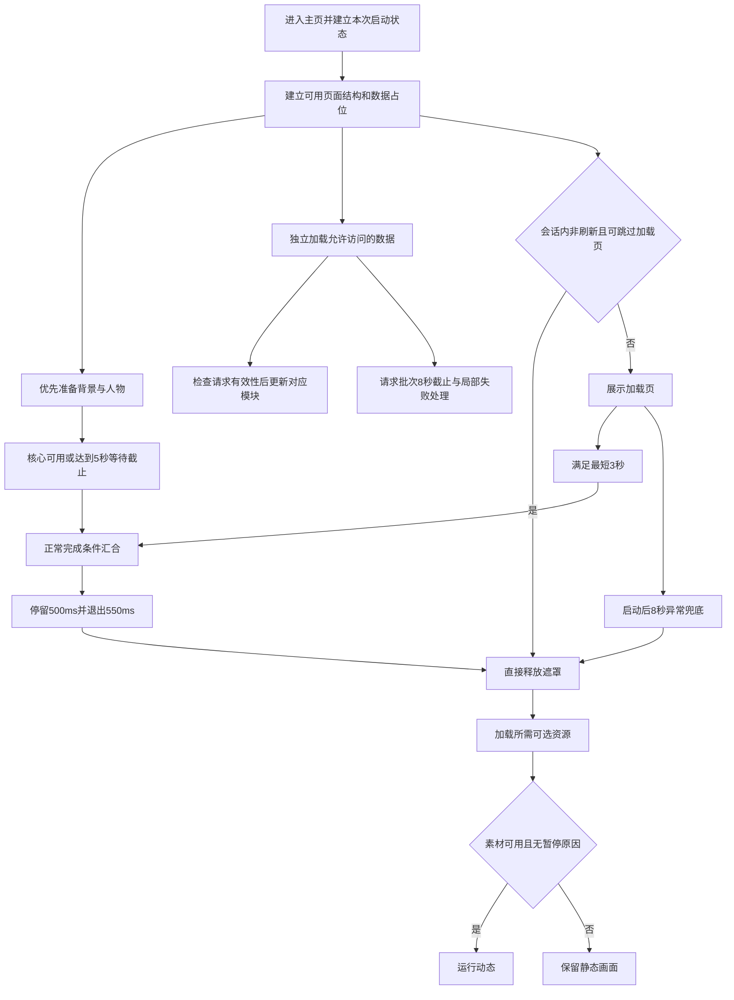

# 林小梦主页改版 PRD 确认草案

本文件保留 req-confirm 过程草案，确认结果已于 2026-10-02 按用户指令写回 [正式 v2 PRD](../PRD-林小梦主页改版-v2.md)。后续需求与实施以正式 v2 为准；功能尚未实施。

本版面向现有 H5 主页，在保留当前布局、业务入口和权限规则的基础上，接入 `lxm_idle_demo_v4` 的动态背景与人物交互，并补齐加载超时、动画生命周期、素材优化及兼容性要求。用户已确认本轮汇总方案；当前交付仅为新版本 PRD，功能、素材优化与部署尚未实施。

旧文件名为 v1，正文修订至 v1.8；本版统一使用整数版本 v2，旧版 PRD、开发步骤、审查及进度记录保留于 [history](../history/README.md)。demo 的 v4 是参考素材版本，与本 PRD 版本分别管理。本文件记录待实施需求，不把新行为提前写成当前运行契约。

## 1. 来源与版本范围

| 来源 | 可支持的内容 |
|---|---|
| [v1 基线 PRD](../history/PRD-林小梦主页改版-v1.md)，正文 v1.8 | 原决策编号、仍适用的业务规则及版本记录 |
| 本轮对话中用户对范围的选择 | 保留现有主页布局和入口，替换为 demo 动态背景与人物交互 |
| 本轮对话中用户对倾斜视差的选择 | 保留倾斜视差，在现有“更多互动”增加开启与关闭 |
| 本轮方案复核及用户“没啥问题，总结下方案，按照新版本记录”的确认 | 本版加载规则、请求保护、素材目标、性能治理、影响范围与验收方向 |
| 当前源码及 [H5 页面契约](../../../contract/current/h5-app/api.md) | 实际布局、路由、访客权限、请求和加载现状；不证明拟议功能已实现 |
| `/Users/umark/Desktop/lxm-tm/lxm-4/主页改版/lxm_idle_demo_v4` | 动效和素材参考；其测试不能替代正式主页集成验收 |
| 本轮前序检查记录 | 文件大小、静态页面观察、实际加载源码的时序模拟；不是线上或真机性能结果 |
| 本轮 `req-confirm` 逐项确认 | 用户对 RQ-04、RQ-05、RQ-06 均选择 A：长期记住动态偏好、首版包含微信、同页面保持降级档位 |

后文“✅ 已确认”表示需求或目标已被确认，不表示功能已完成。未指定的验收环境和未测结果单独列为待核验项。未受影响的 v1 业务语义在 §4 保留；与当前布局、权限及本轮确认直接冲突的旧要求在 §3 明确替代。

## 2. 背景、目标与用户场景

### 2.1 当前问题与证据边界

| 现状或问题 | 已核实依据 | 对本次改造的影响 |
|---|---|---|
| 主页已经是深色主题，使用单张背景图 | `frontend/pages/index.html` | v1 的“浅色页面改深色”不再是本期工作 |
| 当前是快捷栏、朋友圈与日记卡、底部聊天入口 | 当前 DOM 和点击处理函数 | 不恢复旧版三张预览卡或“一起听歌”入口 |
| 现有加载层等待静态图片、业务接口、情绪头像与最短展示时间 | `runHomeLoader`、`preloadImage`、`loadPage` | 新可选素材不能加入同一阻塞链；必须补齐超时与页面内容独立显示 |
| 请求函数没有透传取消信号；处理 401 时会先清 token | `frontend/static/js/api.js` 的 `request`、`handleUnauthorized` | 提前释放页面后，需防止旧请求清除新登录态或覆盖新数据 |
| 加载页 pagehide 会清计时器，未配套恢复加载状态 | 当前加载页事件处理 | 浏览器往返恢复可能停在未完成加载态 |
| demo 有多条动画循环，CSS 暂停不覆盖所有 JS、WAAPI 和传感器资源 | demo `app.js`、`styles.css` | 需要统一调度、暂停和销毁 |
| 短屏可能让卡片遮挡脸部；桌面全屏 cover 会严重裁切人物 | 前序静态预览 375×667、390×844、1280×720 | 背景构图按正式主页适配，不能直接复制 demo 全局样式 |

前序加载时序模拟：全部依赖即时完成时，普通模式约 3500ms 开始退出、4050ms 移除遮罩；图片或接口永不结束时，模拟至 20 秒仍未退出。该结果来自实际内联加载源码配合模拟时钟和请求，未测量真实网络、GPU 或用户设备。

### 2.2 目标与成功标准

| 编号 | 目标 | 成功标准 | 状态及来源 |
|---|---|---|---|
| G201 | 保留主页使用路径 | 现有入口、卡片、数据与权限行为保持；背景和人物交互符合 demo 的视觉方向 | ✅ 用户范围选择；§8 验收 |
| G202 | 加载可结束 | 接口或特效失败不永久遮挡页面，入口可以独立显示 | ✅ 本轮确认方案；F203、F204 |
| G203 | 动态可控 | 更多互动提供开关，传感器可关闭，弹窗、通话与后台状态能正确暂停恢复 | ✅ 用户选择及本轮确认方案；F206—F208 |
| G204 | 降低素材传输 | 核心两图争取 ≤350 KiB，全套七图争取 800～900 KiB，同时通过清晰度与贴片对齐检查 | ✅ 优化目标已确认，实际结果待核验；F210 |
| G205 | 控制持续运行成本 | 普通手机目标接近 60fps，低档模式目标至少 30fps；持续掉帧按规则降级 | ✅ 优化方向及目标已确认，测试机型和统计口径见 Q201；F209 |

### 2.3 用户与关键场景

| 用户或场景 | 预期结果 |
|---|---|
| 首次进入或刷新主页 | 看到现有风格的加载页，进入静态场景与可用主页后再开启动态 |
| 访客浏览、触碰人物 | 可看公共主页并获得本地视觉反馈；不初始化私有数据或调用聊天 |
| 已登录用户操作现有入口 | 设置、关系、记忆、朋友圈、日记、聊天及语音沿用当前路径 |
| 手机用户开启倾斜 | 由主动操作触发权限请求，得到可用、拒绝或不可用的真实状态 |
| 弱网、离线、坏图或慢接口 | 有静态降级与局部失败反馈，主页不被永久遮挡 |
| 打开登录弹窗、语音面板、切到后台或后退恢复 | 场景暂停或恢复正确，不抢输入、不重复挂载、不累积资源 |

## 3. 决策与旧要求替代记录

### 3.1 本版有效决策

| 编号 | 主题 | 当前结论 | 状态与来源 |
|---|---|---|---|
| V2-D01 | 布局与入口基线 | 保留当前生产项目主页布局、卡片和入口，以 §4 为准 | ✅ 用户明确选择；源码核对 |
| V2-D02 | 背景与人物 | 替换为 demo v4 分层场景；完整静态画面优先，特效渐进增强 | ✅ 用户选择及本轮确认方案 |
| V2-D03 | 更多互动 | 增加“主页动态”和“倾斜视差”开关；沿用现有登录门禁 | ✅ 用户选择及本轮确认方案 |
| V2-D04 | 加载时序 | 保留正常 3000ms 最短展示、500ms 停留、550ms 退出；核心图片等待最多 5 秒，遮罩 8 秒兜底 | ✅ 本轮确认方案；不是新增的实际测速结论 |
| V2-D05 | 业务数据 | 与遮罩完成解耦，首页请求批次 8 秒截止；区分未完成、失败、真实空态与访客态 | ✅ 本轮确认方案 |
| V2-D06 | 并发保护 | 取消过期请求；写 UI 与处理 401 前检查请求代次及登录快照 | ✅ 本轮确认方案 |
| V2-D07 | 性能与生命周期 | 单一主调度、环境特效优先 30fps、Canvas 有效 DPR 默认至多 1.5；统一暂停与降级 | ✅ 本轮确认方案 |
| V2-D08 | 素材优化 | 优先头发和眨眼 PNG，保护透明边缘；导出首页小图，不覆盖其他页面原图 | ✅ 本轮确认方案 |
| V2-D09 | 权限与业务 | 保留公共首页和交互登录；人物反馈本地执行；不增加后端接口、数据库或模型调用 | ✅ 本轮确认方案及当前 H5 契约 |
| V2-D10 | 发布与回退 | 新资源版本化，核对实际缓存与 HTTPS；保留旧背景及首页回退开关 | ✅ 本轮确认方案 |
| V2-D11 | 文档与实现状态 | 新建 v2，保留 v1；本轮只记录，功能状态为待实施 | ✅ 用户本轮记录指令及 `$prd-from-chat` |
| V2-D12 | 动态偏好保存 | 当前浏览器长期保存主页动态选择，刷新、再次访问及登录切换均保留；不同设备分别设置，系统减少动态效果优先 | ✅ RQ-04，用户选择 A |
| V2-D13 | 首版验收范围 | 包含 iOS Safari、Android Chrome、iOS 微信和 Android 微信内置浏览器；具体机型与版本在验收前列明，语音沿用现有兼容策略 | ✅ RQ-05，用户选择 A |
| V2-D14 | 降级后恢复 | 同一页面实例保持降级档位；后台、弹窗和浏览器后退恢复不升档；刷新或全新打开主页时重新评估 | ✅ RQ-06，用户选择 A |

### 3.2 旧决策的有效范围

旧编号不复用，完整历史原文保留于 v1 文件。以下替代只作用于本次主页增量，不推定其他页面或技术债已完成。

| 原编号或章节 | 本版处理 | 替代或保留依据 |
|---|---|---|
| C1、C2 | ✅ 保留：以 `lxm_for` H5 为准，主页独立主题，不全局替换主题 | V2-D01、§4 |
| C3、C7、C14、R3 | ✅ 保留成长数据和四级关系语义；旧固定“亲密度”标签不覆盖当前等级标签 | 当前顶栏；V2-D01 |
| C4、C8、C9、C11、C12、C13、Q1、Q2 | ✅ 保留陪伴天数、装饰语义、CTA、北京时间和不新增关怀卡/心情标签的约束 | §4；C11 原称“八段”，其原表和当前实现均为七段，修正计数表述 |
| C16、Q3、Q4、R4 | ✅ 保留日记固定句、相对时间、NEW 与真实 Lv0 锁规则 | §4；加载失败不得冒充 Lv0 |
| R1、N4 | ✅ 保留情绪头像和共享状态语解析；不把加载页头像强制同步回旧行为 | 当前 `updateAvatarEmotion` 只更新顶栏头像 |
| N2、C19 的删除横卡部分 | ✅ 保留，不恢复黄粉装饰球或中部关系横卡 | 当前布局；V2-D01 |
| C18；旧 §4.7 的单图背景要求 | ⛔ 已废止主页必须沿用 `index.png` 的限制 | 被 V2-D02 替代；旧图仍保留供语音及回退使用 |
| C5 的五项全部 Toast、N1、TD-HOME-08 的远期访客假设 | ⛔ 已废止作为当前首页要求 | 当前语音/记忆已有入口能力，访客开放已进入当前契约；被 V2-D01、V2-D03、V2-D09 替代 |
| C6、C15、C19 的独立关系卡部分、R2、N3；旧三卡结构 | ⛔ 已废止作为本版主页结构和取数要求 | 被 V2-D01 替代：朋友圈＋日记卡，关系在顶栏、记忆在快捷栏；不改变子页规则 |
| C10 的“亲密度进入设置” | ⛔ 已废止作为当前点击路径 | 当前头像进入设置，顶栏关系按钮进入关系页；V2-D01 |
| C17 | 原图继续保留；首页允许使用同内容的小尺寸派生图 | V2-D08；不重新引入记忆预览卡 |
| 旧 §4.7 等全部静态资源/API/情绪头像的门闩、强制同步双头像 | ⛔ 已废止 | 被 V2-D04、V2-D05 替代 |
| N5 | ✅ 保留实现、测试和文档同步原则；当前行为契约落点改为 `docs/contract/current/h5-app/api.md` | 当前文档索引；待实现后同步 |
| K1—K7 及旧技术债状态 | 保留在 v1 作为当时审查记录 | 不作为本版已实施或已验收证据，不在本轮重结算技术债 |

### 3.3 req-confirm 确认台账与正文映射

| ID | 标题 | 来源 | 状态 | 依赖／返回点 | 正文及验收落点 |
|---|---|---|---|---|---|
| RQ-01 | 保留布局与入口，接入 demo 场景 | 已有明确确认：V2-D01、V2-D02 | 已确认 | 无；不重复询问 | §4、F201、F202、AC201、AC211、AC214 |
| RQ-02 | 加载截止、内容独立显示与旧请求保护 | 已有明确确认：V2-D04—V2-D06 | 已确认 | 无；不重复询问 | §5.1、§5.2、AC202—AC205 |
| RQ-03 | 互动入口、访客门禁与倾斜主动授权 | 已有明确确认：V2-D03、F206、F207 | 已确认 | 无；不重复询问 | §5.3、AC206、AC207 |
| RQ-04 | 动态偏好的保存范围 | 审查发现：§5.3；用户逐项选择 A | 已确认 | 无 | V2-D12、F206、§5.3、AC217 |
| RQ-05 | 首版设备与浏览器验收范围 | 显式待核验项 Q201、Q203 中的范围问题；用户逐项选择 A | 已确认 | 具体设备与版本仍按 Q201 在验收前列明 | V2-D13、§8、AC207、AC210、AC215 |
| RQ-06 | 自动降级后的恢复策略 | 审查发现：§6；用户逐项选择 A | 已确认 | 依赖 RQ-05；无子项返回点 | V2-D14、F209、§6、AC208、AC210 |

已确认 6 项，未决 0 项，延期 0 项。Q201—Q203 剩余内容属于实施和事实核验，不是尚未作出的产品选择。需求确认状态与功能实现状态分别记录；需求确认完成不表示功能已实现或验收通过。

## 4. 保留的主页能力与本期边界

### 4.1 页面结构和入口

| 区域 | 本版保留的行为 |
|---|---|
| 顶栏头像 | 随情绪切换；点击进入 `/pages/settings.html` |
| 顶栏关系按钮 | 展示当前等级和进度；点击按现有登录门禁进入关系页 |
| 陪伴天数 | `relationship/detail` 的 `milestones.known_days`；访客显示“故事从今天开始”；失败隐藏或显示占位 |
| Hero | 北京时间、状态语、Good night 与装饰波形；背景和人物按 F201 替换 |
| 快捷栏 | 保留语音通话、视频通话、记忆星云、陪我入睡、更多互动；访客点击先弹共享登录窗 |
| 已登录快捷行为 | 语音沿用 `VoiceEntry.begin()`；记忆进入 `/pages/memory.html`；视频与入睡继续现有占位行为；更多按 F206 扩展 |
| 朋友圈 | 公共预览、更新时间、配图及登录态角标保留；点击沿用 `goFeed()` 的未读回复定位规则 |
| 日记 | 固定句“今天记录点什么好呢...”＋相对时间，不展示正文；`is_read === false` 显示 NEW；真实 Lv0 显示锁，点击仍可按登录门禁进入日记页 |
| 底部 CTA | “和她说说话吧”＋“她在等你哦”，进入 `/pages/chat.html`，保留未读主动消息角标及该页现有访问策略 |

关系等级沿用陌生、朋友、亲密、知己；进度沿用 `current_growth` / `growth_value`、`next_threshold`、`progress_percent`，满级显示“{value} / 已满级”且进度 100%。数值算法不变。

状态语继续使用共享 `resolveStatusText`，按 `status_text`、情绪映射、默认句依次兜底。日记继续复用 `formatTime` 的刚刚、N 分钟前、N 小时前、M 月 D 日四档，不改成正文摘要或新的时间算法。

北京时间保持 24 小时 `HH:mm`：深夜 00:00–04:59、清晨 05:00–07:59、上午 08:00–11:59、中午 12:00–13:59、下午 14:00–17:59、傍晚 18:00–19:59、晚上 20:00–23:59。Good night 仅在 `hour < 5` 或 `hour >= 20` 展示；原时段配套关怀句仍无新增展示位。

### 4.2 本期包含与排除

包含主页分层场景、人物本地反馈、两个互动开关、加载和请求保护、动画资源治理、素材派生与缓存核验、现有功能回归。

本期不重排业务卡片、不恢复旧版三卡布局、不开发视频或入睡能力、不改变关系成长算法和其他子页业务、不增加模型调用、后端 API 或数据库迁移。语音涉及场景暂停和旧背景路径兼容，语音协议、音频链路与通话计费不在改造范围。AI/Agent 规格扩展不适用，本次人物反馈属于前端视觉交互。

## 5. 功能需求与主流程

本节需求来自 V2-D01—V2-D10 及 V2-D12—V2-D14，属于本期已确认范围；表中顺序用于索引，不表示可跳过后续验收。

| 编号 | 触发或输入 | 系统行为与可观察结果 |
|---|---|---|
| F201 | 打开主页 | 背景＋完整人物构成静态底图；随后增强呼吸、眨眼、发丝、待机回应、灯光、雨与星光；任一可选层失败保留基础画面 |
| F202 | 小屏、短屏、桌面、旋转或卡片高度变化 | 所有贴片共用坐标变换；根据实际 UI 位置调整人物，脸部与入口可见；桌面采用居中竖向场景和暗色延展 |
| F203 | 首访、刷新、会话内返回 | 按 §5.1 显示或跳过加载页，核心图片、API 和可选特效按不同职责加载；异常有截止 |
| F204 | 初始取数、登录变化、局部重试 | 主页结构和入口独立显示，数据按模块更新；8 秒请求批次截止，支持取消、去重、代次与登录快照保护 |
| F205 | 动态允许时点击或键盘激活人物有效区域 | 轻微本地回应，重复触发合并；不触发页面跳转、聊天、关系写入；UI 按钮和覆盖层优先 |
| F206 | 已登录打开更多互动或再次进入主页 | 提供主页动态、倾斜视差的开关及实际状态；无已保存选择时动态默认开启，之后长期沿用当前浏览器选择；系统减少动态效果优先 |
| F207 | 主动开启或关闭倾斜 | 倾斜初始关闭；用户操作中申请权限；检查支持、安全环境、授权结果与实际数据；关闭移除监听，旋转后重新校准 |
| F208 | 加载、后台、弹窗、通话、关闭动态、减少动态效果、页面离开恢复 | 统一管理多种暂停原因、计时器、CSS/WAAPI/RAF、传感器和观察器；不存在重复挂载和资源累积 |
| F209 | 场景持续运行或掉帧 | 单一主调度，按时间差运动；环境特效优先 30fps；DPR 默认至多 1.5，另设像素上限；按 §6 降级，同一页面实例不自动升档 |
| F210 | 素材导出与替换 | 按 §7 预算优化，保持透明通道、画布比例与锚点；小图使用首页派生资源，原资源保留 |
| F211 | 资源发布、请求缓存、场景故障 | 使用版本化资源；检查真实缓存头与 HTTPS；旧图保留且路径大小写正确；首页可切回旧背景 |
| F212 | 新旧功能集成 | 保留 §4 全部入口、数据及权限语义，复核静态契约与真实用户流程，实施完成时同步当前 H5 契约 |

### 5.1 加载规则

| 项目 | 确认规则 |
|---|---|
| 静态底图 | 背景和人物准备包含下载与可用解码；优先加载；加载页复用同组资源，不另下载大海报 |
| 核心图片等待 | 主页启动后最多等 5 秒；失败或截止使用已完成图层或底色；迟到结果不能重建加载页 |
| 正常加载节奏 | 普通模式保留最短 3000ms、完成后停留 500ms、退出 550ms；资源及时就绪时约 4.05 秒移除遮罩 |
| 遮罩截止 | 从本次启动记录截止时刻，8 秒仍未退出则直接释放；定时器正常执行且页面在前台时适用；恢复前台先检查是否已超时 |
| 业务数据 | 不纳入遮罩完成门闩；私有数据未就绪展示占位，失败可局部重试，不假装为零或访客 |
| 可选素材 | 头发、眨眼、灯光等随后加载；不阻塞入口。静态/减少动态模式无需抢先加载不用的可选资源 |
| 情绪头像 | 保留真实情绪更新，解码/失败不阻塞遮罩；加载专用头像和顶栏头像职责保持分离 |
| Session | 保留 `lxm_home_loader_done`：同标签非刷新再次进入跳过；刷新与现有 `clearToken()` 行为保持；跳过也必须初始化基础场景与数据 |
| 加载效果 | 保留品牌文案和完成提示；取消随进度持续变化的大面积模糊滤镜，以遮罩透明度变化实现过渡；减少动态效果时取消对应过渡 |
| 动态启动 | 等遮罩退出、相关素材可用且不存在暂停原因后启动；后加载模块读取当前启动状态，不能只等待可能已错过的一次性事件 |

素材减重不会自动缩短保留的最短展示时间。进度表达主页准备状态，不把 API 未完成伪装成业务数据加载成功。主内容显示不能继续完全依赖 `loadPage()` 最后才写入 `content-loaded`。

### 5.2 数据、并发与权限

访客只加载当前契约允许的公共内容；持 token 用户按现有首页接口取关系、日记、未读及 Feed。超时不清除登录态。只有属于当前请求上下文的有效 401 才执行既有访客降级策略。

每次首页取数批次关联代次、发起时登录快照和取消控制器。登录成功、退出、重试或新批次取代旧批次时，取消已失效请求；在处理 401 之前及响应解析后、UI 写入前重新判断有效性。仅 `Promise.race` 结束等待不等于取消网络。`request` 增加可选能力，其他调用点保留原默认行为，避免另造一套鉴权请求函数。

关系数据未知时，日记锁状态保持未知，不能按默认 level=0 渲染。真实空列表、网络失败和访客锁定各有对应状态。Feed 预览与角标也不能用失败结果覆盖已知数据。局部重试和登录刷新应去重；场景恢复不再额外触发一轮 `loadPage()`，保留并协调已有 Feed 可见性刷新。

### 5.3 交互与传感器

装饰层不拦截事件，仅人物有效区域响应；主按钮、卡片、弹窗及语音面板优先。保留正常页面手势、缩放和键盘操作，不复制 demo 对全场景的 `touch-action: none`。关闭动态、系统减少动态效果或其他暂停原因存在时，人物触碰也不启动动作；倾斜只能在动态允许的前提下实际运行。

“更多互动”沿用当前访客登录门禁；登录成功只恢复当前登录数据，不自动执行原操作或申请传感器权限。人物本地反馈不初始化私有数据。

主页动态开关按 RQ-04 在当前浏览器长期记住：无已保存选择时默认开启；用户选择后，刷新、再次访问和登录切换继续沿用。该设置不按账号同步，不同设备分别设置；系统减少动态效果始终优先。此保存规则仅覆盖主页动态总开关，倾斜的新页面初始关闭和主动授权规则保持。存储不可用时按既有异常规则退化，不让存储失败中断页面。

倾斜状态至少区分关闭、等待授权/数据、已开启、不可用。权限获准不等于数据可用；拒绝、不支持、非安全环境或无有效数据时，展示简短原因并保持关闭或不可用。关闭动态会停止倾斜监听，重新开启动态不自动申请权限。隐藏页面或面板暂停期间保留用户意图，只有恢复条件满足时才可继续已允许的监听。传感器事件只更新输入，由调度器应用；横竖屏变化后重新校准，不自动反复弹权限请求。

## 6. 状态、异常与性能降级

暂停原因分别记录为加载中、页面隐藏、登录弹窗、语音面板、用户关闭动态、系统减少动态效果。任一原因存在即暂停；移除一个原因不能覆盖其他原因。暂停与销毁同时覆盖 CSS 动画、WAAPI、RAF、眨眼和待机计时器、传感器监听、布局观察器。暂停后保持自然静态姿态，恢复时重置时间差并重新安排动作，避免追赶后台经过的时间。

`pagehide` 的浏览器缓存保留场景走暂停，`pageshow` 幂等恢复；真正销毁时清理所有资源。场景不得因登录、重复初始化或切换视图而创建多套循环。特效初始化异常被限制在特效模块内。

自动降级按 RQ-06 在同一页面实例中保持，不持续尝试自动提高档位。切后台后恢复、弹窗关闭和浏览器后退恢复继续使用当前档位；刷新或全新打开主页时才重新评估。重新评估不保证强制恢复最高档，也不覆盖已保存的动态关闭偏好或系统减少动态效果。

| 场景 | 处理与用户反馈 | 恢复或降级 | 验收 |
|---|---|---|---|
| 核心图失败或加载超时 | 释放等待，使用已完成图层或底色，入口照常显示 | 迟到资源只能在有效生命周期内补入，不重新遮挡主页 | AC203 |
| 头发/眨眼/灯光失败 | 不展示失败层 | 使用完整基础人物与背景，不出现缺块 | AC201、AC203 |
| API 超时或离线 | 对应模块显示失败或重试，保留正确登录状态 | 有界局部重试；非失败模块可用 | AC204 |
| 旧请求晚到或旧 401 | 丢弃失效结果，无清 token 和写界面副作用 | 当前批次继续 | AC205 |
| 权限拒绝、无数据或不支持 | 开关不显示为已开启，说明原因 | 保留其他可用交互，用户主动再尝试 | AC207 |
| 页面隐藏、弹窗、通话 | 暂停动态和传感器 | 所有暂停原因解除后恢复 | AC208 |
| Canvas/观察器/动效能力不可用 | 功能检测，使用静态或兼容布局路径 | 首页主体正常 | AC209 |
| 持续掉帧 | 优先减少雨和星光，再停止发丝物理 | 仍不稳定则静态展示；同一页面保持降级，刷新或全新打开时重评 | AC210 |
| JS 后加载或会话跳过加载页 | 读取现有启动状态 | 单次挂载并直接进入正确静态/动态阶段 | AC202、AC208 |
| 本地存储不可用 | 不让读写失败中断首页 | Session 标记与设置按可用能力退化 | AC202 |

性能实现采用一条主 RAF 调度，运动按时间差计算且限制恢复后的异常大步长；环境特效优先 30fps。布局数据在尺寸变化时更新，避免每次 pointermove 都测量布局。光点和雨纹理缓存，减少逐帧创建渐变；Canvas 仅覆盖实际场景，默认有效 DPR 至多 1.5，再按总像素预算约束。避免持续更新大面积 filter、重叠毛玻璃及不必要的 `will-change`。具体像素上限和降级检测窗口由实际设备测量确定，见 Q201。

## 7. 素材预算与节约口径

### 7.1 已统计的素材与确认目标

| 范围 | 当前文件大小 | 本版目标或处理 |
|---|---:|---|
| 背景＋人物主图 | 450,234 字节，约 440 KiB | 争取 ≤350 KiB，优先保证首屏清晰度 |
| 三张头发 PNG | 625,591 字节，约 611 KiB，占七图约 48.6% | 优先比较保留 alpha 的无损 WebP 等导出结果 |
| demo 全部七图 | 1,286,798 字节，约 1,257 KiB | 争取 800～900 KiB；不是整页所有资源的预算 |
| 当前主页默认头像 | 683,856 字节，约 668 KiB | 首页导出符合实际展示尺寸的派生图 |
| 当前主页日记占位图 | 612,551 字节，约 598 KiB | 首页使用同内容缩略图，取消不必要的原图预载 |

背景和人物已为 WebP，继续优化需比较脸部、头发及透明边缘。灯光层可先尝试较低像素尺寸。转换素材保持画布比例、透明通道、贴片位置、透明留白和旋转锚点；如裁切或改变坐标，必须同步变换并重新对齐，不能只替换文件。

首页头像派生需覆盖初始显示、情绪更新与失败回退路径，避免先加载小图后又被公共映射换成大图。其他页面原资源和默认行为保留。资源 URL 保持一致以利用浏览器缓存，不能通过不同查询参数重复请求同一素材。

### 7.2 节约含义与测算限制

全套达到 800～900 KiB 时，相对当前七图减少约 28%～36% 传输；十万次完整冷加载约减少 34～44 GiB。该测算假设每次下载整套素材，不代表实际 CDN 账单、缓存访问流量或首屏必需量。

同尺寸压缩主要节省下载、存储和缓存字节；不会按同一比例降低解码内存。宽高均缩至 80% 时，像素数减少 36%；当前七图按 RGBA 等效展开约 19.6 MiB，仅为像素内存估算，不是浏览器实测峰值。Canvas、合成层和动画运算另行占用资源。素材优化不直接减少模型调用费用。

压缩结果必须经实际显示尺寸和目标设备检查，不能为了达成字节目标接受明显糊脸、发丝白边、眨眼跳边或贴片错位。目标值已确认，达成情况尚未测量。

## 8. 验收标准

需求状态为已确认；下表全部验收尚未在新实现上执行。环境和统计口径未指定部分见 Q201，不用前序模拟或 demo 测试替代。

| 编号 | 前置与操作 | 预期结果 | 关联需求 |
|---|---|---|---|
| AC201 | 静态层与可选层依次就绪，观察并触碰人物 | 基础画面完整、贴片对齐；有预期动态与本地回应；可选层缺失不破坏人物 | F201、F205 |
| AC202 | 首访、刷新、会话跳过，模拟模块晚加载及存储不可用 | 启动状态正确；普通模式遵守确认时序；跳过不漏挂载；异常存储不阻塞页面 | F203 |
| AC203 | 阻断或损坏单张图片、使核心图一直挂起 | 核心等待 5 秒截止；前台可执行情况下遮罩最迟 8 秒兜底释放；入口可操作；迟到结果不盖回加载层 | F201、F203 |
| AC204 | 使业务请求一直挂起、离线或局部失败 | 页面结构独立显示；请求批次 8 秒截止并取消；显示对应失败状态，可局部重试；不假冒访客、Lv0 或真实空列表 | F204 |
| AC205 | 慢请求期间登录、退出、重试，并让旧请求晚返回成功或 401 | 旧结果不覆盖新 UI、不清新 token；当前有效 401 仍执行既有策略；无重复刷新批次 | F204、F212 |
| AC206 | 访客/已登录用户分别点击人物、更多、卡片和 CTA，并使用键盘 | 人物只做本地反馈，业务入口优先；访客门禁正确；登录后不自动重放或请求传感器权限 | F205、F206、F212 |
| AC207 | 真机允许/拒绝倾斜，模拟无数据、不支持、非安全环境，关闭并旋转屏幕 | 实际状态与开关一致；关闭移除监听；无重复授权；有效恢复后方向正确 | F207 |
| AC208 | 切后台、往返页面、开关登录/语音面板、切换动态及系统减少动态效果 | 多个暂停原因互不覆盖；无后台场景循环与传感器监听；恢复无跳变、闭眼残留或重复实例；同一页面暂停恢复不重置降级档位 | F206、F208、F209 |
| AC209 | 禁用 Canvas 或可选 API，制造特效初始化错误 | 静态画面与业务入口可用；不存在异常引发的整页中断 | F201、F208 |
| AC210 | 在列明的设备上记录新旧主页持续运行与低档表现，制造掉帧并恢复、刷新或全新打开 | 记录帧率、长任务、点击响应和内存趋势；掉帧按顺序降级，同一页面不自动升档；刷新或全新打开重新评估；达到经 Q201 确定环境下的目标 | F209 |
| AC211 | 在 375×667、390×844、430×932、1280×720 及横竖屏下检查 | 人脸与入口可见、贴片一致，底部内容可操作，安全区和正常页面手势可用 | F202 |
| AC212 | 对比原始与优化素材，在实际尺寸及高像素密度设备显示 | 输出字节清单；确认预算达成情况、透明边缘、脸部清晰度和眨眼/发丝对齐；无重复大图下载 | F210 |
| AC213 | 同设备同网络分别测冷加载、缓存访问及刷新 | 记录遮罩退出、入口可操作时间与传输量；可选特效不延长门闩，不把固定展示时间算成压缩收益 | F203、F210、F211 |
| AC214 | 访客及已登录用户逐一操作 §4 入口 | 设置、关系、记忆、Feed、日记、聊天和真实语音入口符合当前规则；声音链路不被场景占用影响 | F212 |
| AC215 | 检查实际部署资源响应并更新资源版本、切回旧背景 | HTTPS/权限行为、资源缓存及大小写引用正确；新版本可获取，回退可用，语音旧背景仍可访问 | F211 |
| AC216 | 实施后核对源码、回归测试与当前 H5 契约 | 同步本次真实行为；不把只测 demo、静态壳或模拟时钟的结果作为整体通过 | F212 |
| AC217 | 修改动态开关后刷新、再次访问、切换登录账号，并在另一设备访问或开启系统减少动态效果 | 当前浏览器保留选择；不同设备分别设置；登录切换不重置；系统减少动态效果优先；倾斜仍遵守新页面初始关闭与主动授权规则 | F206、F207 |

首版主页场景、交互与加载的验收必须包含 iOS Safari、Android Chrome、iOS 微信内置浏览器及 Android 微信内置浏览器。具体机型、系统、浏览器或微信版本和网络配置在验收前列明，并写入记录；不把个别设备通过推定为所有设备通过。各环境倾斜不可用时明确提示并按现有降级规则处理。语音沿用已有兼容策略，不因增加主页微信验收范围改变语音协议或支持承诺。

## 9. 技术实施、依赖与风险

### 9.1 已核实影响面与拟新增模块

| 文件或模块 | 状态 | 本版改动职责 |
|---|---|---|
| `frontend/pages/index.html` | 已检查 | 场景容器、加载状态、内容独立显示、更多互动、请求批次与事件协调 |
| `frontend/static/js/api.js` | 已检查 | 可选取消信号与有效性检查；在 401 副作用之前防止失效请求污染当前登录态；首页小图更新的兼容接入 |
| `frontend/static/css/voice-entry.css` | 已检查 | 核对并修正旧背景 URL 大小写；保留原背景资源 |
| `frontend/static/js/voice-entry.js` | 已检查接入点 | 识别面板实际打开/关闭状态；优先通过主页适配，不能只等待连接成功事件才暂停 |
| `frontend/static/css/home-scene.css` | 拟新增 | 限定作用域的图层、静态降级和交互区域样式 |
| `frontend/static/js/home-scene-core.js` | 拟新增 | 动效参数、坐标/时间计算及可独立验证的规则 |
| `frontend/static/js/home-scene.js` | 拟新增 | 场景初始化、素材、统一调度、暂停、传感器、降级与销毁 |
| `frontend/static/images/home-scene/v4/` | 拟新增 | 带版本或内容哈希的导出资源；不得以不可变缓存覆盖同 URL 内容 |
| `nginx/nginx.conf` | 已检查 | 仅在核对真实部署后补新资源缓存策略；仓库的 80 端口配置不能证明外层无 HTTPS |
| `tests/test_h5_static_contract.py` | 已检查相关入口 | 更新主页相关断言，回归访客与公共鉴权兼容行为 |
| `docs/contract/current/h5-app/api.md` | 当前权威契约已读取 | 实施完成后同步主页交互、加载与失效请求保护的真实约定；本轮不提前改写 |

FastAPI 直接服务与 Nginx 部署的根路径行为不同：仓库 Nginx 的 `/` 重定向至 `/pages/index.html`，不能统一断言根路径必然进入登录页。`/api/app/persona-background` 返回角色文字背景，不是图片服务，不作为本次素材接口。

### 9.2 状态、接口与兼容

状态组织围绕场景生命周期、暂停原因集合、启动阶段和截止时刻、素材可用状态、请求代次/登录快照/取消控制器、倾斜实际状态及质量档位。具体代码字段名属于实现细节，以上不是已存在的数据模型。无需数据库迁移；现有 Session key 保持含义。

首页继续使用当前关系、日记、未读和 Feed 接口及响应语义，不新增聚合 API。公共请求函数的新能力由首页显式使用，默认调用方式兼容。旧请求被判断为失效后不进入 401 处理；有效请求的既有 401 策略保持，实施时在契约中写清该前置条件。

新素材使用版本化 URL，缓存策略以真实响应头验证；HTML 不设置长期不可变缓存。旧图不能删除，语音首次使用旧图可能产生独立下载，不为了预热语音把旧大图重新加入首页关键加载链。保留首页切换开关，场景可回退至旧背景，加载修复可独立保留。

倾斜数据只用于本地视觉输入，无上传或新增采集需求。验证使用本地性能记录；本期不新增埋点平台，不记录 token 或传感器原始数据。v1 所提后端首页聚合、关系字段合并等仍为范围外建议，本版不新建技术债编号或声称旧债已关闭。

### 9.3 实施顺序与恢复位置

| 顺序 | 工作包 | 完成依据 |
|---|---|---|
| 1 | 建立新场景资源、静态两层与尺寸适配，复核派生素材 | AC201、AC211、AC212 |
| 2 | 接入有截止的加载流程、页面独立显示和请求状态保护 | AC202—AC205、AC213 |
| 3 | 接入人物反馈、更多互动、动态偏好保存、倾斜权限与统一生命周期 | AC206—AC209、AC217 |
| 4 | 调整调度、Canvas、素材与降级参数，完成真机性能对比 | AC210—AC213 |
| 5 | 回归现有入口、部署缓存和回退，同步真实契约 | AC214—AC216 |

当前全部工作包均为 **NOT_STARTED**。恢复开发时从工作包 1 开始，并复核源码是否仍符合本版基线；文档记录完成不表示已获得本轮之外的发布授权，也不表示功能实施完成。

### 9.4 风险、依赖与待核验项

| 项目 | 影响 | 处理或当前状态 |
|---|---|---|
| 公共请求函数兼容性 | 可能波及其他页面 401 行为 | 新能力可选，先验证有效/失效请求再验证现有调用点 |
| 透明贴片压缩和缩放 | 可能出现白边、脸部模糊、发丝/眼睛错位 | 原始素材保留，导出后检查，不以体积单独判定通过 |
| 多个动画与面板状态竞争 | 可能提前恢复或后台耗电 | 暂停原因集合、代次检查、幂等挂载与销毁 |
| 正常加载固定时长 | 压缩后用户仍可能等待约 4.05 秒 | 本版保留已确认展示节奏，不虚报首屏提速 |
| Q201：真机与测量口径 | 具体机型、系统、网络、帧率统计窗口、Canvas 像素预算和自动降级窗口未指定 | ⚠️ 待核验；实施时记录测试环境并量测。接近 60fps 是优化目标，不编造未确认的统计门槛；需改变已确认目标时再讨论 |
| Q202：素材优化结果 | 尚无实际压缩文件、清晰度对比或最终体积 | ⚠️ 待核验；输出优化前后清单和视觉结果 |
| Q203：真实部署能力 | 外层 HTTPS、缓存响应头和各验收环境实际表现未核实；微信首版范围已由 RQ-05 确认 | ⚠️ 待核验；部署验收时检查，不能依据本地配置直接宣称支持 |

RQ-01—RQ-06 已全部确认，无未决或延期产品决策。Q201—Q203 保留为待实测事项，不阻塞需求确认，但相应功能不能在缺少证据时标记为验收完成。

### 9.5 本轮 PRD 审查

- 结论：**需求确认完成，实施证据待核验**（Q201—Q203）；确认结果已写回正式 v2，本文件保留为过程草案。
- 本轮对账：RQ-01—RQ-06 均已映射到正文及验收；新增长期动态偏好、首版微信覆盖、同页面保持降级三项结论，未决 0 项、延期 0 项。
- 已修正：旧稿与当前布局、入口、访客权限和背景要求的冲突；旧加载门闩和双头像同步表述；“八时段”的计数；文件名与正文版本不一致；将预算、模型时序与实测结果区分。
- 保真范围：继续保留关系算法、相识天数、情绪与状态语、日记预览、Good night、CTA 和子页业务约束；被替代的旧决定保留编号及追踪关系。
- 技术证据：已检查主页、公共请求函数、语音接入、Nginx、demo、当前 H5 契约及相关测试入口；前序 demo 测试与加载模拟仅作有限证据，本轮没有执行新功能真机或线上验收。
- 本轮审查未发现无来源的确定性需求断言；实际体积、性能、权限兼容性和部署效果仍须按验收表验证。

## 10. 版本记录

旧版历史摘要原样保留，按新到旧排列；摘要中的“八时段”等用语只记录当时内容，当前要求以正文为准。

| 版本 | 日期 | 主要变更 |
|---|---|---|
| v2 | 2026-10-02 | 基于 `history/PRD-林小梦主页改版-v1.md`（正文 v1.8）新增 demo v4 动态场景、人物本地交互、更多开关、倾斜权限、加载截止、请求保护、素材预算、性能与生命周期、验收和回退；按当前布局与契约替代旧结构/登录/背景/门闩要求。待核验 Q201—Q203；方案已确认、功能待实施；旧版四份记录已归档至 history；本轮按用户指令写回 RQ-04、RQ-05、RQ-06 的 A 方案；六项需求确认全部闭合，实现状态为 NOT_STARTED |
| v1.8 | 2026-06-14 | 全屏加载页增量：§4.7 门闩流程、§4.7.1 加载页约定；§7 资源与静态测试锚点；与 `contract.md` 2026-06-14 摘要对齐 |
| v1.7 | 2026-06-09 | 代码对齐复审确认 N1–N5；更新 §4.2/§4.5/§7/§8；新增 K7、TD-HOME-08；§11 扩 N 系列 |
| v1.6 | 2026-06-07 | 确认 R1–R4；新增 §12 K1–K6 闭合表；修正 §3 过时描述；补 TD-HOME-06/07 |
| v1.5 | 2026-06-07 | 确认 Q2-B（深夜+晚上显示 Good night）；新增 §4.8.1；需求全部闭合 |
| v1.4 | 2026-06-07 | Q1 移除关怀卡；Q3-C 日记相对时间；Q4-A Lv0 锁；C17 占位图路径；§11 说明 Q2 Good night 位置 |
| v1.3 | 2026-06-07 | 确认 C15-C、C19-A、C16 仅固定句+时间；C1–C19 全部闭合；§10 改为定稿结构图 |
| v1.2 | 2026-06-07 | 确认 C10–C14、C16–C18；新增 §4.8 北京时间八时段表；§10 收敛为 C15/C19 两项并附布局示意图 |
| v1.1 | 2026-06-07 | 补充 §4.1 双列对比表、§4.1.2 已有功能对齐；修正 diary API 字段为 `items`；新增 §10 待确认项 C10–C19 |
| v1.0 | 2026-06-07 | 初始版本；确认 C3 亲密度、C4 相识天数、C5 快捷栏占位、C6 我们的记忆、C7 四级体系 |
