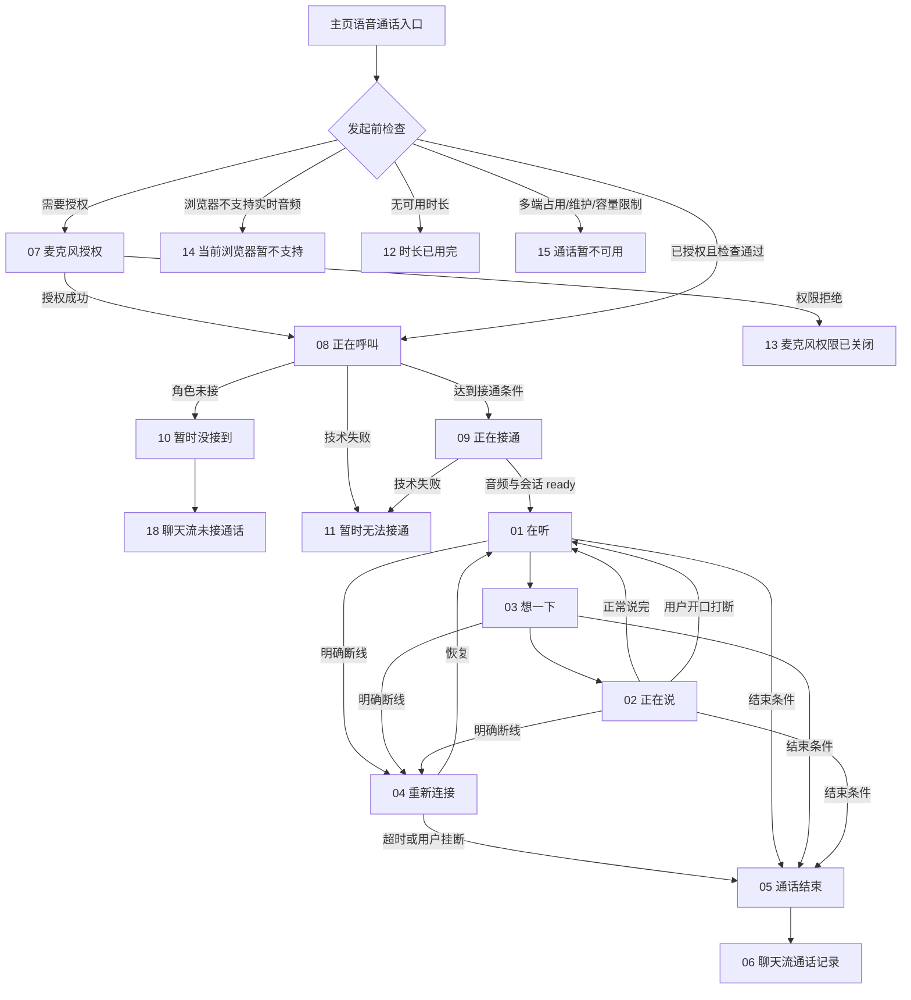

# LXM 语音通话交互规格与 PRD 映射 v1

> - 状态：已确认主流程、结束文案与危机干预的开发交互基线
> - 更新日期：2026-08-29
> - 目标设备：iPhone 16 Pro，参考 CSS 视口 `402 × 874`
> - 产品需求来源：[PRD-LXM语音通话仿真交互设计-v2.md](./PRD-LXM语音通话仿真交互设计-v2.md)（v2.3）
> - 决策依据：[需求确认记录-LXM语音通话-v1.md](./需求确认记录-LXM语音通话-v1.md)
> - 高保真来源：[demo/hifi/](./demo/hifi/)

## 1. 文档职责与使用边界

本文档连接 PRD、已确认高保真 Demo 与前端实现，明确页面状态、进入条件、用户操作、系统反馈、退出结果及验收口径。

本文档不重复定义以下内容：

- API、WebSocket、Provider 事件及数据表字段，以 PRD 和后续正式接口契约为准；
- 计费、记忆、摘要、召回等服务端业务规则，以 PRD 为准；
- PRD 中仍标记“待确认”的参数，不因本文档引用而自动定稿；
- Demo 内的 `setTimeout`、查询参数和 HTML 页面跳转仅用于串联演示，不是生产逻辑。

### 1.1 信息优先级

| 信息类型 | 权威来源 |
|---|---|
| 产品目标、业务规则、异常语义、计费与数据结果 | PRD v2 |
| 页面状态、控件行为、前端反馈与状态切换 | 本文档 |
| 视觉布局、色彩、图标、玻璃质感与动效观感 | 已确认高保真 Demo |
| API 字段、事件名、错误码、路由与持久化 | 正式工程契约与实际代码 |

发生冲突时，不得直接照搬 Demo 脚本。应先按业务语义执行 PRD，再同步修订本文档和 Demo；未确认项统一标为 `TBD`。

## 2. 全局设计与实现基线

### 2.1 画布和安全区

- 以 iPhone 16 Pro 竖屏 `402 × 874` CSS 视口为设计基准；实际实现使用 `100vw / 100dvh` 适配，不写死真机物理像素。
- 真机页面直接全屏展示内容，不添加设备机框、圆角外壳、假状态栏或调试控件。
- 顶部和底部交互区必须使用 `env(safe-area-inset-top)`、`env(safe-area-inset-bottom)` 避让系统区域。
- Demo 在桌面浏览器中限制到 402px 宽仅用于评审；真机实现不得出现额外黑边或居中机身效果。

### 2.2 通用视觉与交互

- 人物图保持全屏沉浸式背景，状态文案和控制区叠加在暗部渐变上。
- 同级圆形控制按钮保持同尺寸、同基线和同点击热区；点击热区不得小于 `44 × 44` CSS px。
- 挂断/取消采用红色圆形按钮，听筒图标水平居中；不得用尺寸变化表达普通按压状态。
- 玻璃质感来自半透明填充、细描边、高光和适量模糊，不以高亮白底遮挡人物主体。
- 页面不展示实时字幕。用户和林小梦的转写仍按 PRD 在后台形成、落库并参与摘要与记忆。
- 动效应支持 `prefers-reduced-motion: reduce`；关闭动效后不得影响状态识别和操作。

### 2.3 状态驱动原则

- 生产页面由业务状态和 Provider 事件驱动，不依赖固定延时猜测接通结果。
- 通话状态只允许一个权威来源；重复事件、重复点击和并发结束事件必须幂等。
- 普通页面/通话子状态切换不得重建同一通电话的 `call_id`、Provider Session、计时或音频控制状态；明确断线重连时的 Provider Session 是否复用按第 5.6 节能力门禁执行。
- 静音、扬声器状态在倾听、思考、说话和重连状态之间保持，直至本通结束。

## 3. 页面状态总览

文件编号是设计确认顺序，不是业务流程序号。正常业务顺序为：

> 重连成功后，图中回到“在听”表示默认视觉落点。
>
> **能力未取证时的实际形态（PRD C99）**：`supports_session_reconnect` 当前零证据，因此重连成功后走「新 Session + 补注入会前小包」，**接受上下文断层**，由角色播放已定稿衔接语“刚刚好像断了一下。你刚才说到哪儿了？”，视觉落点固定为「在听」。只有该能力取证通过后，才按服务端恢复的真实回合状态进入对应状态（可能是 AI 播放或思考）。衔接话术属于 `voice_call_script` 可发布/回滚配置。

## 4. Demo 页面与 PRD 功能映射

| Demo 页面 | 前端状态 | PRD 对应部分 | 进入条件 | 主要操作与退出结果 |
|---|---|---|---|---|
| [01-in-call-listening.html](./demo/hifi/01-in-call-listening.html) | `CONNECTED / WAIT_USER` | 6.3、14.2、20.3 | 已接通；正在等待或接收用户表达 | 静音、扬声器、挂断；用户说完后进入“想一下”，挂断进入结束页 |
| [02-in-call-speaking.html](./demo/hifi/02-in-call-speaking.html) | `CONNECTED / AI_SPEAKING` | 6.3、9、14.2、20.4 | 收到 AI 音频并开始实际播放 | 静音、扬声器、挂断；用户有效开口触发打断并回到倾听；正常播完回到倾听 |
| [03-in-call-thinking.html](./demo/hifi/03-in-call-thinking.html) | `CONNECTED / RECALLING 或 AI_THINKING` | 6.3、10、14.2 | 用户最终文本形成，正在召回或等待 AI 回复 | 静音、扬声器、挂断；收到音频后进入“正在说” |
| [04-reconnecting.html](./demo/hifi/04-reconnecting.html) | `RECONNECTING` | 4/C12、6.2、13.3、18/E8 | 已接通的通话发生明确网络断开 | 仅保留挂断；恢复后进入服务端真实回合状态；超时进入结束流程 |
| [05-call-ended.html](./demo/hifi/05-call-ended.html) | `ENDING / ENDED` | 6.2、12.2、14.2、20.7 | 用户挂断、静音超时、额度结束、硬顶、退出意图或重连超时 | 展示最终计费时长和结束文案；“返回聊天”进入聊天时间线 |
| [06-chat-record.html](./demo/hifi/06-chat-record.html) | `CHAT / CALL_RECORD` | 12、14.3、20.8 | 通话结束并完成基础结算 | 点击卡片展开/收起；摘要异步更新；失败时保留静态文案，不展示技术错误 |
| [16-chat-record-ready.html](./demo/hifi/16-chat-record-ready.html) | `CHAT / CALL_RECORD / SUMMARY_READY` | 12.2、14.3、20.8/AC38 | CALL-SUM-01 成功返回用户可见摘要 | 用一句话摘要替换“摘要整理中”；卡片保留展开箭头，不展示逐字转写 |
| [17-chat-record-summary-fallback.html](./demo/hifi/17-chat-record-summary-fallback.html) | `CHAT / CALL_RECORD / SUMMARY_FAILED` | 12.2、14.3、20.8/AC39 | 摘要任务已调用但失败 | 保留“刚刚聊了一会儿”与时长；不显示技术错误、失败标识或重试入口；无额外信息时不展示展开箭头 |
| [07-microphone-permission.html](./demo/hifi/07-microphone-permission.html) | `PREFLIGHT / PERMISSION` | 6.1、14.2、18/E1-E2 | 首次使用、权限为 `prompt`，或需要解释授权用途 | 允许后调用系统授权；授权成功继续呼叫；关闭/“先不打了”锁定重复点击并返回来源页，直接打开 Demo 时回落到空聊天页 |
| [13-microphone-denied.html](./demo/hifi/13-microphone-denied.html) | `PREFLIGHT / PERMISSION_DENIED` | 6.1、14.2、18/E1 | 系统或浏览器返回麦克风权限拒绝 | 查看通用开启方法、重新检测或退出；不创建有效通话、不计入未接 |
| [14-browser-unsupported.html](./demo/hifi/14-browser-unsupported.html) | `PREFLIGHT / UNSUPPORTED` | 6.1、18/E2 | 浏览器缺少实时音频能力 | 返回聊天；不申请权限、不创建有效通话、不计入未接 |
| [15-call-blocked.html](./demo/hifi/15-call-blocked.html) | `PREFLIGHT / BLOCKED` | 6.1、6.2、18/E4 | 多端已有通话、服务维护或容量限制 | 默认展示“另一台设备正在通话”；同一组件可切换维护/容量文案；不创建有效通话、不计入未接 |
| [08-calling.html](./demo/hifi/08-calling.html) | `DECIDING / PREWARMING / RINGING` | 6.1、6.2、14.2、20/AC2、20/AC3、20/AC6 | 发起前检查通过，已创建本次呼叫（`status=deciding`）并开始角色决策、预热或响铃 | “取消”终止本次呼叫；角色接听并达到条件后进入“正在接通”；未接或技术失败进入对应结果页 |
| [09-connecting.html](./demo/hifi/09-connecting.html) | `CONNECTING` | 6.2、14.2 | 最短响铃条件满足，正在完成音频与会话连接 | “取消”终止；音频和会话均 ready 后进入“在听”；失败进入技术失败页 |
| [10-missed-call.html](./demo/hifi/10-missed-call.html) | `MISSED` | 4/C2、6.1、6.2、14.2、20/AC4 | CALL-01 做出角色未接决定 | 说明“她现在可能不方便”；返回聊天进入 18 未接卡片；不计费，且不得统计为技术失败 |
| [18-missed-call-record.html](./demo/hifi/18-missed-call-record.html) | `CHAT / MISSED_CALL_RECORD` | 4/C2、6.2、14.3、20/AC4 | 角色未接后从 10 返回聊天 | 轻量卡片展示通话类型、未接状态和发起时间；不展示时长、摘要、技术错误或展开箭头 |
| [11-connection-failed.html](./demo/hifi/11-connection-failed.html) | `FAILED` | 4/C15、6.2、14.2、18/E7、20/AC3 | S2S 建连失败、超时或其他技术故障 | “重新尝试”重新执行必要发起检查并再次拨号；“回到聊天”退出；不得伪装成角色未接 |
| [12-call-duration-limit.html](./demo/hifi/12-call-duration-limit.html) | `BLOCKED / NO_QUOTA` | 6.1、6.2、13、18/E3 | 发起前检查发现免费池与额外池均不可用 | “回聊天找她”进入聊天；“稍后再说”锁定重复点击并返回来源，直接打开 Demo 时回落到空聊天页；不执行 CALL-01、不申请上游资源、不计费 |

**两点命名与覆盖说明**

1. `12-call-duration-limit.html` 的文件名与语义不符：它实际表达的是**额度不足**（映射 `BLOCKED / NO_QUOTA`），而真正的「通话时长上限」是 PRD C22 的 1 小时硬顶；AC34 指额度归零后的单次 30 秒免费收尾。硬顶**没有独立页面**，按第 5.7 节共用结束页并展示对应定稿文案。文件名保留不改，以此说明为准。
2. 现有 18 张页面**不覆盖**危机提示条与危机资源卡片（PRD 第 19.8 节），需新增两个 UI 元素，规格见第 5.9 节。

## 5. 关键交互规格

### 5.1 麦克风授权

| 权限结果 | 前端行为 | 业务结果 |
|---|---|---|
| `granted` | 授权按钮进入短暂处理中状态，随后继续发起前检查或进入呼叫 | 可创建有效呼叫 |
| `prompt` | 先展示 07 页面，用户确认后再触发系统权限弹窗 | 等待系统结果 |
| `denied` | 展示 13 页面；提供通用开启方法、重新检测和退出，不假设 H5 可直接跳转系统设置 | 不创建有效通话；不计入未接 |
| 浏览器不支持实时音频 | 展示独立阻断反馈，不继续请求权限 | 不创建有效通话；不计入未接 |

- 自定义授权页不能代替系统权限弹窗。
- “允许麦克风”进入请求中状态后需要防重复点击；系统拒绝时必须恢复可操作状态。
- Demo 已覆盖 `denied`（13）与浏览器不支持（14）的视觉方案，生产仍需接入真实权限与能力检测。

### 5.2 呼叫、接通与取消

- “正在呼叫”表示角色决策、会前召回、S2S 预热和最短响铃可能并行进行；页面不得暴露内部任务名称。
- “正在接通”表示角色已接听且正在完成音频/会话 ready，不等于已经开始计费。
- 呼叫和接通阶段均允许取消。首次点击后立即禁用按钮并停止响铃，防止重复取消。
- 取消后释放上游资源和用户通话租约；因为未进入 `CONNECTED`，不扣除通话时长。
- Demo 中 1600ms、1150ms 的自动跳转仅用于评审。生产响铃上下限已定稿为**最短 4 秒、最大等待 12 秒**（AC2 / AC3），接通依赖真实 ready 事件。
- CALL-01 超时或非法输出时默认接听，采用 **4–8 秒中性延迟与中性开场**（AC6），前端无需为此提供差异化视觉。
- 取消发生在响铃或接通阶段时，服务端记为 `status=cancelled`，**不生成时间线卡片、不占 `sort_seq`**（PRD 第 14.3 节记录矩阵）。
- 每次用户主动发起一轮新拨号时，前端生成一个 UUID（最长 64 字符）作为 `Idempotency-Key`；同一次创建请求的网络超时/重试必须复用原 key 与原 payload。用户在失败页主动点击“重新尝试”属于新一轮拨号，生成新 key；不得用换 key 的方式重试同一网络请求，也不得把旧 key 复用于新的用户意图（PRD C122）。

### 5.3 倾听、思考与说话

| UI 状态 | 触发依据 | 退出依据 |
|---|---|---|
| 在听 | 已接通且等待用户；或正在接收用户语音 | 用户最终文本形成后进入“想一下” |
| 想一下 | 动态召回、模型推理或等待首段 AI 音频 | 首段可播放音频到达后进入“正在说” |
| 正在说 | AI 音频已经开始实际播放 | 正常播完回“在听”；用户打断则立即停止并回“在听” |

- “想一下”不能因召回失败无限停留；按 PRD 超时降级后继续当前回合。
- 用户侧不显示 ASR 文本、模型草稿或实时字幕。
- 状态文案使用 `aria-live="polite"`，但高频音量动画不重复播报给辅助技术。

### 5.4 自然打断

- 仅当麦克风未静音且 AI 正在实际播放时检测用户打断。
- 检测到有效新表达后，先停止本地音频和清空未播放缓冲，再发送 Provider 中断与上下文截断事件。
- UI 立即从“正在说”切换到“在听”，不能等待完整 AI 文本生成结束。
- 极短“嗯、啊、对”等附和默认不直接打断（AC18）：候选阶段约 180–250ms，短弱附和保留为 backchannel，持续表达、新语义或强打断词才升级为真正打断。词表与阈值属 `voice_call_script` / `voice_call_config` 配置，默认值仍需真实设备样本校准。
- 未播放内容不得进入用户可见记录、摘要或记忆输入；截断失败也不能退回保存完整生成文本。
- **打断相关的三项能力位当前零证据**（`supports_reply_cancel` / `supports_context_truncate` / `supports_playback_text_mapping`）。前端实现须先按最保守路径落地（停本地播放 + 清缓冲 + 上报打断位置），能力取证通过后再启用精确映射与上下文截断的差异化表现。

### 5.5 静音、扬声器和挂断

| 控件 | 默认状态 | 点击后行为 | 状态保持 |
|---|---|---|---|
| 静音 | 麦克风开启，`aria-pressed=false` | 停止向上游发送麦克风音频；视觉切换为选中态，标签表达“已静音” | 在听/想一下/正在说/重连之间保持 |
| 扬声器 | 按产品默认音频路由，`aria-pressed=false` | 在平台支持时切换输出路由；选中态表达扬声器已开启 | 在听/想一下/正在说/重连之间保持 |
| 挂断 | 可用 | 首次点击立即进入结束中、按钮禁用；重复事件不重复结算 | 不适用 |

- 用户主动静音期间不得触发“6 秒确认/12 秒挂断”的静音超时逻辑。
- 如果当前平台不能控制音频输出路由，应隐藏或禁用扬声器控件并给出真实能力状态，不允许只切换视觉假状态。
- 挂断与额度耗尽同时触发时，只允许一次 `ENDING` 状态更新和一次结算。

### 5.6 重连

- 收到明确断线事件后立即进入 04 页面；无 close 但长时间无数据由心跳负责判定。
- 重连期间始终保留本通 `call_id`、静音/扬声器状态及已完成回合，不重新播放开场白；只有 `supports_session_reconnect` 已取证时才恢复原 Provider Session，未取证时按下一条规则新建 Session。
- 响铃、连接和明确重连窗口均不计费；页面计时应以服务端累计 `CONNECTED` 时长为准，重连期间暂停增长。
- 重连成功后的状态落点取决于 `supports_session_reconnect` 是否已取证：未取证时固定回到「在听」并播放“刚刚好像断了一下。你刚才说到哪儿了？”（接受上下文断层）；取证通过后按服务端返回的真实回合状态恢复，不再额外播放该句。
- 重连超时属于**已经接通过**的通话，结束后生成**完整通话卡片**（不是未接卡片），`end_reason=reconnect_timeout`，结束页使用第 5.7 节对应定稿文案。
- 重连页仅保留挂断操作，避免用户误以为“重新拨号”会创建第二通电话。

### 5.7 结束页与返回聊天

- 结束页在统一结算完成后展示最终通话时长；结算尚未完成时不得先显示可能回跳的假时长。
- “返回聊天”点击后进入处理中状态并防重复点击，基础通话卡片写入完成后再返回聊天时间线。
- 若卡片写入失败，应允许返回聊天，并由持久任务补偿；不能把用户锁在结束页。

九项 `end_reason` 使用下列定稿文案。文案存于 `voice_call_script` 并可发布/回滚，前端不得自行改写、拼接或补充副文案。

| `end_reason` | 适用阶段 | 默认文案 / 行为 |
|---|---|---|
| `user_hangup` | 已接通 | 就先聊到这 |
| `user_cancel` | 接通前 | 不展示结束页，直接返回聊天 |
| `exit_intent` | 已接通 | 好，那我们先聊到这 |
| `silence_timeout` | 已接通 | 好像暂时听不到你，我们下次再聊 |
| `quota_exhausted` | 已接通 | 今天能聊的时间用完啦，我们下次再聊 |
| `hard_limit` | 已接通 | 这次聊得有点久，我们先休息一下 |
| `reconnect_timeout` | 已接通 | 网络没有恢复，我们下次再接着聊 |
| `provider_error` / `system_error` | 接通前 | 暂时无法接通 |
| `provider_error` / `system_error` | 已接通 | 通话暂时中断，请稍后再试 |

“接通前 / 已接通”以服务端是否已首次进入 `CONNECTED` 为唯一分界。`provider_error` / `system_error` 发生在接通前时复用 11 「暂时无法接通」结果布局，不展示时长、不生成卡片、不计费；发生在接通后时复用 05 结束页，展示已结算时长并生成完整通话卡片。前端不展示 Provider、租约、熔断或上游错误细节。

### 5.8 通话记录卡片

`summary_status` 为**四态**（PRD C85）：

| 摘要状态 | 卡片表现 | 展开箭头 |
|---|---|---|
| `pending` | 立即显示通话类型、时长、静态描述及“摘要整理中” | 不显示 |
| `ready` | 保留通话类型和时长，以一句话摘要替换待整理文案 | 显示 |
| `failed` | 保留“刚刚聊了一会儿”等静态文案，不展示技术错误或失败按钮 | 不显示 |
| `not_applicable` | 接通但不满足摘要资格时展示完整静态卡；`missed` 时展示轻量未接卡；`failed/cancelled` 无卡 | 不显示 |

- 卡片是独立 `source=call` 类型，不伪装成普通 AI 消息气泡。
- **前端必须新增 `source === 'call'` 渲染分支**（PRD C89）：现有 `renderTimelineItem` 只有 `source === 'user'` 与 else 两个分支，`call` 会落进 else 被渲染成普通 AI 文本气泡；卡片没有 `content` 字段时会渲染出空气泡。这是必做项，不是可选优化。
- item 字段为**扁平扩展**的 5 个字段（`call_id` / `call_status` / `duration_seconds` / `summary_status` / `call_summary`），无 `payload` 子对象；其他 `source` 的这 5 个字段为 `null`。
- 卡片存在可见的补充摘要时，整张卡片可点击；右侧箭头向下表示可展开，展开后旋转向上，再次点击收起。静态降级卡片没有额外的用户可见内容，不展示伪造的展开箭头。
- 展开状态同步更新 `aria-expanded`，并确保键盘和屏幕阅读器可操作。
- 卡片不展示完整实时转写；摘要和后续主动消息资格必须分别判断。
- **摘要 ready 的传达方式**（PRD C91）：结束页「返回聊天」时立即拉取时间线 1 次；若目标卡片仍为 `pending`，则在 **3 秒后自动重拉 1 次**。包含首次拉取在内总请求次数固定为 **2 次**；第二次仍为 `pending` 就保留「摘要整理中」，本页不再轮询，后续由用户再次进入/刷新聊天时获取最新状态。
- 接通但不满足“有效 ≥15 秒且存在有意义闭环回合”的摘要资格时，不调用摘要 LLM，`summary_status=not_applicable`，仍使用 17 的静态卡视觉基底生成**完整通话卡片**；该数据态与 `failed` 的“已调用但失败”语义必须分开测试（PRD AC39）。
- `reasoning` 不是用户数据契约的一部分：卡片、用户端 API 和 timeline 均不接收、不渲染该字段，导出也不应包含它。其只供 `super_admin` 后台调优、保留 30 天的边界由后台设计文档承接（PRD C35）。
- Demo 查询参数 `?no-call=1` 仅用于展示“没有通话卡片”的聊天页，不是生产路由协议。

### 5.9 危机提示条与危机资源卡片（O-06 已定稿，无既有 Demo）

产品规则见 PRD 第 19.8 节（C121）。这是本期新增、**当前 18 张页面完全未覆盖**的两个 UI 元素；文案与视觉口径已确认，开发需新增组件，不再作为 TBD。P1 默认地区为**中国大陆**，不通过定位或用户文本自动猜测地区。

| 元素 | 出现位置 | 形态要求 |
|---|---|---|
| 危机提示条 | 通话页底部、通话控件上方常驻 | **低干扰、非红色**：不弹窗、不中断通话、不打断她说话、不阻塞任何控件。同一通内只出现一次，多次命中不叠加、不闪烁 |
| 危机资源卡片 | 挂断后插入聊天流 | **独立系统卡类型**，无 AI 头像、无角色署名、非 AI 文本气泡；不进入摘要与记忆；不提供「我没事」等需要用户表态的交互。具体 API `source` 枚举由正式工程契约命名 |

定稿文案：

- 提示条：**“如果你有伤害自己的念头，请先联系身边可信任的人，或拨打 12356。”**
- 系统卡正文：**“如果你可能马上伤害自己，请立即拨打 110/120，并请一位可信任的人来到你身边；也可以拨打 12356 心理援助热线。”**
- P1 不另行定义眉题、标题或拨号按钮，不在已确认内容之外扩展交互。

实现建议（不新增产品决策；产品级硬约束仅为低干扰、非红色、非弹窗、独立系统卡）：

- 提示条使用半透明蓝灰底、低对比细边框和静态系统信息图标，文字对比度需满足可读性；禁止红色/橙色告警底、警报符号、呼吸闪烁和震动。
- 系统卡可使用中性暖灰底、蓝灰强调色、轻边框和普通圆角，不复用林小梦气泡的头像、尾巴或口吻；P1 未定义热线按钮。
- 提示条在「在听 / 想一下 / 正在说 / 重连」四个状态下保持可见，不随状态切换消失；不挤压挂断、静音和扬声器的安全区。
- 纯关键词匹配的误报率不低（「我要死了」「累死了」等日常表达），低干扰形态正是为容忍误报而选。

卡片不展示命中原文。危机原文在后台独立表保留 30 天，任务日志保留 90 天；P1 不增应用层加密，由独立表、RBAC 和逐次读取审计保护。用户端/timeline/导出均不获得危机原文。

与人格铁律的关系：危机资源展示本质是一次跳出角色的系统干预。安全优先于沉浸，但干预形式必须尽量降低破坏程度——这是选择底部提示条而非弹窗、也不改由角色口吻说出的原因（后者依赖零证据的 `supports_current_turn_rag_gate`）。

## 6. 无独立页面的 PRD 行为

| 触发场景 | 前端表现 | 系统行为 | 是否计费/生成卡片 |
|---|---|---|---|
| 等待用户回答且麦克风正常，连续 6 秒无有效语音 | 保持“在听”，不新增弹窗 | 林小梦发起自然确认 | 已连接时间正常计费 |
| 上述状态连续 12 秒仍无有效语音 | 仍复用通话中/结束布局 | 林小梦自然告别后挂断 | 结算有效通话并按规则生成记录 |
| 静音与软收尾同时触发 | 不新增冲突提示 | 静音状态机优先 | 结束时统一结算 |
| 剩余时长达到软收尾阈值 | 默认不显示机械倒计时 | 向当前 S2S 会话注入 `time_low`，不再开启新话题 | 正常计费至最终结算 |
| 余额归零 | 保持当前通话视觉，随后进入结束页 | 允许当前语句和告别完成 | 每通最多一次、最多 30 秒的收尾**免费，不扣减**；不产生负余额、不因重连暂停（AC34） |
| 单通达到绝对硬顶 | 进入结束流程 | 完成当前允许的结束动作并统一结算 | 硬顶默认 1 小时，可配置 |
| 通话结束后摘要生成 | 聊天卡片由 pending 更新为 ready | 异步执行 CALL-SUM-01 | 不影响卡片先行插入 |
| 摘要失败 | 卡片保持静态描述 | 后台记录并按任务策略处理 | 不向用户暴露技术错误 |
| 结束后 3 秒内再次拨号 | 入口暂时不可重复触发或给出轻提示 | 执行误触频控 | 不创建第二通有效呼叫 |
| 用户不在灰度白名单 / 已触发软停 | 复用 15 通用阻断页文案 | 预检阻断，不建通话行 | 不计费、不生成卡片 |
| 账号被封禁 | 复用 15 通用阻断页文案 | 预检校验 `is_banned` 后阻断 | 不计费、不生成卡片 |
| 硬停（运维断开全部通话） | 进入结束页，使用已接通 `system_error` 的“通话暂时中断，请稍后再试”文案 | 服务端逐个结束进行中通话 | 结算已连接时间 |
| 用户 ASR 命中内容安全词表 | **无任何前端表现**，播放不中断 | 服务端检测并记录，该回合不进记忆 | 正常计费 |
| 用户或 AI 命中危机词表 | 通话页底部出现低干扰提示条；挂断后聊天流插入危机资源卡片 | 原文入独立表、告警、该回合不进记忆 | 正常计费 |
| 通话进行中收到文字主动消息 | 本期**不抑制**，用户返回聊天后可能看到「刚才你在忙吗」类消息 | 记 TD-V-05，后续优化 | 不影响计费 |

账号注销不属于 P1 交互范围。本文不新增注销入口或语音专项流程；未来由项目级注销流程独立接入语音清理能力，本期只记为 P1 本地技术债 `TD-V-07`。

## 7. 用户可见记录与结束结果

本表与 PRD 第 14.3 节的记录矩阵一一对应，`status` 与 `summary_status` 取值以 PRD 为准。

| 结束类型 | `status` | 独立结果页 | 聊天流结果 | 占 `sort_seq` | 计费 |
|---|---|---|---|---|---|
| 正常接通后结束 | `ended` | 05 通话结束 | 06 通话记录卡片，摘要异步更新 | 是 | 仅累计 `CONNECTED` 时间 |
| 接通但不满足摘要资格 | `ended` | 05 通话结束 | 完整静态通话卡片，`summary_status=not_applicable`；不调用摘要 LLM | 是 | 仅累计 `CONNECTED` 时间 |
| 静音超时 / 额度耗尽 / 硬顶 / 退出意图 | `ended` | 05 结束页 + 第 5.7 节对应定稿文案 | 完整通话卡片 | 是 | 仅累计 `CONNECTED` 时间 |
| 已接通后重连超时 | `ended` | 05 结束页 + 第 5.7 节对应定稿文案 | **完整通话卡片**（已接通过，非未接卡片） | 是 | 仅结算已连接时间 |
| 角色未接 | `missed` | 10 暂时没接到 | 18 轻量“未接通话”卡片，不显示时长或摘要 | 是 | 不计费 |
| 用户在呼叫/接通阶段取消 | `cancelled` | 直接返回来源或聊天 | 不生成任何卡片 | 否 | 不计费 |
| 接通前 `provider_error` / `system_error`（含超 12 秒） | `failed` | 11 接通前错误文案分支 | 不生成任何卡片 | 否 | 不计费 |
| 接通后 `provider_error` / `system_error` | `ended` | 05 通话中断文案分支 | 完整通话卡片 | 是 | 仅结算已连接时间 |
| 发起前无额度 | **不建行** | 12 时长已用完 | 不生成通话卡片 | 否 | 不计费 |
| 权限拒绝 / 能力不支持 / 封禁 / 不在白名单 / 软停 / 维护 / 并发满 | **不建行** | 阻断反馈（13 / 14 / 15） | 不生成通话卡片 | 否 | 不计费 |

最后两行的「不建行」是本期定稿口径（PRD C82）：预检阻断只递增服务端指标并写结构化日志，**不落 `voice_call` 表**。这与 PRD 第 18 节 E1–E4 及四个阻断页的「不创建有效通话」表述一致。

## 8. Demo 与生产实现的差异

| Demo 表现 | 生产实现要求 |
|---|---|
| HTML 文件之间使用 `window.location.href` 跳转 | 由现有前端路由或同页状态容器切换，不刷新并丢失实时会话 |
| `?flow=1` 开启自动串联 | 仅为评审参数，不进入生产协议 |
| `?no-call=1` 删除示例卡片 | 仅为评审参数，生产由真实聊天数据决定是否渲染卡片 |
| 320ms 后跳转 | 只表示按钮反馈节奏；业务完成时间由真实结果决定 |
| 1600ms 后从呼叫进入接通 | 生产采用响铃上下限、CALL-01 和 Provider ready 事件 |
| 1150ms 后从接通进入在听 | 生产必须等待音频和会话均 ready |
| 页面内静音/扬声器仅切换视觉状态 | 生产必须同步真实音频状态，失败时回滚视觉并给出可理解反馈 |
| 页面显示固定 `01:05`、`05:32` | 生产读取本通权威累计时长和最终结算时长 |

## 9. 已确认设计决策与待确认项

### 9.1 已确认设计决策

以下六条**均已确认并完成视觉核对**，不是待办缺口。

| 编号 | 议题 | 结论 | 开发前要求 |
|---|---|---|---|
| UI-RESOLVED-01 | 麦克风被拒绝后的引导状态 | 13 页面已确认；采用“查看开启方法 + 重新检测”，避免普通 H5 无法可靠跳转系统设置的问题 | 开发时接入真实权限检测 |
| UI-RESOLVED-02 | 浏览器不支持实时音频 | 14 页面已确认；与角色未接、网络失败分离，仅说明环境能力限制 | 开发时接入真实能力检测 |
| UI-RESOLVED-03 | 已有通话、多设备占用、服务维护和全局并发阻断 | 15 通用阻断页已确认；默认展示多端占用，维护和容量限制复用组件文案 | 开发时接入对应门禁结果 |
| UI-RESOLVED-04 | 通话记录卡片摘要状态 | 06 为 `pending`，16 为 `ready`、17 为 `failed` 视觉；接通但摘要不适用复用 17 的静态视觉基底，但数据态必须为 `not_applicable`。四态以同一记录类型呈现，只有有额外摘要时才提供展开 | 开发时补齐四种数据态并做视觉核对 |
| UI-RESOLVED-05 | 未接后的聊天流记录 | 18 页面已确认；10 → 18 Demo 返回链路已接通，未接卡片不显示时长或摘要 | 开发时保留未接与技术失败的独立数据/埋点语义 |
| UI-RESOLVED-06 | 07 页“关闭/先不打了”和 12 页“稍后再说”的退出交互 | 已补退出锁定与“优先返回来源、直接打开 Demo 时回落到空聊天页”的行为 | 生产由真实路由返回来源，不把 Demo 回落路径作为业务协议 |

### 9.2 设计缺口闭环（原 UI-GAP）

| 编号 | 原缺口 | 已定稿结论 |
|---|---|---|
| UI-GAP-01 | 危机提示条（通话页底部常驻）无设计 | **已关闭**：第 5.9 节定稿中国大陆文案、非红色低干扰视觉和 12356 / 110 / 120 资源 |
| UI-GAP-02 | 危机资源卡片（聊天流）无设计 | **已关闭**：第 5.9 节定稿独立系统卡的文案与视觉，不扩展标题或拨号操作，不伪装成 AI 气泡 |
| UI-GAP-03 | 结束页各 `end_reason` 的文案未逐条定稿 | **已关闭**：第 5.7 节定稿九项矩阵及 `provider_error` / `system_error` 的接通前后分支；不额外补副文案 |
| UI-GAP-04 | 重连衔接语的文案未定（能力未取证时必需） | **已关闭**：第 5.6 节定稿为“刚刚好像断了一下。你刚才说到哪儿了？” |

目前没有阻塞 P1 前端开发的文案/视觉 TBD；上表编号仅为保留原缺口的追溯关系。

### 9.3 继承 PRD 的产品与技术 TBD

v1.8 曾列出十项，v1.10 已将 Q9 / O-05 定稿；直接影响交互实现的只剩三项上游能力取证 TBD，其他七项已定稿。全局另有 O-04（Open API v1 真实第三方消费者现状）未确认，它不改变本交互稿的视觉规则，但会阻塞时间线契约兼容性结论与发布。

**仍然 TBD（三项，均为上游能力取证，见 PRD 第 16.3 节与未定项 O-01）**

- Q1：外部召回是否能作用于当前回合且不产生双回复；
- Q2：现有语音基础能力对实时转写、打断、上下文注入和重连的支持范围；
- Q3：打断后能否可靠得到用户实际听到的文本。

六项能力位目前**零项有完整证据**，因此上述三项在取证完成前不得按「支持」实现。

O-02 不再是 TBD：每份证据锁定 Provider Profile、模型、协议 Profile、Adapter、SDK、取证用例集版本指纹；指纹变化立即过期，时间有效期默认 30 天、可在 `voice_call_config` 发布为 7–90 天。这只决定“证据何时失效”，不代表任何一项上游能力已取证。

**已定稿（七项，本文档不再标 TBD）**

| 项 | 定稿结论 | 出处 |
|---|---|---|
| Q6 响铃最短/最大等待 | 至少 4 秒 + 第 12 秒截止 | AC2 / AC3 |
| Q7 CALL-01 失败兜底 | 默认接听 + 4–8 秒中性延迟 | AC6 |
| Q8 30 秒收尾计费口径 | 每通一次、最多 30 秒**免费**、不负扣、不因重连暂停 | AC34 |
| Q10 语音是否加成长值 | 每满 30 秒 5 点，日上限 100 点 | AC36 / AC37 |
| Q11 短附和不打断规则 | 两阶段判定，短弱附和保留为 backchannel | AC18 |
| Q12 短/异常通话是否生成摘要 | 有效 ≥15 秒且有意义闭环回合才调 LLM | AC38 / AC39 |
| Q9 追加消息发送时段 | 初始值为陌生 10:00–21:00、朋友 09:30–22:00、亲密 09:00–22:30、知己 09:00–23:00；`Asia/Shanghai`、左闭右开、0–20 分钟抖动、最大延迟 24 小时；作为 `voice_call_config` 可发布/回滚配置并锁定任务快照版本；种子发布和读取失败回退共用一份规范默认值，业务分支不重复硬编码 | O-05 已关闭 |

## 10. 开发验收清单

### 10.1 视觉与适配

- [ ] iPhone 16 Pro 竖屏按 `402 × 874` 参考视口还原，真机没有机框、假状态栏、调试控件或额外黑边。
- [ ] 顶部、底部操作避开安全区；页面高度变化时主要按钮不被遮挡。
- [ ] 同级控制按钮尺寸一致，挂断听筒横向居中，所有点击热区至少 `44 × 44`。
- [ ] 玻璃层不遮挡人物主体和关键文案，文字对比度在暗色背景下可读。
- [ ] 减少动态效果系统偏好开启后，页面仍可识别当前状态。

### 10.2 状态与操作

- [ ] 正常链路可按“权限 → 呼叫 → 接通 → 在听/想一下/正在说 → 结束 → 聊天卡片”完成。
- [ ] 未接与技术失败语义、数据和埋点完全分离。
- [ ] 呼叫和接通阶段均可取消，且不开始计费。
- [ ] 静音、扬声器状态跨通话中页面和重连保持，并与真实音频状态一致。
- [ ] 所有挂断、取消、重试和返回操作防重复点击；重复结束事件不重复结算。
- [ ] 重连不创建第二个 `call_id`，重连窗口不计费；`supports_session_reconnect` 未取证时固定回到「在听」并播衔接语，不假装上下文连续。
- [ ] 未取证重连的衔接语精确为“刚刚好像断了一下。你刚才说到哪儿了？”，同通恢复不重播开场白。
- [ ] 页面计时从 `CONNECTED` 开始，并按服务端权威累计时长展示。
- [ ] 预检阻断（封禁、非白名单、软停、无额度、并发满）均不生成聊天卡片，也不占用 `sort_seq`。

### 10.3 打断、记录和异常

- [ ] AI 播放时用户有效开口可迅速停止音频并切回倾听。
- [ ] 未播放的 AI 内容不进入用户可见记录、摘要和记忆输入。
- [ ] 通话过程中不向用户公开显示实时字幕。
- [ ] 通话结束后先插入记录卡片，再异步更新摘要；摘要失败不展示技术错误。
- [ ] 权限拒绝、无额度、浏览器不支持、角色未接和技术失败均不错误计费。
- [ ] Demo 中所有固定延时、固定时长和查询参数均未被当成生产业务规则。
- [ ] 前端已新增 `source === 'call'` 渲染分支，`call` 类型不再落进 else 被渲染成 AI 文本气泡。
- [ ] 四态 `summary_status` 均有对应表现，`not_applicable` 不显示展开箭头。
- [ ] C91 严格执行“返回聊天首次拉取 + `pending` 后 3 秒自动重拉 1 次”，包含首次在内总计 2 次，第二次后不继续轮询。
- [ ] 九项 `end_reason` 均按第 5.7 节定稿文案渲染；`provider_error` / `system_error` 以首次 `CONNECTED` 为分界，接通前不生成卡片，接通后生成完整卡片。
- [ ] 用户端、timeline、通话卡片与导出均不包含 `reasoning`。

### 10.4 危机与内容安全（v1.9 新增）

- [ ] 危机提示条为底部常驻低干扰形态，不弹窗、不中断通话、不阻塞控件。
- [ ] 提示条与资源卡使用中性蓝灰/暖灰视觉，不使用红色、警报动画或角色气泡样式。
- [ ] 提示条在「在听 / 想一下 / 正在说 / 重连」四态下持续可见，同一通内只出现一次。
- [ ] 危机资源卡片为独立卡片类型，不伪装成 AI 气泡，不提供需要用户表态的按钮。
- [ ] P1 中国大陆提示条与系统卡逐字采用第 5.9 节默认文案，准确展示 12356 及紧急危险 110/120，不额外扩展标题或拨号操作。
- [ ] 内容安全命中在前端**完全无表现**，不出现任何提示、暂停或降级视觉。
- [ ] 危机与内容安全的命中文本不出现在摘要、记忆和聊天卡片中。
- [ ] 危机卡不展示命中原文；后台危机原文 30 天、任务日志 90 天的保留边界不被前端缓存绕过。

## 11. 版本记录

| 版本 | 日期 | 说明 |
|---|---|---|
| v1 | 2026-08-24 | 基于 PRD v2 和 12 个已确认高保真状态页，建立页面、状态、交互、异常和验收映射；保留 PRD 与 Demo 的未接卡片冲突及未设计阻断状态 |
| v1.1 | 2026-08-25 | 确认未接后保留轻量未接通话卡片；补充 13 麦克风权限拒绝页面及 H5 权限引导口径 |
| v1.2 | 2026-08-25 | 补充 14 浏览器不支持实时音频页面及其 `PREFLIGHT / UNSUPPORTED` 映射 |
| v1.3 | 2026-08-25 | 13 麦克风权限拒绝页面完成视觉确认 |
| v1.4 | 2026-08-25 | 14 浏览器不支持页面完成视觉确认；补充 15 通用阻断页面及 `BLOCKED` 映射 |
| v1.5 | 2026-08-25 | 15 通用阻断页面完成视觉确认；补充 16 通话摘要已生成卡片状态 |
| v1.6 | 2026-08-25 | 16 通话摘要已生成卡片完成视觉确认；补充 17 摘要静态降级卡片状态 |
| v1.7 | 2026-08-25 | 17 摘要静态降级卡片完成视觉确认；补充 18 未接通话卡片，并接通 10 → 18 Demo 返回链路 |
| v1.8 | 2026-08-25 | 18 未接通话卡片完成视觉确认；补齐 07、12 退出流程与防重复点击，并清理已覆盖状态的旧说明 |
| v1.9 | 2026-08-26 | 对齐 PRD v2.2 与《需求确认记录 v1》：修正三处 AC 引用错漏（AC38 / AC3 / AC4）与 12 页文件名语义说明；补 `summary_status` 四态与前端 `source === 'call'` 渲染分支必做项；补预检阻断不建行、不占 `sort_seq` 的记录矩阵；补危机提示条与危机资源卡片交互规格（第 5.9、10.4 节）及四项真实设计缺口；把 Q6/Q7/Q8/Q10/Q11/Q12 从 TBD 转为已定稿，剩 Q1/Q2/Q3 能力取证与 Q9 时段值；重连按 `supports_session_reconnect` 未取证的保守路径描述 |
| v1.10 | 2026-08-29 | 关闭 O-02 / O-05 / O-06 及原 UI-GAP-01~04：定稿包含 SDK 的六维证据指纹和默认 30 天（7–90 天可发布）失效规则；定稿四档追加消息窗口、`Asia/Shanghai`、左闭右开、0–20 分钟抖动、24 小时最大延迟和任务快照版本；定稿中国大陆危机提示条/独立系统卡的逐字文案与非红色视觉，不扩展标题或拨号操作；补九项 `end_reason` 文案矩阵及接通前后错误分支；重连衔接语定稿；C91 收敛为首拉 + 3 秒后一次重拉（总 2 次）；补危机原文 30 天、任务日志 90 天、`reasoning` 不进用户端/timeline/导出与账号注销 `TD-V-07` 边界 |
