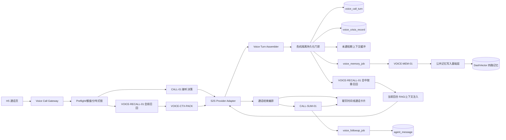
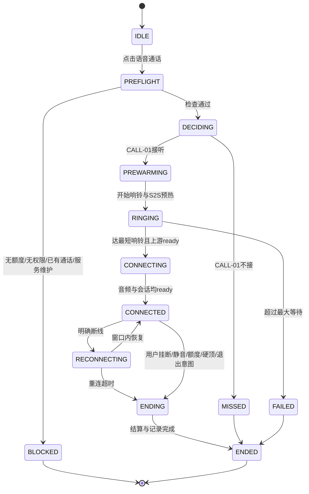
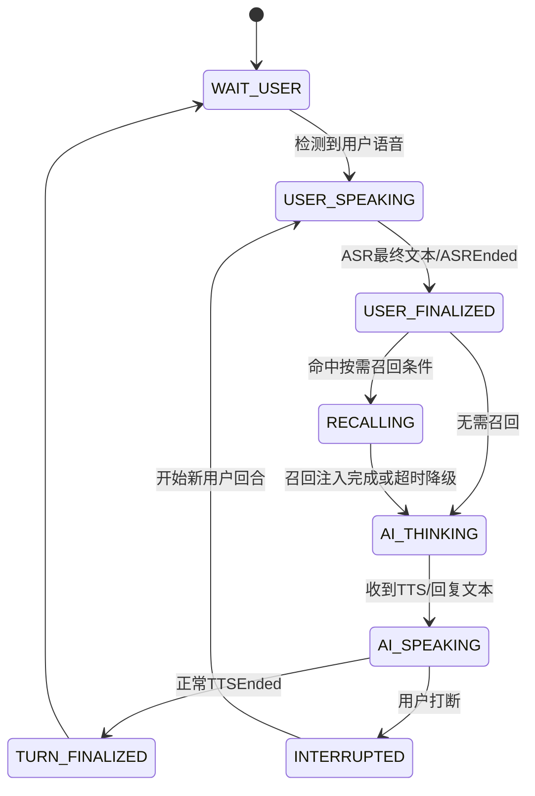

# LXM语音通话-仿真人交互、实时转写与独立记忆链路设计 PRD

## 1. 文档摘要

本文档面向林小梦（LXM）产品约 50 名内测用户，在已有 Doubao 端到端 S2S 实时语音基础能力之上，设计一层完整的“仿真人电话”业务能力。

本版本除保留 v1 中已定义的接听决策、响铃时序、通话状态、时长配额、异常兜底、后台运营与通话后追加消息外，重点完成以下架构修正：

1. **语音记忆召回与语音记忆存储均采用独立业务链路**，不直接调用文字对话的检索编排或 Step6 任务；可以复刻文字链路的处理逻辑与结构，并复用 Embedding、DashVector、Stable Key 等底层能力。
2. **转写在通话过程中按回合实时形成**，不等待通话结束后统一转写。用户本轮说完、林小梦本轮回复完成或被打断后，即形成一条可追溯的语音回合记录。
3. **每个有意义的完整回合均可异步触发 VOICE-MEM-01**，提取并写入长期记忆；记忆任务不阻塞下一轮通话。
4. **支持自然打断（Barge-in）**：林小梦尚未说完时，用户开口可立即停止当前播报，并同步截断模型上下文；未实际播放给用户的内容不视为已经发生的对话。
5. **增加会话前上下文“小包” VOICE-CTX-PACK**，在接通前向实时模型注入人设、关系、称呼、近期对话、上次通话摘要、重要记忆和未完话题，避免每次接通后“重新认识”。
6. **CALL-SUM-01 不再承担长期记忆写入**，其职责收敛为整通电话的记录卡片摘要与通话后追加消息判断。

核心目标是：让用户感受到林小梦不仅“像真人一样接电话”，还能够在同一通电话中自然接话、被打断、记住刚刚说过的内容，并在后续文字或语音对话中继续使用这些记忆。

本次需求收口遵循“只为主线增加语音通话能力”的边界：沿用现有四路记忆与 Stable Key 写入语义，不在本版本复制或改造整套记忆层。明确记忆/模糊记忆、记忆版本与证据链、矛盾确认 Agent、用户侧记忆管理等统一进入独立的后续记忆优化版本。

### 1.1 v2.2 的修正来源与文档权威链

v2.2 是对 v2.1 的**代码对齐修正版**，全部修改来自《[需求确认记录-LXM语音通话-v1](需求确认记录-LXM语音通话-v1.md)》（15 组决策 V1-1 ~ V15-10）。本次修正的七个方向：

1. **跨模态派生指标止损**：语音不写 `conversation_log` 会让主动消息、日记、ActionScore 等既有逻辑在语音用户身上输出错误内容，须显式修正写入端与两处读取端（第 4.3 节 C70–C72、第 5.1 节）。
2. **记忆写入契约收紧**：`memory_type` 改真实取值、Stable Key 补长度约束、限定可写两路、溯源改 MySQL 台账（第 11.3、11.4 节）。
3. **内容安全与危机干预补齐**：语音是出口止损而非入口拦截；补回 P0 已决策但 v2.1 遗漏的危机识别能力（第 19.7、19.8 节）。
4. **状态枚举与用户可见记录矩阵定稿**：移除 `preflight`、终态四分、`end_reason` 九项、`summary_status` 四态（第 15.1、14.3 节）。
5. **成长值与配额口径落地**：语音走独立方法 + `Asia/Shanghai` 时区 + 唯一键幂等（第 13.5、15.7 节）。
6. **配置与能力位口径修正**：能力位默认全 `false`、去掉按用户灰度、配置拆两个 `config_key`、凭据只走环境变量（第 16.3、17.1 节）。
7. **指标口径隔离**：语音指标独立命名空间，不污染既有看板；依赖未取证能力的指标显式标为不可测（第 21 节）。

**文档权威链**（冲突时按此顺序）：


| 顺序  | 文档                                          | 权威范围                       |
| --- | ------------------------------------------- | -------------------------- |
| 1   | 本 PRD（v2.5）                                 | 产品行为、数据语义、删除边界、端到端验收       |
| 2   | [需求确认记录 v1.3](需求确认记录-LXM语音通话-v1.md)           | 决策依据、代码事实、技术债与已知约束的完整论证    |
| 3   | [后台配置与管理设计 v1](DESIGN-LXM语音通话后台配置与管理-v1.md) | 后台页面、Schema、API、校验、发布与回滚细节 |
| 4   | [交互规格与 PRD 映射 v1](LXM语音通话交互规格与PRD映射-v1.md)  | 前端视觉、状态映射与 Demo 对应关系       |


`docs/design/realtime_voice/P0/决策记录-林小梦实时语音通话-v2.md`（C1–C27）为**历史文档**，已被本文全面取代，其中 C2 / C7 / C8 / C10 / C11 / C20 / C26 / C27 明确作废，开发不得引用。仅 C16 / C17 / C23 / C24（危机干预）与 C19 / C25（人格铁律）仍然有效，且已并入本文第 19.8 节。

### 1.2 v2.3–v2.5 最终收口

v2.3 依据需求确认记录 v1.1 收口 O-02/O-03/O-05/O-06，并同步 observer/`ai_trainer` 权限、卡片矩阵、保留期与数据保护边界。账号注销全量清理移出 P1，登记为 TD-V-07，不能计入本期验收；P1 仍保留后台单通删除语义。当前仅 O-01 与 O-04 未定。

v2.4 依据需求确认记录 v1.2 关闭正式 STEP 复审识别的三项来源缺口：冻结 missed 首发逐字文案，确立 MySQL 独立追加式能力证据事实源，并确立关系阶段多窗口校验与无副作用预览语义。该修订不扩展 P1 功能范围，O-01/O-04 仍是实施/发布证据门禁。

v2.5 依据需求确认记录 v1.3 只修正执行编排口径：对应实现 STEP 同期产出并验证契约增量，全部里程碑通过后再统一整合现行契约；每个 STEP 绑定本系统层可直接观察的 AC、CSTR 或技术验收锚点，不要求迁移、结构和基础设施 STEP 代领下游业务 AC。该修订不改变 C1–C122、AC1–AC49/AC51–AC80、接口字段、业务语义或 O-01/O-04 门禁。

---


## 2. 背景与代码基线


### 2.1 产品背景

v1 已定义以下主要能力：

- CALL-01 接听决策；
- 响铃动画与真实建连解耦；
- 拨号中、通话中、结束反馈、未接卡片、通话记录卡片；
- 每日免费时长和额外时长；
- 弱网重连、静音超时、软收尾、强制接听、多设备锁；
- CALL-SUM-01 通话后摘要和追加消息；
- 后台音色、参数、补充时长和转写记录管理。

v1 的主要缺口是把“语音通话”视为一段结束后再处理的整体数据，没有完整定义实时转写、逐轮回合、会话前记忆注入、通话中按需召回以及用户打断模型播报的行为。

### 2.2 当前代码仓与 P0 S2S 基线

当前 LXM `main` 主线已有以下可复用能力：

- 文字聊天独立的查询改写、多路向量检索、Prompt 注入和 Step6 异步记忆写入；
- DashVector 四路记忆类型、Stable Key、Embedding、关系状态和时间线 `sort_seq`；
- `conversation_log` 与 `agent_message` 的统一时间线；
- 后台配置草稿、发布、版本、回滚和 Redis 热配置；
- 定时任务和延迟队列的实现范式。

当前 `main` 未包含完整语音通话 Router、通话表、转写表及 H5 实时音频实现；主页“语音通话”入口仍是占位行为。

本 PRD 指定 `feat/realtime-voice-phase0@b937a78` 为 P0 S2S **能力验证基线**。该基线已能提供实时事件流、`ChatRAGText`（事件 502）、`ClientInterrupt`（事件 515）、ASR 后规则/向量召回及内存态上下文实验，但尚不等同于可直接合入的生产实现，已知仍需补齐或验证：

- 当前回复开始前的 RAG 门控、问题/回复绑定、注入确认与取消，避免默认回复和 RAG 回复并发；
- TTS 播放位置与文本句段的可靠映射；
- 持久化、幂等、重试、权限、保留和删除语义；
- H5 真机 AEC、蓝牙、切后台、断线重连和容量表现。

因此，开发应以该提交核对事件能力，再通过 Provider Adapter 收敛契约；不得把实验分支中的内存态行为直接视为业务主线已具备能力。

**Phase 0 取证的真实状态（2026-08-26 核对，必须在开工前读到）**


| 事项                                     | 状态                                                                                                                                                           |
| -------------------------------------- | ------------------------------------------------------------------------------------------------------------------------------------------------------------ |
| 实验工具链（真实端点、二进制协议编解码、会前小包、召回编排、弱网代理、单测） | 已就绪，在 `feat/realtime-voice-phase0@b937a78`，**未合 main**                                                                                                       |
| Go/No-Go 报告                            | **不存在已填写版本**，分支上只有 `Phase0-GoNoGo-报告模板.md`                                                                                                                   |
| 六项能力位证据                                | **零项有完整证据**，仅 `supports_current_turn_rag_gate` 有部分采集基础                                                                                                       |
| 关键事件采集白名单                              | 缺 `ChatResponse` / `ChatEnded` / `TTSSentenceStart` / `TTSSentenceEnd` / `TTSEnded` / `ConversationTruncated` / `SessionFailed` / `UsageResponse` **全部 8 项** |
| 第 16.4 节事件名的来源                         | 2026-07-18 桌面调研（厂商文档），**非实测**                                                                                                                                |


`docs/progress/林小梦实时语音-Phase0_progress.md` 标注的“16/16 100%”指**代码与单测就绪**，不等于本文第 22 节定义的 Phase 0 取证已交付。二者是两个独立状态，不得互相代替。

因此本文所有“Provider 支持某能力”的表述，在拿到填好的 Go/No-Go 报告之前一律按未验证处理，业务层无条件先走降级路径（第 16.3 节）。

### 2.3 核心设计原则


| 原则                | 说明                                                                                                                                            |
| ----------------- | --------------------------------------------------------------------------------------------------------------------------------------------- |
| P1 独立业务链路         | 语音召回、语音记忆存储、语音后处理分别独立维护 Prompt、任务、状态、重试和指标                                                                                                    |
| P2 复用底层能力         | 可复用 Embedding、DashVector Client、Stable Key 校验、关系数据、配置中心等基础层                                                                                   |
| P3 按实际发生落库        | 用户最终转写和用户实际听到的 AI 内容才进入有效转写、摘要与记忆                                                                                                             |
| P4 通话不中断          | 召回、记忆提取、摘要等业务任务失败不得阻塞实时通话主链                                                                                                                   |
| P5 回合级真相          | `voice_call_turn` 是转写和记忆的最小事实单元，整通转写由回合拼装                                                                                                     |
| P6 幂等可补偿          | 计费、回合落库、记忆写入、摘要和追加消息均可重试且不得重复执行                                                                                                               |
| P7 显式上下文          | 不依赖供应商不可见的跨会话记忆；跨通话连续性由 LXM 自己召回和注入                                                                                                           |
| P8 能力门控           | Provider 能力按“已验证/未验证/失败/已过期”管理；未验证能力仅可在审计 `test` 中强制启用，全量必须验证通过，能力不足时走确定性降级                                                                        |
| P9 数据域解耦          | 通话记录、转写、摘要、记忆和用量账本分别管理；删除或过期不得产生未定义的跨域级联                                                                                                      |
| P10 控制面不可替代业务状态机  | LLM 只能提出退出意图等建议，挂断、计费、删除等不可逆动作必须由业务状态机执行                                                                                                      |
| P11 老功能不改代码但要改判定  | “不动老逻辑”不等于“老功能行为不变”。既有主动消息、日记、活跃度判定依据都是 `conversation_log`，语音不写它，老功能会主动输出错误内容。因此写入端补 `last_interaction_at`、读取端做两处最小止损，其余记技术债（第 4.3 节 C70–C72） |
| P12 安全底线不建在未取证能力上 | 内容安全与危机干预的响应形态只能依赖已验证事实。当前六项能力位零证据，故危机响应采用低干扰常驻提示条而非“当前回合注入角色口吻关心”（第 19.8 节）                                                                  |
| P13 指标口径不共用       | 语音指标使用独立 Redis 前缀与独立看板，不递增既有 `content_block_count`、`llm_stats`、`llm_response_times`，避免分子含语音、分母不含语音的虚假比率（第 21.2 节）                             |


---


## 3. 目标、成功标准与非目标


### 3.1 产品目标


| 编号  | 目标      | 成功定义                                    |
| --- | ------- | --------------------------------------- |
| G1  | 拟真人接听体验 | 接听延迟、未接、开场和结束行为不呈现机械固定规律                |
| G2  | 实时自然对话  | 用户可自动收音、自然停顿、随时打断，林小梦不会继续播放被打断的长回复      |
| G3  | 跨模态连续记忆 | 文字聊天和语音通话使用同一四路长期记忆，但拥有独立召回与存储流程        |
| G4  | 通话内连续性  | 用户本通电话前面说过的重要内容，可通过会话短期缓冲在后续回合继续使用      |
| G5  | 可追溯转写   | 用户和林小梦每个完整回合均可在后台还原，打断内容有明确标识           |
| G6  | 可靠计费与结算 | 不重复扣时长、不漏扣；断线、重连和重复结束事件不造成重复结算          |
| G7  | 可运营与可调优 | 音色、模型、Prompt、时序、静音、打断、召回、记忆和额度参数均可版本化配置 |


### 3.2 建议内测观测指标

以下为内测建议指标，不作为当前已确认硬门槛：

- 通话创建成功率；
- S2S 建连成功率；
- 接通后首段语音开始耗时 P50/P90/P95；
- 打断生效耗时 P50/P90；
- 误打断率；
- ASR 最终转写产生率；
- 回合落库成功率；
- VOICE-MEM-01 最终成功率；
- VOICE-RECALL-01 触发率、命中率、超时率；
- 通话卡片摘要成功率；
- 计费账本与通话时长差异；
- 用户主观“像真人”“记得我”“打断自然”评分。

必须满足的正确性门槛：

- 重复扣减次数为 0；
- 同一回合重复写入记忆次数为 0；
- 被打断且未播放的 AI 内容不得作为“用户已听到内容”进入有效转写；
- 多设备同账号不得同时建立两通有效通话；
- 后台删除通话后，删除围栏必须阻止未完成任务继续写入；已成功产生的长期记忆不得被误删。


### 3.3 本期范围

- 仅用户主动发起语音通话；
- 仅复用主页快捷互动栏“语音通话”入口；
- CALL-01 接听决策；
- 会话前 VOICE-RECALL-01 与 VOICE-CTX-PACK；
- 实时转写、回合组装和回合落库；
- 通话中按需 VOICE-RECALL-01；
- 用户打断 AI 播报；
- 逐轮异步 VOICE-MEM-01；
- 时长、异常、重连、静音、软收尾和硬顶；
- 通话记录卡片、整通摘要和追加消息；
- 每满 30 秒增加 5 点关系成长值（按有效计入时长计算）；
- 后台配置、补充时长、通话记录、逐轮转写、到期状态、导出和任务状态查询；
- 语音内容安全的**出口检测与记录**（不干预播放，见第 19.7 节）；
- **危机内容识别与响应**（仅语音、仅自伤/自杀倾向，见第 19.8 节）；
- 全局总开关 + 用户白名单灰度、软停/硬停两级紧急停用；
- 跨模态派生指标的写入端修正与两处读取端最小止损（第 4.3 节 C70–C72）。


### 3.4 非目标

- 林小梦主动发起来电；
- 视频通话；
- Feed 页面发起通话；
- 用户侧购买、支付和订单，本期仅管理员补充额外时长；
- 信号强度等纯视觉拟真；
- 通话中公开显示实时字幕，后台仍保存转写；
- 语音记忆直接调用文字聊天 Step6；
- 依赖供应商 `dialog_id` 作为跨通话长期记忆；
- 每个“嗯、啊、对”等无有效语义短回合都调用一次记忆 LLM；
- 保存原始音频或进行质量抽样录音；
- 用户侧查看、纠正、逐条删除向量记忆，或在通话卡片中管理记忆；
- 明确记忆/模糊记忆双态、记忆版本历史、证据链、冲突确认 Agent、旧版本回退与模糊记忆衰减；
- 后台删除通话时级联删除已经成功写入的长期记忆；
- 用本期语音改造顺带重构文字 Step6 或现有记忆层；
- 前端埋点上报通道（仓库零基建，改为服务端指标 + 预检回传，见第 21.1 节）；
- 百分比灰度（50 人规模无统计意义，只做用户白名单，见第 17.1 节）；
- 语音读写 `relationship` 的 Future 单槽（语音里说的约定本期不触发后续主动消息，记 TD-V-06）；
- 通话进行中抑制文字主动消息投递（记 TD-V-05）；
- 文字侧的危机内容识别与响应（本期仅语音，见第 19.8 节）；
- 微信内置浏览器内通话（走“浏览器不支持”阻断页，P0 C27 的 JSSDK 录音方案本期不做）；
- 账号注销全量清理（移出 P1，登记 TD-V-07，由后续独立账号注销项目实施；本期仅保留后台单通删除）；
- 语音情绪写入 `emotion_log` / Redis `ai_emotion` / `user_short_term_emotion`（本期仅存 `voice_call`，见第 12.4 节）；
- 后台“历史对话 Tab”纳入通话记录（走独立的语音通话记录页，见第 14.3 节）。

---


## 4. 决策记录


### 4.1 沿用或修正 v1 的主要决策


| 编号  | 主题        | v2 结论                                          | 状态           |
| --- | --------- | ---------------------------------------------- | ------------ |
| C1  | 接听决策      | CALL-01 综合关系、日程、首次通话、今日次数和历史情况决定是否接听与延迟        | 沿用 v1        |
| C2  | 未接来电      | 允许小概率未接并展示未接卡片；未接不等于技术失败                       | 沿用 v1        |
| C3  | 首次与后续通话   | 通过 CALL-01 输入差异化，不另建固定分支                       | 沿用 v1        |
| C4  | 响铃与建连     | 响铃动画和真实预热并行；最短响铃 4 秒、最大等待 12 秒                 | ✅ 已确认        |
| C5  | 状态页面      | 拨号、连接、通话、重连、结束、未接和记录卡片均在本期                     | 沿用并扩展        |
| C7  | 发起方       | 本期恒为用户，数据结构预留 initiator                        | 沿用 v1        |
| C8  | 通话结束展示    | 立即插入通话卡片，摘要异步生成后更新；可判断追加消息                     | v2 修正        |
| C9  | 免费时长重置    | 明确按 `Asia/Shanghai` 自然日 00:00 重置且不结转           | v2 修正口径      |
| C10 | 软收尾       | 剩余时长达到阈值时向当前 S2S 会话注入 `time_low`               | 沿用 v1        |
| C11 | 额度耗尽      | 每通最多一次 30 秒免费自然收尾；不产生负余额、不得开启新话题               | ✅ 已确认        |
| C12 | 弱网重连      | 明确断线立即进入重连；心跳超时仅用于僵尸连接兜底                       | v2 修正        |
| C13 | 误触频控      | 上一通结束后 3 秒内禁止再次拨打                              | 沿用 v1        |
| C14 | 多设备并发     | Redis 分布式租约，先到先得                               | v2 细化        |
| C15 | 服务故障      | 接通前提示“暂时无法接通”，接通后提示“通话暂时中断，请稍后再试”；不自动转文字 | v2.3 收口 |
| C16 | 静音超时      | 6 秒确认、12 秒告别挂断；仅在等待用户回答且麦克风正常时计时               | v2 细化        |
| C17 | 静音与软收尾    | 同时触发时静音处理优先                                    | 沿用 v1        |
| C19 | 强制接听      | 5 分钟内未接 5 次后，下一次角色决策强制接听；不能越过额度、并发和服务故障        | v2 细化        |
| C20 | 关系值       | 按有效计入时长每满 30 秒增加 5 点，每通余秒不结转；每日上限 100 点        | ✅ 已确认        |
| C21 | 通话入口      | 本期仅主页入口，不增加聊天页入口                               | v2 修正        |
| C22 | 单通上限      | 绝对硬顶 1 小时，可配置；僵尸连接由心跳兜底                        | 沿用 v1        |
| C23 | 时长账户      | 免费池 + 额外时长池，优先扣免费池；用户侧不区分来源                    | 文案修正         |
| C24 | 扣减方式      | 分段幂等扣减，并增加独立 usage ledger                      | v2 细化        |
| C25 | 音色        | 按 persona 配置，通话保存模型、音色和配置版本快照                  | v2 细化        |
| C26 | 记忆权重      | 语音与文字长期记忆默认同权重                                 | 沿用 v1        |
| C27 | 记忆写入      | **废止：CALL-SUM-01 不再直接写长期记忆**                   | 被 C39/C44 替代 |
| C28 | 转写存储      | 独立 `voice_call` + `voice_call_turn`，不混用文字消息表   | v2 细化        |
| C29 | 内容保留期     | 有效转写默认 180 天；AI 完整生成调试文本、CALL-SUM `reasoning` 与危机原文默认 30 天；任务日志默认 90 天 | ✅ 已确认        |
| C30 | 响铃时间      | 默认最短 4 秒、最大 12 秒，后台可配并按通话快照                    | ✅ 已确认        |
| C31 | 并发与超时     | 最大并发、连接超时、重试、心跳、重连等均配置化                        | 沿用并扩展        |
| C32 | 追加消息      | 摘要生成与追加消息资格分离；不能发追加消息时仍可生成摘要                   | v2 修正        |
| C33 | 追加判断      | 未尽话题、情绪浓度、关系阶段和合理时段                            | 沿用 v1        |
| C34 | LLM 数量    | **废止：不再限定只有 CALL-01 与 CALL-SUM-01**            | 被 C38/C39 替代 |
| C35 | reasoning | 由 CALL-SUM 生产并存储，仅 `super_admin` 后台调优可见，默认保留 30 天；不进入用户侧、timeline 或任何导出 | v2.3 收口        |
| C36 | 日程        | 优先读取 `life_plan.scenes` 当前时段；缺失时使用通用活动配置或中性上下文 | v2 修正        |
| C37 | 消费体系      | 时长独立，不接积分体系                                    | 沿用 v1        |


### 4.2 本轮新增并确认的决策


| 编号  | 主题             | 结论                                                               | 状态                                                        |
| --- | -------------- | ---------------------------------------------------------------- | --------------------------------------------------------- |
| C38 | 语音记忆召回         | 新建独立 VOICE-RECALL-01；可复刻文字查询改写和多路检索，但不直接调用文字业务节点                 | ✅ 已确认                                                     |
| C39 | 语音记忆存储         | 新建独立 VOICE-MEM-01；输出兼容现有四路记忆结构，复用公共写入基础层                         | ✅ 已确认                                                     |
| C40 | 实时转写           | 通话中按回合接收 ASR/模型文本并落库，不等待挂断后统一 ASR                                | ✅ 已确认                                                     |
| C41 | 逐轮记忆           | 每个完整且有有效语义的回合异步提取记忆，不阻塞下一轮                                       | ✅ 已确认                                                     |
| C42 | 用户打断           | 用户在 AI 播放过程中开口，停止播报并截断供应商上下文                                     | ✅ 已确认                                                     |
| C43 | 会话前小包          | 新增 VOICE-CTX-PACK；当前 v1 和主仓没有完整定义，v2 纳入 P0                       | ✅ 已确认                                                     |
| C44 | CALL-SUM-01 职责 | 仅负责整通卡片摘要和追加消息，不承担逐轮长期记忆写入                                       | ✅ 已确认                                                     |
| C45 | 实际听到的内容        | AI 未播放或被打断未播放的部分，不写入有效对话和记忆                                      | ✅ 已确认                                                     |
| C46 | 会话短期缓冲         | 增加本通电话的短期上下文缓冲，解决逐轮记忆异步完成前的本通连续性                                 | ✅ 已确认                                                     |
| C47 | 通话后补偿          | 挂断后检查未闭环回合、失败记忆任务和最后转写；只补漏，不重复整通重写                               | ✅ 已确认                                                     |
| C48 | 供应商跨通话上下文      | 每通新建业务会话；仅同一通重连复用 provider dialog/session，跨通话由 LXM 小包显式注入        | ✅ 已确认                                                     |
| C49 | P0 验证基线        | 以 `feat/realtime-voice-phase0@b937a78` 核对 S2S 事件和能力，不把实验实现直接并入主线 | ✅ 已确认                                                     |
| C50 | 当前回合 RAG       | Provider 能可靠门控时作用于当前回合；否则当前回合自然澄清，结果从下一回合生效                      | ✅ 已确认                                                     |
| C51 | 打断有效文本         | 按“精确已播片段 → 客户端确认完整句 → 空文本”三级证据生成，完整生成文本仅排障                       | ✅ 已确认                                                     |
| C52 | 会前小包预算         | 稳定人格上限 5000 字符；动态上下文上限 2000 字符，其中最近对话上限 800 字符、记忆最多 5 条，构建预算 3 秒 | ✅ 已确认                                                     |
| C53 | 语音记忆拆分         | 按语义原子生成 0–N 条；同主题合并、不同主题拆分，单回合最多 5 条高价值记忆                        | ✅ 已确认                                                     |
| C54 | 跨模态并发          | 文字/语音任务保持独立；仅对共享关系标量写入做协调，当前记忆仍沿用 Stable Key upsert              | ✅ 已确认                                                     |
| C55 | CALL-01 失败兜底   | 默认接听，使用 4–8 秒中性延迟与中性开场；不得绕过额度、锁、容量和 Provider 门禁                  | ✅ 已确认                                                     |
| C56 | 附和与打断          | 两阶段判定；短弱附和不打断，持续表达、新语义或强打断词立即升级                                  | ✅ 已确认                                                     |
| C57 | 摘要资格           | 接通后有效时长不少于 15 秒且至少有一个有意义闭环回合才生成 LLM 摘要，否则使用静态卡片                  | ✅ 已确认                                                     |
| C58 | 退出意图           | LLM 只提出退出意图；业务状态机完成简短告别、等待播放结束后挂断，并支持用户续说取消                      | ✅ 已确认                                                     |
| C59 | 追加消息时段         | 由 `voice_call_config` 承载可发布的关系阶段 `windows` 数组：初始为陌生 `[10:00,21:00)`、朋友 `[09:30,22:00)`、亲密 `[09:00,22:30)`、知己 `[09:00,23:00)`；`Asia/Shanghai`、分钟精度、左闭右开、不跨日，同阶段不重叠但可相邻，每窗口时长大于 0–20 分钟抖动上限；窗外顺延后加抖动，恰好 24 小时允许、超过则取消。首次种子发布与读取失败回退共用规范默认值；后台复用 config validate 提供无副作用预览 | ✅ v2.4 收口 |
| C60 | 转写后台           | 独立查看逐轮有效文本、到期时间与状态，并支持有权限导出；查看和导出均审计                             | ✅ 已确认                                                     |
| C61 | 原始音频           | 本期不保存，只保存文字、时序与质量指标                                              | ✅ 已确认                                                     |
| C62 | 后台单通删除         | 删除卡片、摘要和转写并取消未完成任务；已成功写入的长期记忆、用量账本、成长值和无内容审计不回滚。账号注销全量清理不属于本期 | ✅ 已确认                                                     |
| C63 | 记忆体系优化         | 明确/模糊记忆、版本、矛盾确认 Agent 与用户侧记忆管理整体延期到独立版本，本期不做半套实现                 | ✅ 范围确认                                                    |
| C64 | 后台文档边界         | 本 PRD 保留产品语义、后台概要、权限与删除边界；后台页面、Schema、API、校验和发布细节由专项设计承接         | ✅ 已确认                                                     |
| C65 | 配置发布单元         | 语音专项非敏感配置聚合为一个 `voice_call_config`；分区保存草稿，整包测试、发布、版本化和回滚         | ⚠️ 已被 C100 拆分修正                                           |
| C66 | S2S 凭据         | 密钥保存在部署 Secret/环境配置；后台只保存 `credential_ref`、版本引用与健康状态，不展示或回传明文    | ✅ 已确认                                                     |
| C67 | 未验证能力          | 允许配置并强制启用，必须显著标记、二次确认、填写原因、鉴权和审计；验证通过前不得全量                       | ⚠️ 已被 C98 / C116 修正（默认全 `false`，`effective_scope` 无按用户维度） |
| C68 | 后台首批范围         | Phase A 先建设 S2S Provider、模型、音色、连接测试、能力矩阵、发布/回滚和配置快照底座            | ✅ 已确认                                                     |
| C69 | S2S 人格来源       | 引用现有共享人格的明确已发布版本，并叠加语音专用指令与动态小包；不复制第二份可独立编辑的人格正文                 | ✅ 设计收口                                                    |


### 4.3 v2.2/v2.3 代码对齐与最终收口决策（C70–C122）

全部来自《[需求确认记录-LXM语音通话-v1](需求确认记录-LXM语音通话-v1.md)》。「依据」列为确认记录内的决策编号，用于反查完整论证与代码事实。

**三项前提裁定**


| 编号   | 前提                    | 裁定                                                                                                  |
| ---- | --------------------- | --------------------------------------------------------------------------------------------------- |
| P-01 | P0 决策记录（C1–C27）与本文的关系 | 本文全面取代 P0 决策记录，冲突项一律以本文为准                                                                           |
| P-02 | 部署形态                  | **单实例部署**。与文字链路现状一致（`chat_service._generation_futures` 为进程内字典，`asyncio.Future` 无法跨实例共享）。本期不具备水平扩展能力 |
| P-03 | 浏览器支持范围               | 仅支持独立浏览器；微信内置浏览器走“浏览器不支持”阻断页                                                                        |


**决策表**


| 编号   | 主题               | 结论                                                                                                                                                                                      | 依据            |
| ---- | ---------------- | --------------------------------------------------------------------------------------------------------------------------------------------------------------------------------------- | ------------- |
| C70  | 语音写入端跨模态修正       | 语音成长值走新增独立方法，并在其中更新 `relationship.last_interaction_at`；`add_growth` 等既有函数一行不改。自动修复沉默天数与语气修正、主动消息 P1 时间条件、P4 轻度沉默                                                                        | V1-1          |
| C71  | 读取端最小止损          | 只改两处：主动消息 `_check_p0` 的「24h 内无新对话」、日记 `_get_conversation_summary_in_window` 的 `has_interaction`，均纳入 connected 通话                                                                        | V1-2          |
| C72  | 派生指标技术债          | ActionScore 活跃度权重、P1「历史对话 ≥10 轮」、P3 凌晨在线、人格偏离率语音口径记为 TD-V-01 ~ TD-V-04，本期不改                                                                                                             | V1-3          |
| C73  | 语音情绪             | CALL-SUM-01 整通产出一条，存 `voice_call` 新增字段；**不写** `emotion_log` / Redis `ai_emotion` / `user_short_term_emotion`；仅供语音会前小包与后台通话详情使用                                                          | V1-4          |
| C74  | 摘要失败降级取值         | 摘要失败时日记侧须定义降级取值，不得把空字符串注入 Prompt                                                                                                                                                        | V1-5          |
| C75  | 记忆输出校验           | `memory_type` 使用真实取值；输出后前置 `validate_key` / `validate_value`，不合规记 `dropped` 指标且不触发重试，不沿用 Step6 的静默 `continue`                                                                           | V2-1          |
| C76  | 可写记忆路            | 只允许写 `user` 与 `character_private`；代码侧硬拒绝 `character_global` / `character_knowledge`（后两者 `doc_id` 后缀为 `"0"`，是跨全体用户共享的角色级记忆）                                                              | V2-2          |
| C77  | 记忆溯源落点           | 溯源不写向量 `fields`，改 MySQL 独立台账；向量 `fields` 与文字链路完全同构                                                                                                                                      | V2-3          |
| C78  | 未完话题归属           | `unfinished_topics` 与未来约定存 `voice_call` 字段，仅服务语音会前小包；不进向量库、不占 Future 槽、不复用 `relationship.character_purpose`                                                                             | V2-4          |
| C79  | 语音内容安全形态         | 出口止损：用户 ASR final 与 AI 有效文本双向检测并记录，Phase 1 不干预播放；句级拦截随能力取证再升级                                                                                                                           | V3-1 / V3-2   |
| C80  | 安全指标隔离           | 独立 Redis 计数键与独立指标，不并入 `content_block_count:{date}`                                                                                                                                      | V3-3          |
| C81  | 命中回合的记忆处理        | 内容安全或危机命中的回合 `memory_status=skipped`，不进 VOICE-MEM-01                                                                                                                                    | V3-4 / V15-8  |
| C82  | 通话行创建时机          | 预检全部通过后才建 `voice_call` 行；`status` 移除 `preflight`，起始态 `deciding`；阻断只走服务端指标 + 结构化日志，不落业务表                                                                                                 | V4-1          |
| C83  | 终态四分             | `ended`（接通过）/ `missed` / `failed` / `cancelled`；状态机图中的 `ENDED` 是流程终点抽象节点，不是 `status` 取值                                                                                                 | V4-2          |
| C84  | `end_reason` 与结束行为 | 至少九项，见第 15.1 节；各原因的结束页/无结束页行为及接通前后异常默认稿见第 14.2 节，由 `voice_call_script` 发布覆盖 | V4-3 / V4-7 |
| C85  | `summary_status` | 仅满足摘要资格的接通通话进入 `pending` 并调用摘要 LLM；接通但不满足摘要资格使用完整静态卡、`summary_status=not_applicable`；`missed` 为轻量卡，`failed/cancelled` 无卡，三类均不调用摘要 LLM | V4-4          |
| C86  | 用户可见记录矩阵         | 按第 14.3 节矩阵定稿                                                                                                                                                                           | V4-5          |
| C87  | 时间线卡片结构          | item **扁平扩展** 5 个字段，其余 source 置 `null`；不引入 `payload` 子对象                                                                                                                                | V5-1          |
| C88  | Open API         | 返回通话卡片；对应实现 STEP 同期产出并验证 `docs/design/openapi/open-api-v1.md`、`docs/contract/current/openapi/api.md` 与 `docs/contract/current/chat-emotion/api.md` 的契约增量，全部里程碑通过后统一整合现行契约；根 `docs/contract.md` 仅在入口路由变化时更新 | V5-2、V16-1          |
| C89  | 前端渲染分支           | `renderTimelineItem` **必须**新增 `source === 'call'` 分支，否则通话卡片落进 else 被渲染成普通 AI 文本气泡（无 `content` 时渲染出空气泡）                                                                                  | V5-6          |
| C90  | `sort_seq` 分配    | 插入时一次性分配，摘要更新走 UPDATE、绝不重新分配；不生成卡片的结束类型不占号                                                                                                                                              | V5-5          |
| C91  | 摘要 ready 的传达     | 结束页返回聊天时首次拉取时间线；仍为 `pending` 时 3 秒后仅自动重拉 1 次，总请求数为 2，不做无限轮询                                                                                                                                  | V5-4          |
| C92  | 成长值实现方式          | `RelationshipService` 新增独立方法（如 `add_voice_growth`），复用 `_get_or_create_relationship` / `_calc_level` / 升级历史写入；日上限按 `Asia/Shanghai`；不叠加 `dialog` +2；静音期间不计；达上限时部分给分；`ACTION_LABELS` 补语音条目 | V6-1 ~ V6-7   |
| C93  | 成长值幂等记录          | `ALTER relationship_growth_log` 增加可空 `source_type` / `source_id` / `eligible_seconds` / `business_date` + `UNIQUE(source_type, source_id)`。MySQL 唯一索引对 NULL 不去重，既有行与既有写入完全不受影响          | V6-3          |
| C94  | 配置版本锚定           | `base_version` 复用生效行的 `version`；`ALTER admin_config` 增加可空 `draft_revision`；草稿保存带乐观锁，冲突返回专用错误码                                                                                           | V7-1 / V7-4   |
| C95  | `persona_ref`    | 存 `version` + 人格正文 `sha256`，不存正文全文（`_MAX_HISTORY_VERSIONS = 20`，超出即物理删除最早历史版本，纯指针会静默断链）                                                                                                 | V7-2          |
| C96  | 配置第一天接入运行时       | 「改配置即生效」写成显式验收项；缺配置或解析失败回退代码默认值。仓库已有 TD-004 / TD-005 / TD-012 三条「后台可保存可发布但运行时不读取」的同类债，语音不得成为第四条                                                                                         | V7-3          |
| C97  | 发布卡点一            | 改为参数取值范围校验，不套用 `run_standard_tests`；保留 CONFIRM 手输确认与发布后 5 分钟监控窗口                                                                                                                        | V7-5          |
| C98  | 能力位默认值与证据失效      | 六项默认全 `false`；证据指纹包含 Provider Profile、模型、协议 Profile、Adapter、SDK、测试用例版本，默认有效 30 天（可配置 7–90 天）；任一指纹变化或到期即 `stale`，运行时按 `false` 降级并退出 `all`，只能经审计在 `test` 强制启用。生产证据只追加到 MySQL `voice_capability_evidence`，每轮每能力位一条；配置只保存只读投影/引用 | V8-2 / V8-5 |
| C99  | 重连降级形态           | 重连成功后以「新 Session + 补注入会前小包」继续，接受上下文断层；初始衔接语为「刚刚好像断了一下。你刚才说到哪儿了？」，由 `voice_call_script` 发布覆盖 | V8-3          |
| C100 | 后台配置拆分           | 拆成 `voice_call_config`（阈值/配额/能力位/总开关/用户白名单/关系窗口，`tech_ops` 写）与 `voice_call_script`（会前小包模板、结束页/异常/危机文案、衔接话术，`ai_trainer` 写）                                                                               | V9-1          |
| C101 | 通话文本可见范围         | `super_admin` / `ops_admin` / `observer` 可读取未过期 effective 转写正文；`observer` 只读，`ai_trainer` 正文访问返回 403；完整生成调试文本另行鉴权 | V9-2          |
| C102 | S2S 凭据           | 只走环境变量；`credential_ref` = 环境变量名 + 已/未配置状态；改凭据需改 env 并重启，不支持后台热切                                                                                                                         | V9-3          |
| C103 | 权限实现方式           | 不引入权限点框架，按仓库既有惯例在语音 router 模块内定义角色元组并逐端点挂 `require_role`                                                                                                                                | V9-4          |
| C104 | 导出门禁             | 导出维持 `POST /api/admin/voice/calls/export`，显式挂 `deny_observer_export`；`observer` 导出返回 403                                                                                                                                   | V9-5          |
| C105 | 通话租约             | 锁值存 `call_id` 而非 `"1"`，释放前校验持有者；TTL 设较短值并在心跳中续租；**续租失败即结束通话**（`system_error`），不放任锁自然过期形成双通                                                                                              | V10-2         |
| C106 | 并发对账             | 全局并发用 Redis 计数器，配合定期扫描「进行中但超过硬顶时长」的行做归零对账                                                                                                                                               | V10-3         |
| C107 | 时长配额             | 全局统一日配额，`Asia/Shanghai` 自然日重置，配额值从 `voice_call_config` 读                                                                                                                                | V10-4         |
| C108 | 配额扣减时点           | **不预扣**；通话中用服务端计时器实时比对「已用 vs 剩余」，结算时一次性扣减；崩溃时按最后一次心跳时长补扣。只有实时比对能支撑 30 秒 grace                                                                                                           | V10-5         |
| C109 | 预检封禁校验           | 预检须复用 `User.is_banned` 与 Redis `user_banned:{user_id}`                                                                                                                                          | V10-6         |
| C110 | grace 与并发        | 30 秒 grace 期间仍计入并发容量（音频仍在传输）                                                                                                                                                            | V10-7         |
| C111 | 主动呼入             | 本期不做；`voice_call` 预留 `initiated_by`（`user` / `character`），本期恒为 `user`                                                                                                                   | V11-1         |
| C112 | 未接后的解释消息         | `voice_followup_job` 走 `agent_message`，绕过「8 次/天 + 30 分钟间隔」，消费成功后回填 `agent:count:{user_id}:{date}`；`missed_explanation_template` 首发逐字值为「刚刚没接到你的电话，晚一点我们再聊呀。」，无变量，随 script 发布/回滚，失败时回退同一规范默认值并告警 | V11-2 / V11-8 |
| C113 | 通话结束的主动消息复位      | 调用既有 `_reset_proactive_times`                                                                                                                                                           | V11-3         |
| C114 | 灰度形态             | 全局总开关 + 用户白名单（`config_key` 存 user_id 列表），不做百分比 rollout                                                                                                                                  | V12-1         |
| C115 | 紧急停用             | 软停（只拦新拨打，进行中自然结束）与硬停（断开全部进行中通话）两级，权限归 `tech_ops`，均写操作日志                                                                                                                                 | V12-2         |
| C116 | 能力位灰度维度          | 移除 `capability_gray` 的按用户维度；能力位是全局客观事实，只保留「验证状态 + 证据版本 + 强制启用标记」                                                                                                                        | V12-3         |
| C117 | 前端埋点             | 本期不做上报通道；麦克风权限结果与浏览器能力检测结果随预检请求回传，其余事件服务端已掌握                                                                                                                                            | V14-1         |
| C118 | 指标存储             | 独立 Redis 键前缀 + 独立通话看板；关键十项落 MySQL 日聚合表长期保留，瞬时分布类留 Redis 2 天                                                                                                                             | V14-2 / V14-3 |
| C119 | 不可测标注            | 依赖未取证能力的指标在能力位为 `false` 时显式标为「不可测」，不上报数值（上报 0 会得出与事实相反的结论）                                                                                                                              | V14-4         |
| C120 | 成本核对             | 服务端权威计时 × 单价估算，后台标注「估算值」；定期与真实账单人工对账，差异率本身作为一个指标                                                                                                                                        | V14-5         |
| C121 | 危机内容识别与响应        | 补回 P0 C16 / C17 / C23 / C24；P1 默认中国大陆（12356、110/120），提示条/系统资源卡默认稿可发布覆盖；原文先判定后持久化，命中/疑似命中时隔离表与无正文 turn 原子提交；独立 RBAC + 逐次读取审计，P1 不增加应用层加密，完整规则见第 19.8 节 | V15-1 ~ V15-10 |
| C122 | 通话创建幂等契约          | 必填 `Idempotency-Key`（UUID、≤64、同用户唯一）；同 key 同 payload 在 24 小时重放窗内返回原 `call_id` 且不新建票据/通话，不同 payload 返回 409；原票据已消费或过期时只返回该通话当前状态 | V4-6 |


---


## 5. 总体系统架构




图中的“公共记忆写入基础层”仅指现有 Embedding、DashVector、四路 `memory_type` 与 Stable Key upsert 等基础能力，不代表本期新增记忆版本库、明确/模糊状态机或历史回退层。

### 5.1 业务链路独立与公共能力复用边界


| 能力                | 文字业务链路                                    | 语音业务链路                       | 是否共用               |
| ----------------- | ----------------------------------------- | ---------------------------- | ------------------ |
| 查询改写 Prompt       | TEXT Query Rewrite                        | VOICE-RECALL-01 Prompt       | 不共用业务节点            |
| 检索编排              | 文字多路检索                                    | 语音多路检索                       | 不共用业务任务，可复刻逻辑      |
| 记忆提取 Prompt       | Step6                                     | VOICE-MEM-01                 | 不共用                |
| 记忆任务表/队列          | 文字异步任务                                    | voice_memory_job             | 不共用                |
| Embedding Client  | 公共                                        | 公共                           | 共用                 |
| DashVector Client | 公共                                        | 公共                           | 共用                 |
| 四路 memory_type    | 公共规范                                      | 公共规范                         | 共用                 |
| Stable Key 校验     | 公共                                        | 公共                           | 共用                 |
| 关系表               | 公共数据源                                     | 公共数据源                        | 共用，但写入需冲突控制        |
| 指标与日志             | 文字命名空间                                    | 语音命名空间                       | 不共用指标口径            |
| 成长值写入方法           | `add_growth`（常量点数）                        | `add_voice_growth`（按时长可变点数）  | 不共用方法，共用关系行与升级历史   |
| 情绪存储              | `emotion_log` + Redis `ai_emotion` + 短期情绪 | `voice_call` 情绪字段            | **不共用**，语音情绪不进既有三层 |
| 内容安全              | 入口拦截（入队前命中即拒绝，消息不进 LLM）                   | 出口止损（用户话已出口、上游已在生成，只能检测记录）   | 语义硬差异，不共用          |
| 主动消息计数            | `agent:count:{user_id}:{date}`            | 仅 `voice_followup_job` 消费后回填 | 部分共用（只回填不参与频控判定）   |
| 时间线 `sort_seq`    | `allocate_sort_seq`                       | 同一函数                         | 共用，需评估行锁等待对结束流程的影响 |
| 前端时间线渲染           | `renderTimelineItem` 的 `user` / else 分支   | 必须新增 `call` 分支               | 共用函数，必须扩分支         |


文字和语音业务任务可以并发，但凡写入共享关系标量，必须通过同一协调入口，使用数据库行锁/乐观条件更新和幂等键，避免旧快照后完成时覆盖新关系状态。DashVector 记忆仍遵循当前 Stable Key upsert；跨渠道事实冲突的版本化处理属于第 19.5 节技术债。

**跨模态一致性的两条硬约束（C70/C71）**

1. 语音不写 `conversation_log`，因此凡以 `conversation_log` 为判定依据的既有逻辑，都会在语音用户身上主动输出错误内容。已确认必须处理的三个用户可见穿帮：给刚打完一小时电话的用户发「一天没联系了」；2 级用户当天日记写「今天没联系」；纯语音用户 ActionScore 活跃度权重恒为 0 导致主动消息静默发不出（第三项本期记 TD-V-01）。
2. 语音情绪不得写入 `emotion_log`：日记 `_get_recent_emotion`、主动消息 `_check_p0`、短期情绪服务第 3 层兜底查的都是「该用户最新一条 `emotion_log`」且**不带渠道过滤**，写入即被自动消费。不写它同时绕开一处硬阻塞——`emotion_log.conversation_id` 为 NOT NULL 且外键指向 `conversation_log.id`，语音没有可挂的行。

---


## 6. 完整用户流程


### 6.1 发起前检查

用户点击主页“语音通话”后，依次执行：

1. 登录状态校验；
2. **账号封禁校验**：复用 `User.is_banned` 与 Redis `user_banned:{user_id}`；
3. **功能门禁校验**：全局总开关、软停状态、用户白名单；
4. 浏览器实时音频能力校验（结果随请求回传服务端记录）；
5. 麦克风权限校验或申请（结果随请求回传服务端记录）；
6. 剩余时长校验；
7. 服务维护和全局并发校验；
8. 误触频控校验：上一通结束后 3 秒内禁止再拨；
9. Redis 用户通话租约获取（锁值为 `call_id`，见第 13.6 节）；
10. 创建 `call_id`、`voice_call` 行和配置快照；
11. 并行执行：
  - CALL-01；
  - 会前 VOICE-RECALL-01；
  - 日程、关系、最近通话等基础数据读取；
12. CALL-01 不接：展示未接卡片并结束；
13. CALL-01 接听：构建 VOICE-CTX-PACK、预热 S2S、播放响铃；
14. 同时满足 CALL-01 目标接听时刻、已响铃至少 4 秒且 S2S/音频 ready 后进入通话中；
15. 到第 12 秒仍未 ready：按技术失败结束，不伪装成角色未接；用户在响铃中挂断则记为用户取消。

**行创建时机（C82）**：第 1–9 步为预检，全部通过后才在第 10 步创建 `voice_call` 行。预检被阻断的请求**不落任何业务表**，只按阻断原因分维度递增服务端指标并写结构化日志。因此 `status` 不存在 `preflight` 取值，起始态为 `deciding`。

阻断分布本质是运维指标，50 人规模用监控维度足够；真需要按用户回溯时再补独立的尝试表，`voice_call` 结构不变，不会返工。

CALL-01 超时、非法 JSON 或模型异常时，代码兜底为“接听”，在 4–8 秒范围内选取中性延迟并使用中性开场。该兜底只替代角色决策，不得绕过余额、分布式锁、系统容量、维护状态或 Provider 可用性门禁。

CALL-01 按模型/配置版本统计错误率、非法输出率、超时率与兜底率，配置告警和熔断。达到熔断条件后暂停调用异常版本，直接使用同一代码兜底并记录原因；阈值由后台运营配置，不能因反复重试拖过 12 秒最大等待。

### 6.2 通话主状态机




图与库字段的对应关系（C82/C83）：


| 图中节点                                                 | 是否对应 `voice_call.status`                     | 说明                                                             |
| ---------------------------------------------------- | -------------------------------------------- | -------------------------------------------------------------- |
| `PREFLIGHT`                                          | 否                                            | 纯请求期，未建行                                                       |
| `BLOCKED`                                            | 否                                            | 预检阻断，不建行、不占 `sort_seq`、无卡片                                     |
| `DECIDING` / `PREWARMING` / `RINGING` / `CONNECTING` | 是（`deciding` / `ringing` / `connected` 等过程态） | —                                                              |
| `ENDED`                                              | **否**                                        | 流程终点抽象节点。库里的终态是 `ended` / `missed` / `failed` / `cancelled` 四分 |


用户在响铃或接通阶段主动取消时落 `cancelled`，与角色未接（`missed`）、技术失败（`failed`）互不混淆。

### 6.3 单回合状态机




---


## 7. 会话前上下文小包 VOICE-CTX-PACK


### 7.1 目标

在林小梦接通并说第一句话之前，向实时模型注入“足够接上关系、又不过度膨胀”的上下文，避免：

- 每通电话像第一次认识；
- 忘记用户称呼；
- 忽略上次未聊完的话题；
- 与当天朋友圈、日程或关系阶段冲突；
- 把整套文字 Prompt 原样塞入语音模型，导致书面化和朗读 JSON。


### 7.2 数据组成

按优先级组成一个小包：

1. 林小梦语音人格卡；
2. 当前关系阶段和用户称呼；
3. 当前时间、城市、当前或最近一条生活场景；
4. 最近文字/语音压缩对话（按字符预算裁剪，不固定追求轮数）；
5. 上一次有效通话摘要；
6. 最近 30 天最多 5 条高价值用户记忆；
7. 最近一条未完话题或未来约定；
8. 上一通通话的整通情绪；
9. 从特定内容入口进入时的来源内容，本期主页入口不使用。

第 5、7、8 项的数据来源是 `voice_call` 表字段，**不来自向量库**：整通摘要取 `call_summary`，未完话题取 `unfinished_topics`，情绪取语音情绪字段（C73/C78）。这带来一条已知约束（CS-V-05）：未完话题不进向量库，因此**文字聊天侧无法召回接续**，只有语音会前小包能用。

### 7.3 示例结构

```json
{
  "persona": {
    "name": "林小梦",
    "voice_style": "短句、松弛、自然停顿、会吐槽，不朗读Markdown或JSON",
    "relationship_boundary": "先接住情绪，不控制、不说教"
  },
  "relationship": {
    "stage": "intimate",
    "preferred_name": "Kevin",
    "current_attitude": "关心，但不要连续追问"
  },
  "current_context": {
    "time": "周日晚上",
    "activity": "刚结束设计稿修改，在家休息"
  },
  "important_memories": [
    "用户最近连续加班近一个月",
    "用户更喜欢先被听完再听建议"
  ],
  "open_topics": [
    "上次提到工作压力，还没有聊完"
  ],
  "recent_dialogue": [
    {"user": "最近事情太多了", "assistant": "听起来你一直绷着"}
  ]
}
```


### 7.4 注入原则

- 人格与说话方式进入 `system_role` 或 `character_manifest`；
- 近期真实 QA 优先进入 `dialog_context`；
- 长期记忆必须是压缩事实，不注入原始长文；
- 一通电话内配置与上下文小包冻结，管理员修改只影响下一通；
- 构建失败时使用最小包：人格、关系阶段、称呼和当前时间；
- 不将文字 Step5 的 JSON 输出格式约束注入语音模型。

固定预算与就绪规则：

- 稳定人格和硬规则继续放在 `character_manifest`，上限 5000 字符；
- 动态上下文总上限 2000 字符，其中最近对话上限 800 字符；
- 长期记忆最多选择 5 条高价值结果，按优先级裁剪，不用后台手工绑定固定文档 ID；
- 小包构建预算为 3 秒，超时即使用最小包；
- 第一轮回复设置 ready barrier：上下文小包已注入或已明确降级后，才允许模型开始首轮生成；
- 人格、动态预算、召回规则和结果均随 `config_snapshot` 固化在本通电话中。


### 7.5 跨通话 Provider 上下文策略

每通电话创建新的业务会话和新的 Provider Session；同一通电话的短暂重连**只有在 `supports_session_reconnect` 已有有效取证时**才可复用原 `dialog_id/session_id`。未取证或证据失效时保留同一业务 `call_id`，但新建 Provider Session，按第 18.5 节的小包与衔接话术保守恢复。

跨通话不依赖 Provider 隐式保留的最近 20 轮上下文，原因是：

- 难以审计模型实际看到了什么；
- 与 LXM 自有记忆可能发生重复或冲突；
- 用户删除记忆后，供应商上下文可能仍然存在；
- 不利于未来切换 Provider。

---


## 8. 实时转写与语音回合


### 8.1 转写策略

转写采用实时分段方式：

- `ASRResponse.is_interim=true`：仅用于通话态和临时展示/调试，不直接持久化为最终事实；
- `ASRResponse.is_interim=false` 或 `ASREnded`：形成用户本轮最终文本；
- `ChatResponse`：累计林小梦本轮回复文本；
- `ChatEnded`：表示文本生成结束，但不等于用户已经听完；
- `TTSEnded`：表示 Provider TTS 流结束；只有其语义经 Adapter 验证等价于播放完成，或客户端另行确认播放队列已清空，才能认定用户听完；
- 用户打断：根据实际播放位置截断 AI 有效文本。


### 8.2 回合闭环条件

正常回合：

```text
用户最终ASR
+ AI最终文本
+ TTSEnded
+ 客户端播放完成确认（或经验证的等价事件）
= 回合闭环
```

被打断回合：

```text
用户最终ASR
+ AI已实际播放部分
+ interrupt/truncate完成
= 回合闭环（assistant_interrupted=true）
```

只有 `ChatEnded`、但音频尚未播放完成时，不得触发最终记忆写入。

### 8.3 `voice_call_turn` 数据结构


| 字段                          | 说明                                                  |
| --------------------------- | --------------------------------------------------- |
| `id`                        | 主键                                                  |
| `call_id`                   | 所属通话                                                |
| `turn_index`                | 通话内单调递增序号                                           |
| `question_id`               | Provider 用户问题 ID                                    |
| `reply_id`                  | Provider 回复 ID                                      |
| `user_text_final`           | 用户最终转写                                              |
| `user_asr_confidence`       | 有则保存，缺失可为空                                          |
| `assistant_text_generated`  | 模型完整生成文本，仅用于排障                                      |
| `assistant_text_effective`  | 用户实际听到或可确认已播放的文本                                    |
| `effective_text_evidence`   | full/exact_played/confirmed_sentences/none          |
| `assistant_interrupted`     | 是否被用户打断                                             |
| `played_audio_ms`           | 已播放音频毫秒数；无法可靠获取时为空，不伪造                              |
| `playback_completed_at`     | 客户端确认完整播放完成的时间；未完成时为空                               |
| `turn_status`               | collecting/finalized/interrupted/aborted            |
| `memory_status`             | skipped/pending/processing/success/failed/cancelled |
| `user_content_safety_status` / `assistant_content_safety_status` | `pending/passed/matched/error_allowed`；常规内容安全结果，不存原文 |
| `user_crisis_status` / `assistant_crisis_status` | `pending/passed/matched/suspected/isolation_failed`；危机门禁的非正文状态 |
| `started_at`                | 回合开始时间                                              |
| `finalized_at`              | 回合闭环时间                                              |
| `effective_text_expires_at` | 用户文本与 AI 有效文本的精确到期时间                                |
| `generated_text_expires_at` | AI 完整生成调试文本的精确到期时间                                  |
| `effective_text_cleared_at` | 用户 final/AI effective 实际清除时间                        |
| `generated_text_cleared_at` | AI 完整生成调试文本实际清除时间                                   |
| `content_clear_reason`      | 本期仅 `expired/admin_deleted`；账号注销原因值由 TD-V-07 后续项目定义 |


唯一约束：

```text
UNIQUE(call_id, turn_index)
UNIQUE(call_id, question_id)
```

所有用户 ASR final 和 AI effective 文本在写入 `voice_call_turn` 前必须经过危机持久化门禁，门禁前的原文只允许存在于当前进程内存，不得先落 turn 再清理；`assistant_text_generated` 也只能在同 reply 的 effective 危机判定完成后持久化。安全通过时按上表写入正文；命中或疑似命中时，在**同一 MySQL 事务**中写入 `voice_crisis_record` 原文，并 upsert 仅含 `*_crisis_status`、`memory_status=skipped` 等非正文标记的 turn：对应方向的正文字段必须为 `NULL`，AI 侧同时不保留 `assistant_text_generated`。隔离写入失败时不得回退为将原文写入 turn；告警后至多记录不含原文的 `isolation_failed` 标记，并在处理完成后释放内存中的原文引用。


### 8.4 通话结束时的转写处理

结束时不重新对整段录音做统一 ASR，主要执行：

1. 等待短暂的 final event flush 窗口；
2. 封闭最后一个未闭环回合；
3. 标记无法完成的残缺回合；
4. 拼装整通有效转写；
5. 检查回合记忆任务是否漏建；
6. 进入摘要和后处理。

若外部语音基础能力只在挂断后返回整段文本，而无法提供上述事件，则不满足 v2 的实时转写前置条件，需要先补 Provider Adapter。

### 8.5 存储边界与保留

- `voice_call` 存储通话级状态、计费、配置快照、摘要状态和内容保留状态；
- `voice_call_turn` 独立存储通过危机门禁的用户与 AI 逐轮文字；危机命中/疑似命中的 turn 只留非正文状态，所有语音回合均不写入 `conversation_log`；
- 通话卡片以 `source=call` 接入现有统一时间线；
- 只有 VOICE-MEM-01 提取出的 0–N 条长期事实进入 DashVector，整段逐字转写不进入向量库；
- `user_text_final` 与 `assistant_text_effective` 默认保留 180 天；
- `assistant_text_generated` 只供特殊排障权限使用，默认保留 30 天；
- 到期任务清空文本内容，保留不含内容的通话状态、时长、计费、到期执行结果和审计元数据；摘要与长期记忆分别遵循自己的生命周期，不随转写自动到期。

---


## 9. 用户打断林小梦（Barge-in）


### 9.1 产品规则

当林小梦正在说话时，用户开始表达新的有效语义，系统应停止当前播报并切换到倾听用户。

目标体验：

- 用户不需要等林小梦说完；
- 停止播放应足够快；
- 林小梦后续不能假设用户已经听到了未播放部分；
- “嗯、啊、对”等极短附和不应频繁误打断长回复。


### 9.2 两阶段打断判定

优先使用 Provider `ASRInfo` 或同等“识别到用户首字”事件，并结合客户端 VAD/AEC 分两阶段处理：

1. **候选阶段**：连续有效人声约 180–250ms 后建立候选，不立即切断 AI；纯回声和噪声直接丢弃。
2. **语义升级阶段**：短弱附和结束且没有继续表达时，保留为 backchannel；用户持续说话、出现新语义、升级连接词或命中强打断词时，立即升级为真正打断。

默认词表：

- 弱附和词：`嗯、嗯嗯、啊、哦、对、对对、好、好的、是、是的、哈哈`；
- 强打断词：`等等、等一下、停一下、不是、不对、等会儿、先别说、让我说、你听我说`；
- 语义升级连接词：`但是、可是、不过、其实、我是说、我的意思是`。

词表、VAD 阈值、持续时长与升级规则全部由后台配置，支持草稿、验证、测试、发布、版本和回滚，并在创建通话时生成快照。以上为默认起点，仍需使用真实设备样本校准。

2026-09-12 用户确认的 M3 测试默认：`voice_call_config.interaction` 的 `vad_rms_threshold=0.015`、`candidate_ms=200`、`sustained_ms=600`、`goodbye_timeout_ms=10000`、`time_low_seconds=60`。毫秒/秒单位按字段名；RMS 为归一化 PCM 值。均支持后台校验、发布和回滚，发布后仅新通话采用；VAD 仍待真机校准，不视为生产定值。

### 9.3 打断执行流程

```text
AI_SPEAKING
→ 收到有效用户语音
→ 立即停止本地音频播放
→ 清空尚未播放的音频缓冲
→ 记录 current_reply_id 与 played_audio_ms
→ 发送 ClientInterrupt/同类事件
→ 发送 ConversationTruncate/同类上下文截断
→ assistant_interrupted=true
→ 计算 assistant_text_effective
→ 继续接收用户 ASR
```


### 9.4 有效文本规则


| 场景                     | `assistant_text_effective`                             |
| ---------------------- | ------------------------------------------------------ |
| 正常播放完成                 | 完整回复文本，`effective_text_evidence=full`                  |
| 被打断且有可靠 reply/TTS/文本映射 | 仅保存精确已播放片段，`effective_text_evidence=exact_played`      |
| 无精确映射，但客户端能确认完整句已播放结束  | 仅保存这些完整句，`effective_text_evidence=confirmed_sentences` |
| 两类证据均不存在               | 保存为空，`effective_text_evidence=none`                    |
| 文本已生成但音频未播放            | 不视为已发生                                                 |


`assistant_text_generated` 可用于排障，但不得进入用户可见通话记录、摘要或记忆提取输入。

### 9.5 回声与自打断防护

H5 与基础语音层必须启用或验证：

- `echoCancellation`；
- `noiseSuppression`；
- `autoGainControl`；
- 播放时间戳与麦克风帧时间戳同步；
- 外放场景下的双讲检测；
- 蓝牙耳机切换后的重新校准。

---


## 10. 独立语音记忆召回 VOICE-RECALL-01


### 10.1 召回模式

分为两级：

#### 会前必做召回

用于构建 VOICE-CTX-PACK，召回：

- 用户核心身份与偏好；
- 最近情绪和生活状态；
- 上一次通话摘要；
- 最近未完话题；
- 与当前日程或时段相关的记忆。


#### 会中按需召回

用户本轮出现下列情况时触发：

- “你还记得……”；
- “我之前跟你说过……”；
- “上次那个……”；
- 提到明确人名、地点、计划、作品或长期偏好；
- 用户纠正林小梦记忆；
- 当前问题需要过去信息才能回答；
- S2S 模型主动判断信息不足并请求外部记忆。

普通闲聊、附和和当前上下文已足够的回合不调用长期记忆召回。

### 10.2 独立处理流程

```text
用户本轮最终ASR
→ 语音专属触发判断
→ VOICE 查询改写
→ 优先查询本通短期缓冲
→ 查询 DashVector 四路记忆
→ 过滤、重排、去重
→ 返回 1–3 条压缩结果
→ Adapter 当前回合门控已验证：回复开始前注入本轮
→ Adapter 门控未验证：本轮自然澄清，结果写入短期缓冲供下一回合使用
```


### 10.3 与文字召回的关系

VOICE-RECALL-01 可以复刻文字链路的：

- QueryQuestion / QueryKeywords 思路；
- 四路检索；
- Stable Key 和前缀过滤；
- 相关性与时间性重排。

但必须独立维护：

- 语音 Prompt；
- 召回触发器；
- 实时延迟预算；
- 返回条数和字数；
- 失败降级；
- 语音指标；
- 缓存策略。


### 10.4 本通短期上下文缓冲

逐轮 VOICE-MEM-01 是异步任务，不能保证下一轮到来前已经写入 DashVector。因此每通电话需要一个短期缓冲，例如 Redis：

```text
voice:session_context:{call_id}
```

包含：

- 最近若干完整回合；
- 本通已提取但未持久化的记忆候选；
- 用户在本通中的明确纠正；
- 当前未完话题；
- 已触发过的召回主题缓存。

召回顺序：

```text
本通短期缓冲
→ 会前上下文小包
→ 长期 DashVector
```


### 10.5 当前回合召回的关键技术门槛

Doubao S2S 在用户说完后可能自动开始生成回复。如果外部召回结果晚于默认回复生成，则会出现：

- 当前回复没有用到记忆；
- 默认回复和 RAG 回复同时产生；
- 用户听到重复或相互矛盾的两段话。

P0 分支已存在 `ChatRAGText`（事件 502），但“能发送注入事件”不等于“能保证本轮只产生一条最终回复”。上线前必须验证 Provider Adapter 是否支持以下至少一种能力：

1. 用户回合结束后延迟默认回复，等待外部召回；
2. 取消本轮默认回复，再注入 RAG；
3. 使用工具调用/外部 RAG 事件，并保证只生成一条最终回复；
4. 在自动生成前同步提交 `ChatRAGText` 或同等事件。

只有在回复尚未开始、注入与本次问题可靠绑定且能够证明不会产生双回复时，才把召回结果用于当前回合。能力验证通过后可按发布配置正常启用；尚未验证时只允许经专项权限、二次确认和审计后在审计 test 中强制启用，不得进入全量。若未启用或当前基础服务不支持，降级方案为：

- 当前回合自然询问确认；
- 召回结果进入短期缓冲；
- 从下一回合开始生效。

一旦检测到回复已开始，迟到的召回结果不得追加生成第二段答复，只进入短期缓冲。即使在审计 `test` 中强制启用了未验证能力，该运行时安全规则也不得关闭。能力状态、强制启用原因、`effective_scope` 和降级模式必须写入配置版本与通话快照。这项验证决定当前 Provider 能否从 `test` 升级为全量“当前回合模式”，属于 P0 能力门槛。

---


## 11. 独立语音记忆存储 VOICE-MEM-01


### 11.1 触发时机

每个回合闭环后，若满足以下至少一类条件，则创建 `voice_memory_job`：

- 用户表达稳定偏好、身份、关系、计划、经历或长期状态；
- 用户纠正已有记忆；
- 用户表达有持续价值的情绪背景；
- 林小梦与用户形成明确约定或未完话题；
- 回合内容长度和置信度达到配置门槛。

以下回合代码侧直接 `skipped`：

- 纯“嗯、啊、对、哈哈”等附和；
- 空文本；
- ASR 置信度过低且无用户确认；
- 只有被打断且无法确定用户听到内容的 AI 回复；
- 安全策略禁止持久化的敏感信息。


### 11.2 输入

VOICE-MEM-01 输入至少包含：

```json
{
  "call_id": "...",
  "turn_index": 8,
  "user_text": "不是下周，是下个月去日本",
  "assistant_text_effective": "啊对，下个月。我记住了",
  "previous_turn_summary": "用户提到计划去日本",
  "relationship_context": {},
  "origin_channel": "voice_call"
}
```


### 11.3 输出与语义原子拆分

VOICE-MEM-01 一次处理一个已闭环回合，输出 0–N 条兼容现有四路记忆规范的语义原子；同一主题合并，不同主题拆分，单回合最多保留 5 条高价值结果：

```json
{
  "memory_items": [
    {
      "memory_type": "user",
      "stable_key": "旅行-计划-日本",
      "content": "用户计划下个月去日本，不是下周"
    },
    {
      "memory_type": "character_private",
      "stable_key": "后续话题-日本-行程",
      "content": "下次可继续询问日本行程准备情况"
    }
  ]
}
```

拆分规则：

- 只保留可独立理解、可独立召回的事实或约定；不按固定字数机械切片；
- 同一事实的背景、否定与纠正必须保留在同一个原子中，不能拆出相反含义；
- AI 完整生成文本本身不能成为记忆；输入只允许使用用户最终文本、AI 有效文本及双方明确形成的约定；
- 纯附和、临时口头禅和低价值重复可输出 0 条；
- 超过 5 条时按长期价值、明确程度和后续可用性排序截断，并记录被截断数量指标。


#### 可写记忆路限制（C76）

只允许写两路，代码侧硬拒绝另外两路：


| `memory_type`         | 是否可写  | 原因                                                        |
| --------------------- | ----- | --------------------------------------------------------- |
| `user`                | ✅     | 用户级记忆，`doc_id` 含 `user_id`                                |
| `character_private`   | ✅     | 角色对该用户的私有记忆，`doc_id` 含 `user_id`                          |
| `character_global`    | ❌ 硬拒绝 | `doc_id` 后缀为 `"0"`，角色级、**跨全体用户共享**。单个用户的通话可污染所有用户看到的林小梦设定 |
| `character_knowledge` | ❌ 硬拒绝 | 同上                                                        |


#### Stable Key 与内容的前置校验（C75）

VOICE-MEM-01 输出后、写入前必须调用公共 `validate_key` / `validate_value`，实际约束为：

- 恰好 **3 段**，段间以 `-` 分隔，每段非空；
- 仅允许汉字、数字、英文、`-`、`_`；
- **key 汉字数 ≤ 20**；
- **value 汉字数 ≤ 100**。

口语内容天然比文字长，超限属于常发情况。因此：

- 校验不通过的条目**丢弃并递增** `dropped` **指标，不触发任务重试**（重试改不了 LLM 输出的长度）；
- Prompt 中必须写明三段式与长度上限，让模型直接产出合规输出；
- **不得沿用**文字 Step6 写入循环对非法 key 只 `continue` + info 日志的做法：那会导致任务标 `success`、指标显示成功、实际零写入的静默失败。

上例中的 `后续话题-日本行程` 只有两段，会被 `validate_key` 拒绝，故已改为三段式 `后续话题-日本-行程`。

### 11.4 落库规则

- 使用现有 `memory_type` 规范，可写路按第 11.3 节限定为两路；
- 不新增独立语音向量库；
- **向量** `fields` **与文字链路完全同构**，只包含 `content` / `stable_key` / `key_l1` / `key_l2` / `user_id`，不额外塞溯源字段；
- 溯源信息写入 MySQL 独立台账（建议表名 `voice_memory_trace`）：

```text
call_id
turn_index
doc_id
memory_type
stable_key
pipeline_version   = voice_memory_v1
written_at
```

- 溯源为什么不进向量 `fields`（C77）：`dashvector_client.upsert` 是 HTTP **全量 upsert**，溯源字段写进 `fields` 后，文字链路对同一 Stable Key 的下一次 upsert 会把它整体擦除，审计目标必然落空；同时也绕开「DashVector 是否接受未预定义字段」这一未验证假设；
- 台账顺带支撑第 11.6 节的漏单检查与后台通话详情的「记忆任务成功/失败数」列；
- `stable_key` 不得携带 `source=voice_call` 之类的渠道标记：`stable_key` 是 `build_doc_id` 的哈希输入，打标记会让语音与文字的同一条记忆分裂成两个 `doc_id`，破坏 upsert 去重（P0 C2 已因此作废）；
- `pipeline_version` 只标识本次提取流程/Prompt 版本，不是记忆内容版本号，也不形成历史版本链；
- 来源字段只用于审计和后续追溯，不在本期构成记忆版本、模糊状态或删除级联机制；
- 同一 Stable Key 沿用当前确定性 upsert 语义；用户在本轮作出的明确纠正可成为该 Stable Key 的当前值；
- 同一 `call_id` 的记忆任务按 `turn_index` 顺序消费；
- 不同通话可以并发；
- 写入成功后同步更新本通短期缓冲；
- 关系标量字段通过共享协调入口做行锁/条件更新和幂等保护，避免文字 Step6 与语音任务的旧快照互相覆盖；
- Stable Key 不同或跨渠道事实发生矛盾时，本期不新增“模糊记忆”半成品，由后续记忆优化版本解决；
- 后台删除来源通话不删除已经成功写入的向量记忆。


### 11.5 幂等与任务状态

`voice_memory_job` 字段：


| 字段                 | 说明                                                  |
| ------------------ | --------------------------------------------------- |
| `call_id`          | 通话 ID                                               |
| `turn_id`          | 回合 ID                                               |
| `turn_index`       | 顺序                                                  |
| `pipeline_version` | 语音记忆流程版本                                            |
| `status`           | pending/processing/success/failed/skipped/cancelled |
| `attempt_count`    | 重试次数                                                |
| `next_retry_at`    | 下次重试时间                                              |
| `fail_reason`      | 失败原因                                                |
| `extraction_snapshot` | STEP-029确认增量：可空JSON，首次安全原子集合及版本/阶段；重试沿用，不重新抽取已确定条目 |


唯一约束：

```text
UNIQUE(turn_id, pipeline_version)
```

任务执行前必须校验 `voice_call.deletion_fence_at`。一旦通话进入删除流程，尚未提交的任务标记 `cancelled`；已经成功提交的向量写入不回滚。

2026-09-13确认：`memory.max_retries`默认2（不含首次，范围0～5），`memory.retry_backoff_ms`默认`[1000,5000]`毫秒，长度与重试次数相等、非递减、每项100～60000。定时任务领取到期任务；重试耗尽为failed，后续回合可继续，旧任务补跑不得覆盖本通较新回合已提交的同key。快照在首次向量写前持久化，success/skipped/cancelled时清除，failed保留但不超过来源正文到期时间；后台任务元数据及日志不暴露快照正文。旧无快照的已尝试任务不自动推定可以重新抽取。

### 11.6 通话结束补偿

结束后执行：

- 检查所有 finalized/interrupted 回合是否有对应记忆任务；
- 缺失则补建；
- 已成功不重复；
- 失败任务继续按策略重试；
- 不把整通摘要再次当成一条长期记忆覆盖逐轮事实。

若通话已设置删除围栏，不再补建或重试记忆任务、摘要任务及追加消息任务。

### 11.7 本期记忆边界与后续技术债

本期不引入新的记忆类型状态或历史层，继续使用现有四路 `memory_type`、Stable Key 和当前值 upsert。以下内容应另立“记忆优化”PRD/技术债（编号待建立），统一设计后再实施：

- “明确记忆/模糊记忆”标签及模糊记忆不能作为既定事实使用的召回规则；
- 版本号、证据来源、当前版本、失效版本、删除最新版本后的回退与升降级；
- 发现“小白/小黑”等冲突时，由 Agent 通过自然对话确认，而非直接覆盖或武断采用其一；
- 同类多条模糊记忆的合并、衰减、过期与晋升；
- 用户侧查看、纠正、逐条删除、选择“不记住本次通话”及其跨数据域语义；
- 来源通话删除与记忆回滚/级联的可选策略。

---


## 12. 通话后摘要与追加消息


### 12.1 CALL-SUM-01 新职责

CALL-SUM-01 仅处理：

1. 用户可见的一句话通话摘要；
2. 未完话题或情绪延续判断；
3. **整通情绪判定**（一条，仅供语音自用）；
4. 是否发送追加文字消息；
5. 发送延迟和内容；
6. 内部 reasoning。

它不再直接调用 DashVector，也不负责生成逐轮长期记忆。

`reasoning` 由 CALL-SUM-01 生产并存储，仅 `super_admin` 可在后台调优查看，默认保留 30 天；不得进入用户侧、timeline 或任何导出。

### 12.2 调用时机

通话结束后立即插入聊天时间线卡片：

```text
语音通话 · 05:32
刚刚聊了一会儿
摘要整理中
```

随后异步调用 CALL-SUM-01，成功后更新：

```text
语音通话 · 05:32
聊了最近连续加班和下个月去日本的计划
```

摘要失败时保留静态文案，不向用户展示技术错误。

只有同时满足下列条件才调用 LLM 生成摘要：

- 已成功进入 `CONNECTED`，且有效通话时长不少于 15 秒；
- 至少存在一个有意义的闭环回合。

接通但不满足摘要资格（纯静音、内容为空、不足 15 秒或无意义回合）的通话仍生成完整静态卡片；`missed` 生成轻量未接卡片；`failed` / `cancelled` 不生成卡片。上述场景均不调用摘要 LLM。低于 15 秒但有有效回合时，仍保存转写并可按规则运行 VOICE-MEM-01。

### 12.3 摘要与追加消息资格分离

```text
有效通话
→ 生成摘要
→ 单独判断 followup_eligible
→ eligible 时消费 should_send_followup 等输出
```

不能因为主动消息额度不足而跳过整通摘要。

### 12.4 输出结构

```json
{
  "call_summary": "聊了最近加班很累，以及下个月去日本的计划",
  "unfinished_topics": ["日本行程准备"],
  "user_emotion": "疲惫",
  "assistant_emotion": "担心",
  "should_send_followup": true,
  "reasoning": "用户情绪明显且旅行话题未展开",
  "followup_delay_minutes": 90,
  "followup_content": "刚刚忘了问，你日本那边行程定到哪一步啦",
  "content_type": "topic_continuation"
}
```

**落库位置与消费边界（C73/C78）**


| 输出字段                                 | 落库位置                           | 允许消费方              |
| ------------------------------------ | ------------------------------ | ------------------ |
| `call_summary`                       | `voice_call.call_summary`      | 时间线卡片、语音会前小包、后台    |
| `unfinished_topics`                  | `voice_call.unfinished_topics` | **仅**语音会前小包、后台     |
| `user_emotion` / `assistant_emotion` | `voice_call` 语音情绪字段            | **仅**语音会前小包、后台通话详情 |
| `should_send_followup` 等             | `voice_followup_job`           | 追加消息链路             |
| `reasoning`                          | CALL-SUM 独立调优字段（30 天）           | **仅** `super_admin` 后台调优；禁止用户侧、timeline、导出 |


语音情绪**不写** `emotion_log`、Redis `ai_emotion` 与 `user_short_term_emotion` 三层中的任何一层，因此不影响日记情绪、主动消息 P0 触发与文字聊天的情绪联动。理由与硬阻塞见第 5.1 节。

本期情绪粒度为**整通一条**；将来若需逐轮情绪，可扩展到 `voice_call_turn`，不改本期结构。

摘要失败时（`summary_status=failed`）除卡片使用静态文案外，日记侧引用通话摘要的位置必须有明确降级取值，**不得把空字符串注入 Prompt**（C74）。

### 12.5 追加消息计划与发送前检查

不设置一刀切的全局硬时段。`voice_call_config` 提供可发布的关系阶段 `windows` 数组：初始配置分别为陌生 `[{start:"10:00",end:"21:00"}]`、朋友 `[{start:"09:30",end:"22:00"}]`、亲密 `[{start:"09:00",end:"22:30"}]`、知己 `[{start:"09:00",end:"23:00"}]`；时区统一 `Asia/Shanghai`，时间为 `HH:mm` 分钟精度。每个阶段的 `windows` 必须非空；每个窗口左闭右开、`start < end`且不跨日；同阶段窗口不得重叠，但允许首尾相邻；不同阶段之间可重叠。每个窗口时长必须严格大于 `jitter_max_minutes`，本期抖动取值范围为 0–20 分钟。

候选时间已在窗口内时，直接使用候选时间，结果标记为 `in_window`，**不加抖动**。候选时间在窗口外时，顺延到下一个允许窗口的起点，再加 0–20 分钟抖动。从未调整的候选时间起计，最终发送时间恰好顺延 24 小时可以入队，超过 24 小时则取消，不跨日无限顺延。

首次种子发布与配置缺失/解析失败回退必须共用一份规范默认值，业务调度分支不得再复制同值。CALL-SUM-01 生成计划时使用的关系阶段与配置版本是本条计划的权威快照；回退时版本标记为 `code-default`。即使发送前关系变化，也不重新换算窗口。

后台必须支持窗口配置的草稿、范围/重叠校验、测试预览、发布、版本与回滚，避免取消全局兜底后由误配置造成深夜发送。测试预览复用 `POST /api/admin/voice/config/config/validate`，可选输入关系阶段、候选时间和确定性抖动值；只返回解析后的窗口、发送时间/取消原因与 `in_window` 标记，不保存草稿、不发布配置、不更新 Redis、不创建 job，也不改变既有 job 快照。该端点只允许 `super_admin` / `tech_ops`；精确请求/响应和错误码由后台 DESIGN 维护。

发送前而非仅生成时，再次检查：

- 通话结束状态允许；
- 通话时长达到阈值；
- 主动消息额度仍可用；
- 用户是否已经主动发过文字消息；
- 用户是否已经继续聊过同一话题；
- 当前是否到达计划快照确定的允许发送时段；
- 该 `call_id` 是否已经发送过追加消息。

新增独立 `voice_followup_job`，不得覆盖 `relationship.future_timestamp` 的单一 Future 槽。

`missed` 终态不调用 CALL-SUM-01；它直接使用已发布 `voice_call_script.followup.missed_explanation_template` 生成确定性解释消息，任务 `content_type=missed_explanation`，并与已接通后的 topic/emotional 分支共用同一窗口、发送前复核、`(call_id,content_type)` 幂等和计数回填链路。该模板首发逐字值为「刚刚没接到你的电话，晚一点我们再聊呀。」，不带变量；可随 `voice_call_script` 发布/回滚。配置缺失或解析失败时使用同一份规范默认值并告警，不得用空串或占位文案发送。

### 12.6 用户退出意图与自然挂断

对“我先开会，晚点聊”这类明确退出意图，执行软挂断状态机：

```text
识别明确退出意图
→ LLM 只生成简短告别且不得开启新话题
→ 业务侧进入 PENDING_SOFT_HANGUP
→ 等待 TTSEnded/客户端确认播放完成
→ 服务端执行挂断
```

- LLM 不拥有直接挂断的不可逆权限；
- “我等会要开会”只描述未来安排，语义不明确时继续对话或自然确认，不自动挂断；
- 用户在告别播放期间说“等等”或继续表达，立即取消待挂断并回到正常回合；
- 告别 TTS 失败或迟迟不结束时，达到可配置硬超时后服务端兜底挂断；
- 最终状态、触发文本分类、是否取消和挂断原因必须写日志。


### 12.7 删除围栏

后台删除通话时取消尚未完成的 CALL-SUM-01 和 `voice_followup_job`；已发送的追加消息不回撤，已成功产生的长期记忆不删除。

---


## 13. 时长账户与计费


### 13.1 账户结构

```text
voice_quota_account
- user_id
- free_quota_date
- free_remaining_seconds
- extra_remaining_seconds
- version
- updated_at
```

免费池默认 300 秒，按上海自然日重置；额外时长由管理员补充，不自动过期。

### 13.2 用量账本

```text
voice_usage_ledger
- id
- call_id
- segment_seq
- free_seconds_used
- extra_seconds_used
- usage_type
- duration_seconds（M2：可空 Integer，新片写实际秒数，旧行保持 NULL）
- quota_date（M2：可空 Date，上海计费自然日，旧行保持 NULL）
- created_at
```

唯一约束：

```text
UNIQUE(call_id, segment_seq)
```


### 13.3 扣减规则

2026-09-09 用户确认的兼容补充：上述两列由新的 M2 迁移追加，不改 v8c 基线；零扣费 grace 通过 duration_seconds 记录，跨日按 quota_date 拆片，不以 created_at 代替计费归属。原唯一约束和以下扣减规则不变。

- 仅 `CONNECTED` 状态扣减；
- 响铃、连接、明确重连窗口不扣减；
- 优先扣免费池，再扣额外时长；
- 心跳/时间片重复上报不得重复扣减；
- 挂断时做最终差额结算，但不得重新全量扣一次；
- Provider Usage 仅用于成本核对，不直接作为用户秒数账本真相；
- 日配额为全局统一值，从 `voice_call_config` 读取，按 `Asia/Shanghai` 自然日重置，时区必须与第 13.5 节成长值日上限一致，否则会出现「额度已重置但成长值没重置」的错位（C107）。

**扣减时点：不预扣，实时比对（C108）**

```text
通话中：服务端计时器持续比对「本通已用秒数 vs 账户剩余秒数」
→ 触达剩余 0：进入 30 秒免费 grace
→ 挂断：一次性写 usage ledger 并扣减账户
→ 进程崩溃：按最后一次心跳记录的时长补扣
```

三种模型只有实时比对可行：预扣模型下通话中不存在「额度耗尽」这一时刻，事后结算模型下通话中无法感知耗尽，两者都支撑不了第 13.4 节的 30 秒 grace。而服务端本来就要计时（算 `growth_eligible_seconds` 与 1 小时硬顶），实时比对是零额外成本。

### 13.4 余额耗尽缓冲

免费池与额外池均变为 0 时，每通电话最多触发一次 30 秒免费自然收尾：

- 不产生负余额，也不再扣任何时长池；
- 只允许完成当前表达和一次简短告别，不得开启新话题；
- 30 秒按墙钟连续计时，期间即使进入重连也不暂停或重置；
- 到 30 秒仍未结束时由服务端硬挂断；
- `voice_usage_ledger` 以独立 `usage_type=grace` 记录收尾秒数，计费消耗为 0；
- 创建通话时总余额已为 0，不得用该缓冲绕过发起门槛。


### 13.5 关系成长值

语音通话按以下公式结算关系成长值：

```text
voice_growth = floor(growth_eligible_seconds / 30) * 5
```

其中：

- 仅完整的 30 秒段计入；每通不足 30 秒的余数舍弃，不跨通话结转；
- 通话至少包含一个有意义的闭环回合，否则成长值为 0；
- 响铃、连接、明确重连窗口、整通静音和 30 秒免费收尾不计入 `growth_eligible_seconds`；
- 未接与技术失败为 0；
- 按 `call_id` 幂等结算一次；删除通话记录不回滚已经结算的成长值；
- 后台可配置“每段秒数、每段成长值、每日上限”，默认分别为 30 秒、5 点、100 点；
- 每日上限按 `Asia/Shanghai` 业务自然日重置；
- **用户主动静音期间不计入** `growth_eligible_seconds`；
- 当日已达上限但本通还有剩余点数时**部分给分**，语义与既有 `add_growth` 的 `min(points, limit - current)` 一致。


#### 实现约束（C92/C93）


| 项                    | 要求                                                                                                                                                                              |
| -------------------- | ------------------------------------------------------------------------------------------------------------------------------------------------------------------------------- |
| 写入方法                 | 在 `RelationshipService` 内**新增独立方法**（如 `add_voice_growth(user_id, eligible_seconds, call_id)`），复用 `_get_or_create_relationship` / `_calc_level` / 升级历史写入；`add_growth` 一行不改       |
| 为什么不能复用 `add_growth` | `GROWTH_ACTIONS` 的点数与日上限都是常量，`add_growth` 签名只接受 `action_type`，无法承载按时长计算的可变点数                                                                                                    |
| 顺带写入                 | 同一方法内更新 `relationship.last_interaction_at`（C70），修复沉默天数与语气修正、主动消息 P1 时间条件、P4 轻度沉默                                                                                                |
| 幂等                   | `ALTER relationship_growth_log` 增加可空 `source_type` / `source_id` / `eligible_seconds` / `business_date`，并建 `UNIQUE(source_type, source_id)`。MySQL 唯一索引对 NULL 不去重，既有行与既有写入完全不受影响 |
| 不叠加                  | 语音回合**不叠加** `dialog` +2 分，只按时长结算                                                                                                                                                |
| 日上限                  | 语音独立 100 点，**接受全渠道 200 点/天**                                                                                                                                                    |
| 并发                   | 新方法与 `add_growth` 会并发写同一行 `relationship`（用户边通话边发文字），必须行锁或条件更新，属于 C54 要协调的共享标量                                                                                                   |
| 后台展示                 | `ACTION_LABELS` 需补语音条目，否则后台成长记录列表显示空标签；`get_relationship_detail` 返回的 `today_growth` 结构含硬编码 50 且不含语音，需同步处理，否则关系页展示与实际不符                                                          |


**产品节奏提示（CS-V-09）**：现有文字四项日上限合计正好 100 点（50+20+10+20），语音再独立给 100 后全渠道 200/天，而 0→1 级门槛为 200 分——理论上一天可从「陌生」升到「朋友」，1→2 级从最快 8 天压缩到 4 天。已按产品视角确认接受：语音时间成本远高于文字，更快的关系推进符合直觉；50 人内测阶段推进偏快比偏慢更易观察调整。

### 13.6 通话租约与并发容量


| 项       | 规则                                                                    | 依据   |
| ------- | --------------------------------------------------------------------- | ---- |
| 锁值      | 存 `call_id` 而非 `"1"`，释放前校验持有者（owner token）                            | C105 |
| TTL 与续租 | TTL 设较短值，在通话心跳中续租                                                     | C105 |
| 续租失败    | **立即结束通话**，`end_reason=system_error`；不放任锁自然过期                         | C105 |
| 全局并发    | Redis 计数器 + 定期扫描「进行中但超过硬顶时长」的 `voice_call` 行做归零对账                     | C106 |
| grace 期 | 30 秒 grace 期间仍计入并发容量（音频仍在传输）                                          | C110 |
| 误触频控    | 上一通结束后 3 秒内禁止再拨，可直接沿用 `try_consume_resend_quota` 的 `INCR` + 窗口 TTL 范式 | C13  |


既有 `try_acquire_bundle_lock` 是无 owner token 的裸 NX 锁，释放时直接 `delete` 不校验持有者。对 bundle 场景可接受（TTL 90 秒、同用户天然串行），但语音锁最长持有 1 小时，误删与续租风险被放大，因此不复用其范式。

锁自然过期意味着系统认为通话已结束而音频流仍在走，此时用户可从另一设备拨入形成双通。主动结束通话虽损体验，但状态确定。

**连接池提示**：语音占用 Redis 与数据库连接的时长远超既有任何链路（1 小时 vs 数十秒），连接池容量需在 Phase 1 重新评估。

---


## 14. 通话 UI 与交互


### 14.1 入口

主页快捷互动栏“语音通话”按钮由占位提示改为真实入口。

本期不在聊天页增加第二入口。

### 14.2 页面状态


| 状态     | 主文案           | 可用操作              |
| ------ | ------------- | ----------------- |
| 权限申请   | 允许麦克风后才能和她通话  | 授权/返回             |
| 正在呼叫   | 正在呼叫林小梦…      | 挂断                |
| 正在连接   | 她快接到了…        | 挂断                |
| 通话中-倾听 | 林小梦在听         | 静音/扬声器/挂断         |
| 通话中-思考 | 林小梦想一下        | 静音/扬声器/挂断         |
| 通话中-说话 | 林小梦正在说        | 静音/扬声器/挂断；用户开口可打断 |
| 重连中    | 网络有点不稳，正在重新连接 | 挂断                |
| 未接     | 她现在可能不方便      | 返回                |
| 无法接通   | 暂时无法接通        | 返回/稍后再试           |
| 结束     | 本次通话时长 + 状态   | 返回聊天流             |

#### 结束页、异常与重连默认稿（C84/C99/C100）

下表均为 `voice_call_script` 初始默认值，可由后台发布覆盖；`user_cancel` 不展示结束页，直接返回聊天。

| 场景 / `end_reason` | 默认行为或文案 |
|---|---|
| `user_hangup` | 「就先聊到这」 |
| `user_cancel` | 无结束页，直接返回聊天 |
| `exit_intent` | 「好，那我们先聊到这」 |
| `silence_timeout` | 「好像暂时听不到你，我们下次再聊」 |
| `quota_exhausted` | 「今天能聊的时间用完啦，我们下次再聊」 |
| `hard_limit` | 「这次聊得有点久，我们先休息一下」 |
| `reconnect_timeout` | 「网络没有恢复，我们下次再接着聊」 |
| `provider_error` / `system_error`（接通前） | 「暂时无法接通」 |
| `provider_error` / `system_error`（接通后） | 「通话暂时中断，请稍后再试」 |
| 重连成功衔接 | 「刚刚好像断了一下。你刚才说到哪儿了？」 |


### 14.3 通话记录卡片

聊天时间线新增 `source=call`。item 采用**扁平扩展** 5 个字段（C87），不引入 `payload` 子对象；这 5 个字段对其他 `source` 一律置 `null`：

```json
{
  "source": "call",
  "sort_seq": 12345,
  "call_id": "call_xxx",
  "call_status": "ended",
  "duration_seconds": 332,
  "summary_status": "ready",
  "call_summary": "聊了最近加班和日本旅行计划"
}
```

通话卡片不伪装成普通 AI 文本气泡。

#### `summary_status` 四态与展示规则（C85）


| 取值               | 卡片展示          | 展开箭头    |
| ---------------- | ------------- | ------- |
| `pending`        | 静态文案「摘要整理中」   | 不显示     |
| `ready`          | 一句话摘要         | 显示      |
| `failed`         | 静态文案「刚刚聊了一会儿」 | **不显示** |
| `not_applicable` | 接通但不满足摘要资格的完整静态卡、未接轻量卡或无卡片场景 | 不显示 |


#### 用户可见记录矩阵（C86）


| 结束类型                                  | 落 `voice_call` | 时间线卡片  | 占 `sort_seq` | `summary_status`               |
| ------------------------------------- | -------------- | ------ | ------------ | ------------------------------ |
| 接通且满足摘要资格                            | 是              | 完整卡片   | 是            | `pending` → `ready` / `failed` |
| 接通但不满足摘要资格（纯静音、不足 15 秒或无意义回合）       | 是              | 完整静态卡片 | 是            | `not_applicable`               |
| 角色未接                                  | 是              | 轻量未接卡片 | 是            | `not_applicable`               |
| 用户在响铃或接通阶段取消                          | 是              | 无      | 否            | `not_applicable`               |
| 技术失败（建连失败 / 超 12 秒）                   | 是              | 无      | 否            | `not_applicable`               |
| 预检阻断（封禁 / 无额度 / 权限 / 不支持 / 并发 / 维护）   | 否              | 无      | 否            | —                              |


重连超时结束的通话**已经接通过**，因此生成完整卡片，与技术失败不同。

#### `sort_seq` 分配规则（C90）

- 插入卡片时**一次性分配**，摘要 ready 后只走 UPDATE，**绝不重新分配**；
- 不生成卡片的结束类型（用户取消、技术失败）不占号；
- 分配走既有 `allocate_sort_seq` 的 `SELECT ... FOR UPDATE` 行锁。通话结束时用户可能同时在发文字，须确认锁等待不拖长结束流程。


#### 前端与对外契约（C88/C89/C91）

- 前端 `renderTimelineItem` 目前只有 `source === 'user'` 与 else 两个分支，`source=call` 会落进 else 被渲染成**普通 AI 文本气泡**（无 `content` 时渲染出空气泡），正是本节禁止的行为。**必须新增** `call` **分支**，这不是可选优化；
- `open_get_timeline` 是对 `get_timeline` 的直接透传，通话卡片会立刻反映到对外契约。对应实现 STEP 必须同期产出并验证 `docs/design/openapi/open-api-v1.md`、`docs/contract/current/openapi/api.md` 与 `docs/contract/current/chat-emotion/api.md` 的契约增量；全部里程碑通过后再统一整合现行契约，根 `docs/contract.md` 仅在入口路由变化时更新。若已有真实第三方接入 Open API v1，须先评估其对未知 `source` 的容错（未定项 O-04）；
- 摘要 ready 的传达方式：结束页「返回聊天」时首次拉取时间线；若卡片仍为 `pending`，3 秒后仅自动重拉 1 次，**总请求数固定为 2，不做无限轮询**；
- 后台「历史对话 Tab」本期**不纳入**通话（它是独立的 SQL `union_all` 实现，与 `timeline_read_service` 是两份代码），页面加提示指向独立的语音通话记录页。

本期卡片只表达“发生过一通电话”及其状态、时长和摘要，不展示向量记忆，也不提供纠正、删除记忆或“不要记住本次通话”等记忆管理入口。后台转写管理与向量记忆管理同样是两个独立数据域。

### 14.4 危机提示条与危机资源卡片

产品行为见第 19.8 节，视觉与交互规格由《[交互规格与 PRD 映射](LXM语音通话交互规格与PRD映射-v1.md)》承接。两个新增 UI 元素：


| 元素     | 位置       | 形态要求                                        |
| ------ | -------- | ------------------------------------------- |
| 危机提示条  | 通话页底部常驻  | 低干扰、非红色。**不弹窗、不中断通话、不打断她说话**；同一通内只出现一次，不因多次命中叠加 |
| 危机资源卡片 | 挂断后插入聊天流 | 独立系统卡片类型，非 AI 文本气泡；仅展示冻结正文，不增加标题、按钮或拨号操作；不进入摘要与记忆 |


P1 默认服务地区为中国大陆，文案使用 12356、110/120。初始默认稿由 `voice_call_script` 承载，可后台发布覆盖：

- 提示条：「如果你有伤害自己的念头，请先联系身边可信任的人，或拨打 12356。」
- 资源卡：「如果你可能马上伤害自己，请立即拨打 110/120，并请一位可信任的人来到你身边；也可以拨打 12356 心理援助热线。」

---


## 15. 数据模型


### 15.1 `voice_call`


| 字段                                                   | 说明                                                                                                                                                                       |
| ---------------------------------------------------- | ------------------------------------------------------------------------------------------------------------------------------------------------------------------------ |
| `id/call_id`                                         | 通话唯一标识                                                                                                                                                                   |
| `user_id`                                            | 用户                                                                                                                                                                       |
| `initiated_by`                                       | `user` / `character`；本期恒为 `user`，为后续主动呼入预留（C111），替代 v2.1 的 `initiator`                                                                                                   |
| `status`                                             | 过程态 `deciding` / `ringing` / `connected` / `reconnecting` / `ending`；终态四分 `ended` / `missed` / `failed` / `cancelled`。**无** `preflight`（C82/C83）                         |
| `end_reason`                                         | 至少九项：`user_hangup` / `user_cancel` / `exit_intent` / `silence_timeout` / `quota_exhausted` / `hard_limit` / `reconnect_timeout` / `provider_error` / `system_error`（C84） |
| `provider`                                           | doubao 等                                                                                                                                                                 |
| `provider_session_id`                                | 当前 Provider Session 标识；同通重连仅在 `supports_session_reconnect` 有有效证据时复用，否则更新为新 Session                                                                                         |
| `provider_dialog_id`                                 | 当前 Provider 上下文标识；重连复用边界同上，且不得依赖它承载跨通长期记忆                                                                                                                                       |
| `connected_at/ended_at`                              | 时间                                                                                                                                                                       |
| `duration_seconds`                                   | 实际计费时长                                                                                                                                                                   |
| `free_seconds_used/extra_seconds_used`               | 消耗                                                                                                                                                                       |
| `grace_seconds`                                      | 免费自然收尾秒数                                                                                                                                                                 |
| `growth_eligible_seconds/growth_points`              | 本通成长值计入秒数与结算点数                                                                                                                                                           |
| `sort_seq`                                           | 聊天时间线排序；不生成卡片的结束类型为空                                                                                                                                                     |
| `summary_status/call_summary`                        | 卡片摘要，`summary_status` 四态见第 14.3 节                                                                                                                                        |
| `user_emotion/assistant_emotion`                     | 整通情绪各一条，来自 CALL-SUM-01；仅供语音会前小包与后台详情（C73）                                                                                                                                |
| `unfinished_topics`                                  | 未完话题与未来约定；仅供语音会前小包与后台（C78）                                                                                                                                               |
| `config_snapshot`                                    | 本次使用的完整配置版本，含 `persona_ref`（`version` + 正文 `sha256`）与六项能力位取值                                                                                                             |
| `capability_snapshot`                                | 本通实际生效的能力位与降级模式，便于按通话回溯行为差异                                                                                                                                              |
| `transcript_retention_days/generated_retention_days` | 两类文字保留天数快照                                                                                                                                                               |
| `transcript_expires_at/generated_text_expires_at`    | 两类文字的精确到期时间                                                                                                                                                              |
| `summary_reasoning/reasoning_expires_at`             | CALL-SUM 内部调优推理与 30 天到期时间；仅 `super_admin` 后台调优可见，不进用户侧、timeline 或导出                                                                                           |
| `deletion_fence_at/deleted_at/deleted_by`            | 删除围栏、完成时间和操作人                                                                                                                                                            |


### 15.2 `voice_call_turn`

见第 8.3 节。

### 15.3 `voice_memory_job`

见第 11.5 节。

### 15.4 `voice_postprocess_job`

用于：

- 最后回合补齐；
- 摘要生成；
- 卡片更新；
- 记忆任务漏单检查；
- 追加消息任务创建。

状态：

```text
pending / processing / success / partial_success / failed / cancelled
```

设置删除围栏后不得再从 `cancelled` 回到执行态。

### 15.5 `voice_followup_job`


| 字段                            | 说明                                    |
| ----------------------------- | ------------------------------------- |
| `call_id`                     | 来源通话                                  |
| `user_id`                     | 用户                                    |
| `candidate_due_at`            | 未做窗口顺延和抖动前的候选发送时间                    |
| `due_at`                      | 按窗口顺延并加入抖动后的实际计划发送时间                 |
| `latest_due_at`               | 相对候选时间最多顺延 24 小时的截止时间                 |
| `content`                     | 消息内容                                  |
| `content_type`                | `topic_continuation` / `emotional_followup` / `missed_explanation` |
| `status`                      | pending/sent/cancelled/failed         |
| `cancel_reason`               | 用户已主动聊天、额度不足等                         |
| `agent_message_id`            | 发送成功后关联                               |
| `relationship_stage_snapshot` | 计划生成时的关系阶段                            |
| `schedule_config_version`     | 计划采用的关系时段配置版本；规范默认回退记为 `code-default` |
| `timezone_snapshot`           | 本任务采用的时区，本期为 `Asia/Shanghai`         |
| `allowed_window_snapshot`     | 本任务实际采用的允许窗口快照                        |
| `jitter_minutes`              | 本任务实际抽取的 0–20 分钟抖动值                  |


### 15.6 通话创建幂等记录 `voice_call_create_idempotency`

`POST /api/voice/calls` 的 24 小时重放记录必须持久化，不能只放在进程内存。最小字段与约束如下：

| 字段 | 说明 |
|---|---|
| `user_id/idempotency_key` | 用户内唯一的请求键；key 为 UUID 且最长 64 字符 |
| `request_payload_sha256` | 规范化请求体哈希，用于识别同 key 不同 payload |
| `call_id` | 首次成功创建的唯一通话；与本表一一对应 |
| `ticket_jti/ticket_expires_at/ticket_consumed_at` | 原单次票据的非明文引用及状态；重放不得生成第二张票据 |
| `replay_expires_at` | 创建后 24 小时的重放截止时间 |

约束：`UNIQUE(user_id,idempotency_key)`、`UNIQUE(call_id)`、`UNIQUE(ticket_jti)`，并为 `replay_expires_at` 建清理索引。服务端在同一数据库事务中先占用唯一键，再创建 `voice_call` 并回填 `call_id/ticket_jti`；任一预检失败必须整体回滚，不留下业务通话或半成品幂等行。并发同 key 请求由唯一键串行化：payload 哈希相同读取原结果，哈希不同返回 409。不得保存票据明文；原票据未消费且未过期时可按同一 `ticket_jti` 重建同一逻辑票据响应，已消费或过期时只返回当前通话状态。

### 15.7 成长值幂等记录

**结论已收口为 ALTER 既有表**（C93），不新建 `voice_growth_ledger`：

```text
ALTER TABLE relationship_growth_log
  ADD COLUMN source_type      VARCHAR NULL,   -- voice_call
  ADD COLUMN source_id        VARCHAR NULL,   -- call_id
  ADD COLUMN eligible_seconds INT NULL,
  ADD COLUMN business_date    DATE NULL,      -- Asia/Shanghai 业务日
  ADD UNIQUE KEY uk_growth_source (source_type, source_id);
```

四个列全部可空，且 MySQL 唯一索引**对 NULL 不去重**，因此既有历史行与文字链路的既有写入行为完全不受影响。

### 15.8 语音记忆溯源台账 `voice_memory_trace`

见第 11.4 节。承担三个职责：记忆写入审计、第 11.6 节的漏单检查、后台通话详情的「记忆任务成功/失败数」列。

### 15.9 危机记录表

独立表，字段与访问规则见第 19.8 节。核心约束：逐字原文只存在于该表，**不进**向量库、`voice_call_turn`、摘要与会前小包。命中/疑似命中时，该表的原文写入与 turn 的非正文标记必须在同一 MySQL 事务完成，禁止“先写 turn、再移走原文”。

### 15.10 能力证据事实源 `voice_capability_evidence`

生产能力证据使用 MySQL 独立表 `voice_capability_evidence`，不属于 `admin_config` 历史，也不以 Phase0 本地报告文件作为生产事实源。每次能力测试运行对每个被测能力位追加一条记录；`evidence_report_id` 是该条报告的稳定唯一 UUID，`evidence_run_id` 是同一测试运行的分组 UUID。

证据记录只追加，不允许原地更新或业务删除，也不随配置历史清理；按长期审计证据保留。证据 payload 必须先脱敏，禁止密钥、凭据、原始音频、用户转写、上游敏感原文或可逆推个人信息进入该表。完整证据仅 `super_admin` / `tech_ops` 可读；其他对语音配置有读权的角色只读验证状态、指纹、证据编号、时间与到期信息等非敏感投影。

`voice_call_config.capabilities` 只保存服务端从该表生成的只读投影/引用，管理员不能手工提交 `verified`。后台专项 DESIGN 负责字段、索引、脱敏、追加事务和发布时重校验的精确契约。

### 15.11 数据库迁移

本功能必须新增 Alembic Migration，至少包含：

**新建表**

- `voice_call`；
- `voice_call_create_idempotency`；
- `voice_call_turn`；
- `voice_quota_account`；
- `voice_usage_ledger`；
- `voice_memory_job`；
- `voice_postprocess_job`；
- `voice_followup_job`；
- `voice_memory_trace`（记忆溯源台账）；
- `voice_capability_evidence`（能力证据独立追加式事实源）；
- 危机记录表；
- 语音指标日聚合表（第 21.2 节的关键十项）；
- 必要唯一约束和索引。

**修改既有表（两处，均为可空列，不影响既有数据）**

- `relationship_growth_log`：增加 `source_type` / `source_id` / `eligible_seconds` / `business_date` + `UNIQUE(source_type, source_id)`；
- `admin_config`：增加可空 `draft_revision`（草稿乐观锁，见第 17.1 节）。

不能以 `create_all_tables()` 代替正式迁移。涉及既有表的两处 ALTER 必须提供可回滚的 downgrade。

---


## 16. API 与事件契约


### 16.1 LXM 业务接口


| 接口                                           | 用途                                                   |
| -------------------------------------------- | ---------------------------------------------------- |
| `GET /api/voice/quota`                       | 查询剩余通话时长                                             |
| `POST /api/voice/calls`                      | 创建通话、执行幂等预检并返回 `call_id/call_ticket`                 |
| `GET /api/voice/calls/{call_id}`             | 查询通话状态                                               |
| `WS /api/voice/calls/{call_id}/stream`       | H5 与 LXM 实时音频和控制事件                                   |
| `POST /api/voice/calls/{call_id}/end`        | HTTP 兜底结束接口                                          |
| `GET /api/admin/voice/calls`                 | 管理端独立查询通话记录                                          |
| `GET /api/admin/voice/calls/{call_id}/turns` | 有权限地查询逐轮有效转写和到期状态                                    |
| `POST /api/admin/voice/calls/export`         | 按后台通用格式导出未过期的有效转写；必须显式挂 `deny_observer_export`（C104） |
| `DELETE /api/admin/voice/calls/{call_id}`    | 设置删除围栏并执行第 17.5 节删除语义                                |


`POST /api/voice/calls` 的请求体须携带前端预检结果（麦克风权限结果、浏览器能力检测结果），服务端据此落指标，替代前端埋点通道（C117）。

`POST /api/voice/calls` 必填请求头 `Idempotency-Key`（C122）：值必须为 UUID，长度不超过 64；在同一用户范围唯一。同 key + 同 payload 在 24 小时重放窗口内返回原 `call_id`，不得新建票据或通话；同 key + 不同 payload 返回 409；票据已消费或过期时返回该通话当前状态，不创建替代票据。重放真相持久化在第 15.6 节的 `voice_call_create_idempotency`，不得只用进程内缓存；规范化 payload 哈希、原 `call_id` 与非明文票据引用必须可审计。该幂等契约与 C13 的「上一通结束后 3 秒内禁止再拨」是两件事：前者防网络重试重复创建，后者防误触。

### 16.2 WebSocket 鉴权

浏览器 WebSocket 不得把长期 JWT 直接放在 URL 中，执行流程为：

1. 使用普通 HTTP + Bearer JWT 创建通话；
2. 服务端返回短期、单次使用 `call_ticket`；
3. WebSocket 建连时消费票据；
4. 票据使用后立即失效；
5. 票据绑定 user_id、call_id、设备和短 TTL。


### 16.3 Provider Adapter 必须暴露的能力

```text
create_connection
start_session
send_audio
receive_asr_interim
receive_asr_final
receive_chat_text
receive_tts_audio
interrupt_reply
truncate_reply_context
inject_context
inject_rag
finish_session
reconnect_session
get_usage
```

Adapter 还必须显式返回能力标志，至少包括：

```text
supports_current_turn_rag_gate
supports_reply_cancel
supports_context_truncate
supports_playback_text_mapping
supports_sentence_playback_ack
supports_session_reconnect
```

**六项能力位默认全为** `false`**（C98）**。只有拿到填好的 Go/No-Go 报告才允许置 `true`；在此之前业务层**无条件先走降级路径**，不得写「若支持则……」这种运行时二选一但默认走支持分支的实现。

当前取证覆盖度（2026-08-26）：


| 能力位                              | 采集基础 | 缺什么                                                           |
| -------------------------------- | ---- | ------------------------------------------------------------- |
| `supports_current_turn_rag_gate` | 部分   | 有 `rag_injected`，但判定「避免双回复」需 `ChatResponse` / `ChatEnded`，未采集 |
| `supports_reply_cancel`          | 无    | 无对应事件                                                         |
| `supports_context_truncate`      | 无    | 需 `ConversationTruncated`                                     |
| `supports_playback_text_mapping` | 无    | 需 `TTSSentenceStart` / `TTSSentenceEnd`                       |
| `supports_sentence_playback_ack` | 无    | 需句级播放确认，未实现                                                   |
| `supports_session_reconnect`     | 无    | 无对应事件                                                         |


**六项中零项有完整证据，一项有部分基础。**

每项能力除布尔开关外，还必须携带验证状态、证据版本、强制启用标记、生效范围和降级模式。**生效范围不含按用户维度**：能力位描述的是上游是否支持某项行为，是客观事实而非策略，按用户灰度等于允许「对 A 用户上游支持句级映射、对 B 用户不支持」，逻辑上不成立，且会导致同版本同时跑两套交互逻辑、故障无法复现（C116）。

业务层按能力矩阵选择本文定义的模式，禁止从 Provider 名称或分支存在某个事件编号推断能力已经可靠可用。

能力证据指纹固定包含 Provider Profile、模型、协议 Profile、Adapter、SDK 与测试用例版本。证据默认有效 30 天，可由 `voice_call_config` 配置为 7–90 天；任一指纹维度变化或到期即自动转为 `stale`。`stale` 在运行时按能力 `false` 走确定性降级并立即退出 `all`，只能经审计在 `test` 强制启用；不得把无证据状态直接发布到全量。

每轮能力测试必须以同一 `evidence_run_id` 分组，并对每个被测能力位向 `voice_capability_evidence` 追加一条拥有独立 `evidence_report_id` 的记录。配置草稿与发布版本不复制完整报告，只固化当前证据引用及可运行的非敏感投影；发布时必须重新校验引用记录存在、能力位匹配、结果通过、指纹一致且未到期。完整证据与脱敏边界见第 15.10 节。

- `verified`：可按发布范围启用，包括全量；
- `unverified`：默认关闭或降级，只能在审计 test 中由有权限人员强制启用；
- `failed`：不得启用，必须走降级；
- `stale`：六维指纹任一变化或证据到期，按未验证处理。

后台字段、验证证据、发布门禁与审计规则以《[LXM语音通话后台配置与管理设计](DESIGN-LXM语音通话后台配置与管理-v1.md)》为准。

### 16.4 关键 Provider 事件映射


| Provider 事件             | LXM 行为                                     |
| ----------------------- | ------------------------------------------ |
| `SessionStarted`        | 标记上游 ready，保存 dialog_id                    |
| `ASRInfo`               | 可能触发打断                                     |
| `ASRResponse`           | 更新 interim/final 用户文本                      |
| `ASREnded`              | 用户回合结束                                     |
| `ChatResponse`          | 累计模型回复文本                                   |
| `ChatEnded`             | 文本生成结束，不立即闭环                               |
| `TTSSentenceStart/End`  | 记录播放边界                                     |
| `TTSEnded`              | 标记 Provider TTS 流结束；结合客户端播放完成确认后正常闭环 AI 回合 |
| `ConversationTruncated` | 被打断上下文截断成功                                 |
| `SessionFailed`         | 进入重连或失败流程                                  |
| `UsageResponse`         | 成本与账本核对                                    |


**本表事件名的来源是 2026-07-18 桌面调研（厂商文档），除** `ASRResponse` **/** `ASREnded` **外均未实测**。Phase 0 取证的第一步就是把 `ChatResponse` / `ChatEnded` / `TTSSentenceStart` / `TTSSentenceEnd` / `TTSEnded` / `ConversationTruncated` / `SessionFailed` / `UsageResponse` 这 8 项补进事件采集白名单，用真实上游确认事件名、时序与字段。

P0 基线中的 `ChatRAGText`（502）和 `ClientInterrupt`（515）由 Adapter 内部映射，不向 H5 暴露供应商事件编号。Adapter 必须将事件与 `call_id/question_id/reply_id` 绑定并返回确认或失败，业务层据此决定当前回合 RAG、截断和有效文本证据等级。

### 16.5 H5 播放确认事件

H5 通过已鉴权 WebSocket 上报以下业务事件，作为 AI 有效文本证据：


| 事件                                | 必要字段                                       | 用途               |
| --------------------------------- | ------------------------------------------ | ---------------- |
| `client_playback_progress`        | call_id、reply_id、played_audio_ms、event_seq | 记录单调递增的已播位置      |
| `client_sentence_played`          | call_id、reply_id、sentence_id、event_seq     | 确认某个完整句已经播完      |
| `client_reply_playback_completed` | call_id、reply_id、event_seq                 | 确认本回复播放队列已经清空    |
| `client_barge_in`                 | call_id、reply_id、played_audio_ms、event_seq | 固化用户打断瞬间的客户端播放位置 |


服务端必须校验 `reply_id` 归属、事件序号单调性和上报位置不超过已下发音频范围，并对重复事件幂等处理。缺失或不可信的上报不能提升证据等级。

### 16.6 Nginx 与部署

需增加 WebSocket Upgrade、合理的读写超时和连接数配置；现有仅面向 HTTP/SSE 的 `/api/` 配置不足以完整承载实时音频长连接。

---


## 17. 后台管理

后台详细字段、页面、API、校验、发布和回滚规则已迁移到独立文档《[LXM语音通话后台配置与管理设计](DESIGN-LXM语音通话后台配置与管理-v1.md)》。本 PRD 继续作为通话产品行为、数据语义、删除边界和端到端验收的权威来源；独立文档是后台实现细节的权威来源。若两者冲突，先满足本文的产品与数据语义，再同步修正后台设计。

### 17.1 配置能力概要


| 分类    | 产品要求                                                                       |
| ----- | -------------------------------------------------------------------------- |
| 全局与灰度 | 总开关、维护状态、**用户白名单**（user_id 列表）、软停/硬停两级紧急停用。**不做百分比灰度**（C114）               |
| S2S   | Provider、endpoint、resource、model、Adapter/协议 Profile、凭据引用、连接测试和能力矩阵         |
| 音色    | voice_id、voice_version、speech_rate、loudness_rate                           |
| 接听    | CALL-01 Prompt、模型、超时、重试、最短响铃 4 秒、最大等待 12 秒、兜底延迟 4–8 秒、告警与熔断阈值              |
| 会前小包  | 已发布人格版本引用、语音专用指令模板、人格 5000 字符、动态总长 2000 字符、最近对话 800 字符、记忆最多 5 条、3 秒预算和降级模板 |
| 动态召回  | 触发规则、TopK、阈值、超时、缓存时长、注入方式和确定性降级                                            |
| 逐轮记忆  | Prompt、最小文本长度、ASR 置信门槛、单轮最多 5 条、重试次数                                       |
| 打断与静音 | VAD 阈值、弱附和词、强打断词、升级连接词、truncate、静音确认与挂断阈值                                  |
| 时长    | 每日免费秒数、软收尾、一次性 30 秒免费缓冲、硬顶                                                 |
| 成长值   | 每段 30 秒、每段 5 点、每日上限 100 点                                                  |
| 并发    | 全局并发、用户锁 TTL、心跳、重连窗口                                                       |
| 追加消息  | 摘要门槛；陌生 `[10:00,21:00)`、朋友 `[09:30,22:00)`、亲密 `[09:00,22:30)`、知己 `[09:00,23:00)`；`Asia/Shanghai`、左闭右开、0–20 分钟抖动、最大顺延 24 小时、取消规则 |
| 保留    | 有效转写 180 天、完整生成调试文本 30 天、CALL-SUM `reasoning` 30 天、危机原文 30 天、任务日志 90 天 |


#### 配置承载：拆为两个 `config_key`（C100）

v2.1 的单一 `voice_call_config` 已按性质拆分，避免话术编辑与阈值调整互相覆盖草稿：


| `config_key`        | 内容                                  | 写权限                          | 读权限                                                                  |
| ------------------- | ----------------------------------- | ---------------------------- | -------------------------------------------------------------------- |
| `voice_call_config` | 超时、并发、配额、成长值、能力位、总开关与用户白名单、关系阶段发送窗口、保留期 | `super_admin` / `tech_ops`   | `super_admin` / `ai_trainer` / `tech_ops` / `ops_admin` / `observer` |
| `voice_call_script` | 会前小包模板、语音专用指令、结束页与异常副文案、重连衔接话术、危机提示条与资源卡文案 | `super_admin` / `ai_trainer` | 同上                                                                   |


两者均按分区保存草稿，测试、发布、版本和回滚以各自完整配置为单位。保存草稿不改变运行态。共享人格不复制正文，由 `voice_call_config` 的 `persona_ref` 引用明确的已发布 `persona` 版本。

`crisis_keywords` 是内容安全规则域的独立 `config_key`，不是第三个语音整包：沿用既有 safety-rules 范式，由 `super_admin` / `ai_trainer` 发布与回滚、`observer` 只读，并原子更新 `active_config:crisis_keywords`。它不参与两个语音 key 的草稿合并或通话快照；生产发布和回滚均拒绝规范化后空集（`minItems: 1`），运行时缺失、非法、空集或读取异常都按“疑似命中”处理并告警。

#### 版本锚定与草稿并发（C94/C95）


| 项                | 规则                                                                                                                                         |
| ---------------- | ------------------------------------------------------------------------------------------------------------------------------------------ |
| `base_version`   | 复用生效行的 `version`（由 `publish_config` 递增，可直接作乐观锁基准）                                                                                          |
| `draft_revision` | `admin_config` **新增可空列**。草稿行的 `version` 恒为 0 且保存时原地覆盖，无法承担此职责                                                                              |
| 草稿保存             | 走语音自己的保存方法，带 `base_version` + `draft_revision` 乐观锁，冲突返回专用错误码并展示差异。既有 `save_draft` 是无条件 last-write-wins，两个管理员同时编辑时后保存者静默覆盖，不可复用             |
| 发布 / 回滚          | 复用既有 `publish_config` / `rollback_config`（回滚语义是「把旧内容作为新版本重新发布」，版本号单调递增不复用，适用于语音）                                                           |
| `persona_ref`    | 存 `version` + 人格正文 `sha256`，不存正文全文。原因：`_MAX_HISTORY_VERSIONS = 20`，人格发布超 20 次后早期版本行被物理删除，纯指针会静默断链；`sha256` 体积恒定，且在版本行被清理后仍能判定「与当前生效版本是否相同」 |


#### 运行时接入与发布门禁（C96/C97）

- 语音配置**第一天接入运行时**，「改配置即生效（对新通话）」是显式验收项。仓库已有 TD-004（Agent 规则）、TD-005（关系规则）、TD-012（第三方配置）三条同类技术债，模式一致：后台配置页已交付、可保存可发布，但运行时不读取。语音配置里的并发上限与时长配额直接决定成本，若不接入运行时，运营调低配额控成本时不会生效，问题要到账单出来才发现；
- 缺配置、JSON 解析失败或未知/不兼容 Schema 时回退规范代码默认值，并记指标，不阻断通话；仅对 Schema 明确声明向后兼容的新增可选字段做字段级默认补齐；
- 已成功读取的 `global.enabled=false` 或软停状态必须优先执行，不能被“读取失败回退”绕过；
- 发布卡点一改为**参数取值范围校验**（如超时 5–30 秒、并发上限 ≥1、配额 ≥0），不套用 `run_standard_tests`；卡点二（CONFIRM 手输确认）与卡点三（发布后 5 分钟监控窗口）保留；
- 配置在**通话开始时快照锁定**，通话期间不重读（AC11 的必然要求）。


#### 凭据（C102，已知约束 CS-V-01）

S2S 凭据**只走环境变量**。服务端保存的 `credential_ref` 是环境变量名；`super_admin` / `tech_ops` 可查看该非敏感引用与已/未配置状态，`ai_trainer` / `ops_admin` / `observer` 只返回已/未配置，不返回引用、revision、原文、首尾、掩码、哈希或其他可推断元数据。

**改凭据需改 env 并重启，不支持后台热切**，这是本期已知约束而非缺陷。理由：既有 `admin_config.third_party:doubao` 里存着 Endpoint 与 API Key 并同步到 Redis，而运行时实际读的是环境变量与 `config.py`（TD-012）。语音要用的是同一厂商的同一套凭据，若再引入第三种存法，运维会搞不清「豆包 key 到底改哪里」。走 env 同时满足「密钥零落地」与 observer 脱敏。

#### 能力位门禁

未验证能力必须显示“未验证”，默认关闭或使用降级模式；仅有专项权限的人员可在审计 test 中强制启用，并完成二次确认、填写原因和审计。未验证、失败或已过期能力不得发布到全量。强制启用的生效范围**不含按用户维度**（C116）。

### 17.2 通话记录管理

后台提供独立的“语音通话记录/转写”页面，不等同于向量记忆操作台。列表需支持按用户、状态、时间、Provider/模型/音色、结束原因、打断、任务状态和到期状态筛选；详情需按回合还原用户最终转写、AI 有效文本、证据等级、任务状态、配置快照和审计记录。

正文查看、完整生成调试文本、导出、任务补跑和删除分别鉴权。普通导出不得包含 `assistant_text_generated`；已到期或已删除内容仅显示清除状态，不能恢复或导出正文。删除确认框必须明确提示“删除通话不会删除已生成的长期记忆”。精确字段和操作流程由后台专项设计维护。

逐轮转写是只读事实记录，本期后台不提供改写正文能力；因此不存在“修改转写后自动改写通话卡片或向量记忆”的隐式联动。后续如需数据纠错，必须分别定义原始事实、展示摘要和长期记忆的处理语义。

### 17.3 权限点与默认映射

**实现方式已收口（C103）**：不引入权限点框架，按仓库既有惯例在语音 router 模块内定义角色元组（`_READ_ROLES` / `_WRITE_ROLES`），逐端点挂 `require_role(*roles)`。下表的权限点名称仅作**能力语义标识**，用于说明每类操作的边界，不落地为独立的权限模型。


| 能力                    | 语义标识                                 | 实际角色                                                                 |
| --------------------- | ------------------------------------ | -------------------------------------------------------------------- |
| 查看未过期用户 final 与 AI effective 文本 | `voice_transcript.read`              | `super_admin` / `ops_admin` / `observer`；`ai_trainer` 访问正文返回 403 |
| 导出有效转写（POST）          | `voice_transcript.export`            | `super_admin` / `ops_admin`；必须显式挂 `deny_observer_export`，`observer` 返回 403 |
| 查看 30 天内 AI 完整生成调试文本  | `voice_debug_generated.read`         | 仅 `super_admin`                                                      |
| 查看 30 天内 CALL-SUM `reasoning` | —                                  | 仅 `super_admin`；不得进入任何导出                                           |
| 删除通话记录并设置删除围栏         | `voice_call.delete`                  | 仅 `super_admin`                                                      |
| 补跑允许重试的失败任务           | `voice_job.retry`                    | `super_admin` / `tech_ops`                                           |
| 读语音配置（两个 key）         | `voice_config.read`                  | `super_admin` / `ai_trainer` / `tech_ops` / `ops_admin` / `observer` |
| 查看能力证据                | `voice_capability_evidence.read`     | `super_admin` / `tech_ops` 返回已脱敏完整证据；其余语音配置读角色只返回非敏感投影 |
| 写 `voice_call_config` | `voice_config.edit/publish/rollback` | `super_admin` / `tech_ops`                                           |
| 写 `voice_call_script` | `voice_config.edit/publish/rollback` | `super_admin` / `ai_trainer`                                         |
| 强制启用未验证能力             | `voice_capability.force_enable`      | 仅 `super_admin`                                                      |
| 软停 / 硬停、强制挂断进行中通话     | —                                    | `tech_ops`（含 `super_admin`），必须写操作日志                                  |
| 查看危机记录                | —                                    | 仅 `super_admin`，每次查看写审计（第 19.8 节）                                    |


两条关键边界：

1. `ai_trainer` **看不到通话逐轮正文**，访问正文返回 403。仓库既有 `_USER_BUSINESS_READ_ROLES` 不含 `ai_trainer`，语音应对齐；话术调试走在线测试工具。
2. **observer 的边界**：可只读未过期的 effective 转写正文以及通话列表、详情、指标与配置；不得读取完整生成调试文本；所有写操作由方法级写总闸自动拒绝；导出固定返回 403。读取凭据时只返回已/未配置状态，禁止原文、首尾、掩码、哈希或可推断元数据。


### 17.4 审计

保存/丢弃草稿、验证、连接测试、发布、回滚、强制启用未验证能力、查看、导出、删除、任务补跑和查看完整生成文本均需审计。审计记录操作人、权限点、配置版本或 `call_id`、变更分区/筛选条件、时间、结果和失败原因；强制启用还需记录原因、能力状态和 `effective_scope=test`。正常日志不记录原始正文、密钥或明文敏感字段；必要关联使用内部 ID、脱敏值或哈希。

### 17.5 后台删除通话

删除动作按以下顺序执行：

1. 原子设置 `deletion_fence_at`，阻止新建或继续执行 VOICE-MEM-01、CALL-SUM-01 和追加消息任务；
2. 将未完成任务置为 `cancelled`；已部分提交时只停止尚未提交部分；
3. 从用户时间线移除通话卡片，清空摘要与逐轮文字正文，并从普通后台列表隐藏；
4. 保留不含正文的删除审计、用量账本、成长值记录及幂等所需最小元数据；
5. 不检索、不回滚、不删除已经成功写入 DashVector 的长期记忆。

确认框必须展示影响范围。该动作是 P1 唯一保留的数据删除能力。账号注销全量清理已移出 P1，登记 TD-V-07，由后续独立账号注销项目处理，不计入本期验收。

---


## 18. 异常、边界与优先级


| 编号  | 场景                       | 处理                                                        |
| --- | ------------------------ | --------------------------------------------------------- |
| E1  | 麦克风权限拒绝                  | 不创建有效通话，提示开启权限                                            |
| E2  | 浏览器不支持                   | 提示当前环境暂不支持，不计入未接                                          |
| E3  | 无剩余时长                    | 不执行 CALL-01，不获取上游资源                                       |
| E4  | 多设备并发                    | 后到请求返回“通话进行中”                                             |
| E5  | CALL-01 超时/非法 JSON       | 默认接听，使用 4–8 秒中性延迟与中性开场；不绕过业务门禁                            |
| E6  | 会前召回失败                   | 使用最小上下文包，不阻断接听                                            |
| E7  | S2S 建连失败                 | “暂时无法接通”，不算角色未接                                           |
| E8  | 明确网络断开                   | 立即重连；重连窗口不扣时长                                             |
| E9  | 无 close 但长时间无数据          | 心跳超时清理僵尸连接                                                |
| E10 | ASR 低置信                  | 当前回复先复述确认；未被用户确认前该轮记忆直接跳过，本期不新增模糊状态                       |
| E11 | 动态召回超时                   | 不阻塞过久，当前回合澄清或下一回合生效                                       |
| E12 | 用户打断                     | 停止播放、截断上下文、闭环被打断回合                                        |
| E13 | 截断事件失败                   | 不把完整 AI 文本写入有效转写；记录技术异常                                   |
| E14 | VOICE-MEM-01 失败          | 不影响通话，持久任务重试，后台可补跑                                        |
| E15 | 同一 Stable Key/关系并发更新     | 向量记忆沿用当前 Stable Key upsert；共享关系标量通过协调入口保护，跨渠道事实版本化延期      |
| E16 | 余额与静音同时触发                | 静音状态机优先，结束时仍完成账本结算                                        |
| E17 | 用户挂断与额度耗尽同时发生            | `ENDING` 条件更新只成功一次，统一结算                                   |
| E18 | 最后一段转写晚到                 | final flush 窗口内补齐，超时后残缺标记                                 |
| E19 | 后端重启                     | 通话可能异常结束，但持久后处理任务可继续恢复                                    |
| E20 | 追加消息发送前用户已主动聊天           | 取消 follow-up job                                          |
| E21 | 用户表达明确退出意图               | 简短告别后由业务状态机挂断；用户续说则取消待挂断                                  |
| E22 | 删除通话时仍有异步任务              | 先设置删除围栏再取消未完成任务；成功记忆不回滚                                   |
| E23 | 转写到期/已删除后请求导出            | 只返回已清除状态，不导出正文                                            |
| E24 | RAG 结果晚于本轮回复开始           | 禁止生成第二段回复，写入短期缓冲供下一回合使用                                   |
| E25 | 账号被封禁                    | 预检直接阻断，不建 `voice_call` 行、不执行 CALL-01                      |
| E26 | 总开关关闭 / 软停中 / 不在白名单      | 预检阻断并给出对应提示；软停不影响进行中通话                                    |
| E27 | 硬停触发                     | 遍历进行中通话逐个结束，`end_reason=system_error`；进行中通话按“通话暂时中断，请稍后再试”展示 |
| E28 | 内容安全命中                   | 检测记录，Phase 1 不干预播放；命中回合 `memory_status=skipped`（第 19.7 节） |
| E29 | 内容安全检测异常（Redis 故障）       | fail-open 放行，但必须区分「检测通过」与「检测异常放行」两种状态并落指标                 |
| E30 | 危机内容命中                   | 通话页显示低干扰提示条、挂断后插资源卡片、原文入独立表；**不 fail-open**（第 19.8 节）     |
| E31 | 租约续租失败                   | 立即结束通话，`end_reason=system_error`，不放任锁自然过期形成双通             |
| E32 | Stable Key 或 value 超长/非法 | 该条记忆丢弃并记 `dropped` 指标，不重试、不静默标成功                          |
| E33 | 通话进行中收到文字主动消息投递          | 本期不抑制，已知穿帮风险，记 TD-V-05                                    |
| E34 | 摘要失败                     | 卡片用静态文案且不显示展开箭头；日记侧引用处必须有降级取值，不注入空字符串                     |


优先级：

```text
安全/账号/权限/额度/系统容量
> 多设备锁
> Provider 可用性
> 强制接听安全阀
> CALL-01 角色决定
```

---


## 19. 内容安全、危机干预、隐私与保留


### 19.1 默认数据范围

本 PRD 要求保存：

- 通话元数据；
- 用户最终转写；
- AI 有效文本；
- 30 天内、仅供特殊排障权限查看的 AI 完整生成文本；
- 通话摘要；
- CALL-SUM 内部 `reasoning`（仅 `super_admin` 调优，30 天）；
- 结构化记忆来源信息；
- 时序、打断和质量指标。

本期明确**不保存原始音频**。未来如需质量抽样录音，必须另立需求，补充用户授权、采样比例、用途限制、加密、短期保留、访问审计和删除机制后再实施。

### 19.2 记忆安全

以下内容不得自动写入长期记忆：

- 密码、证件、支付信息；
- 第三方隐私的完整可识别信息；
- 危机倾诉的逐字细节；
- ASR 置信度过低且用户未确认的姓名、日期、金额和地址；
- 用户明确要求“不记住”的内容。

这里的“不记住”仅指在记忆任务提交前识别到的自然语言要求并跳过本轮/本通候选；本期不提供用户侧记忆管理 UI，也不承诺用该指令回滚此前已经成功写入的历史记忆。

### 19.3 数据保留期

- `user_text_final` 与 `assistant_text_effective` 默认保留 180 天；
- `assistant_text_generated` 默认保留 30 天；
- CALL-SUM `reasoning` 默认保留 30 天；
- 危机原文默认保留 30 天；
- 任务日志默认保留 90 天；
- 创建通话时计算精确 `expires_at` 并保存配置快照，后续配置变更不追溯改变本通到期日；
- 清理任务幂等执行，按内容类型记录 `effective_text_cleared_at` 或 `generated_text_cleared_at`，不删除计费、成长值、状态和无内容审计；
- 后台展示精确到期时间、剩余天数和清理状态；到期内容不可查看或导出；
- 通话摘要与长期记忆拥有独立生命周期，转写到期不触发向量记忆删除。


### 19.4 删除与级联边界

- 后台删除一通电话：执行第 17.5 节语义，删除卡片、摘要和逐轮正文，取消未完成任务，但不删除已经成功写入的长期记忆；
- 若记忆任务发生部分提交：已提交的原子记忆保留，未提交部分停止；不得以跨系统非原子回滚制造新的不一致；
- 自动 180 天转写到期与后台手工删除采用相同的“记忆不级联”原则；
- 用量账本、已结算成长值、删除审计和幂等最小元数据不回滚；
- 账号注销全量清理移出 P1，登记 TD-V-07，由后续独立账号注销项目统一定义并实施；不得计入 P1 验收。本期只实现后台单通删除，仍遵守“成功记忆不级联”规则。


### 19.5 后续记忆优化技术债（待编号）

本期有意识保留一个边界风险：同一 Stable Key 的明确纠正仍按当前值覆盖，不同 Stable Key 或跨渠道矛盾没有“模糊记忆 + 对话确认”状态机。这不会阻断通话功能，但在姓名、计划、关系事实变化时可能出现误覆盖或召回冲突。

典型场景：旧记忆记录“用户叫小白”，用户后来明确说“你记错了，我叫小黑”时，本期按现有 Stable Key upsert 写入当前值；若用户只是说“朋友最近都叫我小黑”等含义不明确、可能并存的信息，本期没有能力自动生成模糊版本并追问确认，该风险只记录、不在语音版本中扩张记忆架构。

后续独立版本需要把第 11.7 节事项作为一个整体设计，重点保证：模糊记忆不可作为既定事实；新旧证据可追溯；冲突时 Agent 自然确认；删除、纠正、回退、衰减和用户控制共享同一套语义。未完成该整体设计前，不在本期数据库或向量文档中预置一套无法闭环的“未知状态”。

### 19.6 配置与凭据安全

- S2S 认证值只保存在部署 Secret/环境配置，不进入后台聚合 JSON、Redis、历史版本、通话快照、浏览器响应、导出或普通日志；
- 后台服务端仅保存非敏感 `credential_ref`、凭据版本引用、健康状态和最近测试摘要；`super_admin` / `tech_ops` 可查看非敏感引用与状态，`ai_trainer` / `ops_admin` / `observer` 只返回已配置/未配置，任何接口不得回传可还原的密钥或可推断元数据；
- 配置草稿按分区保存；`voice_call_config` 与 `voice_call_script` 各自以完整 key 为发布/回滚单位并拥有独立版本/hash，通话开始时同时锁定两者的解析快照，避免跨版本组合出未验证运行态；
- 未验证能力仅可在审计 test 中强制启用，必须独立鉴权、显著告警、二次确认、填写原因并审计；全量发布门禁不可绕过；
- Provider Profile、模型、协议 Profile、Adapter、SDK 或测试用例版本变化，或证据超过配置有效期后，既有能力证据自动标记为 `stale`，重新按未验证能力处理。


### 19.7 语音内容安全（C79/C80/C81）


#### 与文字链路的语义硬差异


|            | 文字链路                                                                        | 语音链路                          |
| ---------- | --------------------------------------------------------------------------- | ----------------------------- |
| 时机         | **入口拦截**：`check_content_safety` 在入队前执行，命中直接返回 `ERR_CONTENT_UNSAFE`，消息不进 LLM | **出口止损**：用户话已出口、上游已在生成，只能事后检测 |
| Phase 1 行为 | 拒绝并提示                                                                       | **检测 + 记录，不干预播放**             |


因此本文不得写成「沿用现有内容安全检查」——那会让开发按入口拦截实现，而语音在架构上做不到。

#### Phase 1 规则

- 检测对象：用户 ASR final 与 AI 有效文本**双向**，各跑 `check_content` + 人格风险扫描；
- 结果写 `voice_call_turn` 标记，命中回合 `memory_status=skipped`，不进 VOICE-MEM-01；
- 使用**独立 Redis 计数键与独立指标**，不递增 `content_block_count:{date}`。既有内容拦截率 = `content_block_count` / 当日 `role=assistant` 的 `conversation_log` 条数，语音若递增同一键会造成分子含语音、分母不含语音的虚高比率；
- 人格偏离率同理单列，不并入既有看板（TD-V-04）；
- 检测异常时 fail-open（与 P4「通话不中断」同向），但必须区分「检测通过」与「检测异常放行」两种状态，否则 Redis 故障期间安全状态不可审计。

`check_content` 是纯 Redis 关键词子串匹配，耗时亚毫秒级，放入实时回路无延迟负担。

#### 句级拦截（Phase 2，已知约束 CS-V-02）

句级中断播放依赖 `supports_playback_text_mapping` 与 `TTSSentenceStart/End`，当前零证据，随能力取证结果再升级。

### 19.8 危机内容识别与响应（C121）

本节补回 P0 决策 C16 / C17 / C23 / C24 定义的能力——v2.1 完全没有危机干预章节，而 P0 曾用四条决策专门定义它。第 19.7 节的常规内容安全只到 `banned_keywords` 级别，覆盖不到这块。

#### 覆盖范围与检测方式


| 项    | 结论                                                                      |
| ---- | ----------------------------------------------------------------------- |
| 覆盖内容 | **仅自伤/自杀倾向**。未成年人性内容、性暴力、跟踪控制、医疗危机、诈骗等明确列为已知未覆盖（承 P0 C23）               |
| 检测方式 | 纯关键词匹配。新建 `crisis_keywords` 配置项 + 独立 Redis 键，复用 `banned_keywords` 的读取范式；发布/回滚的规范化结果必须非空（`minItems: 1`） |
| 检测对象 | 用户 ASR final 与 AI 有效文本**双向**。AI 侧命中属严重人格事故，除记录外必须告警                     |
| 检测时机 | 最早为 ASR final（用户说完一句之后），此延迟为固有限制                                        |
| 失败策略 | **不 fail-open**。Redis 故障，或词表缺失、非法、空集、读取/检测异常时，均按「疑似命中」处理并告警，不静默放行 |
| 适用渠道 | 本期**仅语音**，文字侧后续迭代（承 P0 C17，已知约束 CS-V-07）                                |
| 已知限制 | 隐晦表达可能漏检（承 P0 C24，已知约束 CS-V-06）                                         |


#### 命中响应

```text
命中
→ 通话中：通话页底部显示低干扰常驻提示条（不弹窗、不中断、不打断她说话）
→ 挂断后：在聊天流插入独立系统危机资源卡片（非 AI 气泡）
→ 该回合 memory_status = skipped
→ 逐字原文写入独立危机记录表
→ 告警（AI 侧命中额外标记为人格事故）
```

**为什么不采用角色口吻关心**（P0 原倾向）：那要求「当前回合注入并生效」，依赖 `supports_current_turn_rag_gate`，当前零证据。安全底线不能建在未取证能力上（原则 P12）。取证通过后可把角色口吻关心作为增强——她先说一句关心，提示条同时在下方出现。

纯关键词在此场景误报率不低（「我要死了」「累死了」等日常表达）。低干扰形态对误报更宽容：误报时用户只看到一条不相关提示条，不会被弹窗打断。

#### 数据边界


| 约束     | 说明                                                                                               |
| ------ | ------------------------------------------------------------------------------------------------ |
| 存储位置   | **独立表**，逐字原文                                                                                     |
| 禁止流向   | 不进向量库、不进 `voice_call_turn`、不进摘要、不进会前小包                                                           |
| 原因     | 若存进 `voice_call_turn`，会被会前小包与 CALL-SUM-01 读到，违反 P0 C16 的「脱离记忆系统、不参与召回、不被角色感知」。独立表是唯一能保证不被角色感知的做法 |
| 保留期与权限 | 默认 30 天；可见范围**仅** `super_admin`，每次查看写审计日志                                                          |
| 保护措施   | P1 不增加应用层加密；使用隔离表、RBAC 与逐次读取审计                                                              |

持久化时序固定为：原文先在进程内存中完成危机判定，安全通过后才写 `voice_call_turn`；命中或疑似命中时，同一 MySQL 事务原子写隔离原文和 turn 非正文标记，对应方向的 turn 正文为 `NULL`，AI 侧连同 generated/effective 文本一并留空。事务失败时宁可不保留原文并告警，也不得将其回退写入 turn、日志、事件载荷或任何下游。处理完成后必须释放内存中的原文引用。


#### 与人格铁律的张力

项目铁律要求「永不承认是 AI」「不说教不评判」，而危机资源展示本质是一次跳出角色的系统干预。**安全优先于沉浸**，但干预形式应尽量降低破坏程度——这也是选择底部提示条而非弹窗的原因之一。

P1 默认服务地区为中国大陆。通话页提示条为底部常驻、低干扰、非红色，不使用弹窗；资源卡为独立系统卡片而非 AI 气泡。两条文案作为 `voice_call_script` 初始默认值，可后台发布覆盖：

- 提示条：「如果你有伤害自己的念头，请先联系身边可信任的人，或拨打 12356。」
- 资源卡：「如果你可能马上伤害自己，请立即拨打 110/120，并请一位可信任的人来到你身边；也可以拨打 12356 心理援助热线。」

---


## 20. 验收标准


### 20.1 接听与通话


| 编号  | 前置/操作             | 预期                                |
| --- | ----------------- | --------------------------------- |
| AC1 | 用户从主页点击通话         | 完成权限、额度、锁、容量和服务检查后创建唯一 `call_id`；缺少或非法 `Idempotency-Key` 拒绝，同用户同 key 同 payload 24 小时内重放返回原 `call_id`，不同 payload 返回 409，且不重复创建票据/通话 |
| AC2 | CALL-01 给出接听目标时刻  | 至少响铃 4 秒，且目标时刻和 S2S ready 均满足后才接通 |
| AC3 | 到第 12 秒上游仍未 ready | 以技术失败结束，不计为角色未接，不扣通话时长            |
| AC4 | CALL-01 明确不接      | 展示未接卡片，不启动计费；该结果与技术失败可区分          |
| AC5 | 用户在响铃中挂断          | 记录为用户取消，不计为角色未接或技术失败              |
| AC6 | CALL-01 超时或非法输出   | 默认接听并采用 4–8 秒中性延迟/开场，同时仍受全部业务门禁约束 |
| AC7 | 多端同时拨打            | 仅一个会话获得租约并接通                      |


### 20.2 会前上下文


| 编号   | 前置/操作           | 预期                                                     |
| ---- | --------------- | ------------------------------------------------------ |
| AC8  | 用户有称呼、上次通话和重要记忆 | 首轮上下文包含精简信息，不依赖手工绑定固定文档 ID                             |
| AC9  | 构建正常            | 人格不超过 5000 字符，动态小包不超过 2000 字符，最近对话不超过 800 字符，记忆不超过 5 条 |
| AC10 | 构建超过 3 秒或召回失败   | 使用最小包并解除首轮 ready barrier，不无限等待                         |
| AC11 | 管理员通话中修改配置      | 当前通话继续使用创建时快照，不发生 Prompt、音色、词表或时序突变                    |


### 20.3 转写与回合真相


| 编号   | 前置/操作             | 预期                                                              |
| ---- | ----------------- | --------------------------------------------------------------- |
| AC12 | 用户说完一句            | ASR final 经危机门禁后立即形成一条 `voice_call_turn`；危机命中/疑似命中时 turn 只留非正文标记、原文原子写隔离表；不等待整通结束且不写入 `conversation_log` |
| AC13 | 林小梦正常说完且客户端确认播放完成 | `assistant_text_effective` 为完整回复，证据等级为 `full`                   |
| AC14 | 发生 ASR interim 修正 | 仅 final 文本作为持久事实                                                |
| AC15 | 挂断时最后回合未闭环        | final flush 后补齐或标记残缺，不伪造完整内容                                    |
| AC16 | 查询聊天时间线           | 通话以 `source=call` 独立卡片出现，不伪装成文本气泡                               |


### 20.4 打断与退出


| 编号   | 前置/操作             | 预期                                  |
| ---- | ----------------- | ----------------------------------- |
| AC17 | AI 播放中用户持续开口/命中强词 | 当前音频迅速停止、缓冲清空并进入用户回合                |
| AC18 | 用户仅说短弱附和          | 按通话配置保留为 backchannel；继续表达或出现升级词后再打断 |
| AC19 | 有精确文本播放映射         | 只保存精确已播片段，证据等级为 `exact_played`      |
| AC20 | 只有完整句播放确认或完全无证据   | 分别只保存已确认完整句或空文本，绝不回填完整生成文本          |
| AC21 | 用户说“我先开会，晚点聊”     | 简短告别播放完成后由服务端挂断；用户续说可取消，模糊表达不自动挂断   |


### 20.5 语音记忆


| 编号   | 前置/操作                   | 预期                                                    |
| ---- | ----------------------- | ----------------------------------------------------- |
| AC22 | 有意义回合闭环                 | 创建唯一 VOICE-MEM-01 任务，不阻塞下一轮通话                         |
| AC23 | 一个回合包含多个主题              | 按语义原子输出 0–N 条，同主题合并、不同主题拆分，最多写 5 条                    |
| AC24 | 无意义附和、低置信未确认或只有 AI 未播文本 | 任务跳过，不写长期记忆                                           |
| AC25 | 同一通连续多个任务               | 按 `turn_index` 消费；同 Stable Key 沿用现有 upsert，不新增版本/模糊状态 |
| AC26 | VOICE-MEM-01 失败         | 持久重试且不重复写入，后台有权限时可补跑                                  |
| AC27 | 通话结束                    | 整通摘要不重复覆盖逐轮记忆                                         |


### 20.6 语音召回


| 编号   | 前置/操作                       | 预期                                |
| ---- | --------------------------- | --------------------------------- |
| AC28 | 用户问“你还记得我说过的日本旅行吗”          | 触发 VOICE-RECALL-01，并优先检查本通短期缓冲    |
| AC29 | Adapter 已验证当前回合门控           | 可按发布范围启用；召回在回复开始前与本问题绑定，只产生一条最终回复 |
| AC30 | Adapter 未验证且未在审计 `test` 强制启用，或召回结果迟到 | 当前回合自然澄清，结果从下一回合生效，不追加第二段回复       |
| AC31 | 动态召回超时                      | 不无限阻塞，不编造共同经历                     |


### 20.7 计费与成长值


| 编号   | 前置/操作            | 预期                                    |
| ---- | ---------------- | ------------------------------------- |
| AC32 | 通话进入 `CONNECTED` | 开始分段扣减；响铃、连接和明确重连窗口不扣减                |
| AC33 | 重复上报同一时间片        | usage ledger 唯一约束保证不重复扣减              |
| AC34 | 免费池和额外池在通话中归零    | 每通仅一次、最多 30 秒免费自然收尾；不负扣、不因重连暂停，结束后硬挂断 |
| AC35 | 创建通话时总余额为 0      | 不执行 CALL-01，不使用收尾缓冲绕过发起门槛             |
| AC36 | 有效计入 65 秒且当日未达上限 | 获得 10 点成长值；5 秒余数不结转，按 `call_id` 仅结算一次 |
| AC37 | 当日语音成长已达 100 点   | 后续通话仍可进行，但不再增加当日语音成长值                 |


### 20.8 摘要与追加消息


| 编号   | 前置/操作                     | 预期                                      |
| ---- | ------------------------- | --------------------------------------- |
| AC38 | 有效时长不少于 15 秒且有意义闭环回合      | 立即插入静态卡片，随后异步生成并更新摘要                    |
| AC39 | 摘要不适用的结束场景 | 接通但不满足摘要资格仍生成完整静态卡；`missed` 生成轻量卡；`failed/cancelled` 无卡；均不调用摘要 LLM；有效短回合仍可执行 VOICE-MEM-01 |
| AC40 | 预览或生成计划时间            | 四关系阶段的非空多窗口配置均按 `Asia/Shanghai`、分钟精度、左闭右开执行；起点包含、终点排除。候选时间已在窗口内则不加抖动；窗外顺延到下一窗口后加确定的 0–20 分钟抖动；恰好 24 小时允许，超过取消。validate preview 不修改草稿/生效版本且不创建 job |
| AC41 | 生成计划后关系变化                 | 仍以计划生成时的关系阶段和配置版本为权威，不重算窗口              |
| AC42 | 发送前用户已聊天、继续同话题、额度不足或任务已发送 | 取消或跳过，不机械追发且保证 `call_id` 幂等             |


### 20.9 后台、保留与删除


| 编号   | 前置/操作          | 预期                                                      |
| ---- | -------------- | ------------------------------------------------------- |
| AC43 | 有查看权限进入独立通话后台  | `super_admin` / `ops_admin` / `observer` 可按回合查看未过期 effective 文本、到期时间、剩余天数和清理状态；`ai_trainer` 正文访问返回 403 |
| AC44 | 有导出权限发起 POST 导出 | 只导出未到期的用户 final 与 AI effective 文本，不包含完整生成调试文本或 reasoning；操作有审计；`observer` 返回 403 |
| AC45 | 角色权限边界        | `observer` 可读未过期 effective 正文但不可导出；`ai_trainer` 正文访问 403；完整生成调试文本与 reasoning 均仅 `super_admin` 可见 |
| AC46 | 内容到期 | 180 天清空有效转写；30 天清空完整生成文本、CALL-SUM reasoning 与危机原文；90 天清理任务日志；保留无内容元数据，长期记忆不受影响 |
| AC47 | 检查存储与日志        | 不存在原始音频；普通日志不含密钥、原文或未脱敏 PII                             |
| AC48 | 后台删除通话         | 先设置删除围栏，移除卡片/摘要/转写并取消未完成任务；成功记忆、账本、成长值和无内容审计保留          |
| AC49 | 删除时任务已部分提交     | 已提交记忆保留，未提交部分停止，不发起跨系统回滚                                |

> **延期项（不计入 P1 验收）**：原 AC50“用户账号注销全量清理”移出 P1，登记 TD-V-07，由后续独立账号注销项目验收；本期仅验收 AC48/AC49 的后台单通删除语义。


### 20.10 后台配置与 S2S 能力门禁


| 编号   | 前置/操作                                         | 预期                                                 |
| ---- | --------------------------------------------- | -------------------------------------------------- |
| AC51 | 管理员只保存某一配置分区                                  | 只更新聚合配置草稿与 `draft_revision`，运行态和当前通话均不变化           |
| AC52 | 管理员发布通过校验和测试的草稿                               | 被发布的 key 生成独立单调递增版本；新通话同时锁定 `config_version` 与 `script_version` 的解析快照，进行中通话继续使用旧快照    |
| AC53 | 检查配置 JSON、Redis、历史、快照、接口和普通日志                 | 不存在 S2S 密钥明文；仅授权角色可见非敏感 `credential_ref`，其他角色只见已配置/未配置状态       |
| AC54 | 能力状态为未验证                                      | 页面显著标记“未验证”，默认关闭或使用确定性降级，不能直接发布到全量                 |
| AC55 | 有专项权限人员强制启用未验证能力                              | 仅审计 test 可发布；必须二次确认、填写原因，并记录操作人、证据版本、范围和降级模式        |
| AC56 | 未验证能力尝试发布到 `all`                              | 服务端拒绝，不得通过前端绕过；验证通过后才允许全量                          |
| AC57 | 六维证据指纹变化或证据到期 | Provider Profile、模型、协议 Profile、Adapter、SDK、测试用例版本任一变化，或默认 30 天（可配 7–90 天）到期，能力证据自动 `stale`；运行时按 `false` 降级并退出 `all`，只能经审计在 `test` 强制启用。每轮每能力位追加独立证据记录；尝试手工修改/删除证据、写入未脱敏 payload 或引用不存在/不匹配/未通过/已到期证据发布均被服务端拒绝 |
| AC58 | 两名管理员基于同一旧草稿并发保存或发布                           | `base_version` / `draft_revision` 冲突被拒绝并展示差异，不静默覆盖 |


### 20.11 跨模态一致性（v2.2 新增）


| 编号   | 前置/操作                                                             | 预期                                                                             |
| ---- | ----------------------------------------------------------------- | ------------------------------------------------------------------------------ |
| AC59 | 用户刚结束一通 connected 通话，此后 24 小时无任何文字对话                              | 主动消息不发出「一天没联系了」类文案；`relationship.last_interaction_at` 已被语音更新                   |
| AC60 | 2 级用户当天只有语音通话、无文字对话                                               | 次日日记 `has_interaction` 为真，内容围绕互动而非「今天没联系」                                      |
| AC61 | 检查 `emotion_log` / Redis `ai_emotion` / `user_short_term_emotion` | 语音通话不产生任何写入；情绪只存在于 `voice_call`                                                |
| AC62 | 语音成长值结算                                                           | 走独立方法；`add_growth` 及 `GROWTH_ACTIONS` 常量未被修改；`relationship_growth_log` 既有行不受影响 |
| AC63 | 同一 `call_id` 重复触发成长值结算                                            | `UNIQUE(source_type, source_id)` 拒绝第二次，点数不翻倍                                   |
| AC64 | 用户在通话中主动静音 3 分钟                                                   | 该 180 秒不计入 `growth_eligible_seconds`                                           |
| AC65 | 查询时间线，用户既有文字消息也有通话                                                | 通话卡片渲染为独立卡片；文字气泡不受影响；分页游标正确，不重复不丢项                                             |


### 20.12 内容安全与危机干预（v2.2 新增）


| 编号   | 前置/操作                             | 预期                                                                       |
| ---- | --------------------------------- | ------------------------------------------------------------------------ |
| AC66 | 用户 ASR final 命中 `banned_keywords` | 记录标记，播放不中断；该回合 `memory_status=skipped`；`content_block_count:{date}` 未被递增 |
| AC67 | 内容安全检测时 Redis 不可用                 | 通话继续；该回合安全状态标记为「检测异常放行」而非「检测通过」                                          |
| AC68 | 用户说出命中 `crisis_keywords` 的内容      | 通话页底部出现非红色、低干扰常驻提示条，通话不中断、她不被打断；挂断后出现使用中国大陆默认资源（12356、110/120）的独立系统卡片，不渲染为 AI 气泡 |
| AC69 | 检查危机原文的流向与保护                     | 判定前只在进程内存；命中/疑似命中后只存隔离表（默认 30 天），与无正文 turn 原子提交；向量库、`voice_call_turn`、摘要、会前小包、日志与事件载荷均无原文，隔离失败也不降级写入他处；P1 不增加应用层加密，以 RBAC 和逐次读取审计保护 |
| AC70 | 危机词表缺失/非法/空集，或 Redis 不可用 | 按「疑似命中」处理并告警，**不静默放行** |
| AC71 | 非 `super_admin` 访问危机记录            | 拒绝；`super_admin` 每次查看均产生审计记录                                             |
| AC72 | AI 有效文本命中危机关键词                    | 记录并告警，标记为人格事故                                                            |


### 20.13 灰度、停用与运行时配置（v2.2 新增）


| 编号   | 前置/操作            | 预期                                                 |
| ---- | ---------------- | -------------------------------------------------- |
| AC73 | 用户不在白名单          | 预检阻断，不建 `voice_call` 行，无卡片，只递增阻断指标                 |
| AC74 | 执行软停             | 新拨打被拒绝；进行中通话自然结束不受影响；操作日志已记录                       |
| AC75 | 执行硬停             | 全部进行中通话被结束，`end_reason=system_error`；操作日志已记录       |
| AC76 | 管理员调整并发上限或日配额并发布 | **下一通通话立即按新值执行**（运行时确实读取配置），进行中通话不受影响              |
| AC77 | 配置缺失或 JSON 解析失败  | 回退代码默认值并记指标，通话不被阻断                                 |
| AC78 | 通话心跳续租失败         | 通话被主动结束，`end_reason=system_error`，不出现同账号双通         |
| AC79 | 账号被封禁后发起通话       | 预检阻断（`User.is_banned` / Redis `user_banned:{user_id}` 均生效） |
| AC80 | 能力位未取证时查看语音看板    | 依赖该能力的指标显示「不可测」，**不显示 0**                          |


---


## 21. 埋点与日志


### 21.1 前端数据回传（本期不做埋点通道）

**仓库前端埋点为零基建**：不存在 `/api/track` 类端点、`sendBeacon` 调用或任何 analytics SDK，「埋点」只出现在文档里。v2.1 列出的 13 个事件目前没有投递通道。

因此本期方案改为（C117）：


| 数据                                          | 获取方式                             |
| ------------------------------------------- | -------------------------------- |
| 麦克风权限结果                                     | 随 `POST /api/voice/calls` 预检请求回传 |
| 浏览器能力检测结果                                   | 随 `POST /api/voice/calls` 预检请求回传 |
| 其余 11 项（响铃、接通、挂断、重连、结束、打断候选/保留/升级/停播、软挂断三态） | **服务端已掌握**，直接由服务端落指标             |


服务端数据比前端埋点更可信：不会丢、不会被拦、不依赖用户网络。前端埋点通道属于本期明确不做但可后续独立建设的能力。

### 21.2 服务指标

- CALL-01 耗时、输出合法率、兜底率、兜底原因和最终延迟分布；
- VOICE-CTX-PACK 构建耗时、大小、裁剪数、降级率；
- 当前回合/下一回合 RAG 模式占比、召回耗时、超时、迟到与双回复次数；
- ASR interim/final 数量与回合闭环耗时；
- 打断候选、弱附和保留、升级、误打断、停止播放耗时、truncate 成功率；
- `effective_text_evidence` 各等级占比；
- VOICE-MEM-01 排队时长、0 条/1–5 条分布、截断数、成功率、重试率；
- 同 Stable Key upsert 与跨渠道冲突观测数；
- 摘要资格、成功/失败、静态降级与 follow-up 取消原因；
- 计费差异、免费收尾触发/秒数、成长值秒数/点数/日上限命中；
- 转写清理、查看、导出、删除围栏与任务取消结果；
- WebSocket 并发、断线、重连和 Provider Usage 与业务时长成本比；
- 预检阻断分布（按封禁 / 无额度 / 不在白名单 / 软停 / 浏览器不支持 / 权限拒绝 / 并发满 / 维护分维度）；
- 内容安全命中数、检测异常放行数（独立键，不并入 `content_block_count`）；
- 危机命中数、AI 侧危机命中数（告警级）；
- Stable Key / value 校验丢弃数（`dropped`）；
- 租约续租失败数、并发计数器对账修正次数。


#### 存储与命名空间（C118）


| 类别                                                                              | 存储          | 保留  |
| ------------------------------------------------------------------------------- | ----------- | --- |
| 关键十项：每日通话数、接通率、未接率、技术失败率、平均通话时长、总有效计费秒数、估算成本、CALL-01 兜底率、VOICE-MEM-01 成功率、摘要成功率 | MySQL 日聚合表  | 长期  |
| 瞬时分布类（各类耗时 P50/P90/P95、打断时延等）                                                   | Redis，独立键前缀 | 2 天 |


**独立命名空间是硬要求**：语音不写 `llm_stats` / `llm_response_times`，也不并入 `/admin/dashboard`，改为独立通话看板。`llm_response_times` 是全局共享的单一 List，`llm_service` 与 `deepseek_llm_service` 都 lpush 同一个键，豆包对话、DeepSeek 生活流、感知 IM 的耗时已经混在一起算平均值；语音的首帧时延与文字的整轮生成耗时不是同一量纲，混算对两边都失去意义。

既有 Redis 指标 TTL 统一为 172800 秒（2 天），无任何历史趋势能力。而并发上限与时长配额直接关系成本，成本判断需要跨周/跨月对比，因此关键十项必须落 MySQL。

#### 依赖未取证能力的四项指标（C119）


| 指标                              | 依赖能力                         |
| ------------------------------- | ---------------------------- |
| `truncate` 成功率                  | `ConversationTruncated`      |
| `effective_text_evidence` 各等级占比 | 播放映射或句级 ack                  |
| 双回复次数                           | `ChatResponse` / `ChatEnded` |
| Provider Usage 与业务时长成本比         | `UsageResponse`              |


能力位为 `false` 时，这四项**显式标为「该能力未取证，指标不可测」，不上报数值**。上报 0 是最危险的一类指标错误：`truncate 成功率 0%` 与 `truncate 不可测` 是完全相反的结论。统一用「不可测」呈现，使看板本身在提醒还有能力未验证。

#### 成本核对口径（C120）

- 成本 = 服务端权威计时 × 单价，后台必须标注「估算值」；
- 定期与真实账单人工对账，**差异率本身作为一个指标**；
- 差异率持续偏大时优先怀疑计时口径（grace、重连窗口、静音是否计入），而非直接调单价。


### 21.3 业务日志要求

关键日志按事件补齐下列可用字段：

```text
call_id
user_id（内部ID或脱敏值）
turn_index
question_id
reply_id
provider_session_id
pipeline_version
config_version
script_version
relationship_stage_snapshot
capability_mode
decision / failure_category / fallback
latency_ms / final_delay_ms
```

CALL-01 兜底日志至少记录 `call_id`、attempt、延迟、模型/配置版本、失败分类、是否兜底和最终决策。查看、导出、删除与任务补跑使用第 17.4 节审计日志。

正常日志不得记录长期 JWT、API 密钥、原始音频二进制、完整转写正文或明文 PII；只使用内部 ID、脱敏值或哈希。调试正文只能存在于受权限与 30 天保留约束的数据域，不得散落在普通应用日志。

---


## 22. 开发顺序与上线门槛


### 后台专项 Phase A：S2S 配置底座（首批）

按照《[LXM语音通话后台配置与管理设计](DESIGN-LXM语音通话后台配置与管理-v1.md)》先建设以下控制面能力：

- S2S Provider、endpoint、resource、model、Adapter/协议 Profile 和凭据引用；
- 音色及基础语音参数；
- 已发布人格版本引用与语音专用指令模板；
- 服务端连接测试与六项 Provider 能力矩阵；
- 分区草稿、整包校验/测试/发布、历史和回滚；
- 未验证能力的标记、专项权限、审计 test 强制启用和全量门禁；
- 新通话配置快照及版本追溯。

该专项可与下述业务 Phase 0 取证并行，但任何真实灰度通话开始前，配置发布、凭据隔离、能力门禁和快照必须可用。

### Phase 0：基于既有 S2S 分支做能力验证

固定验证基线为 `feat/realtime-voice-phase0@b937a78`，交付 Provider 能力矩阵和 Adapter 契约，而不是直接把实验分支视为完成品。

**取证前的三项前置动作（v2.2 新增，基于第 2.2 节的真实状态）**

1. 在 P0 分支补齐 8 个关键事件的采集白名单：`ChatResponse` / `ChatEnded` / `TTSSentenceStart` / `TTSSentenceEnd` / `TTSEnded` / `ConversationTruncated` / `SessionFailed` / `UsageResponse`；
2. 按六项能力位设计定向验证矩阵，每项明确「用什么事件序列证明支持 / 不支持」；
3. 用真实上游采数并**填写** `Phase0-GoNoGo-报告模板.md`，产出物即六项能力位所要求的「验证状态 + 证据版本」。

**成本对比**（决定为什么必须先取证）：补齐事件采集 + 一轮采数是**数天**量级；Phase 1 按错误假设开发后返工涉及后端交互逻辑、前端状态机与 18 张高保真页，是**数周**量级。且取证产出物本身就是能力矩阵的必需输入，不是额外工作。

**可并行开工的部分**：不依赖能力位的四块可与取证并行 —— 状态枚举与记录矩阵（C82–C86）、时间线卡片（C87–C91）、成长值与配额（C92–C93、C107–C108）、后台配置底座（C94–C97、C100–C104）。

**必须挡在取证之后的四块**：打断语义、上下文截断、句级播报映射、重连恢复。

验证内容：

- 验证实时 final ASR、ChatResponse、TTSSentence 边界与 TTSEnded；
- 验证 `ClientInterrupt`/ConversationTruncate 及 question/reply 绑定；
- 验证 `ChatRAGText` 是否能在回复开始前门控、确认和取消；未完成取证时默认“下一回合模式”，只允许通过后台专项门禁在审计 test 中强制启用，已验证失败时不得强制启用；
- 验证精确播放映射或客户端完整句确认能达到哪个证据等级；
- 验证同一通重连的 session/dialog 恢复、H5 AEC、蓝牙、切后台和真机权限行为；
- 固化能力标志、超时、错误映射、指标和降级契约。


### Phase 1：通话主链、回合真相与通话记录基础

- 主页入口、预检（含封禁 + 白名单 + 软停校验）、CALL-01、4/12 秒响铃、状态机和多设备租约（带 owner token 与续租）；
- 时长账本、实时配额比对、30 秒免费收尾、成长值独立方法与幂等结算；
- 实时转写、`voice_call/voice_call_turn`、打断、软挂断和通话卡片（含前端 `source=call` 分支）；
- 语音内容安全出口检测与危机识别响应；
- 跨模态止损两处（主动消息 P0、日记 `has_interaction`）；
- 独立通话后台、角色元组鉴权、有效转写 180 天、完整生成文本/reasoning/危机原文 30 天、任务日志 90 天、POST 导出审计（含 `deny_observer_export`）和删除围栏；
- 正式 Alembic Migration（含两处既有表 ALTER）、配置快照、指标日聚合表、日志与基础告警。


### Phase 2：会前上下文与独立语音记忆

- VOICE-RECALL-01 会前召回与 VOICE-CTX-PACK；
- 本通短期缓冲；
- VOICE-MEM-01 逐轮语义原子提取、两路写入限制、Stable Key 前置校验与 `voice_memory_trace` 台账；
- 通话结束补偿、任务取消与后台任务状态；
- 句级内容安全拦截（若第 8 组能力取证通过）。


### Phase 3：动态召回与通话后延续

- 按 Phase 0 能力矩阵启用已验证的当前回合模式，或仅在审计 test 中取证未验证模式；其余使用下一回合降级；
- CALL-SUM-01（含整通情绪与未完话题落库）、摘要资格和 `voice_followup_job`；
- 关系阶段发送窗口、指标、灰度和 Prompt/词表调优。

明确/模糊记忆、记忆版本、矛盾确认 Agent 和用户侧记忆管理不属于上述任一 Phase，应另立版本。本文 Phase 表示本期开发与联调顺序，不代表对记忆层进行全面重构。

### 22.1 上线门槛

- 后台专项 Phase A 已完成，发布、凭据隔离、能力门禁和配置快照通过验证；
- Phase 0 能力矩阵已评审，每项能力均有状态、证据版本、启用范围和明确降级；
- 未验证能力只能在审计 test 生效，已验证失败的能力不得强制启用，任何未验证能力均无法发布到全量；
- AC1–AC49、AC51–AC80 中与本次上线 Phase 对应的用例通过；AC50 已延期，不计入 P1 验收；
- 双回复、重复扣费、重复成长结算和删除围栏后新增写入均为 0；
- 权限越权、普通日志泄露正文/密钥和原始音频落盘均为 0；
- 语音指标未污染 `content_block_count` / `llm_stats` / `llm_response_times` / 既有看板；
- 危机原文未出现在向量库、`voice_call_turn`、摘要与会前小包中；
- 数据迁移、回滚、保留清理和任务恢复演练通过。


### 22.2 STEP 拆解注意事项

本节是 PRD 到开发 STEP 的交接清单。拆 STEP 时逐条落到具体 STEP 上，不要作为「背景阅读」跳过。

#### A. 顺序硬约束（违反即返工）


| #   | 约束                                                       | 原因                                                         |
| --- | -------------------------------------------------------- | ---------------------------------------------------------- |
| A1  | Phase 0 取证 STEP 必须排在打断、上下文截断、句级播报映射、重连恢复四类 STEP 之前       | 六项能力位零证据，按假设开发的返工量是取证成本的数倍（第 22 节 Phase 0）                 |
| A2  | 数据库迁移 STEP 必须先于所有落库 STEP，且两处既有表 ALTER 单独成一个可回滚 STEP      | `relationship_growth_log` 与 `admin_config` 是既有表，风险等级与新建表不同 |
| A3  | 配置读取 STEP 必须与配置页 STEP 同期交付，不得拆成「先做页面后接运行时」               | 仓库已有 TD-004 / TD-005 / TD-012 三条同类债，都是这样产生的（C96）           |
| A4  | 前端 `renderTimelineItem` 的 `call` 分支必须与「通话卡片入库」同一 STEP 交付 | 否则卡片一入库就被渲染成空的 AI 文本气泡，是用户可见故障（C89）                        |
| A5  | 危机识别 STEP 必须先于任何「语音正式对外可用」的里程碑                           | 安全能力不能后置补，且 P0 已明确决策要做                                     |
| A6  | 六项能力位的默认值 STEP（全 `false` + 降级路径）必须先于任何消费能力位的 STEP        | 避免出现「默认走支持分支、取证后再改」的实现（C98）                                |


#### B. 每个 STEP 必须自带的锚点


| 项     | 要求                                                     |
| ----- | ------------------------------------------------------ |
| 验收锚点 | 每个 STEP 至少绑定一项在其所属系统层可直接观察并断言的验收锚点：业务行为优先绑定有效 AC（AC1–AC49、AC51–AC80）或 CSTR；迁移、结构和基础设施 STEP 可绑定直接需求、测试与完成标志，不得借前置关系代领下游业务 AC。AC50 为延期项，不得计入 P1 验收 |
| 决策锚点  | 涉及 v2.2/v2.3 修正的 STEP 必须标注 C 编号（C70–C122），便于反查确认记录中的代码事实；全文有效决策范围截至 C122，未定义号与已标记废止项不计入覆盖 |
| 指标锚点  | 涉及新链路的 STEP 必须同期落对应指标，指标不得延后到「上线后再补」                   |
| 回滚方式  | 涉及 DDL、既有表、既有函数触点的 STEP 必须写明回滚方式                       |


#### C. 既有代码触点清单（最易漏改的部分）

以下是语音必须触碰或必须明确「不碰」的既有实现。拆 STEP 时逐条确认归属，不要留在「后续再看」。


| 触点                                                                   | 动作                                                  | 依据        |
| -------------------------------------------------------------------- | --------------------------------------------------- | --------- |
| `RelationshipService.add_growth` / `GROWTH_ACTIONS`                  | **不改**，新增 `add_voice_growth`                        | C92       |
| `RelationshipService` 的 `ACTION_LABELS`                              | **必须补**语音条目，否则后台成长记录显示空标签                           | C92       |
| `get_relationship_detail` 的 `today_growth`（含硬编码 50，不含语音）             | **必须同步**，否则关系页展示与实际不符                               | C92       |
| `relationship.last_interaction_at`                                   | 语音写入端更新                                             | C70       |
| 主动消息 `_check_p0` 的「24h 内无新对话」                                        | 纳入 connected 通话                                     | C71       |
| 日记 `_get_conversation_summary_in_window` 的 `has_interaction`         | 纳入 connected 通话                                     | C71       |
| ActionScore 活跃度权重 / P1「≥10 轮」/ P3 凌晨在线 / 人格偏离率                       | **本期不改**，记 TD-V-01 ~ TD-V-04                        | C72       |
| `emotion_log` / Redis `ai_emotion` / `user_short_term_emotion`       | **一律不写**                                            | C73       |
| `chat_service._reset_proactive_times`                                | 通话结束时调用（新代码调老函数，零侵入）                                | C113      |
| `relationship.future_timestamp` / `future_action`（Future 单槽）         | **一律不读不写**，记 TD-V-06                                | C78       |
| `increment_agent_count_for_future` 的「绕过频控但计入计数」范式                    | 参照实现 `voice_followup_job` 的计数回填                     | C112      |
| `timeline_read_service.get_timeline` / `allocate_sort_seq`           | 加第三源；`sort_seq` 一次性分配                               | C87 / C90 |
| `open_chat_service.open_get_timeline`                                | 透传实现，改动即对外契约变更；实现 STEP 同期产出并验证 current Open API/chat-emotion 与 `open-api-v1.md` 的契约增量，全部里程碑通过后统一整合现行契约；根契约仅在入口变化时更新 | C88、V16-1       |
| 后台 `GET /api/admin/users/{user_id}/conversations`（独立 `union_all` 实现） | **本期不纳入**通话，加提示指向独立页                                | C86       |
| `content_safety_service.check_content`                               | 复用函数，但语义从入口拦截改为出口止损                                 | C79       |
| `content_block_count:{date}`                                         | **不递增**，用独立键                                        | C80       |
| `llm_stats` / `llm_response_times`                                   | **不写入**，用独立键                                        | C118      |
| `memory_llm_service` 写入循环对非法 key 的静默 `continue`                      | **不照抄**，改为丢弃 + `dropped` 指标                         | C75       |
| `character_knowledge_validate.validate_key` / `validate_value`       | 前置调用（3 段、key ≤20 汉字、value ≤100 汉字）                  | C75       |
| `dashvector_client.upsert`（HTTP 全量 upsert）                           | 向量 `fields` 与文字同构，溯源走 MySQL 台账                      | C77       |
| `admin_config_service.save_draft`（无条件 last-write-wins）               | **不复用**，语音走带乐观锁的保存方法                                | C94       |
| `publish_config` / `rollback_config`                                 | 直接复用                                                | C94       |
| `_MAX_HISTORY_VERSIONS = 20`                                         | 影响 `persona_ref`，故存 `sha256`                        | C95       |
| `try_acquire_bundle_lock`（裸 NX 锁，无 owner token）                      | **不复用范式**，语音锁需 owner token + 续租                     | C105      |
| `try_consume_resend_quota` 的 `INCR` + 窗口 TTL                         | 可直接沿用做 3 秒误触频控                                      | C13       |
| `User.is_banned` / Redis `user_banned:{user_id}`                     | 预检必须校验                                              | C109      |
| `banned_keywords` 的读取范式                                              | 复用给新的 `crisis_keywords`                             | C121      |
| `deny_observer_export`                                               | 通话导出必须显式挂载                                          | C104      |
| `_USER_BUSINESS_READ_ROLES`（不含 `ai_trainer`）                         | 语音通话文本对齐此边界                                         | C101      |


#### D. 时区口径（仓库现存三套，语音只用一套）


| 口径                                 | 现有使用者                                  | 语音                     |
| ---------------------------------- | -------------------------------------- | ---------------------- |
| `Asia/Shanghai`                    | 日记、生活流                                 | ✅ 语音配额与成长值日上限**统一用这套** |
| 服务器本地日（`date.today()`）+ UTC 午夜 TTL | 既有成长值 Redis key（key 按本地日命名却在 UTC 午夜过期） | ❌ 不沿用，但**不改动**既有文字行为   |
| UTC 日（`datetime.utcnow()`）         | `agent:count`                          | ❌ 语音不参与主动消息频控判定，不受影响   |


配额与成长值必须同口径，否则会出现「额度已重置但成长值没重置」的错位。

#### E. 必须在对应 STEP 开工前关闭的未定项


| 编号   | 未定项                            | 阻塞的 STEP             |
| ---- | ------------------------------ | -------------------- |
| O-01 | 六项能力位的真实取证结论                   | 打断、截断、句级播报、重连恢复、成本对账 |
| O-04 | 是否已有真实第三方接入 Open API v1        | 时间线卡片对外契约            |


#### F. 反模式清单（评审时直接打回）

1. 把「不动老逻辑」理解成「不改任何既有判定」——会产出用户可见的穿帮（第 5.1 节）。
2. 用 `create_all_tables()` 代替 Alembic 迁移。
3. 在 `stable_key` 里加渠道标记——破坏 upsert 去重（P0 C2 已作废）。
4. 记忆写入对非法 key 静默 `continue` 并标任务 `success`。
5. 溯源字段写进向量 `fields`——会被下一次全量 upsert 擦除。
6. 语音情绪写 `emotion_log`——会被日记与主动消息自动消费。
7. 语音指标递增既有共享键——产生分子分母不同源的虚假比率。
8. 能力位默认 `true` 或「若不支持再降级」的写法。
9. 未取证能力的指标上报 0 而不是「不可测」。
10. 后台配置页交付但运行时不读取。
11. 通话卡片走 `payload` 子对象或复用 `content` 字段渲染。
12. 摘要更新时重新分配 `sort_seq`。
13. 危机原文进入 `voice_call_turn` 或摘要。
14. 危机检测 fail-open。
15. 语音写 Future 单槽。

---


## 23. 确认状态、验证项与延期项


### 23.1 需求确认结果

v2.1 的 Q1–Q22 经 v2.3 范围修正后继续适用；v2.2 补入 C70–C121，v2.3 仅新增 C122 幂等契约。全文有效决策范围截至 C122，未定义号与已标记废止项不计入覆盖。当前仅剩 O-01 与 O-04 两项未定项（第 22.2 节 E）。

Q1–Q22 的收口如下：


| 编号  | 结论                                                                                                                                          | 状态                     |
| --- | ------------------------------------------------------------------------------------------------------------------------------------------- | ---------------------- |
| Q1  | 当前回合 RAG 采用能力门控；已验证后可按发布范围启用，未验证时默认降级但可在测试范围强制启用。**v2.2 修正**：默认值为 `false`（C98），`effective_scope` 无按用户维度（C116）                               | ✅ 已确认，P0 实测决定能否全量      |
| Q2  | 以 `feat/realtime-voice-phase0@b937a78` 作为 S2S 验证基线，不视为生产实现                                                                                  | ✅ 已确认                  |
| Q3  | 长对话按语义原子拆分，单回合最多 5 条；有效 AI 文本按三级证据确定                                                                                                        | ✅ 已确认                  |
| Q4  | 人格 5000、动态 2000、最近对话 800 字符、最多 5 条记忆、3 秒预算和首轮 barrier                                                                                       | ✅ 已确认                  |
| Q5  | 本期只协调共享关系标量写入；完整记忆版本/模糊状态延期                                                                                                                 | ✅ 范围确认                 |
| Q6  | 最短响铃 4 秒、最大等待 12 秒                                                                                                                          | ✅ 已确认                  |
| Q7  | CALL-01 失败默认接听，4–8 秒中性延迟，不绕过业务门禁                                                                                                            | ✅ 已确认                  |
| Q8  | 余额归零后每通一次、最多 30 秒免费收尾，不负扣                                                                                                                   | ✅ 已确认                  |
| Q9  | 由 `voice_call_config` 发布关系窗口默认配置：陌生 `[10:00,21:00)`、朋友 `[09:30,22:00)`、亲密 `[09:00,22:30)`、知己 `[09:00,23:00)`；`Asia/Shanghai`、左闭右开、0–20 分钟抖动、最大顺延 24 小时 | ✅ 已确认 |
| Q10 | 每满 30 秒增加 5 点，余秒不结转，每日上限 100 点                                                                                                              | ✅ 已确认                  |
| Q11 | 两阶段附和/打断，默认词表由后台版本化配置                                                                                                                       | ✅ 已确认                  |
| Q12 | 有效时长至少 15 秒且有意义回合才生成摘要；明确退出意图走软挂断                                                                                                           | ✅ 已确认                  |
| Q13 | 有效转写 180 天；完整生成调试文本、CALL-SUM reasoning、危机原文 30 天；任务日志 90 天；后台独立查看、到期展示和 POST 导出 | ✅ 已确认 |
| Q14 | 本期不保存原始音频                                                                                                                                   | ✅ 已确认                  |
| Q15 | 用户侧向量记忆查看、纠正、删除和卡片记忆 UI 不进入本期                                                                                                               | ⏭️ 整体延期                |
| Q16 | observer 可读未过期 effective 正文但导出 403；`ai_trainer` 正文 403；调试全文/reasoning 仅 `super_admin`；访问与操作按既定审计边界执行 | ✅ 已确认 |
| Q17 | 账号注销全量清理移出 P1，登记 TD-V-07，由后续独立账号注销项目验收；P1 仅保留后台单通删除（不删除成功记忆，删除围栏取消未完成任务） | ⏭️ 账号注销延期；单通删除已确认 |
| Q18 | 后台采用独立专项文档；父 PRD 保留产品概要、权限和删除语义，详细 Schema/UI/API 迁移到专项设计                                                                                    | ✅ 已确认                  |
| Q19 | 首批先建设 S2S Provider、模型、音色、连接测试、能力矩阵、发布/回滚和快照底座                                                                                               | ✅ 已确认                  |
| Q20 | S2S 密钥保存在部署 Secret/环境配置；后台只保存凭据引用、版本和状态                                                                                                     | ✅ 已确认                  |
| Q21 | 语音专项非敏感配置分区保存草稿、整包发布/回滚，每通冻结完整快照。**v2.2 修正**：由单一 `voice_call_config` 拆为 `voice_call_config` + `voice_call_script` 两个 `config_key` 并分权（C100） | ✅ 已确认，v2.2 修正          |
| Q22 | 未验证能力允许经专项权限强制启用并标记“未验证”，但验证通过前不得全量。**v2.2 修正**：`effective_scope` 仅 `off` / `test` / `all` 三值，无按用户分桶；强制启用收敛到 `super_admin`（C116）            | ✅ 已确认，v2.2 修正          |


### 23.2 P0 仍需产出证据的技术项

这些不是待产品选择的问题，而是实现前必须用基线分支和真机给出证据的能力项：


| 验证项               | 通过标准                              | 未验证/不通过时行为                           |
| ----------------- | --------------------------------- | ------------------------------------ |
| 当前回合 RAG 门控       | 与 question 绑定、回复开始前注入且压力测试无双回复    | 未验证时默认下一回合，仅可在审计 test 取证；已验证失败时固定下一回合      |
| 播放文本映射            | 可按 reply/TTS 边界还原精确已播文本           | 未验证时仅可在审计 test 取证；未启用或失败时降为完整句确认，仍不具备则空文本 |
| 打断与上下文截断          | 停播、清缓存、Provider 截断和后续上下文一致        | 未验证时仅可在审计 test 取证；失败时不宣称完整自然打断并走明确降级      |
| 实时 final ASR/回合事件 | 可稳定产生 final、Chat 和 TTS 结束事件并绑定 ID | 先补 Adapter；不得改成挂断后整段 ASR 冒充本方案       |
| H5 与重连            | 真机 AEC、蓝牙、切后台、断网恢复和同通上下文可复现       | 对不支持环境阻断或采用明确降级                      |


### 23.3 独立延期需求

建立“记忆优化”技术债/PRD（编号待建立），整体覆盖明确/模糊记忆、版本与证据、矛盾确认 Agent、召回使用边界、升降级与衰减、用户侧管理以及来源删除/回退语义。该延期项不得在本期以复制一套记忆表或增加孤立状态字段的方式局部实现。

### 23.4 本期新增技术债

以下条目只作为 **P1 本地技术债清单** 在本 PRD 与 STEP 中维护；仓库全局 `TD-001～TD-037` 集合已冻结，本轮不向 `docs/tech-debt/active/` 新增或迁移这些条目。


| 编号      | 内容                                           | 风险等级 |
| ------- | -------------------------------------------- | ---- |
| TD-V-01 | ActionScore 活跃度权重不含语音，纯语音用户权重恒为 0，主动消息静默发不出  | 中    |
| TD-V-02 | 主动消息 P1 长期沉默的「历史对话 ≥10 轮」不含语音                | 低    |
| TD-V-03 | 主动消息 P3 凌晨在线判定不含语音（语音中的失眠/熬夜关键词不触发）          | 低    |
| TD-V-04 | 人格偏离率语音口径未并入既有看板（语音单列，既有分母不含语音）              | 低    |
| TD-V-05 | 通话进行中不抑制文字主动消息投递，可能出现「一边通话一边问在不在忙」的穿帮        | 中    |
| TD-V-06 | 语音里说的约定不触发后续主动消息（不碰 Future 单槽）；后续版本考虑给语音独立槽位 | 低    |
| TD-V-07 | 账号注销全量清理移出 P1；后续独立项目覆盖 MySQL、Redis、DashVector、任务表和可控 Provider 用户上下文 | 高 |


### 23.5 已知约束（本期设计选择，非技术债）


| 编号      | 内容                                        |
| ------- | ----------------------------------------- |
| CS-V-01 | 语音凭据不支持后台热切，改 key 需改 env 并重启（同 TD-012 性质） |
| CS-V-02 | 句级内容安全拦截待 Phase 2（依赖能力取证）                 |
| CS-V-03 | 单实例部署前提，本期不具备水平扩展能力                       |
| CS-V-04 | 仅支持独立浏览器，微信内置浏览器走阻断页                      |
| CS-V-05 | 未完话题只在语音会前小包生效，文字聊天侧无法召回接续                |
| CS-V-06 | 危机识别仅覆盖自伤/自杀倾向，纯关键词匹配，隐晦表达可能漏检            |
| CS-V-07 | 危机干预本期仅语音，文字侧同样内容无响应                      |
| CS-V-08 | 重连后上下文断层（能力未取证时），靠衔接话术缓和                  |
| CS-V-09 | 关系推进速度相对纯文字翻倍（全渠道日上限 200 点）               |


### 23.6 本期不做但已预留


| 内容             | 预留方式                                             |
| -------------- | ------------------------------------------------ |
| 林小梦主动呼入        | `voice_call.initiated_by` 字段，本期恒为 `user`         |
| 前端埋点通道         | 无预留（权限与能力检测结果随预检请求回传）                            |
| 语音专属 Future 槽位 | 记 TD-V-06，本期不碰单槽                                 |
| 逐轮语音情绪         | 本期整通一条存 `voice_call`，将来可扩到 `voice_call_turn`     |
| 预检阻断的按用户回溯     | 本期走服务端指标；需要时再补尝试表，`voice_call` 结构不变              |
| 危机干预的角色口吻关心    | 待 `supports_current_turn_rag_gate` 取证通过后作为提示条的增强 |
| 账号注销全量清理        | 登记 TD-V-07，由后续独立账号注销项目实施；P1 仅保留后台单通删除        |


---


## 24. 版本记录


| 版本     | 日期         | 主要变化                                                                                                                                                                                                                                                                                                                                                                 |
| ------ | ---------- | -------------------------------------------------------------------------------------------------------------------------------------------------------------------------------------------------------------------------------------------------------------------------------------------------------------------------------------------------------------------- |
| v1     | 2026-08-08 | 首次定义接听时序、配额、异常、CALL-SUM-01 和后台能力                                                                                                                                                                                                                                                                                                                                     |
| v2 草案  | 2026-08-09 | 增加会前小包、实时逐轮转写、自然打断、独立语音召回、逐轮记忆、短期缓冲和可靠后处理                                                                                                                                                                                                                                                                                                                            |
| v2 确认稿 | 2026-08-25 | 按 P0 S2S 基线补齐能力门控、语义原子、打断证据、4/12 秒响铃、30 秒收尾、成长值、摘要/退出、关系窗口、保留/RBAC/导出与非级联删除；记忆体系优化整体延期                                                                                                                                                                                                                                                                               |
| v2.1   | 2026-08-25 | 拆分后台专项设计；确认 `voice_call_config` 聚合发布、Secret 凭据边界与 S2S 配置首批范围；当时的未验证能力“测试/灰度”口径已由 v2.2 移除按用户灰度并收口为仅审计 `test`                                                                                                                                                                                                                                                                                      |
| v2.2   | 2026-08-26 | 按《需求确认记录 v1》做代码对齐修正：新增 C70–C121 与 AC59–AC80；补回危机内容识别与响应（第 19.8 节）与语音内容安全出口止损（第 19.7 节）；`status` 移除 `preflight` 并终态四分；`memory_type` 改真实取值、限定两路、补 Stable Key 校验、溯源改 MySQL 台账；成长值改独立方法 + `ALTER relationship_growth_log`；配置拆两个 `config_key` 并明确 `draft_revision` 乐观锁与 env 凭据；能力位默认全 `false` 并移除按用户灰度；前端埋点改服务端指标；补 STEP 拆解注意事项（第 22.2 节）、技术债 TD-V-01~06 与已知约束 CS-V-01~09 |
| v2.3   | 2026-08-29 | 收口 O-02/O-03/O-05/O-06：新增 C122 创建幂等契约；能力证据六维指纹与 30 天默认有效期；关系窗口默认配置；结束页/异常/重连/危机默认稿；修正 observer/`ai_trainer` 正文与 POST 导出权限、C91 两次拉取、AC39 卡片矩阵、保留期、危机数据保护和 Redis 封禁键；账号注销移出 P1 并登记 TD-V-07 |
| v2.4   | 2026-08-30 | 关闭 GAP-SRC-01～03：冻结 missed 首发逐字文案及同值回退；新增 MySQL `voice_capability_evidence` 独立追加式证据事实源；将关系阶段时段收口为非空多窗口、同阶段不重叠、窗口时长大于 jitter，并复用 config validate 冻结无副作用预览与 24 小时边界 |
| v2.5   | 2026-08-30 | 只修正执行编排口径：实现 STEP 产出并验证契约增量、全部里程碑后统一整合现行契约；验收锚点允许直接 AC/CSTR 或迁移、结构、基础设施的原技术验收，禁止伪认领下游业务 AC；产品事实、接口语义与 O-01/O-04 不变 |


---


# 审查结论

审查结论：**产品需求已完成 v2.5 最终收口，可以先建设后台专项 Phase A，并与业务 Phase 0 取证并行，再进入 Phase 1；不得把 P0 实验分支或“未验证”能力当成生产完成度。后台 DESIGN、交互规格与 STEP 已同步本版口径；对应实现 STEP 同期产出并验证契约增量，全部里程碑通过后统一整合现行契约。**

v2.5 特别提示三件事：Phase 0 的**取证尚未交付**（六项能力位零证据，进度文档的 16/16 指代码就绪），语音不写 `conversation_log` 必须**显式修正既有派生判定**（否则产生用户可见穿帮），以及**账号注销已移出 P1**，不得以 AC50/Q17 名义纳入本期验收。

本确认稿已经闭环：

- 实时逐轮转写、打断后的有效文本证据和独立存储；
- 会前小包、当前/下一回合 RAG 能力门控和本通短期缓冲；
- 逐轮语义原子记忆、现有 Stable Key upsert 与跨模态关系写协调；
- 接听时序、失败兜底、免费收尾、成长值、摘要、自然退出和追加消息窗口；
- 后台查看/POST 导出/RBAC、180/30/90 天分层保留、无原始音频和单通删除围栏；
- S2S Provider/模型/音色配置、Secret 引用、聚合发布、配置快照与未验证能力审计 `test` 门禁；
- “删除通话不追删成功记忆”的明确数据边界；
- 记忆版本、明确/模糊状态和矛盾确认 Agent 的独立延期边界。

仍需确认的是 O-01 Provider/真机能力取证与 O-04 Open API v1 真实接入现状，而不是继续补产品选项。P0 验证应持续更新能力矩阵；未验证能力只可用于审计 test，验证通过后才能进入全量。本文已形成可拆解、可迁移和可验收的产品口径，后台 DESIGN、交互规格与 STEP 已按 v2.5 同步；对应实现 STEP 在接口落地时同期产出并验证契约增量，避免语义漂移，全部里程碑通过后再统一整合现行契约。
