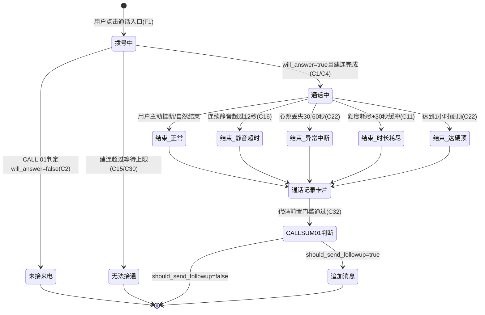

# LXM语音通话-仿真人交互与人性化时序设计 PRD

## 1. 摘要

本文档面向林小梦(LXM)产品约50名内测用户,在已有语音通话基础能力(Doubao端到端S2S实时语音模型)之上,设计一层"仿真人"交互体验:包括接听时序、通话状态UI、时长配额与异常兜底、后台运营能力、记忆写入机制。核心目标是让通话从发起到接听、进行、结束的每一个环节都不像一个"AI系统在响应",而像一个真实的人在接电话,呼应产品"anti-AI authenticity"的整体设计哲学。

## 2. 背景、问题与目标

### 2.1 当前背景

据项目背景资料,语音通话基础功能(余额体系、静音超时、S2S接入方式等)此前已通过结构化Q&A锁定为一套决策记录(项目内部称为C1-C27),但该文档原文未在本轮对话中提供或核对,因此本文档**不将其作为可引用来源**,仅作为背景语境提及。本文档聚焦的是本轮对话中新讨论、新确认的一层能力:接听时序拟真、状态UI、异常处理细化、后台管理扩展、记忆写入架构。

### 2.2 核心问题

当前设计如果按"标准通话产品"的默认做法实现(固定短延迟接听、100%接听、生硬的时长熔断、无差别的失败提示),会让通话体验明显区别于真人,削弱产品的核心体验主张。同时,通话依赖的每日限时机制和第三方语音服务(Doubao S2S)引入了多种边界场景,如果不提前设计,会在内测阶段暴露为体验问题或客服问题。

### 2.3 目标与成功标准

| 目标 | 成功标准 | 状态 | 来源 |
|---|---|---|---|
| G1 | 接听延迟、未接概率等行为让用户难以直接判断这是自动化响应(具体量化方式待定) | ⚠️ 待确认 | 本轮对话 |
| G2 | 时长耗尽/静音等场景走软性收尾,不出现用户反馈"被硬切断"的情况(具体验收方式待定) | ⚠️ 待确认 | 本轮对话 |
| G3 | 冲时长、切换音色、S2S相关参数均可在后台配置,无需改代码上线 | ✅ 已确认 | 本轮对话 |
| G4 | 通话摘要成功写入现有DashVector,可被后续对话检索命中(命中率标准未定) | ⚠️ 待确认 | 本轮对话 |

## 3. 用户、角色与关键场景

| 角色 | 需求或任务 | 触发场景 | 预期价值 | 来源 |
|---|---|---|---|---|
| 内测用户 | 给lxm打语音电话并获得自然的通话体验 | 点击主页/聊天页通话入口 | 更强的陪伴真实感 | 本轮对话 |
| 内测用户 | 时长不够用时可以充值 | 免费额度耗尽 | 持续使用意愿 | 本轮对话 |
| 运营/管理员(Umark) | 给用户冲时长、切换音色、调整参数 | 日常运营/问题排查 | 无需改代码即可运营调优 | 本轮对话 |
| 运营/管理员(Umark) | 查看用户通话记录与转写内容 | 复盘体验、排查异常 | 可追溯、可审计 | 本轮对话 |
| lxm(虚拟角色) | 依据人设日程和关系状态自然回应通话 | 通话全流程 | 维持"anti-AI authenticity" | 本轮对话 |

## 4. 范围与非目标

### 4.1 本期范围

- 用户主动发起语音通话(复用现有主页工具栏"语音通话"入口)
- CALL-01接听决策(是否接听、延迟、开场理由)
- 通话状态UI:拨号中 / 通话中 / 结束反馈 / 未接来电卡片 / 聊天流通话记录卡片
- 每日免费时长 + 充值时长两级配额账本
- 异常场景兜底:弱网重连、拨打频控、多设备并发锁、服务故障降级、静音超时、软收尾、僵尸连接兜底
- 强制接听安全阀(连续未接后保底强制接听)
- 通话摘要生成、追加消息判断(CALL-SUM-01)、记忆写入DashVector
- 后台:音色配置、S2S及LLM节点相关参数配置、并发/频控/超时参数配置、冲时长、用户通话记录查看(含转写)

### 4.2 非目标 / 明确不做

- lxm主动发起来电(仅在CALL-01输出结构与通话会话服务设计上预留扩展位,不在本期开发,⚠️待确认:未来触发逻辑与AGE003联动方式未设计)
- Feed入口接入语音通话(按既有规划留待后续阶段,原始规划文档本轮未核实)
- 信号强度等纯视觉拟真元素(不做)
- 通话内字幕功能(本轮对话未重新讨论,沿用之前的产品方向,但原文未核实,⚠️待确认)

## 5. 决策与来源记录

| 编号 | 主题 | 当前结论 | 状态 | 来源 | 替代关系 |
|---|---|---|---|---|---|
| C1 | 接听决策机制 | 由独立LLM节点CALL-01综合关系等级/人设日程/历史通话情况判断,而非固定随机延迟区间 | ✅ 已确认 | 本轮对话 | — |
| C2 | 是否存在未接来电 | 存在小概率不接听,触发未接来电卡片,并设计后续道歉/回拨衔接 | ✅ 已确认 | 本轮对话 | — |
| C3 | 首次通话与后续通话差异化 | 通过CALL-01输入的is_first_call、today_call_count等参数实现差异化,不单独建规则 | ✅ 已确认 | 本轮对话 | — |
| C4 | 响铃动画与真实建连关系 | 前端响铃动画时长与后端真实预热/建连解耦,动画期间后端并行完成真实建连;动画设最小时长下限兜底真实建连过慢的情况 | ✅ 已确认 | 本轮对话 | — |
| C5 | 通话状态页范围 | 拨号中/通话中/结束反馈/未接来电卡片/聊天流通话记录卡片,本期全部开发 | ✅ 已确认 | 本轮对话 | — |
| C6 | 通话中是否做信号强度等视觉拟真元素 | 不做 | ✅ 已确认 | 本轮对话 | — |
| C7 | 通话发起方 | 本期仅用户可发起;CALL-01输出预留initiator字段(恒为user),通话会话服务不假设发起方唯一为用户,便于未来扩展lxm主动来电,具体触发逻辑本期不涉及 | ✅ 已确认(预留架构) / ⚠️ 待确认(未来触发逻辑) | 本轮对话 | — |
| C8 | 通话结束后聊天流展示形式 | 卡片(时长+短印象总结)+追加消息(话题延续或情绪延续),由CALL-SUM-01判断是否发送 | ✅ 已确认 | 本轮对话 | 被C32细化 |
| C9 | 每日免费额度重置规则 | 服务器自然日0点重置,不结转 | ✅ 已确认 | 本轮对话 | — |
| C10 | 额度即将耗尽提醒(软收尾) | 剩余时长≤阈值(默认30秒,后台可配)时,向进行中的实时S2S会话注入time_low标记,模型在当前会话内自然收尾;前端计时器变色提示,不做文字弹窗 | ✅ 已确认 | 本轮对话 | — |
| C11 | 额度耗尽处理 | 允许约30秒缓冲,让当前语句说完并补一句自动生成的告别语后断开,不做立即硬挂断 | ✅ 已确认 | 本轮对话 | — |
| C12 | 弱网/掉线处理 | 短窗口(5-10秒)内尝试复用同一session重连,超时则挂断并记为"异常中断"状态;断线期间不计入时长消耗 | ✅ 已确认 | 本轮对话 | — |
| C13 | 拨打频控(误触保护) | 上一通电话结束后3秒内禁止再拨,仅防误触连点,与C19强制接听安全阀窗口相互独立、不共用参数 | ✅ 已确认 | 本轮对话 | — |
| C14 | 多设备并发通话 | 会话状态锁,先到先得,后到设备提示"通话进行中" | ✅ 已确认 | 本轮对话 | — |
| C15 | 语音服务故障/超时降级文案 | 统一提示"暂时无法接通",不做自动降级为文字对话 | ✅ 已确认 | 本轮对话 | — |
| C16 | 静音超时判定 | 连续静音超过6秒,lxm主动开口确认;超过12秒仍无响应,lxm说自然告别语后挂断,记为"异常结束-用户静音",不计入未接来电统计;通过事件注入正在进行的实时会话实现,非独立LLM节点;两阈值后台可配 | ✅ 已确认 | 本轮对话 | — |
| C17 | 静音超时与软收尾的优先级 | 两者同时触发时静音处理优先;不冲突时各自独立运行 | ✅ 已确认 | 本轮对话 | — |
| C18 | 未接后立即回拨的判定逻辑 | 不做"上次未接下次强制接听"的特殊规则,每次仍走CALL-01标准概率判定 | ✅ 已确认 | 本轮对话 | 被C19补充 |
| C19 | 强制接听安全阀 | 滚动窗口内未接次数达阈值后强制接听:force_answer_window_minutes(默认5分钟)、force_answer_miss_threshold(默认5次),命中后下一次拨打强制will_answer=true,接听后计数器清零;与C13频控窗口相互独立 | ✅ 已确认 | 本轮对话 | 补充C18 |
| C20 | 未接来电是否影响关系值 | 不影响;仅实际接通后的通话质量可能间接影响关系值,间接影响机制本身本期未设计 | ✅ 已确认(不影响部分) / ⚠️ 待确认(间接影响机制) | 本轮对话 | — |
| C21 | 通话入口 | 复用现有主页工具栏"语音通话"入口作为用户发起入口;该按钮当前实际绑定行为本轮未核实 | ✅ 已确认(入口位置) / ⚠️ 待确认(现有绑定行为,需查代码) | 本轮对话 | — |
| C22 | 单次通话时长上限 | 不设20-30分钟等偏低硬顶;核心防线为心跳检测(客户端定期心跳,服务端30-60秒未收到心跳判定异常并按异常中断结算);另设绝对硬顶1小时(后台可配)作为极端场景兜底,到点按正常挂断处理 | ✅ 已确认 | 本轮对话 | 替代本轮讨论中曾提出的20-30分钟方案 |
| C23 | 时长账本与现有消费体系的关系 | 纯秒为单位的独立时长账本,当前无其他消费场景,不与任何积分/消费体系挂钩;每日免费池(daily_free_seconds,默认300秒)与充值池(topped_up_seconds,不过期)两个独立计数器,优先扣免费池,扣完自动扣充值池,用户侧无感知区分 | ✅ 已确认 | 本轮对话 | — |
| C24 | 时长扣减时机 | 按实际连接时长通过心跳周期分段扣减,而非挂断后一次性结算,防止异常中断导致漏扣/多扣 | ✅ 已确认 | 本轮对话 | — |
| C25 | 后台音色配置维度 | 按人设(persona)维度配置而非全局唯一,本期只有lxm一个人设,默认配一个音色,后台可修改;音色版本随每次通话记录保存 | ✅ 已确认 | 本轮对话 | — |
| C26 | 通话记忆与文字记忆权重 | 语音通话记忆权重与文字聊天记忆相同,不做特殊加权 | ✅ 已确认 | 本轮对话 | — |
| C27 | 通话记忆写入架构 | 摘要提取使用独立新节点CALL-SUM-01,借鉴现有文字摘要节点的prompt模式但不复用同一节点;提取结果写入现有DashVector,新增source=voice_call标签,复用四路索引,不新建向量库 | ✅ 已确认 | 本轮对话 | — |
| C28 | 原始转写与通话元数据存储 | 完全独立的新数据表(call_records等),不与现有聊天消息表混用;原始ASR转写保留,后台可查看 | ✅ 已确认 | 本轮对话 | — |
| C29 | 转写数据保留期 | retention_days字段,默认值约20年(约7300天),后台可修改 | ✅ 已确认 | 本轮对话 | — |
| C30 | 响铃动画时长的设定方式 | 设最小时长下限与最大等待上限两个参数;下限内真实建连未完成则动画兜底,超过上限判定为连接失败,走C15降级文案;具体秒数本轮无可靠数据支撑,需实测校准 | ⚠️ 待确认(具体数值) | 本轮对话 | — |
| C31 | Doubao服务并发/限流后台配置项 | 后台需提供:最大并发通话数、拨打频率相关窗口参数(即C13/C19涉及参数)、连接超时阈值、失败重试次数、降级话术文案,均可配置 | ✅ 已确认(需要这些配置项) / ⚠️ 待确认(除C13/C19已定数值外,其余默认值未给出) | 本轮对话 | — |
| C32 | 追加消息发送机制 | 不采用固定概率触发,改为CALL-SUM-01节点AI判断should_send_followup、发送时机、内容;调用前有代码前置门槛(通话为正常结束或用户主动挂断、通话时长≥最短阈值、当日主动消息额度未超限)全部通过才调用LLM | ✅ 已确认 | 本轮对话 | 替代C8中原始的"卡片+追加消息"粗粒度描述,细化并替代此前讨论过的"固定概率60-70%"方案 |
| C33 | 追加消息判断维度 | LLM判断维度:话题未尽感、情绪浓度、关系阶段、发送时段合理性(避免深夜发送,顺延至合理时段);通话结束状态、通话时长、当日消息额度为代码前置门槛,不进入LLM判断范围 | ✅ 已确认 | 本轮对话 | — |
| C34 | LLM介入范围划分 | 全流程仅CALL-01、CALL-SUM-01两个独立LLM节点,加上进行中S2S会话内的事件注入(软收尾、静音应对,复用同一进行中模型,非新起请求);强制接听安全阀、拨打频控、多设备并发锁、心跳检测、硬顶时长均为代码判断;结束状态卡片文案采用静态文案池随机抽取,仅call_summary字段需LLM生成 | ✅ 已确认 | 本轮对话 | — |
| C35 | LLM reasoning字段用途 | CALL-SUM-01输出的reasoning字段仅供内部审阅/调优,不展示给用户 | ✅ 已确认 | 本轮对话 | — |
| C36 | 现有日程数据源复用 | CALL-01的activity_context输入直接对接现有"时间段+计划活动"日程数据源,无需新建数据表,仅需新增通话服务侧的读取接口;该数据源具体字段结构本轮未核实 | ✅ 已确认(可复用) / ⚠️ 待确认(具体字段结构) | 本轮对话 | — |
| C37 | 现有余额/积分体系关联 | 本功能时长账本完全独立,无消费场景,不需要与现有积分/消费体系打通 | ✅ 已确认 | 本轮对话 | — |

## 6. 功能需求与完整流程

### 6.1 需求清单

| 编号 | 需求 | 触发 / 输入 | 系统行为 | 输出 / 结果 | 优先级 | 状态 | 来源 |
|---|---|---|---|---|---|---|---|
| F1 | 用户发起语音通话 | 点击主页/聊天页通话入口(C21) | 创建通话会话,进入拨号中状态 | 拨号中UI + 触发CALL-01 | P0 | ✅ | 本轮对话 |
| F2 | CALL-01接听决策 | 通话会话创建 | 综合关系等级/日程/历史判断will_answer、delay_seconds、activity_context(C1/C36) | 结构化JSON决策结果 | P0 | ✅ | 本轮对话 |
| F3 | 响铃动画与真实建连解耦 | CALL-01判定will_answer=true | 前端播放响铃动画,后端并行完成S2S建连/预热(C4) | 动画时长≥真实建连所需时间 | P0 | ✅ | 本轮对话 |
| F4 | 通话中实时对话 | 建连成功 | Doubao S2S实时语音会话进行中 | 用户与lxm语音对话 | P0 | ✅ | 本轮对话 |
| F5 | 软收尾提醒 | 剩余时长≤阈值(默认30秒) | 向进行中会话注入time_low事件,前端计时器变色(C10) | 模型自然收尾对话 | P0 | ✅ | 本轮对话 |
| F6 | 静音超时应对 | 连续静音6秒/12秒 | 6秒:模型主动确认;12秒:自然告别后挂断(C16) | 挂断并记录异常结束-静音状态 | P0 | ✅ | 本轮对话 |
| F7 | 通话结束状态判定 | 多种终止条件触发 | 按C5列出的终态分类记录 | 通话状态落库 | P0 | ✅ | 本轮对话 |
| F8 | 通话记录卡片展示 | 通话结束 | 聊天流插入卡片,含时长+短印象总结 | 卡片UI(C8) | P0 | ✅ | 本轮对话 |
| F9 | 通话摘要生成与写入记忆 | 通话正常/主动挂断结束 | CALL-SUM-01生成摘要,写入DashVector(source=voice_call)(C27) | 摘要向量化存储 | P0 | ✅ | 本轮对话 |
| F10 | 追加消息判断与发送 | 摘要生成后,代码前置门槛通过 | CALL-SUM-01判断是否/何时/发什么(C32/C33) | 延迟发送的聊天消息 | P1 | ✅ | 本轮对话 |
| F11 | 每日免费时长+充值时长账本 | 通话中按心跳分段扣减 | 优先扣免费池,扣完扣充值池(C23/C24) | 剩余时长实时更新 | P0 | ✅ | 本轮对话 |
| F12 | 强制接听安全阀 | 滚动窗口内未接达阈值 | 下一次拨打强制will_answer=true(C19) | 保证不会连续多次未接 | P1 | ✅ | 本轮对话 |
| F13 | 拨打频控(误触保护) | 上一通结束后短时间内再拨 | 3秒内拒绝新拨打请求(C13) | 防止误触连点 | P1 | ✅ | 本轮对话 |
| F14 | 多设备并发锁 | 同一账号多端同时发起通话 | 会话状态锁,先到先得(C14) | 后到设备提示通话进行中 | P0 | ✅ | 本轮对话 |
| F15 | 弱网自动重连 | 检测到连接异常 | 5-10秒内尝试复用session重连(C12) | 重连成功恢复通话,否则挂断 | P1 | ✅ | 本轮对话 |
| F16 | 服务故障降级 | Doubao服务超时/故障 | 提示"暂时无法接通"(C15) | 不做自动降级为文字对话 | P0 | ✅ | 本轮对话 |
| F17 | 后台-音色配置 | 管理员在后台操作 | 按人设维度配置音色,记录每次通话使用的音色版本(C25) | 音色切换生效 | P0 | ✅ | 本轮对话 |
| F18 | 后台-LLM/S2S节点参数配置 | 管理员在后台操作 | 配置模型版本、System Prompt相关字段等 | 参数生效,无需改代码 | P0 | ✅ | 本轮对话 |
| F19 | 后台-并发/频控/超时/重试参数配置 | 管理员在后台操作 | 配置C31所列各项参数 | 参数生效 | P0 | ✅ | 本轮对话 |
| F20 | 后台-冲时长 | 管理员在后台操作 | 为指定用户增加topped_up_seconds | 用户可用时长增加 | P0 | ✅ | 本轮对话 |
| F21 | 后台-用户通话记录查看 | 管理员在后台查询 | 展示通话时间/时长/状态/音色/消耗来源/转写/摘要(C28) | 可视化记录列表+详情 | P0 | ✅ | 本轮对话 |
| F22 | 转写数据保留期管理 | 达到retention_days | 到期数据清理(具体清理执行方式本轮未讨论) | ⚠️ 待确认 | P2 | ⚠️ | 本轮对话 |

### 6.2 主流程



### 6.3 状态与规则

- **静音超时优先于软收尾**:两者同时满足触发条件时,按静音超时(C16)处理,不再走软收尾话术生成(C17)。
- **拨打频控与强制接听安全阀相互独立**,使用不同的时间窗口参数,不共用配置(C13/C19)。
- **时长扣减为分段幂等操作**,按心跳周期扣减而非挂断时一次性结算,需保证异常中断场景下不重复扣减、不漏扣(C24)。
- **CALL-SUM-01仅在代码前置门槛全部通过后才被调用**:通话结束状态为正常/用户主动挂断、通话时长≥最短阈值(具体秒数⚠️待确认)、当日主动消息额度未超限(C32)。

## 7. 边界、异常与降级

| 场景 | 触发条件 | 系统处理 | 用户反馈 | 恢复或降级 | 验收编号 |
|---|---|---|---|---|---|
| E1 弱网/掉线 | 连接中断信号 | 5-10秒内复用session尝试重连 | 通话中断提示(重连中) | 重连成功恢复;超时则挂断记为异常中断,断线期间不计时长 | AC5 |
| E2 短时间重复拨打(误触) | 上一通结束后3秒内再拨 | 拒绝新拨打请求 | 无法立即再拨的提示 | 等待窗口过后正常可拨 | AC6 |
| E3 多设备并发发起通话 | 同账号多端同时拨打 | 会话状态锁,先到先得 | 后到设备提示"通话进行中" | 先到会话正常进行 | AC7 |
| E4 Doubao服务故障/超时 | 建连失败或超时 | 不做文字降级 | 提示"暂时无法接通" | 走结束流程,不计入未接来电统计(⚠️待确认是否需要单独统计口径) | AC8 |
| E5 静音超时 | 连续静音6秒/12秒 | 6秒开口确认;12秒告别挂断 | lxm语音反馈+挂断 | 记为"异常结束-用户静音",不计入未接来电统计 | AC9 |
| E6 额度耗尽 | 剩余时长≤0 | 30秒缓冲+自动告别语 | 计时器提示+自然收尾对话 | 正常结束,记为"正常结束-时长耗尽" | AC10 |
| E7 僵尸连接/超长通话 | 心跳丢失30-60秒 / 满1小时硬顶 | 服务端主动清理连接 | 通话结束 | 按对应状态结算已产生时长 | AC11 |

## 8. 验收标准

| 编号 | 前置条件 | 操作 / 事件 | 预期结果 | 关联需求 | 状态 | 来源 |
|---|---|---|---|---|---|---|
| AC1 | 用户点击通话入口 | CALL-01判定will_answer=true | 展示响铃动画,时长不短于真实建连所需时间 | F2/F3 | ⚠️ | 本轮对话(具体秒数待C30实测确认) |
| AC2 | 用户点击通话入口 | CALL-01判定will_answer=false | 展示未接来电卡片,不进入通话中状态 | F2 | ✅ | 本轮对话 |
| AC3 | 通话进行中,剩余时长降至30秒(可配) | 时长持续消耗 | 会话内注入time_low,前端计时器变色 | F5 | ✅ | 本轮对话 |
| AC4 | 通话进行中,剩余时长降为0 | 时长耗尽 | 30秒内自然收尾并挂断,非立即断开 | F5/F11 | ✅ | 本轮对话 |
| AC5 | 通话进行中检测到连接异常 | 触发重连逻辑 | 5-10秒内尝试恢复;超时后记为异常中断且不计入时长消耗 | F15 | ✅ | 本轮对话 |
| AC6 | 上一通电话刚结束 | 3秒内再次拨打 | 拨打请求被拒绝 | F13 | ✅ | 本轮对话 |
| AC7 | 用户已在一台设备通话中 | 另一设备同时发起通话 | 后到设备提示"通话进行中",不产生第二个会话 | F14 | ✅ | 本轮对话 |
| AC8 | Doubao服务超时或故障 | 用户发起通话 | 提示"暂时无法接通",不切换文字对话 | F16 | ✅ | 本轮对话 |
| AC9 | 通话进行中用户连续静音 | 静音超过6秒 / 超过12秒 | 6秒:lxm主动确认;12秒:告别语后挂断,记为异常结束-静音 | F6 | ✅ | 本轮对话 |
| AC10 | 滚动窗口(默认5分钟)内未接次数达阈值(默认5次) | 用户再次拨打 | 强制will_answer=true,接听后计数器清零 | F12 | ✅ | 本轮对话 |
| AC11 | 通话正常结束或用户主动挂断,且通话时长/当日消息额度满足前置门槛 | 触发CALL-SUM-01 | 生成call_summary,判断是否/何时/发什么追加消息 | F9/F10 | ✅ | 本轮对话 |
| AC12 | 通话结束状态为静音超时/异常中断/未接/无法接通 | 触发追加消息判断 | 不调用CALL-SUM-01的追加消息判断,直接跳过 | F10 | ✅ | 本轮对话 |

## 9. 依赖、风险与待确认项

### 9.1 依赖

| 依赖 | 影响 | 负责人或来源 | 状态 |
|---|---|---|---|
| 现有人设"时间段+计划活动"日程数据源 | CALL-01的activity_context输入 | 本轮对话确认可复用 | ✅ 可复用 / ⚠️ 字段结构未核实 |
| 现有AGE003主动消息配额机制 | 追加消息发送前置门槛(C32) | 本轮对话提及需复用 | ⚠️ 具体配额规则细节本轮未获取 |
| 现有DashVector四路索引 | 通话记忆写入 | 本轮对话确认复用 | ✅ 已确认复用 |
| Doubao端到端S2S模型(O/O2.0/SC/SC2.0版本) | 通话引擎与System Prompt字段映射 | 网络公开资料(非用户提供) | ⚠️ 当前实际使用版本本轮未确认 |

### 9.2 风险

| 风险 | 影响 | 缓解措施 | 状态 |
|---|---|---|---|
| 响铃动画下限/上限设置不当 | 过短显得机械,过长显得等待过久或穿帮 | 上线前用真实环境日志采集建连耗时分布后校准(C30) | ⚠️ 待处理 |
| CALL-01/CALL-SUM-01两个LLM节点叠加延迟 | 影响响铃/挂断环节的整体响应速度 | 采用轻量模型(建议DeepSeek),控制在动画时间预算内 | 💡 建议,未验证 |
| 强制接听安全阀/拨打频控参数设置不当 | 可能被内测用户观察出规律,削弱真实感 | 参数保持后台可调,依内测反馈迭代 | 💡 建议 |

### 9.3 待确认项

| 编号 | 问题 | 为什么影响实现或验收 | 建议下一步 |
|---|---|---|---|
| Q-1 | 响铃动画具体秒数下限/上限(C30) | 直接决定AC1能否通过验收,也影响是否穿帮 | 上线前采集真实建连耗时并回填 |
| Q-2 | 现有日程数据源字段结构(C36) | 影响CALL-01读取接口的具体实现 | 开发阶段核对现有表结构 |
| Q-3 | 现有主页通话入口按钮当前实际绑定行为(C21) | 可能与现有功能冲突 | 开发阶段核实代码 |
| Q-4 | 日程数据缺失/读取失败时CALL-01的兜底行为 | 本轮未讨论,可能是遗漏的异常分支 | 补充讨论并纳入E系列异常表 |
| Q-5 | DashVector写入失败时的降级/重试策略 | 可能导致摘要静默丢失 | 补充讨论 |
| Q-6 | 追加消息"发送时段合理性调整"的具体规则数值 | C33已定方向但无参数,影响验收可判定性 | 明确"合理时段"的具体时间范围 |
| Q-7 | G1/G2/G4的量化验收阈值 | 当前为定性描述,无法直接验收 | 内测阶段设计具体测量方式 |
| Q-8 | 关系值间接影响机制细节(C20) | 影响是否需要额外设计一套评分规则 | 后续单独讨论 |
| Q-9 | C31所列配置项中,除C13(3秒)/C19(5分钟/5次)外的默认数值(最大并发数、超时阈值、重试次数等) | 影响后台初始配置与上线默认体验 | 补充给出具体默认值 |
| Q-10 | 转写数据到期后的清理执行机制(自动任务/人工) | 影响合规与运维设计 | 后续单独讨论 |
| Q-11 | AI/Agent评估指标、数据集、上线门槛(见第11节A7) | 当前完全未定义,无法评估上线质量 | 内测阶段单独设计评估方案 |

## 10. 版本记录

| 版本 | 日期 | 基线文件 | 新增 | 修改 / 废止 | 待确认 |
|---|---|---|---|---|---|
| v1 | 2026-08-08 | — | 首次生成,完整覆盖本轮对话中C1-C37全部决策、F1-F22功能需求、E1-E7异常场景、AC1-AC12验收标准 | 无(首次生成) | Q-1至Q-11,详见9.3 |

---

## 11. AI / Agent 规格扩展

### A1. 能力边界

| 能力 | 能做 | 不能做 | 兜底或转人工条件 | 来源 |
|---|---|---|---|---|
| CALL-01接听决策 | 综合关系/日程/历史判断是否接听、延迟多久、给出开场理由 | 不保证100%在期望时间内接听,不做情绪危机干预类判断(超出本文档范围) | 日程数据缺失时的兜底行为⚠️未讨论(见Q-4) | 本轮对话 |
| CALL-SUM-01摘要与追加消息判断 | 生成通话摘要、判断是否/何时/发什么追加消息 | 不生成用户看得到的reasoning说明,不在负面终态下触发追加消息 | 代码前置门槛未通过时直接跳过,不调用LLM | 本轮对话 |

### A2. Agent行为定义

| 场景 / 意图 | 可用上下文 | 期望行为 | 输出形式 | 禁止行为 | 状态 | 来源 |
|---|---|---|---|---|---|---|
| 正常拨打请求 | relationship_level/is_first_call/today_call_count/current_time/persona_schedule_context/last_interaction_summary | 判定will_answer、delay_seconds、activity_context、opening_hint | 严格JSON | 输出JSON外的多余文字 | ✅ | 本轮对话 |
| 日程数据缺失 | — | ⚠️ 待确认 | — | — | ⚠️ | 本轮对话(未讨论) |
| 通话正常/主动挂断结束 | call_transcript_summary/call_duration_seconds/call_end_reason/relationship_level/current_time | 生成call_summary,判断should_send_followup及内容 | 严格JSON,含reasoning字段 | 在负面终态下判断追加消息 | ✅ | 本轮对话 |
| 通话内软收尾/静音应对 | 进行中会话的实时上下文+注入事件(time_low / 静音标记) | 在当前会话内自然生成收尾/确认/告别语 | 语音输出(非独立JSON节点) | 生硬打断、复读固定台词 | ✅ | 本轮对话 |

### A3. Prompt / 指令规范

| 项目 | 规范 | 版本或来源 | 状态 |
|---|---|---|---|
| CALL-01输出结构 | `{will_answer, delay_seconds, decline_reason, activity_context, opening_hint}` | 本轮对话 | ✅ |
| CALL-SUM-01输出结构 | `{call_summary, should_send_followup, reasoning, followup_delay_minutes, followup_content, content_type}` | 本轮对话 | ✅ |
| CALL-SUM-01完整Prompt草稿 | 见下方代码块 | 本轮对话 | ✅ 草稿,未经实测调优 |
| 输出格式硬性要求 | 严格纯JSON,不含JSON外文字(沿用项目既有格式要求,该要求本身未在本轮重新确认,仅延续一致做法) | 本轮对话 | ⚠️ 待确认是否与既有规范完全一致 |

```
# 角色说明
你是林小梦(lxm)的"通话后回顾"助手，任务是判断这通电话结束后，
lxm本人是否会自然地想起来再发一条消息，如果会，生成这条消息的内容。

# 前提（以下条件已由代码预检查通过，你不需要重新判断）
- 通话正常结束（非静音超时/异常中断/未接来电）
- 通话时长超过{{config_var:min_duration_for_followup}}秒
- 今日主动消息额度未超限

# 你需要判断的内容
1. 这通电话的内容，是否存在真人会"回味/惦记/想补充"的点
   （比如没聊完的话题、对方情绪明显、答应了要做的事）。
   如果只是很平淡的日常确认，大概率不需要追加消息。
2. 如果需要发，具体发什么、大概多久之后发（给合理区间内的数字即可，不需要精确）。

# 输入信息
- 通话转写摘要：{{runtime_var:call_transcript_summary}}
- 通话时长：{{runtime_var:call_duration_seconds}}秒
- 通话结束方式：{{runtime_var:call_end_reason}}
- 当前关系等级：{{runtime_var:relationship_level}}
- 当前时间：{{runtime_var:current_time}}

# 输出要求（严格JSON，不要输出任何JSON之外的文字）
{
  "call_summary": "一句话总结这通电话聊了什么，用于聊天记录卡片展示",
  "should_send_followup": true/false,
  "reasoning": "判断理由，简短说明，仅供内部审阅，不展示给用户",
  "followup_delay_minutes": 数字或null,
  "followup_content": "追加消息内容，口语化，不要太长" 或 null,
  "content_type": "topic_continuation" | "emotional_followup" | null
}
```

### A4. 知识与数据

| 知识或数据源 | 用途 | 获取与清洗 | 更新频率 / 时效 | 权限与隐私 | 缺失时处理 | 来源 |
|---|---|---|---|---|---|---|
| 人设日程数据(时间段+计划活动) | CALL-01的activity_context输入 | 复用现有数据源(⚠️具体字段未核实) | 与现有系统一致 | ⚠️ 未讨论 | ⚠️ 未讨论(Q-4) | 本轮对话 |
| 关系等级/好感度 | CALL-01/CALL-SUM-01输入 | 复用现有系统 | 与现有系统一致 | ⚠️ 未讨论 | ⚠️ 未讨论 | 本轮对话 |
| DashVector向量库(新增source=voice_call标签) | 通话记忆存储与检索 | 复用现有四路索引 | 每通电话结束后写入一次 | ⚠️ 未讨论 | ⚠️ 未讨论 | 本轮对话 |

### A5. 工具与接口

| 工具 / 接口 | 类型 | 调用条件 | 输入 / 输出契约 | 超时 / 重试 | 权限 | 失败降级 | 来源 |
|---|---|---|---|---|---|---|---|
| Doubao端到端S2S WebSocket连接 | API | 通话建连时 | StartSession/FinishSession事件,支持连接不断开时的会话复用 | ⚠️ 具体超时/重试数值待C31补充默认值 | ⚠️ 未讨论 | 提示"暂时无法接通"(C15) | 公开技术资料 |
| DashVector写入接口 | API | CALL-SUM-01生成摘要后 | 写入向量+source=voice_call标签 | ⚠️ 未讨论(Q-5) | ⚠️ 未讨论 | ⚠️ 未讨论(Q-5) | 本轮对话 |
| AGE003主动消息配额查询接口 | 内部服务 | CALL-SUM-01判断前的代码前置门槛 | 查询当日剩余主动消息额度 | ⚠️ 未讨论 | ⚠️ 未讨论 | ⚠️ 未讨论 | 本轮对话 |

### A6. 异常与降级

模型超时、服务不可用已在第7节E4覆盖(降级为"暂时无法接通",C15)。以下维度本轮对话未展开评估,列出以避免遗漏:

- 日程数据缺失/读取失败(⚠️ 待确认,Q-4)
- DashVector写入失败(⚠️ 待确认,Q-5)
- CALL-01/CALL-SUM-01输出不合规JSON时的重试/兜底策略(⚠️ 本轮未讨论)
- 越权/异常输入场景(⚠️ 本轮未讨论,本文档不涉及内容安全策略,应遵循产品已有的通用安全机制)

### A7. 评估与验收

⚠️ 待确认(Q-11):本轮对话未讨论CALL-01、CALL-SUM-01的具体评估指标、数据集/测试场景、评估方法或上线门槛,也未讨论延迟与成本的验收标准。建议在内测阶段单独设计,不在本文档中编造阈值。

---

## 12. 技术实施方案扩展(部分,基于本轮对话内容,未检查代码仓库)

### T2. 数据结构与生命周期(本轮对话中确认的字段,未与实际代码核对)

| 实体 / 字段 | 类型 | 来源 | 写入 / 读取方 | 约束 | 迁移或保留策略 |
|---|---|---|---|---|---|
| daily_free_seconds | 整数(秒) | 本轮对话 | 通话服务读写 | 每日0点重置为默认值(默认300),不结转 | 不涉及迁移 |
| topped_up_seconds | 整数(秒) | 本轮对话 | 通话服务读写,后台可写 | 不过期(除非未来单独定义) | 不涉及迁移 |
| call_records(通话记录表,独立新表) | 表 | 本轮对话 | 通话服务写入,后台读取 | 与现有聊天消息表完全独立 | retention_days字段控制,默认约7300天 |
| call_records.voice_version | 字段 | 本轮对话 | 通话结束时写入 | 记录当次通话使用的音色版本 | 随主表保留策略 |
| CALL-01输出JSON | 结构化数据(非持久化实体) | 本轮对话 | CALL-01生成,通话服务消费 | 严格JSON | 不涉及 |
| CALL-SUM-01输出JSON | 结构化数据 | 本轮对话 | CALL-SUM-01生成,写入DashVector及call_records | 严格JSON | 不涉及 |

### T3. API、事件与工具契约

| 接口 | 调用方 | 输入 | 输出 | 错误 | 幂等 / 权限 | 证据 |
|---|---|---|---|---|---|---|
| Doubao S2S StartSession/FinishSession | 通话服务 | 会话参数 | 语音流 | ⚠️ 未核实具体错误码 | 支持同一WebSocket连接内会话复用 | 公开技术资料(非代码核实) |

### T4-T7

本轮对话未提供或核实实际代码仓库、迁移发布计划、可观测性/安全隐私实现细节、技术债信息,均不在本文档中展开,避免编造。如需覆盖这些章节,需要另行提供代码访问权限或补充材料。

---

# 审查结论

审查结论：**通过但有待确认**
已修复：无(首次生成,未发现需要修复的已写入内容;所有已知缺口已在写入阶段直接标记为⚠️待确认或💡AI建议,未强行补全)
剩余待确认：Q-1至Q-11,详见第9.3节,以及A4/A5/A6/A7中标注的多项⚠️待确认技术与评估细节
来源范围：本轮完整对话(含此前多轮Q&A);未提供任何外部文件或代码仓库
技术证据：未检查代码仓库,T4/T5/T6/T7章节因此省略或仅作提示;Doubao S2S会话复用机制来自本轮对话中web_search查得的公开技术资料,非用户材料,非代码验证
