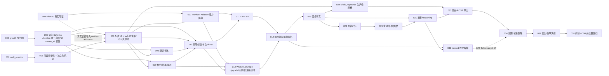

# LXM 语音通话 P1 STEP 草稿

> 首次生成日期：2026-08-26
> 本轮修订日期：2026-08-30
> 阶段结果：`FAILED_VALIDATION`
> 文档状态：`draft-revised`（**已吸收历史审计发现，但尚未完成修订后 `step-doc-review`，不可视为已验证执行提示词**）
> 需求基线：PRD v2.3、需求确认记录 v1.1、后台设计 v1.2、交互规格 v1.10
> 修订输入：`step-audit-historical-snapshot.md` 与用户明确指定的 `history/step-audit-historical-snapshot-verification.md`（历史审计证据，仅用于定位和修复草稿问题，**不是产品事实的新权威来源**）

## 0. 结论

本稿已按历史审计发现修正了内部映射、依赖、验收与伪 blocker，并把已确认的产品选择写成确定值。历史审计只是修订输入；产品语义仍以 `SRC-DEC/SRC-PRD/SRC-ADM/SRC-UI` 及当前契约为准，仓库代码只用于核对实现基线。

当前结果仍为 `FAILED_VALIDATION`：本轮结构、映射与高保真静态合同检查已通过，但正式 `step-doc-review` 尚未执行，O-01/O-04 也仍阻断 Go/No-Go；仓库文档结构全量测试因读取边界未运行。因此仍不能据此文档开始 P1 开发，也不得生成 `steps-verified.md`。

已确认的原产品输入门禁 `O-02/O-03/O-05/O-06/BLK-01/BLK-02/BLK-03/RISK-02` 已在本稿内收口为明确规则。仅保留两项执行证据门禁：

- `O-01`：Provider 六项能力必须用真实事件证据逐项取证；除受审计的 `test` 强制路径外，未验证/false 能力在生产/`all` 只能走确定性降级，`failed` 不得强制启用。
- `O-04`：Open API v1 真实第三方消费者待核查；它只阻塞 Open API 对外契约子任务、兼容性结论/版本策略、STEP-021 DONE 与发布，不阻塞内部卡片实现，也不得伪装成产品语义未定。

## 1. 阅读边界与来源清单

### 1.1 已完整阅读的版本文档

来源标签映射：`SRC-PRD/SRC-ADM/SRC-UI` = `PRD`，`SRC-DEC` = `USER_DECISION`，`CT-*` = `CONTRACT`，`RB-*` = `REPO_BASELINE`；`source_id` 只用于精确定位，不创建新的来源类型。

| source_id | 文档 | 版本/状态 | 用途 |
|---|---|---|---|
| `SRC-PRD` | `docs/design/realtime_voice/P1/PRD-LXM语音通话仿真交互设计-v2.md` | v2.3，需求已确认 | 产品语义、C1–C122、AC1–AC49/AC51–AC80；AC50 延期、顺序和上线门槛 |
| `SRC-DEC` | `docs/design/realtime_voice/P1/需求确认记录-LXM语音通话-v1.md` | v1.1，确认事实源 | 冲突裁决、代码对齐修正、仅余 O-01/O-04 执行证据门禁 |
| `SRC-ADM` | `docs/design/realtime_voice/P1/DESIGN-LXM语音通话后台配置与管理-v1.md` | v1.2，Phase A 待开发 | 后台 Schema、API、权限、发布、Phase A/Phase D 验收 |
| `SRC-UI` | `docs/design/realtime_voice/P1/LXM语音通话交互规格与PRD映射-v1.md` | v1.10，主流程确认 | 18 个高保真状态映射、生产交互、视觉与异常验收 |

已完整阅读上述四份当前版本文档。按仓库边界，仅额外读取用户明确指定的 `history/step-audit-historical-snapshot-verification.md` 作为历史核验输入；未读取其他 history、草案、归档或 `.doc-migration-baseline/`，过期 P0 决策文档未作为需求来源。

### 1.2 契约与仓库证据

| source_id | 状态 | source / locator | 已核实事实 |
|---|---|---|---|
| `CT-SHARED` | `existing` | `docs/contract/current/_shared/conventions.md`；`docs/contract/current/_shared/auth-rbac.md` | 统一响应、认证和后台角色惯例 |
| `CT-TIMELINE` | `existing` | `docs/contract/current/chat-emotion/api.md::GET /api/chat/timeline` | 当前 timeline 仅约定 conversation/agent 字段，尚无 `source=call` |
| `CT-OPEN` | `existing` | `docs/contract/current/openapi/api.md::GET /api/open/v1/chat/timeline`；`docs/design/openapi/open-api-v1.md` | Open API 直接复用 H5 timeline 数据 |
| `CT-MEM` | `existing` | `docs/contract/current/memory-knowledge/api.md`；`docs/contract/current/memory-knowledge/data.md`；`docs/contract/current/memory-knowledge/admin-ui.md` | 当前记忆契约与 Stable Key/向量写入边界 |
| `CT-REL` | `existing` | `docs/contract/current/relationship/api.md`；`docs/contract/current/relationship/data.md`；`docs/contract/current/relationship/admin-ui.md` | 当前关系值、成长记录与管理端展示 |
| `CT-PERSONA` | `existing` | `docs/contract/current/persona-prompt-world-state/api.md`；`docs/contract/current/persona-prompt-world-state/data.md`；`docs/contract/current/persona-prompt-world-state/admin-ui.md` | 已发布人格版本和后台访问边界 |
| `CT-ADMIN` | `existing` | `docs/contract/current/admin-security-accounts/api.md`；`docs/contract/current/admin-security-accounts/data.md` | 管理员账号、角色和认证契约 |
| `CT-OBS` | `existing` | `docs/contract/current/observability-third-party/api.md`；`docs/contract/current/observability-third-party/admin-ui.md` | 审计、指标与后台可观测展示契约 |
| `CT-LIFE` | `existing` | `docs/contract/current/life-feed/api.md`；`docs/contract/current/life-feed/data.md`；`docs/contract/current/life-feed/admin-ui.md` | 生活计划/日程数据契约 |
| `CT-AGENT` | `existing` | `docs/contract/current/agent-future/api.md`；`docs/contract/current/agent-future/data.md`；`docs/contract/current/agent-future/admin-ui.md` | 主动消息和 Future 槽契约 |
| `RB-CONFIG` | `existing` | `backend/models/admin_config.py::AdminConfig`；`backend/services/admin_config_service.py::AdminConfigService` | 现有草稿 `version=0` 且 last-write-wins；无 `draft_revision`；历史最多 20 版 |
| `RB-TIMELINE` | `existing` | `backend/services/timeline_read_service.py::get_timeline`；`backend/services/timeline_seq_service.py::allocate_sort_seq`；`backend/models/conversation_log.py::ConversationLog`；`frontend/pages/chat.html::renderTimelineItem`；`backend/services/open_chat_service.py::open_get_timeline` | 当前只合并 conversation/agent；前端只有 user/else 分支；Open API 直透 |
| `RB-REL` | `existing` | `backend/services/relationship_service.py::add_growth`、`get_relationship_detail`；`backend/models/relationship_growth_log.py::RelationshipGrowthLog` | 既有成长常量不可承载语音可变点数；详情页硬编码 50；表无语音幂等列 |
| `RB-CROSS` | `existing` | `backend/services/agent_service.py::_check_p0`、`increment_agent_count_for_future`；`backend/services/diary_service.py::_get_conversation_summary_in_window`；`backend/services/chat_service.py::_reset_proactive_times`；`backend/services/chat_queue_service.py::try_acquire_bundle_lock`；`backend/redis_client.py::get_redis`；`backend/tasks/scheduler.py` | 主动消息/日记的文字基线，follow-up 计数、队列锁、Redis 与调度范式 |
| `RB-PERSONA` | `existing` | `backend/routers/admin/persona.py` | 已发布 persona 的代码路由基线 |
| `RB-LIFE` | `existing` | `backend/models/life_plan.py::LifePlan` | CALL-01 日程输入的代码基线 |
| `RB-AGENT` | `existing` | `backend/models/agent_message.py::AgentMessage`；`backend/tasks/agent_message_task.py` | follow-up 消息落点和发送任务基线 |
| `RB-PROMPT` | `existing` | `backend/services/prompt_builder.py` | 字符预算与裁剪代码参考，不等于语音契约 |
| `RB-OBS` | `existing` | `backend/routers/admin/stats.py`；`backend/routers/admin/system_monitor.py` | 统计和系统状态后台代码基线 |
| `RB-SAFETY` | `existing` | `backend/services/content_safety_service.py::check_content` | 文字链路异常放行并递增共享 `content_block_count`；语音必须隔离指标 |
| `RB-AUTH` | `existing` | `backend/utils/auth_middleware.py::_authenticate_credentials`；`backend/utils/open_api_auth.py::get_current_user_by_api_key`；`backend/routers/admin/users.py::update_user_status` | Redis 封禁键已按 v2.3 收口为 `user_banned:{user_id}`，STEP-010 禁止旧键双读/双写 |
| `RB-ADMIN` | `existing` | `backend/utils/admin_auth.py::require_role`、`deny_observer_export`、`log_operation`；`backend/routers/admin/users.py::_USER_BUSINESS_READ_ROLES` | 角色元组、读权限与 observer 导出显式拒绝范式可复用 |
| `RB-MEM` | `existing` | `backend/utils/character_knowledge_validate.py::validate_key`、`validate_value`、`build_doc_id`；`backend/services/memory_llm_service.py::upsert_step6_vectors`；`backend/services/user_vector_memory_service.py` | 可复用校验和公共写入底座，但不得直接调用文字 Step6 业务节点 |
| `RB-APP` | `existing` | `backend/main.py`；`backend/models/__init__.py`；`alembic/versions/` | FastAPI 路由、静态页面、模型注册与 Alembic 迁移惯例 |
| `RB-P0` | `existing` | Git `feat/realtime-voice-phase0@b937a78`，`backend/phase0_realtime_voice/*` | 实验客户端、RAG/interrupt 事件和本地报告存在；8 个关键 Provider 事件未采集，六项能力零项有完整证据 |
| `RB-UI-TEST` | `existing` | `tests/test_realtime_voice_demo_contract.py`；`docs/design/realtime_voice/P1/demo/hifi/` | 18 个静态状态的尺寸、控件、可访问性和关键视觉合同已有自动检查 |

### 1.3 已核实的基线冲突与风险

| ID | 事实 | 处理 |
|---|---|---|
| `RISK-01` | `docs/progress/林小梦实时语音-Phase0_progress.md` 写“16/16、100%”，但 PRD v2.3 与 Phase0 代码均显示六项能力零项有完整真实证据 | STEP-004 以真实事件报告重建能力证据；旧进度不得作为 Go 依据；STEP-038 再核验“16/16、100%”只能明确限定为工具/代码与单测就绪，并与六能力真实取证率分栏 |
| `RISK-02` | PRD C109 旧文本写 Redis `ban:{user_id}`，主线三处认证/禁用入口使用 `user_banned:{user_id}` | **已裁决**：STEP-010 只使用 `user_banned:{user_id}`，禁止双键；PRD C109/AC79/确认记录 V10-6 按此回写 |
| `RISK-03` | v2.3 的实现同步目标为 `docs/design/openapi/open-api-v1.md` 及 current `openapi/api.md`、`chat-emotion/api.md`，根级旧合同不是本期同步目标 | **已裁决**：STEP-021 同步 timeline 契约，STEP-033 同步 `POST /api/admin/voice/calls/export`；均只改现行契约 |
| `RISK-04` | 主线尚无语音模型、路由和 current voice contract；P1 目录和 Phase0 工作目录在当前工作树中均为未跟踪内容 | 每个 STEP 只改自身范围；不得覆盖用户现有未提交内容 |
| `RISK-05` | `backend/main.py` 启动会调用 `create_all_tables()`，但 PRD 明确语音结构必须走 Alembic | STEP-001～003 以 migration upgrade/downgrade 为验收真相，不以自动建表代替 |
| `RISK-06` | 历史版本中 PRD AC45 与后台 Phase D 曾和 C101/确认记录 V9-2 冲突；当前 PRD v2.3 与后台 DESIGN v1.2 已统一 | **已裁决并回写**：observer 可读未过期 effective 正文、导出 403；ai_trainer 正文/API 403；STEP-033 只按当前权威口径实现并复核无漂移，不再修改 PRD/DESIGN |

## 2. 冻结后的需求账本

### 2.1 权威顺序与有效编号

冲突时按以下顺序裁决：

1. `SRC-PRD`；
2. `SRC-DEC`；
3. `SRC-ADM`；
4. `SRC-UI`；
5. 当前契约与代码只用于确认实现基线，不覆盖已确认产品语义。

有效产品决策为 PRD 表中实际存在的 `C1–C122`。其中 `C27`、`C34` 已废止，`C65` 被 `C100` 替代，`C67` 被 `C98/C116` 修正；`C6`、`C18` 在当前 PRD 中没有定义，禁止自行补号或补语义。后台 `ADM-C4` 的单一配置 key 旧语义由 `ADM-C12` 取代，仅保留 persona 引用边界；`ADM-C8` 的 capability gray 旧语义由 `ADM-C21` 取代，只保留“生产不得出现 gray”的负向验收；不得把被修正的旧语义重新映射为开发任务。

### 2.2 本期范围约束

`CSTR-SCOPE-01`（PRD `3.3`）完整包含：

1. 仅用户主动发起，且只复用主页“语音通话”入口；
2. CALL-01、VOICE-CTX-PACK、会前和通话中 VOICE-RECALL-01；
3. 实时转写、回合组装、用户打断、逐轮异步 VOICE-MEM-01；
4. 时长、异常、重连、静音、软收尾、硬顶；
5. 时间线通话卡片、整通摘要、追加消息；
6. 每满 30 秒增加 5 点、按有效时长结算的语音成长值；
7. 后台配置、补充时长、通话记录、转写、到期状态、导出和任务状态；
8. 语音内容安全出口检测与记录；
9. 仅语音、仅自伤/自杀倾向的危机识别与响应；
10. 总开关、用户白名单、软停/硬停；
11. 跨模态写入端修正与两处读取端最小止损。

### 2.3 非目标

`CSTR-NG-01`（PRD `3.4`）完整排除：

- 林小梦主动呼入、视频通话、Feed 入口、用户侧购买支付订单、纯视觉信号拟真；
- 通话中公开实时字幕、保存原始音频、依赖 Provider dialog_id 做跨通长期记忆；
- 直接调用文字 Step6、为每个无意义附和调用记忆 LLM、顺带重构文字记忆层；
- 用户侧查看/纠正/删除向量记忆，以及明确/模糊双态、版本、证据链、冲突确认和回退衰减半套实现；
- 后台删通话时级联删除成功长期记忆；
- 前端埋点投递通道、百分比灰度、语音读写 Future 单槽、通话中抑制文字主动消息；
- 文字侧危机响应、微信内置浏览器通话、语音情绪写入既有三层情绪存储；
- 后台“历史对话”Tab 混入通话记录。

### 2.4 后台补充验收 ID

下列 ID 是对 `SRC-ADM` §16 未编号验收的原序编号，不新增业务含义。

| ID 范围 | 准确摘要 |
|---|---|
| `CSTR-ADM-A01..A05` | 分区草稿不生效；整包发布唯一版本；进行中不热切；新通话完整非敏感快照；密钥不进入任何持久层/历史/日志/API/快照 |
| `CSTR-ADM-A06..A10` | Secret 连接测试不泄露；Provider/模型/Profile/音色/Adapter 可追溯；未验证显著标记；仅测试范围强制；强制需权限、CONFIRM、原因、审计 |
| `CSTR-ADM-A11..A15` | 依赖变化使证据 stale；persona_ref 可还原；stale/unverified 受限且 failed 禁用；回滚发新版本；base_version/draft_revision 阻止覆盖 |
| `CSTR-ADM-A16..A20` | 两 config_key 分权；下一通读新配置；配置异常回退并记指标；六能力初始 unverified/off/false 且不能手工改 verified；无按用户能力灰度和 percentage |
| `CSTR-ADM-A21..A25` | 参数范围错误精确提示；后端精确校验 CONFIRM；凭据页最小披露；软硬停行为和审计；persona_ref 同存 version+sha256 |
| `CSTR-ADM-D01..D04` | 按权限看有效转写/到期/清理；普通导出无完整生成文本；observer 可读未过期 effective 正文但导出 403；ai_trainer 正文 403；查看/导出/补跑/删除均审计 |
| `CSTR-ADM-D05..D08` | 删除先围栏后停任务；不回滚成功记忆/账本/成长；正文不可恢复导出；无原始音频 |
| `CSTR-ADM-D09..D12` | ai_trainer 入口和 API 均拒绝；observer 导出 403；危机仅 super_admin 且每读审计；普通转写不展示危机原文 |

### 2.5 交互补充验收 ID

下列 ID 对应 `SRC-UI` §10 的原序，不新增视觉或行为。

| ID 范围 | 准确摘要 |
|---|---|
| `CSTR-UI-V01..V05` | 402×874 参考、真机无演示外壳；安全区；同级尺寸与 44×44；暗底可读；reduced-motion 下状态可辨 |
| `CSTR-UI-S01..S04` | 正常全链；未接与技术失败分离；呼叫/连接可取消且不计费；静音/扬声器跨状态和重连一致 |
| `CSTR-UI-S05..S08` | 操作防重与结束幂等；同 call_id 重连且窗口不计费并按能力降级；计时从 CONNECTED；预检阻断无卡片无 sort_seq |
| `CSTR-UI-E01..E05` | 有效开口停播；未播放文本不进入记录/摘要/记忆；无公开实时字幕；先卡片后异步摘要且失败无技术错误；各异常不误计费 |
| `CSTR-UI-E06..E09` | Demo 延时/时长/参数不进入生产；call 专用渲染；summary_status 四态；摘要重拉有上限 |
| `CSTR-UI-C01..C05` | 危机条低干扰常驻；四态持续且单通一次；危机资源独立卡片；普通安全命中前端无表现；命中文本不进摘要/记忆/卡片 |

### 2.6 已知约束、延期与技术债

- `CS-V-01..CS-V-09` 全部保留：凭据需重启、句级拦截延期、单实例、独立浏览器、语音未完话题不跨文字、危机范围和关键词局限、重连断层、全渠道成长上限 200 点。
- `TD-V-01..TD-V-07` 只登记在 P1 本地技术债清单；仓库全局 TD 编号集合已冻结，本轮不得向 `docs/tech-debt/active/` 新增或迁移这些条目。本期只实现 C70/C71 指定的写入端和两处读取端止损。
- 业务用户账号注销的 MySQL/Redis/DashVector/任务/Provider 全域编排明确移出 P1，以 P1 本地技术债 `TD-V-07` 记录；本文不新建注销 STEP，也不把 AC50 列为 P1 验收。
- 记忆优化作为独立后续 PRD/技术债，不得在本期复制一套表或增加孤立状态字段。

### 2.7 已确认的确定值

| 主题 | 本期冻结值 |
|---|---|
| Provider 证据失效 | `evidence_version` 指纹由 Provider Profile（已包含 Provider 身份）、模型、协议 Profile、Adapter、SDK、专项测试用例版本组成，不再额外重复 `provider` 字段；规范 JSON、证据报告和能力快照均显式保存 `sdk_version/evidence_suite_version`。任一项变化或证据超过有效期自动变 `stale`。默认 30 天，后台可配 7–90 天；`stale` 自动退出 `all`，只能经审计在 `test` 强制启用。 |
| 创建幂等 | 必填请求头 `Idempotency-Key`，UUID、最长 64 字符；前端每次新拨号生成新 UUID，同一请求的网络重试必须复用。服务端 `(user_id,key)` 唯一；同 key+同规范化 payload 返回原 `call_id`且不新建通话/票据；同 key+不同 payload 返回 `409 IDEMPOTENCY_KEY_REUSED`；重放记录保留 24h；票据已消费/过期时只返回当前通话状态，不重建票据。 |
| 配置版本与快照 | `voice_call_config`、`voice_call_script` 各有独立 schema/version/content hash；发布后每通锁定非敏感完整快照，显式记录 `config_version/config_content_sha256` 与 `script_version/script_content_sha256`。未知/不兼容 schema 整 key 回退到同一份规范默认值；只有 schema 明确声明向后兼容的新增可选字段允许字段级补默认，其余情况禁止字段级拼补。 |
| follow-up 窗口 | 发布在 `voice_call_config`，不硬编码；默认陌生 `10:00–21:00`、朋友 `09:30–22:00`、亲密 `09:00–22:30`、知己 `09:00–23:00`；`Asia/Shanghai`、左闭右开，窗外顺延并加 0–20 分钟抖动，最长顺延 24h。首次种子发布与读取/解析失败回退共用一份规范默认常量；任务保存窗口配置版本与关系阶段快照。 |
| 卡片自动重拉 | 首次请求若为 `pending`，3 秒后仅自动重拉 1 次；总请求数最多 2，第二次仍 `pending` 即停止自动请求。 |
| 后台正文/导出 | observer 可读未过期 effective 正文、导出 403；ai_trainer 无入口且正文 API 403；导出使用 `POST /api/admin/voice/calls/export` 并显式调用 `deny_observer_export`。 |
| 封禁键 | 预检与三处现有认证/禁用入口统一使用 `user_banned:{user_id}`，不双读、不双写。 |
| 保留与危机存储 | effective 正文 180 天、generated/reasoning 调试数据 30 天、危机原文 30 天、任务日志 90 天。危机原文不做应用层加密，通过独立表、RBAC、逐次读审计和不导出实现隔离。 |
| 危机 UI | 底部常驻低干扰提示条，非红色、非弹窗：“如果你有伤害自己的念头，请先联系身边可信任的人，或拨打 12356。”资源卡为独立系统卡、非 AI 气泡：“如果你可能马上伤害自己，请立即拨打 110/120，并请一位可信任的人来到你身边；也可以拨打 12356 心理援助热线。” |
| 结束/重连文案 | `user_hangup`“就先聊到这”；`user_cancel`无结束页直接返回；`exit_intent`“好，那我们先聊到这”；`silence_timeout`“好像暂时听不到你，我们下次再聊”；`quota_exhausted`“今天能聊的时间用完啦，我们下次再聊”；`hard_limit`“这次聊得有点久，我们先休息一下”；`reconnect_timeout`“网络没有恢复，我们下次再接着聊”；`provider_error/system_error` 接通前“暂时无法接通”、接通后“通话暂时中断，请稍后再试”。重连衔接语为“刚刚好像断了一下。你刚才说到哪儿了？”。均是 `voice_call_script` 初始默认，可发布覆盖。 |

## 3. 需求 → STEP 覆盖矩阵

### 3.1 需求 → STEP

| 需求 ID | 实现 STEP |
|---|---|
| C1 | 011 |
| C2 | 011、021 |
| C3 | 011 |
| C4 | 011、014 |
| C5 | 011、013、020、021、036 |
| C6 | 未定义，不得自行补号 |
| C7 | 003、010、013 |
| C8 | 021、031 |
| C9 | 008 |
| C10 | 018 |
| C11 | 006、008、018 |
| C12 | 014、019、037 |
| C13 | 009、010 |
| C14 | 009、037 |
| C15 | 013、014 |
| C16 | 018、020 |
| C17 | 018、020 |
| C18 | 未定义，不得自行补号 |
| C19 | 011 |
| C20 | 022 |
| C21 | 010、013、020、036 |
| C22 | 009、014、018、037 |
| C23 | 008 |
| C24 | 008、037 |
| C25 | 006、026 |
| C26 | 028 |
| C27 | 已废止/被替代，无开发 STEP |
| C28 | 003、015 |
| C29 | 003、033、034、037 |
| C30 | 006、011 |
| C31 | 006、009、012、014、019、037 |
| C32 | 021、031、032 |
| C33 | 032 |
| C34 | 已废止/被替代，无开发 STEP |
| C35 | 031、033 |
| C36 | 011、026 |
| C37 | 008 |
| C38 | 030 |
| C39 | 028 |
| C40 | 003、014、015 |
| C41 | 028、029 |
| C42 | 007、017 |
| C43 | 026 |
| C44 | 021、031、032 |
| C45 | 007、015、016、017、028 |
| C46 | 027、030 |
| C47 | 029、031、034、035、037 |
| C48 | 007、012、014、019、026 |
| C49 | 004、007 |
| C50 | 007、027、030 |
| C51 | 004、007、015、016、017 |
| C52 | 006、026 |
| C53 | 028 |
| C54 | 022、028、037 |
| C55 | 011 |
| C56 | 017 |
| C57 | 021、031、035 |
| C58 | 018、020 |
| C59 | 032 |
| C60 | 003、033、034 |
| C61 | 003、013、020、034、036、037 |
| C62 | 003、029、034 |
| C63 | 028 |
| C64 | 005、033 |
| C65 | 已废止/被替代，无开发 STEP |
| C66 | 005、006、007、037 |
| C67 | 已废止/被替代，无开发 STEP |
| C68 | 005（配置发布底座）、006（页面/连接测试/能力矩阵/快照）、007（Provider Adapter） |
| C69 | 006、026 |
| C70 | 022 |
| C71 | 022 |
| C72 | 022 |
| C73 | 022、026、031 |
| C74 | 022、026、031 |
| C75 | 028、029 |
| C76 | 028 |
| C77 | 003、028、029、034 |
| C78 | 026、027、028、031、032 |
| C79 | 015、017、023、035 |
| C80 | 023、035 |
| C81 | 015、023、024、028、029、034 |
| C82 | 003、009、010、011、013 |
| C83 | 003、011、014、020、036 |
| C84 | 003、011、014、018、019、020、036 |
| C85 | 003、011、021、031、036 |
| C86 | 011、021、036 |
| C87 | 003、021、036 |
| C88 | 021、036 |
| C89 | 021、036 |
| C90 | 003、021、031、036 |
| C91 | 020、021、031、036 |
| C92 | 022 |
| C93 | 002、022 |
| C94 | 001、005 |
| C95 | 005、006 |
| C96 | 006 |
| C97 | 005 |
| C98 | 004、006、007 |
| C99 | 007、019 |
| C100 | 005、006 |
| C101 | 033、037 |
| C102 | 005、006、007、012、037 |
| C103 | 005、006、009、024、033、035、037 |
| C104 | 033、037 |
| C105 | 009、012、014、019、037 |
| C106 | 009、035、037 |
| C107 | 006、008、037 |
| C108 | 008、018、037 |
| C109 | 010、037 |
| C110 | 008、009、037 |
| C111 | 003、010、013 |
| C112 | 032 |
| C113 | 022、032 |
| C114 | 005、006、010 |
| C115 | 009、037 |
| C116 | 004、006 |
| C117 | 010、013、020、036 |
| C118 | 003、035、037 |
| C119 | 004、035 |
| C120 | 035 |
| C121 | 003、005、006、015、024、025、034、036 |
| C122 | 003、010、034、037 |
| ADM-C1 | 038（父/子文档责任边界复核） |
| ADM-C2 | 005、006、007 |
| ADM-C3 | 005、006、007、037 |
| ADM-C4 | 005、006、026（仅保留 persona 引用、不复制正文；单 key 旧语义不开发） |
| ADM-C5 | 005、006 |
| ADM-C6 | 006 |
| ADM-C7 | 006、007 |
| ADM-C8 | 038（已由 ADM-C21 取代，仅负向验证无 capability gray） |
| ADM-C9 | 004、007 |
| ADM-C10 | 005、006、026 |
| ADM-C11 | 004、005、006、037 |
| ADM-C12 | 005、006 |
| ADM-C13 | 001、005 |
| ADM-C14 | 005 |
| ADM-C15 | 005、006、026 |
| ADM-C16 | 005 |
| ADM-C17 | 006 |
| ADM-C18 | 006 |
| ADM-C19 | 005、006、007、037 |
| ADM-C20 | 005、006、010 |
| ADM-C21 | 004、005、006、007 |
| ADM-C22 | 004、005、006、007 |
| ADM-C23 | 009、037 |
| ADM-C24 | 005、006、009、024、033、035、037 |
| ADM-C25 | 004、005、006 |
| ADM-C26 | 005、006、032 |
| ADM-C27 | 005、006、024、025、034、036、037 |
| ADM-C28 | 031、033、034、037 |
| ADM-C29 | 034、038 |
| UI-RESOLVED-01–06、已关闭 UI-GAP-01–04 | 013、019–021、025、036 |
| CSTR-SCOPE-01、CSTR-NG-01、CS-V-01–09、TD-V-01–07 | 038 |

> `STEP-038` 是全量回归总闸，统一覆盖全部有效产品决策；为避免把回归 STEP 重复写入每一行，上表的 C1–C122 与 ADM 行只列直接实现/专项验证 STEP。仅 ADM-C1（文档责任边界）、ADM-C8（被修正旧 gray 语义的负向验证）和 ADM-C29（延期边界）把 STEP-038 列为直接责任。

### 3.2 验收 → STEP

| 验收 ID | 验收 STEP |
|---|---|
| AC1 | 009、010、013、036 |
| AC2 | 011、036 |
| AC3 | 011、014、036 |
| AC4 | 011、021、036 |
| AC5 | 011、014、036 |
| AC6 | 011 |
| AC7 | 009、012、037 |
| AC8 | 026 |
| AC9 | 006、026 |
| AC10 | 006、026 |
| AC11 | 006、026 |
| AC12 | 003、014、015 |
| AC13 | 004、007、015、016 |
| AC14 | 015 |
| AC15 | 014、015、016、019、031、037 |
| AC16 | 021、036 |
| AC17 | 004、007、017、020、036 |
| AC18 | 004、017、036 |
| AC19 | 004、007、016、017、036 |
| AC20 | 004、007、016、017、036 |
| AC21 | 018、020、036 |
| AC22 | 028、029 |
| AC23 | 028 |
| AC24 | 028 |
| AC25 | 028 |
| AC26 | 029 |
| AC27 | 028、029、031 |
| AC28 | 027、030 |
| AC29 | 004、007、027、030 |
| AC30 | 004、007、027、030 |
| AC31 | 027、030 |
| AC32 | 008、014、018、019、020 |
| AC33 | 008、018、037 |
| AC34 | 008、018 |
| AC35 | 008、010、013、018 |
| AC36 | 022 |
| AC37 | 022 |
| AC38 | 021、031、036 |
| AC39 | 021、031、036 |
| AC40 | 032 |
| AC41 | 032 |
| AC42 | 032 |
| AC43 | 003、033 |
| AC44 | 033、037 |
| AC45 | 033 |
| AC46 | 003、034、037 |
| AC47 | 012、034、035、037 |
| AC48 | 003、029、034、037 |
| AC49 | 029、034、037 |
| AC50 | 本期不验收；账号注销全域编排延期到 TD-V-07 |
| AC51 | 005、006 |
| AC52 | 005、006 |
| AC53 | 006、007、035、037 |
| AC54 | 004、006 |
| AC55 | 004、006 |
| AC56 | 004、006 |
| AC57 | 004、006 |
| AC58 | 001、005 |
| AC59 | 022、032 |
| AC60 | 022 |
| AC61 | 022、031 |
| AC62 | 002、022 |
| AC63 | 002、022、037 |
| AC64 | 022 |
| AC65 | 021、036 |
| AC66 | 015、023 |
| AC67 | 023 |
| AC68 | 024、025、036 |
| AC69 | 003、015、024、025 |
| AC70 | 024、037 |
| AC71 | 024 |
| AC72 | 015、024 |
| AC73 | 009、010、013 |
| AC74 | 009 |
| AC75 | 009、037 |
| AC76 | 006 |
| AC77 | 006 |
| AC78 | 009、012、014、019、035、037 |
| AC79 | 010、013 |
| AC80 | 004、035 |
| CSTR-ADM-A01 | 005、006 |
| CSTR-ADM-A02 | 005、006 |
| CSTR-ADM-A03 | 006 |
| CSTR-ADM-A04 | 006 |
| CSTR-ADM-A05 | 005、006、007、037 |
| CSTR-ADM-A06 | 006、007、037 |
| CSTR-ADM-A07 | 005、006、007、037 |
| CSTR-ADM-A08 | 006 |
| CSTR-ADM-A09 | 006、007、037 |
| CSTR-ADM-A10 | 006、037 |
| CSTR-ADM-A11 | 004、006、007、037 |
| CSTR-ADM-A12 | 005、006、026 |
| CSTR-ADM-A13 | 006、007、037 |
| CSTR-ADM-A14 | 005、006 |
| CSTR-ADM-A15 | 001、005 |
| CSTR-ADM-A16 | 005、006、037 |
| CSTR-ADM-A17 | 006 |
| CSTR-ADM-A18 | 006 |
| CSTR-ADM-A19 | 005、006 |
| CSTR-ADM-A20 | 005、006、010、037 |
| CSTR-ADM-A21 | 005 |
| CSTR-ADM-A22 | 005 |
| CSTR-ADM-A23 | 005、006、007、037 |
| CSTR-ADM-A24 | 009、037 |
| CSTR-ADM-A25 | 005、006、026 |
| CSTR-ADM-D01–D12 | 024、029、033、034 |
| CSTR-UI-V/S/E/C 全部 | 013、017、019–021、023、025、036 |

> `STEP-038` 统一复核 AC1–AC49、AC51–AC80；上表 AC 行只列直接验收 STEP，AC50 不进入 P1 验收。

### 3.3 STEP → 产品决策与 AC

| STEP | 产品决策 | 验收 |
|---|---|---|
| STEP-001 | C94；ADM-C13 | AC58；CSTR-ADM-A15 |
| STEP-002 | C93 | AC62、AC63 |
| STEP-003 | C7、C28、C29、C40、C60–C62、C77、C82–C85、C87、C90、C111、C118、C121、C122 | AC12、AC43、AC46、AC48、AC69 |
| STEP-004 | C49、C51、C98、C116、C119；ADM-C9、ADM-C11、ADM-C21、ADM-C22、ADM-C25 | AC13、AC17–AC20、AC29、AC30、AC54–AC57、AC80；CSTR-ADM-A11 |
| STEP-005 | C64、C66、C68、C94、C95、C97、C100、C102、C103、C114、C121；ADM-C2、ADM-C3、ADM-C4（仅 persona 引用）、ADM-C5、ADM-C10–C16、ADM-C19–C22、ADM-C24–C27 | AC51、AC52、AC58；CSTR-ADM-A01、A02、A05、A07、A12、A14–A16、A19–A23、A25 |
| STEP-006 | C11、C25、C30、C31、C52、C66、C68、C69、C95、C96、C98、C100、C102、C103、C107、C114、C116、C121；ADM-C2–C7、ADM-C10–C12、ADM-C15、ADM-C17–C22、ADM-C24–C27 | AC9–AC11、AC51–AC57、AC76、AC77；CSTR-ADM-A01–A14、A16–A20、A23、A25 |
| STEP-007 | C42、C45、C48–C51、C66、C68、C98、C99、C102；ADM-C2、ADM-C3、ADM-C7、ADM-C9、ADM-C19、ADM-C21、ADM-C22 | AC13、AC17、AC19、AC20、AC29、AC30、AC53；CSTR-ADM-A05–A07、A09、A11、A13、A23 |
| STEP-008 | C9、C11、C23、C24、C37、C107、C108、C110 | AC32–AC35 |
| STEP-009 | C13、C14、C22、C31、C82、C103、C105、C106、C110、C115；ADM-C23、ADM-C24 | AC1、AC7、AC73–AC75、AC78；CSTR-ADM-A24 |
| STEP-010 | C7、C13、C21、C82、C109、C111、C114、C117、C122；ADM-C20 | AC1、AC35、AC73、AC79；CSTR-ADM-A20 |
| STEP-011 | C1–C5、C19、C30、C36、C55、C82–C86 | AC2–AC6 |
| STEP-012 | C31、C48、C102、C105 | AC7、AC47、AC78 |
| STEP-013 | C5、C7、C15、C21、C61、C82、C111、C117 | AC1、AC35、AC73、AC79；CSTR-UI-V01–V05、S02、S03、S08、E05、E06 |
| STEP-014 | C4、C12、C15、C22、C31、C40、C48、C83、C84、C105 | AC3、AC5、AC12、AC15、AC32、AC78 |
| STEP-015 | C28、C40、C45、C51、C79、C81、C121 | AC12–AC15、AC66、AC69、AC72 |
| STEP-016 | C45、C51 | AC13、AC15、AC19、AC20 |
| STEP-017 | C42、C45、C51、C56、C79 | AC17–AC20；CSTR-UI-E01、E02 |
| STEP-018 | C10、C11、C16、C17、C22、C58、C84、C108 | AC21、AC32–AC35 |
| STEP-019 | C12、C31、C48、C84、C99、C105 | AC15、AC32、AC78；CSTR-UI-S04、S06 |
| STEP-020 | C5、C16、C17、C21、C58、C61、C83、C84、C91、C117 | AC17、AC21、AC32；CSTR-UI-V01–V05、S01–S07、E01–E06 |
| STEP-021 | C2、C5、C8、C32、C44、C57、C85–C91 | AC4、AC16、AC38、AC39、AC65；CSTR-UI-E04、E07–E09 |
| STEP-022 | C20、C54、C70–C74、C92、C93、C113 | AC36、AC37、AC59–AC64 |
| STEP-023 | C79–C81 | AC66、AC67；CSTR-UI-C04、C05 |
| STEP-024 | C81、C103、C121；ADM-C24、ADM-C27 | AC68–AC72；CSTR-ADM-D11、D12 |
| STEP-025 | C121；ADM-C27 | AC68、AC69；CSTR-UI-C01–C05 |
| STEP-026 | C25、C36、C43、C48、C52、C69、C73、C74、C78；ADM-C4（仅 persona 引用）、ADM-C10、ADM-C15 | AC8–AC11；CSTR-ADM-A12、A25 |
| STEP-027 | C46、C50、C78 | AC28–AC31 |
| STEP-028 | C26、C39、C41、C45、C53、C54、C63、C75–C78、C81 | AC22–AC25、AC27 |
| STEP-029 | C41、C47、C62、C75、C77、C81 | AC22、AC26、AC27、AC48、AC49；CSTR-ADM-D05 |
| STEP-030 | C38、C46、C50 | AC28–AC31 |
| STEP-031 | C8、C32、C35、C44、C47、C57、C73、C74、C78、C85、C90、C91；ADM-C28 | AC15、AC27、AC38、AC39、AC61 |
| STEP-032 | C32、C33、C44、C59、C78、C112、C113；ADM-C26 | AC40–AC42、AC59 |
| STEP-033 | C29、C35、C60、C64、C101、C103、C104；ADM-C24、ADM-C28 | AC43–AC45；CSTR-ADM-D01–D04、D09–D12 |
| STEP-034 | C29、C47、C60–C62、C77、C81、C121、C122；ADM-C27、ADM-C28、ADM-C29；TD-V-07 | AC46–AC49；CSTR-ADM-D04–D08、D12 |
| STEP-035 | C47、C57、C79、C80、C103、C106、C118–C120；ADM-C24 | AC47、AC53、AC78、AC80 |
| STEP-036 | C5、C21、C61、C83–C91、C117、C121；ADM-C27 | AC1–AC5、AC16–AC21、AC38、AC39、AC65、AC68；全部 CSTR-UI |
| STEP-037 | C12、C14、C22、C24、C29、C31、C47、C54、C61、C66、C101–C105、C106–C110、C115、C118、C122；ADM-C3、ADM-C11、ADM-C19、ADM-C23、ADM-C24、ADM-C27、ADM-C28 | AC7、AC15、AC33、AC44、AC46–AC49、AC53、AC63、AC70、AC75、AC78；CSTR-ADM-A05–A07、A09–A11、A13、A16、A20、A23、A24 |
| STEP-038 | 全部有效 C1–C122（明确排除 C6、C18、C27、C34、C65、C67）、全部有效 ADM-C1–C29、CSTR-SCOPE-01、CSTR-NG-01、CS-V-01–09、TD-V-01–07 | AC1–AC49、AC51–AC80、全部 CSTR-ADM 与 CSTR-UI；ADM-C4 只验收 persona 引用保留语义，ADM-C8 只负向验证无 capability gray；账号注销延期项转 TD-V-07，不进入验收 |

说明：

- 区间写法只能用于连续且全部有效的编号；C6、C18 未定义，C27、C34、C65、C67 已废止/替代，不得进入任何开发 STEP。
- `C27/C34/C65/C67` 只作为“已废止/被替代”的来源事实保留，不作为开发任务。
- 每个 STEP 至少绑定一个 AC；最终 STEP-038 负责证明全量覆盖，不替代前置 STEP 的独立验收。

### 3.4 后台与交互验收反向索引

| 验收 | STEP |
|---|---|
| CSTR-ADM-A01 | 005、006 |
| CSTR-ADM-A02 | 005、006 |
| CSTR-ADM-A03 | 006 |
| CSTR-ADM-A04 | 006 |
| CSTR-ADM-A05 | 005、006、007、037 |
| CSTR-ADM-A06 | 006、007、037 |
| CSTR-ADM-A07 | 005、006、007、037 |
| CSTR-ADM-A08 | 006 |
| CSTR-ADM-A09 | 006、007、037 |
| CSTR-ADM-A10 | 006、037 |
| CSTR-ADM-A11 | 004、006、007、037 |
| CSTR-ADM-A12 | 005、006、026 |
| CSTR-ADM-A13 | 006、007、037 |
| CSTR-ADM-A14 | 005、006 |
| CSTR-ADM-A15 | 001、005 |
| CSTR-ADM-A16 | 005、006、037 |
| CSTR-ADM-A17 | 006 |
| CSTR-ADM-A18 | 006 |
| CSTR-ADM-A19 | 005、006 |
| CSTR-ADM-A20 | 005、006、010、037 |
| CSTR-ADM-A21 | 005 |
| CSTR-ADM-A22 | 005 |
| CSTR-ADM-A23 | 005、006、007、037 |
| CSTR-ADM-A24 | 009、037 |
| CSTR-ADM-A25 | 005、006、026 |
| CSTR-ADM-D01–D04 | 033、034 |
| CSTR-ADM-D05–D08 | 029、034 |
| CSTR-ADM-D09–D12 | 024、033、034 |
| CSTR-UI-V01–V05 | 013、020、036 |
| CSTR-UI-S01–S08 | 013、019、020、036 |
| CSTR-UI-E01–E09 | 013、017、020、021、036 |
| CSTR-UI-C01–C05 | 023、025、036 |

## 4. 阻断与执行门禁

| ID | 类型 | 影响 STEP | 当前状态 | 开工/完成门禁 |
|---|---|---|---|---|
| O-01 | `RUNTIME` | 004、006（仅真实证据导入、`verified/all` 启用与 DONE）、007、016、017、019、030、035、037、038 | 六项能力零完整证据 | STEP-006 的配置 schema/UI/loader/不可变快照、默认 false 与确定性回退可基于冻结 evidence schema fixture 并行开发；真实证据导入、`verified/all` 启用及 STEP-006 DONE 必须等待真实 Provider + 真机报告；除受审计的 `test` 强制路径外，未验证/false 能力在生产/`all` 只能走已定义降级，`failed` 不得强制启用 |
| O-04 | `UNVERIFIED` | 021（仅对外契约子任务与 DONE）、037、038 | 不知是否有真实 Open API v1 第三方 | DB/内部服务/H5 专用渲染可开工；启动 Open API 对外契约变更前必须核查接入登记/访问证据，有消费者时形成兼容说明/版本策略；STEP-021 DONE 与发布均受此门禁 |

已关闭的 `O-02/O-03/O-05/O-06/BLK-01/BLK-02/BLK-03/RISK-02` 不再出现于执行门禁表；其确定值见 `2.7`，各 STEP 须直接按该值实现和验收。

## 5. STEP 总览与依赖

关键约束：STEP-003 必须以 Alembic upgrade/downgrade 证明对象集，应用启动 `create_all` 不得创建或修补语音表；STEP-006 可按冻结 evidence schema fixture 与 STEP-004 并行，但真实证据导入、`verified/all` 启用和 STEP-006 DONE 必须等待 STEP-004/O-01；STEP-010 先完成幂等建行并签发单次 ticket，STEP-012 才能开放仅 `wss://` 的长连接；STEP-014 是后续回合、结束、重连与异步任务的唯一状态真相。虚线表示条件依赖：STEP-004→006 是完成门禁，STEP-032→034 只在存在 follow-up job 时触发，均不构成对应独立子任务的无条件开工门槛。

| STEP | 单一目标 | 阶段 | 前置 | 状态 |
|---|---|---|---|---|
| 001 | `admin_config.draft_revision` 可回滚迁移 | Phase A | 无 | draft |
| 002 | 成长记录语音幂等列可回滚迁移 | Phase A | 001 | draft |
| 003 | 语音新表、索引与 ORM 基线 | Phase A/1 | 002 | draft |
| 004 | Phase0 真实事件与能力证据矩阵 | Phase 0 | 无 | provisional |
| 005 | 两套语音整包草稿与独立危机词安全配置 | Phase A | 001 | draft |
| 006 | 能力矩阵、配置 UI 与运行时读取/快照 | Phase A | 003、005；004（仅真实证据导入、`verified/all` 与 DONE） | provisional |
| 007 | 正式 Provider Adapter、凭据与降级 | Phase 0/1 | 004、006 | provisional |
| 008 | 配额账户、实时比对与幂等账本 | Phase 1 | 003、006 | draft |
| 009 | 租约、并发对账、软停/硬停 | Phase 1 | 003、006 | draft |
| 010 | 预检与幂等创建通话 | Phase 1 | 003、006、008、009 | draft |
| 011 | CALL-01 与响铃四类结果 | Phase 1 | 007、010 | draft |
| 012 | 单次 call_ticket、WSS 网关与长连接部署 | Phase 1 | 007、009、010 | draft |
| 013 | H5 入口、权限/能力检测与阻断页 | Phase 1 | 010、012 | draft |
| 014 | 通话状态机与会话生命周期 | Phase 1 | 011、012 | draft |
| 015 | 实时回合组装与逐轮事实落库 | Phase 1 | 014 | draft |
| 016 | 客户端播放确认与 AI 有效文本证据 | Phase 1 | 004、015 | provisional |
| 017 | 两阶段附和/打断与上下文截断 | Phase 1 | 007、016 | provisional |
| 018 | 静音、退出、额度收尾和硬顶结束规则 | Phase 1 | 008、014、016 | draft |
| 019 | 同 call_id 重连与保守降级 | Phase 1 | 007、009、012、014 | provisional |
| 020 | H5 通话中状态、音频控件与结束页 | Phase 1 | 013、014、017–019 | draft |
| 021 | 通话卡片 DB/服务/前端/契约同交付 | Phase 1 | 003、014、020 | provisional |
| 022 | 语音成长值与跨模态止损 | Phase 1 | 002、003、014、018、019；031（仅 AC60 E2E） | draft |
| 023 | 语音双向内容安全出口 | Phase 1 | 015 | draft |
| 024 | 危机检测、隔离存储、告警与读审计 | Phase 1 | 003、006、015、023 | draft |
| 025 | 危机提示条与资源卡片 | Phase 1 | 020、021、024 | draft |
| 026 | VOICE-CTX-PACK 会前上下文 | Phase 2 | 006、007、003 | draft |
| 027 | 本通短期上下文缓冲 | Phase 2 | 015、026 | draft |
| 028 | VOICE-MEM-01 提取、两路写入与 trace | Phase 2 | 003、015、023、024、027 | draft |
| 029 | 记忆任务重试、补偿与删除围栏 | Phase 2 | 028 | draft |
| 030 | VOICE-RECALL-01 当前/下一回合模式 | Phase 3 | 004、007、027 | provisional |
| 031 | CALL-SUM-01、整通情绪与卡片更新 | Phase 3 | 003、015、021、028、029 | draft |
| 032 | 关系阶段窗口与 missed 解释 follow-up 任务 | Phase 3 | 014、022、031 | draft |
| 033 | 通话记录后台、正文权限、POST 导出与补跑 | Phase D | 024、029、031 | draft |
| 034 | 到期清理与后台单通删除 | Phase D | 003、029、031、033；032（仅存在 follow-up job 时） | draft |
| 035 | 指标字典、日聚合、看板与成本核对 | 全阶段 | 004、007–012、014–019、021–024、026、028–034 | provisional |
| 036 | 生产 H5 视觉、可访问性与交互回归 | Release | 013、020、021、025、031 | draft |
| 037 | 安全、并发、弱网、保留与故障演练 | Release | 008–035 | provisional |
| 038 | AC1–AC49、AC51–AC80 全量回归与 Go/No-Go 证据包 | Release | 001–037 | provisional |

---

## 6. STEP 详情

### 6.0 新链路指标同期交付矩阵

下表是所列生产 STEP 的**强制开发任务与验收**，不是 STEP-035 的延后工作。每个 STEP 必须同期交付事件产生、失败分类、低基数维度和自身测试；所有行都要断言不写 `llm_stats`、`llm_response_times`、`content_block_count`。STEP-035 只能消费下表已存在的事件，不得替上游补埋点。

| STEP | 指标命名空间 | 必需事件/失败分类 |
|---|---|---|
| 007 | `voice.provider.*` | session/start/result、normalized error、Usage received/missing/invalid/late、capability downgrade/not_measurable |
| 008 | `voice.quota.*` | usage slice、余额归零、grace trigger/seconds、计费差额输入、去重、事务冲突 |
| 009 | `voice.lease.*` / `voice.ops_stop.*` | acquire/renew/release、owner mismatch、对账修正、soft/hard stop |
| 010 | `voice.preflight.*` | result/block_reason（封禁、无额度、不在白名单、软停、浏览器不支持、权限拒绝、已有通话/租约、并发满、维护、Provider 不可用）、idempotency replay/conflict |
| 011 | `voice.call01.*` | decision duration、output valid、fallback/fallback reason、final latency、ringing result、Provider ready 时序 |
| 012 | `voice.ws.*` | connection concurrency/disconnect、ticket/origin/TLS/frame 拒绝、heartbeat timeout、close reason |
| 014 | `voice.state.*` | from/to/reason、非法转换、终态重放 |
| 015 | `voice.turn.*` | interim/final count、turn close duration、duplicate/out_of_order/orphan/incomplete |
| 016 | `voice.effective_text.*` | evidence level（exact_played/sentence/full/none）、mapping/ack unavailable、invalid/duplicate/out_of_order client event |
| 017 | `voice.barge_in.*` | candidate/backchannel/escalated、stop/clear result 与 latency、truncate success/failure/not_measurable、误打断分类 |
| 018 | `voice.finalizer.*` | end_reason、silence、grace、hard limit、finalizer replay |
| 019 | `voice.reconnect.*` | disconnect trigger、attempt/result/timeout、same-session/new-session mode、reconnect duration/no-charge boundary |
| 021 | `voice.timeline.*` | insert/update/pending reload/cursor duplicate/cursor missing |
| 022 | `voice.growth.*` / `voice.cross_modal.*` | growth eligible seconds/points/daily-cap hit、幂等成长、日记/主动次数止损 |
| 023 | `voice.content_safety.*` | user/assistant result、keyword hit、检测异常放行、重复检测去重 |
| 024 | `voice.crisis.*` | user/assistant hit、suspected hit、Redis error、alert/audit result |
| 026 | `voice.context_pack.*` | build result/duration/size、crop count、fallback reason、barrier release |
| 028 | `voice.memory_extract.*` / `voice.memory_upsert.*` | eligible/skip、enqueue、0 或 1–5 output bucket、truncate/drop reason、upsert result、同 Stable Key/跨渠道冲突 |
| 029 | `voice.memory_job.*` | enqueue-to-claim queue duration、claim/retry/drop/compensate/fence cancel |
| 030 | `voice.recall.*` | trigger、current/next mode、latency、timeout/late/cache、double-reply detected/prevented、not_measurable |
| 031 | `voice.summary.*` | eligible/result/failure/static fallback/reasoning expiry/card update |
| 032 | `voice.followup.*` | missed/topic branch、schedule/send/cancel/cancel_reason/retry |
| 033 | `voice.admin_record.*` | view/export/debug/retry 的 authorized/denied/result、audit result、fixed-snapshot/projection mismatch |
| 034 | `voice.retention.*` | expiry scan、single-call delete、fence/cancel/retry |

维度仅允许低基数的 result/reason/status/capability 等枚举，禁止 user_id/call_id/job_id/正文或自由错误字符串作维度。

### [STEP-001] `admin_config.draft_revision` 可回滚迁移

**阶段状态**：`draft`

**目标**：以独立 Alembic revision 为既有 `admin_config` 表增加可空 `draft_revision`，并可无损回滚。

**来源映射**：

| 类型 | ID | 原文短引或准确摘要 | 来源 |
|---|---|---|---|
| 需求 ID | C94、ADM-C13 | `base_version` 复用生效版本；草稿新增独立乐观锁修订号 | `SRC-PRD` / `SRC-ADM` |
| 验收 ID | AC58、CSTR-ADM-A15 | 旧草稿并发保存/发布必须拒绝，不能静默覆盖 | `SRC-PRD` / `SRC-ADM` |

**前置依赖**：

| STEP | 所需产物 | 验证方式 |
|---|---|---|
| 无 | 当前 Alembic head 与 `admin_config` 基线 | `alembic current`、模型/表结构检查 |

**参考路径与符号**：

| 路径或符号 | 状态 | 来源证据 | source_id / locator | 用途 |
|---|---|---|---|---|
| `backend/models/admin_config.py::AdminConfig` | `existing` | `REPO_BASELINE` | RB-CONFIG / `AdminConfig` | 现有列基线 |
| `alembic/versions/v7a_admin_user_token_version.py` | `existing` | `REPO_BASELINE` | RB-APP / `upgrade,downgrade` | ALTER/downgrade 惯例 |
| 新语音 revision | `planned` | `PLANNED` | 不适用 | 只承载 `draft_revision` ALTER |

**输入**：

- 当前 `admin_config` 数据和 Alembic revision 链。

**输出**：

- 一个只增加/删除 `draft_revision nullable` 列的可回滚迁移及模型同步。

**业务定义**：

| 名称 | 定义 | 来源 |
|---|---|---|
| `draft_revision` | 既有表新增可空列；草稿原地保存时用于乐观锁 | C94 |
| `base_version` | 当前生效行 `version`，不由草稿行 `version=0` 代替 | C94 |

**开发任务**：

1. 新建独立 Alembic revision，upgrade 增列、downgrade 删列，不混入语音新表。
2. 同步 ORM；增加升级、旧数据兼容和降级测试。

**不在本 STEP 范围内**：

- 草稿保存服务、冲突错误码、配置页面和其他语音表。

**测试与验收**：

| 场景 | 输入/前提 | 预期结果 | 对应验收 ID |
|---|---|---|---|
| 正常 | 有既有 admin_config 数据后 upgrade | 原行不变，新列为 NULL | AC58 |
| 异常 | 连续执行迁移检查 | 不重复增列；revision 链明确失败而非静默 | AC58 |
| 边界 | upgrade 后 downgrade | 只移除新列，既有字段和数据仍在 | CSTR-ADM-A15 |

**完成标志**：

- [ ] 当前 STEP 的验收断言全部通过
- [ ] 未改变其他 STEP 的范围或来源需求
- [ ] 新发现的路径、符号和契约证据已更新状态
- [ ] 进度记录已按项目动态发现的约定回传

**完成回传**：

> 返回 STEP-001、完成/阻断状态、迁移 upgrade/downgrade 证据、变更文件和下一可执行 STEP；不得自动启动下一 STEP。

### [STEP-002] 成长记录语音幂等列可回滚迁移

**阶段状态**：`draft`

**目标**：以独立迁移扩展 `relationship_growth_log`，使语音成长结算可按来源幂等且不改变既有文字行。

**来源映射**：

| 类型 | ID | 原文短引或准确摘要 | 来源 |
|---|---|---|---|
| 需求 ID | C93 | 增加四个可空列及 `UNIQUE(source_type, source_id)` | `SRC-PRD` |
| 验收 ID | AC62、AC63 | 既有 `add_growth` 行为不变；同 call_id 第二次结算被拒绝 | `SRC-PRD` |

**前置依赖**：

| STEP | 所需产物 | 验证方式 |
|---|---|---|
| STEP-001 | 单线 Alembic head | `alembic heads` 只有预期 head |

**参考路径与符号**：

| 路径或符号 | 状态 | 来源证据 | source_id / locator | 用途 |
|---|---|---|---|---|
| `backend/models/relationship_growth_log.py::RelationshipGrowthLog` | `existing` | `REPO_BASELINE` | RB-REL / `RelationshipGrowthLog` | 既有表模型 |
| `backend/services/relationship_service.py::add_growth` | `existing` | `REPO_BASELINE` | RB-REL / `add_growth` | 回归保护 |
| 新 growth ALTER revision | `planned` | `PLANNED` | 不适用 | 可回滚扩展 |

**输入**：

- STEP-001 migration head 和既有成长记录数据。

**输出**：

- `source_type/source_id/eligible_seconds/business_date` 可空列、唯一索引和 ORM 同步。

**业务定义**：

| 名称 | 定义 | 来源 |
|---|---|---|
| `source_type` | 语音行取 `voice_call`；既有行允许 NULL | C93 |
| `source_id` | 语音行取 `call_id`；与 source_type 联合唯一 | C93 |
| `eligible_seconds` | 本通成长值有效秒数 | C93 |
| `business_date` | `Asia/Shanghai` 业务日 | C92、C93 |

**开发任务**：

1. 单独增加四列和联合唯一索引，并同步模型。
2. 验证 MySQL 对 NULL 的唯一索引语义；覆盖既有写入与 downgrade。

**不在本 STEP 范围内**：

- `add_voice_growth` 业务算法、关系详情展示和新语音表。

**测试与验收**：

| 场景 | 输入/前提 | 预期结果 | 对应验收 ID |
|---|---|---|---|
| 正常 | 两条既有 source 为空的成长记录 | 可继续共存，原写入不受影响 | AC62 |
| 异常 | 同 `voice_call/call_id` 插入两次 | 第二次命中唯一约束 | AC63 |
| 边界 | upgrade 后 downgrade | 四列和索引被精确移除，既有列保留 | AC62 |

**完成标志**：

- [ ] 当前 STEP 的验收断言全部通过
- [ ] 未改变其他 STEP 的范围或来源需求
- [ ] 新发现的路径、符号和契约证据已更新状态
- [ ] 进度记录已按项目动态发现的约定回传

**完成回传**：

> 返回 STEP-002、迁移与既有写入回归证据、变更文件和下一可执行 STEP；不得自动启动下一 STEP。

### [STEP-003] 语音新表、索引与 ORM 基线

**阶段状态**：`draft`

**目标**：用正式迁移和 ORM 建立 P1 所需全部语音数据域，作为后续持久化 STEP 的唯一数据库基线。

**来源映射**：

| 类型 | ID | 原文短引或准确摘要 | 来源 |
|---|---|---|---|
| 需求 ID | C7、C28、C29、C40、C60–C62、C77、C82–C85、C87、C90、C111、C118、C121、C122 | 用户发起、通话、回合、创建幂等、保留、任务、账本、trace、危机和日聚合均有明确数据落点 | `SRC-PRD` |
| 验收 ID | AC12、AC43、AC46、AC48、AC69 | 回合可追溯、保留/单通删除可执行、危机原文隔离 | `SRC-PRD` |

**前置依赖**：

| STEP | 所需产物 | 验证方式 |
|---|---|---|
| STEP-002 | 两处既有表 ALTER 均已独立完成 | migration history 检查 |

**参考路径与符号**：

| 路径或符号 | 状态 | 来源证据 | source_id / locator | 用途 |
|---|---|---|---|---|
| `alembic/versions/` | `existing` | `REPO_BASELINE` | RB-APP / migration directory | 正式迁移位置 |
| `backend/models/__init__.py` | `existing` | `REPO_BASELINE` | RB-APP / `__all__` | 模型注册 |
| `backend/main.py::lifespan` | `existing` | `REPO_BASELINE` | RB-APP / `create_all_tables` | 仅作回归风险，不作为迁移手段 |
| 语音 ORM 模块和 migration | `planned` | `PLANNED` | 不适用 | 新表、约束、索引 |

**输入**：

- PRD `15` 字段、状态、唯一约束、保留与删除边界。

**输出**：

- 下表的完整 planned schema、ORM 与 Alembic upgrade/downgrade；表名、列、数据库 FK、唯一约束和索引就是迁移测试的精确期望，不得在实现时再用概念名二次设计。
- PRD 尚未冻结 `call_id` 的数据库类型/长度/collation，因此本期不伪造 `*.call_id -> voice_call.call_id` 物理 FK；这些关系先以服务事务、存在性校验和业务唯一键保证。待物理类型另行冻结后，才可在独立评审中补同类型 FK。
- 仓库现状使用字符串列 + 应用层常量/模型/请求校验，当前迁移无 MySQL native ENUM/`CheckConstraint` 范式；本 STEP 的数据库 CHECK 精确集合为“无”，不得擅自引入 native ENUM。所有数据库 FK 均显式使用 `ON DELETE RESTRICT`，禁止用 `CASCADE` 暗中实现已移出 P1 的账号注销或破坏单通删除保留边界。

| 表 | 必需列（除通用 `id/created_at/updated_at` 外） | 唯一约束/必需索引 | 数据库 FK 与应用层状态约束 |
|---|---|---|---|
| `voice_call` | `call_id,user_id,initiated_by,status,end_reason,provider,provider_session_id,provider_dialog_id,connected_at,ended_at,duration_seconds,free_seconds_used,extra_seconds_used,grace_seconds,growth_eligible_seconds,growth_points,sort_seq,summary_status,call_summary,user_emotion,assistant_emotion,unfinished_topics,summary_reasoning,config_snapshot,capability_snapshot,transcript_retention_days,generated_retention_days,transcript_expires_at,generated_text_expires_at,reasoning_expires_at,deletion_fence_at,deleted_at,deleted_by` | `UNIQUE(call_id)`；`INDEX(user_id,ended_at)`、`INDEX(status,ended_at)`、`INDEX(sort_seq)`、`INDEX(transcript_expires_at)`、`INDEX(generated_text_expires_at)`、`INDEX(reasoning_expires_at)` | `FK(user_id)->users.id ON DELETE RESTRICT`；`deleted_by` 为审计弱关联、无 FK；`initiated_by={user,character}`；`status={deciding,ringing,connected,reconnecting,ending,ended,missed,failed,cancelled}`；`summary_status={pending,ready,failed,not_applicable}`；`end_reason` 至少支持本文九项但不是封闭枚举 |
| `voice_call_create_idempotency` | `user_id,idempotency_key,request_payload_sha256,call_id,ticket_jti,ticket_expires_at,ticket_consumed_at,replay_expires_at` | `UNIQUE(user_id,idempotency_key)`、`UNIQUE(call_id)`、`UNIQUE(ticket_jti)`；`INDEX(replay_expires_at)` | `FK(user_id)->users.id ON DELETE RESTRICT`；`call_id` 为 application-level 一对一引用，物理类型冻结前无 DB FK |
| `voice_call_turn` | `call_id,turn_index,question_id,reply_id,user_text_final,user_asr_confidence,assistant_text_generated,assistant_text_effective,effective_text_evidence,assistant_interrupted,played_audio_ms,playback_completed_at,turn_status,memory_status,user_content_safety_status,assistant_content_safety_status,user_crisis_status,assistant_crisis_status,started_at,finalized_at,effective_text_expires_at,generated_text_expires_at,effective_text_cleared_at,generated_text_cleared_at,content_clear_reason` | `UNIQUE(call_id,turn_index)`、`UNIQUE(call_id,question_id)`；`INDEX(call_id,finalized_at)`、两个到期时间索引 | `call_id` 为 application-level 引用；`effective_text_evidence={full,exact_played,confirmed_sentences,none}`；`turn_status={collecting,finalized,interrupted,aborted}`；`memory_status={skipped,pending,processing,success,failed,cancelled}`；两类 content-safety 状态均为 `{pending,passed,matched,error_allowed}`；两类 crisis 状态均为 `{pending,passed,matched,suspected,isolation_failed}`；`content_clear_reason` 为 NULL 或 `{expired,admin_deleted}` |
| `voice_quota_account` | `user_id,free_quota_date,free_remaining_seconds,extra_remaining_seconds,version` | `UNIQUE(user_id)`；`INDEX(free_quota_date)` | `FK(user_id)->users.id ON DELETE RESTRICT`；无封闭状态枚举 |
| `voice_usage_ledger` | `call_id,segment_seq,free_seconds_used,extra_seconds_used,usage_type` | `UNIQUE(call_id,segment_seq)`；`INDEX(call_id,created_at)` | `call_id` 为 application-level 引用；`usage_type` 至少支持 `grace`，PRD 未冻结封闭全集，不加 DB CHECK |
| `voice_memory_job` | `call_id,turn_id,turn_index,pipeline_version,status,attempt_count,next_retry_at,fail_reason,lease_owner,lease_expires_at` | `UNIQUE(turn_id,pipeline_version)`；`INDEX(status,next_retry_at)`、`INDEX(call_id,turn_index)` | `FK(turn_id)->voice_call_turn.id ON DELETE RESTRICT`；`call_id` 为 application-level 引用且必须与 turn 所属 call 一致；`status={pending,processing,success,failed,skipped,cancelled}` |
| `voice_postprocess_job` | `call_id,job_type,status,attempt_count,next_retry_at,fail_reason,lease_owner,lease_expires_at` | `UNIQUE(call_id,job_type)`；`INDEX(status,next_retry_at)` | `call_id` 为 application-level 引用；`status={pending,processing,success,partial_success,failed,cancelled}`；`job_type` 未冻结封闭全集，不加 DB CHECK |
| `voice_followup_job` | `call_id,user_id,candidate_due_at,due_at,latest_due_at,content,content_type,status,cancel_reason,agent_message_id,relationship_stage_snapshot,schedule_config_version,timezone_snapshot,allowed_window_snapshot,jitter_minutes,attempt_count` | `UNIQUE(call_id,content_type)`；`INDEX(status,due_at)`、`INDEX(user_id,due_at)` | `FK(user_id)->users.id ON DELETE RESTRICT`；`call_id` 为 application-level 引用，`agent_message_id` 沿用异步消息弱关联、无 FK；`content_type={topic_continuation,emotional_followup,missed_explanation}`；`status={pending,sent,cancelled,failed}`；`relationship_stage_snapshot={stranger,friend,intimate,soulmate}`；`cancel_reason` 非封闭枚举 |
| `voice_memory_trace` | `call_id,turn_index,doc_id,memory_type,stable_key,pipeline_version,written_at` | `UNIQUE(call_id,turn_index,doc_id,pipeline_version)`；`INDEX(doc_id)`、`INDEX(call_id,turn_index)` | `(call_id,turn_index)` 为 application-level turn 引用，物理类型冻结后才评审复合 FK；`memory_type={user,character_private}` |
| `voice_crisis_record` | `call_id,turn_index,direction,matched_keyword,content_plaintext,match_status,is_persona_incident,expires_at,cleared_at` | `UNIQUE(call_id,turn_index,direction)`；`INDEX(expires_at)`、`INDEX(call_id,created_at)` | `(call_id,turn_index)` 为 application-level turn 引用，物理类型冻结后才评审复合 FK；PRD 未冻结 `direction/match_status` 的数据库字面量全集，不加 DB CHECK |
| `voice_metric_daily` | `business_date,metric_name,dimension_hash,dimension_json,metric_value` | `UNIQUE(business_date,metric_name,dimension_hash)`；`INDEX(metric_name,business_date)` | 无 FK；`metric_name`/维度非封闭枚举且禁止业务 ID，不加 DB CHECK |

**业务定义**：

| 名称 | 定义 | 来源 |
|---|---|---|
| call status | 过程态 `deciding/ringing/connected/reconnecting/ending`；终态 `ended/missed/failed/cancelled`，无 preflight | C82、C83 |
| summary status | `pending/ready/failed/not_applicable` | C85 |
| initiated_by | `user/character`，本期恒 `user` | C7、C111 |
| 创建幂等记录 | MySQL 持久化 `(user_id,idempotency_key)` 唯一、规范化 payload 哈希、原 `call_id`、非明文 `ticket_jti` 和 24h `replay_expires_at`；不得只用进程内缓存 | C122 |
| 危机原文 | 门禁前只在进程内存；命中/疑似命中时，在同一 MySQL 事务中将原文只写 `voice_crisis_record.content_plaintext`，turn 对应正文为 NULL 且只留非正文状态；隔离写失败不得回退写 turn。原文保留 30 天，不做应用层加密，依靠隔离表/RBAC/逐读审计；禁止进入摘要/小包/向量/日志/事件载荷 | C121、AC69 |
| 关系约束边界 | 本 STEP 只创建上表明确列出的 5 个 DB FK（`voice_call.user_id`、幂等表 `user_id`、配额表 `user_id`、memory job `turn_id`、follow-up `user_id`），全部显式 `ON DELETE RESTRICT`；其余 call/turn/agent/admin 关系按上表做 application-level 校验，不得擅自增加级联 | PRD `15/19.4`、TD-V-07、仓库迁移惯例 |

**开发任务**：

1. 按上表建立精确的表、列、5 个 DB FK、唯一约束和索引；状态字段使用 String + 应用层常量/模型/请求校验，不建 DB CHECK/native ENUM。对上表封闭集合逐值做正向与非法值负向测试；`end_reason`、`usage_type`、`job_type`、`cancel_reason`、危机 `direction/match_status` 等非封闭字段只验证 PRD 已冻结值，不伪造封闭全集。
2. 注册 ORM；增加空库和存量库 upgrade 测试，逐项比较上表的期望对象集，不使用“全部新表存在”代替精确断言。
3. downgrade 只精确移除上述新表/约束/索引；`admin_config` 和 `relationship_growth_log` 两处 ALTER 由 STEP-001/002 保持独立回滚边界。
4. 增加启动回归：在测试/生产路径禁用 `create_all_tables()` 创建语音结构，仅 Alembic upgrade 可交付上述对象；启动不得静默补表掩盖未迁移环境。

**不在本 STEP 范围内**：

- API、任务消费、清理逻辑、危机检测和后台页面。

**测试与验收**：

| 场景 | 输入/前提 | 预期结果 | 对应验收 ID |
|---|---|---|---|
| 正常 | 空库 upgrade 到 head | 11 张表、列、5 个 `ON DELETE RESTRICT` FK、零 DB CHECK/native ENUM、唯一约束和索引对象集与本 STEP 表格完全相等，ORM 可导入 | AC12、AC43 |
| 异常 | 写封闭集合外的非法状态、call/turn 不存在或不一致的 application-level 引用，或重复业务唯一键 | 模型/服务校验拒绝非法状态与悬空/错配引用；数据库拒绝重复键及 5 个物理 FK 违规 | AC48 |
| 边界 | 存量库 upgrade→downgrade；禁用 `create_all_tables()` 启动 | 既有业务表数据不变，新对象集精确移除；未迁移时明确失败而不是静默补表 | AC46 |

**完成标志**：

- [ ] 当前 STEP 的验收断言全部通过
- [ ] 未改变其他 STEP 的范围或来源需求
- [ ] 新发现的路径、符号和契约证据已更新状态
- [ ] 进度记录已按项目动态发现的约定回传

**完成回传**：

> 返回 STEP-003、schema diff、upgrade/downgrade 与 ORM 证据、变更文件和下一可执行 STEP；不得自动启动下一 STEP。

### [STEP-004] Phase0 真实事件与能力证据矩阵

**阶段状态**：`provisional`

**目标**：基于 `b937a78` 补齐真实 Provider 事件采集并为六项能力分别产出可审计 Go/No-Go 证据；未取证项默认保持 false，只有既定受审计 `test` 强制路径可例外，绝不进入 `all`。

**来源映射**：

| 类型 | ID | 原文短引或准确摘要 | 来源 |
|---|---|---|---|
| 需求 ID | C49、C51、C98、C116、C119；ADM-C9、ADM-C11、ADM-C21、ADM-C22、ADM-C25 | Phase0 只用于取证且测试字段不进生产；六项默认 false、无 capability gray；六维指纹失效；不可测不能报 0 | `SRC-PRD` / `SRC-ADM` |
| 验收 ID | AC13、AC17–AC20、AC29、AC30、AC54–AC57、AC80；CSTR-ADM-A11 | 有证据才启用；无证据必须走确定性降级；任一指纹维度变化或到期后旧证据自动 stale | `SRC-PRD` / `SRC-ADM` |

**前置依赖**：

| STEP | 所需产物 | 验证方式 |
|---|---|---|
| 无 | Git 对象 `b937a78`、真实 Provider 凭据和真机环境 | `git cat-file`；凭据仅检查“已配置”状态 |

**参考路径与符号**：

| 路径或符号 | 状态 | 来源证据 | source_id / locator | 用途 |
|---|---|---|---|---|
| `b937a78:backend/phase0_realtime_voice/events.py::EVENT_TYPES` | `existing` | `REPO_BASELINE` | RB-P0 / `EVENT_TYPES` | 当前采集白名单 |
| `b937a78:backend/phase0_realtime_voice/s2s_client.py::Phase0S2SClient` | `existing` | `REPO_BASELINE` | RB-P0 / `_recv_loop,send_interrupt,inject_rag` | 真实事件与控制实验 |
| `b937a78:backend/phase0_realtime_voice/report.py` | `existing` | `REPO_BASELINE` | RB-P0 / report exports | 无密钥报告底座 |
| 8 个 Provider 事件映射 | `unverified` | `UNVERIFIED` | 不适用 | Chat/TTS/truncate/failure/usage 取证 |
| evidence_version 自动失效规则 | `planned` | `USER_DECISION` | 本文 `2.7` | 六维指纹、默认 30 天/7–90 天可配与 stale 收口 |
| `docs/progress/林小梦实时语音-Phase0_progress.md` | `existing` | `USER_DECISION` | 精确路径 | 区分“工具就绪”与“六能力取证完成” |

**输入**：

- PRD `16.3/16.4` 六能力定义、8 个缺失事件和 Go/No-Go 标准。

**输出**：

- 每能力独立的 `verified/unverified/failed/stale` 记录、规范 evidence JSON、原始事件摘要、降级模式和无密钥报告；evidence JSON 与后续能力快照共用同一六维字段集合。

**业务定义**：

| 名称 | 定义 | 来源 |
|---|---|---|
| 六能力 | current-turn RAG gate、reply cancel、context truncate、playback mapping、sentence ack、session reconnect | C98、PRD `16.3` |
| 初始态 | `enabled=false`、`verification_status=unverified`、`effective_scope=off` | C98、ADM-C22 |
| 六维指纹 | 规范 JSON 字段固定为 `provider_profile/model_version/protocol_profile/adapter_version/sdk_version/evidence_suite_version`；Provider Profile 已含身份，禁止再加重复 `provider` 维度 | ADM-C25、本文 `2.7` |
| 不可测 | 能力为 false 时依赖指标不返回 0 | C119、AC80 |

**开发任务**：

1. 只在取证基线补入 `ChatResponse/ChatEnded/TTSSentenceStart/TTSSentenceEnd/TTSEnded/ConversationTruncated/SessionFailed/UsageResponse` 采集和关联 ID。
2. 在真机/真实上游覆盖正常、迟到、重复、乱序、断线和压力场景；每能力独立判定。
3. 报告脱敏并以六维规范 JSON 计算 `evidence_version` 指纹；证据 JSON、报告和能力快照都必须含 `sdk_version/evidence_suite_version`。任一维变化或超过当前有效期自动转 `stale`、退出 `all`，只允许审计后在 `test` 强制启用。
4. 精确回写 `docs/progress/林小梦实时语音-Phase0_progress.md`：分开展示工具/采集器就绪率和六能力真实取证率，不得用“16/16、100%”表示整体取证完成。

**不在本 STEP 范围内**：

- 将实验代码直接合并主线、默认开启能力、生产业务状态机或后台配置 UI。

**测试与验收**：

| 场景 | 输入/前提 | 预期结果 | 对应验收 ID |
|---|---|---|---|
| 正常 | 真实事件完整且绑定 question/reply | 对应能力可标 verified，报告可复现 | AC54、AC57 |
| 异常 | 双回复、事件缺失/乱序或取证失败 | 能力为 failed/unverified，生产降级不被绕过 | AC29、AC30、AC56 |
| 证据失效 | 分别改变 Provider Profile/模型/协议 Profile/Adapter/SDK/取证用例集版本，或推进超过有效期 | 每一维变化与到期均独立使旧证据 stale、退出 all；原报告保留且新旧指纹可追溯 | AC54、AC57、CSTR-ADM-A11 |
| 边界 | 能力未取证时生成看板数据 | 显示“不可测”，不显示 0 | AC80 |

**完成标志**：

- [ ] 当前 STEP 的验收断言全部通过
- [ ] 六维指纹、到期/stale 自动切换和 test 强制审计验收通过
- [ ] 报告中无凭据、正文或明文 PII
- [ ] Phase0 进度文档已按精确路径回写，且工具就绪/取证完成两个口径可独立核对

**完成回传**：

> 返回 STEP-004、六能力逐项状态、真实报告位置、失败/降级证据和下一可执行 STEP；不得自动启动下一 STEP。

### [STEP-005] 两套语音整包草稿与独立危机词安全配置

**阶段状态**：`draft`

**目标**：为 `voice_call_config`、`voice_call_script` 提供两套语音整包的分权、乐观锁草稿、验证、发布与回滚底座；同时在既有内容安全规则域最小扩展独立 `crisis_keywords` config_key、历史/回滚和 Redis 缓存。本 STEP 不承载必须等待 Phase0 证据的能力位判定。

**来源映射**：

| 类型 | ID | 原文短引或准确摘要 | 来源 |
|---|---|---|---|
| 需求 ID | C64、C66、C68、C94、C95、C97、C100、C102、C103、C114、C121；ADM-C2、ADM-C3、ADM-C4（仅 persona 引用）、ADM-C5、ADM-C10–C16、ADM-C19–C22、ADM-C24–C27 | 配置 schema/分权、发布/回滚、角色元组、非敏感引用、生产字段边界与危机词独立安全配置；不承载运行时、正文权限或导出 | `SRC-PRD` / `SRC-ADM` |
| 验收 ID | AC51、AC52、AC58；CSTR-ADM-A01、A02、A05、A07、A12、A14–A16、A19–A23、A25 | 草稿不生效、发布/回滚新版本、冲突拒绝、分权、可追溯、显式初始态、无 percentage 和密钥零落地 | `SRC-PRD` / `SRC-ADM` |

**前置依赖**：

| STEP | 所需产物 | 验证方式 |
|---|---|---|
| STEP-001 | `draft_revision` 列 | migration/ORM 测试 |

**参考路径与符号**：

| 路径或符号 | 状态 | 来源证据 | source_id / locator | 用途 |
|---|---|---|---|---|
| `backend/services/admin_config_service.py::AdminConfigService` | `existing` | `REPO_BASELINE` | RB-CONFIG / `save_draft,publish_config,rollback_config` | 只复用发布/回滚可用部分；禁止复用 save_draft；保留 `publish_monitor:{config_key}` 的 300 秒发布/回滚监控标记 |
| `backend/utils/admin_auth.py` | `existing` | `REPO_BASELINE` | RB-ADMIN / `require_role,log_operation` | 分端点 RBAC 与审计 |
| `backend/routers/admin/persona.py` | `existing` | `REPO_BASELINE` | RB-PERSONA / published persona routes | persona_ref 校验基线 |
| `backend/routers/admin/safety_rules.py` | `existing` | `REPO_BASELINE` | RB-SAFETY / `banned_keywords` admin pattern | `crisis_keywords` 管理范式，不共用键 |
| 语音配置 router/service/schema | `planned` | `PLANNED` | 不适用 | 两套语音整包的草稿、发布、回滚与审计 |
| 内容安全规则 crisis 扩展 | `planned` | `PLANNED` | RB-SAFETY / safety-rules extension | 独立 config_key 的发布、历史、回滚与 Redis 原子更新 |

**输入**：

- STEP-001 的 `draft_revision`、管理员角色、已发布 persona、两套语音整包 schema 和内容安全规则基线。

**输出**：

- 两套语音整包的专用 optimistic save/发布/回滚 API 与 RBAC/审计；由本 STEP 唯一负责的两 key 规范初始发布；以及内容安全域独立 `crisis_keywords` API、历史/回滚和 `active_config:crisis_keywords` 发布产物。

**业务定义**：

| 名称 | 定义 | 来源 |
|---|---|---|
| 语音整包 | `voice_call_config` 由 super_admin/tech_ops 写；`voice_call_script` 由 super_admin/ai_trainer 写；各自同 key 唯一草稿并整包发布 | C100、ADM-C12 |
| schema/version/hash | 两个语音 key 各自保存并校验 `schema_version/version/content_sha256`；发布或回滚都生成新 version/hash，不共享版本号 | C94、C100、本文 `2.7` |
| 规范初始发布 owner | STEP-005 是两个语音 key 首个生效版本的唯一 owner：仅在对应 key 尚无生效版本时幂等发布，已有版本绝不覆盖。`voice_call_config` 的规范 seed 显式包含 `global.enabled=false`、`maintenance_mode=false`、`soft_stop=false`、`rollout.mode=allowlist` 与 `rollout.user_ids`、六能力 `false/unverified/off`、本文 `2.7` 四档 `followup.schedule` 等已冻结默认；`voice_call_script` 的规范 seed 包含本文 `2.7` 已冻结的结束/异常/重连/危机与 follow-up 话术。两个 key 各自生成 version/hash；STEP-019/020/025/032 只消费与回归，不再执行“首次种子发布” | C100、C114、ADM-C22、ADM-C26、ADM-C27、本文 `2.7` |
| 初始能力持久态 | `voice_call_config` 首个生效版本必须完整持久化六项能力，每项均为 `enabled=false`、`verification_status=unverified`、`effective_scope=off`；不得只依赖 runtime 代码默认值 | ADM-C22、CSTR-ADM-A19 |
| rollout schema | `global.rollout.mode` 只接受 `off/allowlist/all` 并配合 `user_ids`；拒绝 `global.rollout.percentage`、`percentage` mode 和任何按用户 `capability_gray` | C114、ADM-C20、ADM-C21 |
| 发布监控窗口 | 发布及回滚均经 `publish_config` 设置 `publish_monitor:{config_key}`，TTL 精确为 300 秒；该 marker 只用于发布后观察，不进入配置、历史、快照或用户响应，本文不扩展自动回滚策略 | C97、ADM-C16、RB-CONFIG |
| 危机词配置 | `crisis_keywords` 不并入两套语音整包草稿；扩展既有 safety-rules，沿用 super_admin/ai_trainer 写、observer 只读和独立发布/历史/回滚范式 | C121、SRC-ADM `6.12/14.1` |
| 危机词发布 | 去空白、去重后必须满足 `minItems: 1`；发布和回滚均拒绝规范化后空集。校验通过后原子更新 Redis `active_config:crisis_keywords`（JSON 字符串数组）；绝不复用 `banned_keywords`，回滚生成新发布版本并恢复缓存 | C121 |
| persona_ref | 已发布 `version + content_sha256`，不复制正文 | C95 |

**开发任务**：

1. 只为 `voice_call_config`、`voice_call_script` 实现两套整包 schema、独立 `schema_version/version/content_sha256`、分区差异、专用乐观锁草稿、丢弃、验证、发布、历史和回滚；schema 明确不接收 P0 的 `preamble_memory_doc_ids`、`mock_s2s`、弱网档位、`global.rollout.percentage`、`percentage` mode 或按用户 `capability_gray`，能力证据有效期只允许 7–90 天且默认 30 天。
2. 建立唯一 canonical seed manifest 和幂等初始化流程：分别为尚无生效版本的 `voice_call_config`、`voice_call_script` 发布一个完整首版本并同步 Redis；前者显式写入六能力三元组与四档 follow-up 窗口，后者写入本文 `2.7` 的已冻结默认话术。已有任一 key 时只跳过该 key，绝不重置运营配置；后续业务 STEP 禁止再次 seed。后端同时精确校验 `confirm_text == "CONFIRM"`，参数范围错误返回字段和允许区间，禁止前端或 API 手工提交 `verification_status=verified`。
3. 在 safety-rules 增加 `crisis_keywords` GET/PUT/history/rollback，沿用 super_admin/ai_trainer 写、observer 只读；发布/回滚前执行非空规范化校验，再与 `active_config:crisis_keywords` 原子更新，失败不得留下 DB/Redis 版本分叉。
4. 实现两域角色矩阵和全量审计；`super_admin/tech_ops` 只可获得非敏感环境变量名+已/未配置状态，`ai_trainer/ops_admin/observer` 只可获得布尔状态，普通日志不记录 `credential_ref`。发布与回滚必须继续设置 `publish_monitor:{config_key}` 300 秒标记，不另造监控键或自动回滚机制。

**不在本 STEP 范围内**：

- 配置页面、通话运行时消费、真实 S2S 会话和通话记录后台。

**测试与验收**：

| 场景 | 输入/前提 | 预期结果 | 对应验收 ID |
|---|---|---|---|
| 正常 | tech_ops 分区保存 config 草稿、ai_trainer 保存 script 草稿后分别发布；ai_trainer 在安全规则域发布 crisis words | 草稿不改变生效版本；两套语音整包各自生成唯一 version/hash 并可追溯 Provider/模型/Profile/音色/Adapter；危机词独立发布且 Redis 与版本一致，审计完整 | AC51、AC52、C121；CSTR-ADM-A01、A02、A07 |
| 异常 | 两管理员旧 revision 保存；错误角色跨 key 写；Redis 更新失败 | 分别冲突/403/原子回滚，无静默覆盖或 DB/Redis 分叉 | AC58、CSTR-ADM-A15、A16、C121 |
| 初始化 | 空库执行一次/重复执行初始化，并分别模拟其中一个 key 已存在；读取两 key 的 DB 生效行、Redis 与历史 | 每个缺失 key 仅产生一个首版本；三个全局关闭值、allowlist 模式/user_ids、六能力、四档 follow-up 窗口和已冻结 script 默认均显式持久化且三处一致；重复执行或另一 key 已存在不覆盖现有值，不依赖 runtime 临时补默认 | C114、CSTR-ADM-A19、ADM-C22、ADM-C26、ADM-C27 |
| Schema 负向 | 提交 `global.rollout.percentage`、`mode=percentage`、按用户 capability gray 或手工 `verification_status=verified` | 精确字段级拒绝；拒绝内容不进入草稿、生效版本、历史或 Redis | CSTR-ADM-A19、A20、A21；ADM-C20–C22 |
| 发布门禁 | 参数逐一取边界外值；提交 `confirm_text` 的空值、大小写/空格变体和精确 `CONFIRM` | 越界返回具体字段与允许区间；只有精确 `CONFIRM` 通过，其余不发布且无版本/Redis/监控副作用 | C97、CSTR-ADM-A21、A22 |
| Secret 边界 | 配置与发布请求含环境变量名并在服务端注入 sentinel Secret | 只持久化非敏感引用；配置、生效 Redis、历史、审计 before/after 和响应均无 Secret，后三类角色也无 credential_ref | CSTR-ADM-A05、A23 |
| 发布监控 | 用受控时钟分别发布、回滚两个语音 key | 对应 `publish_monitor:{config_key}` 均写入且 TTL 为 300 秒；另一 key 不被覆盖，marker 不进入配置/历史/快照/API | C97、ADM-C16 |
| 边界 | 人格历史被清理、危机词空集/重复项、回滚旧版本，或提交 P0 固定记忆 ID/Mock/弱网字段 | persona_ref 仍可用 version+sha 判断；词表去空白/去重，规范化后空集的发布或回滚均拒绝；合法回滚生成新版本并恢复 Redis；生产 schema 拒绝实验字段且发布物/历史/Redis 均不出现这些键 | CSTR-ADM-A12、A14、A25、C121；ADM-C10、ADM-C11 |

**完成标志**：

- [ ] 当前 STEP 的验收断言全部通过
- [ ] 两 key 唯一 canonical seed（含六能力、四档窗口和已冻结 script 默认）、重复初始化不覆盖、percentage/capability gray 反例、300 秒发布监控、密钥泄漏、两套语音整包与 safety-rules 角色负向用例、`crisis_keywords` DB/Redis 一致性通过
- [ ] 进度记录已按项目动态发现的约定回传

**完成回传**：

> 返回 STEP-005、API/RBAC/冲突/审计测试证据、未关闭门禁和下一可执行 STEP；不得自动启动下一 STEP。

### [STEP-006] 能力矩阵、配置后台 UI 与运行时读取/快照

**阶段状态**：`provisional`

**目标**：先按冻结 evidence schema fixture 交付六项能力状态机、配置 UI、运行时 loader/不可变快照及默认 false/确定性回退；STEP-004 完成后再导入真实证据并收口 `verified/all`，证明下一通读取新版本且进行中通话锁定旧快照。

**来源映射**：

| 类型 | ID | 原文短引或准确摘要 | 来源 |
|---|---|---|---|
| 需求 ID | C11、C25、C30、C31、C52、C66、C68、C69、C95、C96、C98、C100、C102、C103、C107、C114、C116、C121；ADM-C2–C7、ADM-C10–C12、ADM-C15、ADM-C17–C22、ADM-C24–C27 | Provider/音色/连接测试、能力矩阵、配置页面与运行时读取同期交付；测试端点逐一挂角色元组；生产配置/快照排除 P0 固定记忆 ID 与实验字段 | `SRC-PRD` / `SRC-ADM` |
| 验收 ID | AC9–AC11、AC51–AC57、AC76、AC77；CSTR-ADM-A01–A14、A16–A20、A23、A25 | 配置/UI/测试端点、能力强制规则、新通立即生效、当前通不热切、异常回退和角色化凭据投影 | `SRC-PRD` / `SRC-ADM` |

**前置依赖**：

| STEP | 所需产物 | 验证方式 |
|---|---|---|
| STEP-003 | `voice_call.config_snapshot/capability_snapshot` | schema 测试 |
| STEP-004 | **条件完成依赖**：六能力真实证据和六维指纹；只阻塞真实证据导入、`verified/all` 启用与本 STEP DONE | capability report schema/签名；O-01 未关闭时使用冻结 evidence schema fixture 并保持 `unverified/off` |
| STEP-005 | 配置 API 与发布版本 | API contract tests |

**参考路径与符号**：

| 路径或符号 | 状态 | 来源证据 | source_id / locator | 用途 |
|---|---|---|---|---|
| `admin/pages/`、`admin/static/` | `existing` | `REPO_BASELINE` | RB-APP / admin static pages | 后台页面惯例 |
| `backend/services/admin_config_service.py::get_active_config` | `existing` | `REPO_BASELINE` | RB-CONFIG / active Redis+DB read | 生效配置读取基础 |
| `backend/models/admin_config.py` | `existing` | `REPO_BASELINE` | RB-CONFIG / config fields | 版本来源 |
| `POST /api/admin/voice/config/test-connection`、`POST /api/admin/voice/config/test-capability` | `planned` | `PRD` | SRC-ADM `14.1` | 使用服务端 Secret 的连接测试与指定能力取证入口；O-01 开放时只以端口 fixture 验证契约，不产生可信 verified 结论 |
| 语音配置页面、capability state machine 与 runtime snapshot builder | `planned` | `PLANNED` | STEP-005；STEP-004（条件依赖） | 同 STEP 交付对象 |

**输入**：

- 开工输入为冻结的 evidence schema fixture、STEP-005 两套语音整包 API 与 safety-rules 危机词 API，以及 PRD/后台设计中的完整 schema、已确认默认值和 persona_ref；STEP-004 的真实能力证据与六维指纹仅作为证据导入、`verified/all` 和 DONE 的条件输入。

**输出**：

- 两个后台测试 API 及其短生命周期测试 runner port、六能力矩阵、语音设置页面、配置版本/凭据状态 UI，以及服务端生效配置读取、危机词运行时加载、整 key 规范默认回退和包含 `config_version/script_version` 的通话快照构建器。

**业务定义**：

| 名称 | 定义 | 来源 |
|---|---|---|
| 快照时点 | 通话开始时锁定两套非敏感完整 payload，显式保存 `config_version/config_content_sha256`、`script_version/script_content_sha256` 及各自 schema_version，通话中不重读 | AC11、本文 `2.7` |
| 凭据展示 | 配置/快照可以保存非敏感环境变量名作为 `credential_ref`；`super_admin/tech_ops` 的 API、页面与详情投影仅见该变量名和已/未配置状态；`ai_trainer/ops_admin/observer` 的投影只见布尔状态，不返回 `credential_ref`、revision 或其他可推断凭据元数据；用户/H5 响应永不出现这些字段 | C102、ADM-C19 |
| rollout | 总开关 + user_id 白名单，无 percentage | C114 |
| 配置异常 | 任一语音 key schema 未知、不兼容或 JSON 非法时，整 key 回退同一份规范默认值并记独立指标；只有 schema 明确声明向后兼容的新增可选字段允许字段级补默认，其余情况禁止字段级拼补；显式 `global.enabled=false` 或运行时 soft-stop 优先于任何回退，绝不能被默认值重新开启 | C96、AC77 |
| 能力证据 | `effective_scope` 严格只有 `off/test/all`，禁止 capability gray/percentage；未取证默认 `enabled=false/unverified/off`；指纹变化或超期转 stale；stale/unverified 只能审计后在 test 强制，failed 禁止启用 | C98、C114、C116、本文 `2.7` |
| 连接测试 | `test-connection` 只验证草稿指定 Provider/模型/Profile/音色/Adapter 的握手与健康状态；服务端解析环境变量 Secret，响应只含状态、延迟、失败类别和测试版本；成功不得把任何能力改为 `verified` | C68、ADM-C5、CSTR-ADM-A06、A07 |
| 能力测试 | `test-capability` 通过独立测试 runner port 执行指定能力并追加证据；O-01 开放时可用冻结 fixture 验证 API/UI/审计契约，但 fixture 结果不得写成 `verified` 或进入 `all`；STEP-004 的真实取证 runner 接入后完成本 STEP 真实链验收，STEP-007 再接入生产长连接 Adapter | C68、ADM-C5、O-01 |
| 测试端点权限 | 在语音配置 router 定义 `_VOICE_CONFIG_TEST_ROLES=(super_admin,tech_ops)`，`test-connection` 与 `test-capability` 各自显式挂 `require_role(*_VOICE_CONFIG_TEST_ROLES)`；`ai_trainer/ops_admin/observer` 均 403，前端隐藏入口不替代后端鉴权 | C103、ADM-C24、SRC-ADM `11/14.1` |
| 强制启用 | 仅 `super_admin` 可把 `unverified/stale` 强制到 `test`，且后端同时要求 `confirm_text=="CONFIRM"`、非空原因和非空 `global.test_user_ids`；`all` 只接受未过期且指纹一致的 `verified`，`failed` 一律拒绝；任何角色均不能手工写 `verification_status=verified` | AC54–AC57、CSTR-ADM-A08–A11 |
| 能力快照 | 保存与 evidence JSON 同构的六维字段，必须含 `sdk_version/evidence_suite_version`，不得另加重复 provider 身份维度 | ADM-C25、本文 `2.7` |
| 危机词读取 | 只读内容安全域 Redis `active_config:crisis_keywords`；缺失/非法/空集/读取异常必须向 STEP-024 返回“疑似命中”而非空集放行 | C121、AC70 |

**开发任务**：

1. 先以冻结 evidence schema fixture、六项 `false/unverified/off` 持久初始值实现能力状态机、失效期后台配置（7–90 天，默认 30）、自动 stale 和强制 test 审计；STEP-004 交付后再导入真实证据与六维指纹，禁止无真实证据写入 `verified` 或进入 `all`。
2. 实现 `POST /api/admin/voice/config/test-connection` 与 `POST /api/admin/voice/config/test-capability`：两端点逐一挂 `_VOICE_CONFIG_TEST_ROLES` 的 `require_role`；前者只做握手/健康检查，后者经短生命周期测试 runner port 运行指定能力并追加证据；两者使用草稿的非敏感参数和服务端环境 Secret，统一规范化响应、错误分类与审计，响应/异常/审计/历史不得包含 Secret 或上游敏感原文。
3. 实现两套语音整包页面的全部分区、差异、能力状态、显著未验证/失败/stale 标记、历史、测试、发布/回滚；强制启用 UI/API 严格执行仅 super_admin、精确 `CONFIRM`、必填原因、非空测试名单、仅 `test`，拒绝无有效证据的 `all`、所有 `failed` 与手工 verified。危机词只在既有内容安全规则页扩展，沿用 super_admin/ai_trainer 写、observer 只读，不嵌入语音整包页面。
4. 实现 runtime loader 与不可变快照；两套语音 key 分别校验 schema/version/hash，未知/不兼容 schema 整 key 回退，只有 schema 明确声明向后兼容的新增可选字段允许字段级补默认；显式关闭和 soft-stop 先判定。阈值/窗口/能力/话术只能来自通话快照或规范默认，`active_config:crisis_keywords` 通过独立 loader 供 STEP-024 消费；生产读取结果和快照不得包含 `preamble_memory_doc_ids`、`mock_s2s` 或弱网档位。
5. 用集成测试证明发布前后两通使用不同版本，进行中通话不热切；Provider/模型/协议 Profile/音色/Adapter 与六维证据变化在差异、历史、证据和快照中可追溯；扫描响应、Redis、历史、快照和日志无 Secret。

**不在本 STEP 范围内**：

- 生产长连接 S2S Adapter 行为（由 STEP-007 接入同一测试 runner port）、通话创建 API 和 Phase D 通话记录页。

**测试与验收**：

| 场景 | 输入/前提 | 预期结果 | 对应验收 ID |
|---|---|---|---|
| 并行开工 | O-01 未关闭，仅有冻结 evidence schema fixture | 配置 schema/UI/loader/不可变快照和回退可测试；六项能力保持 `unverified/off`，仅既定审计 test 例外可强制，绝不宣称 `verified/all` | C68、C98；O-01 |
| 连接测试 | 服务端 env 注入 sentinel Secret，草稿分别触发握手成功、认证失败、超时和上游敏感错误 | `test-connection` 只返回规范状态/延迟/失败类别/测试版本；不改变能力验证状态；响应、日志、审计、历史、Redis 与快照均找不到 sentinel 或上游敏感原文 | C68、ADM-C5、CSTR-ADM-A05、A06 |
| 能力测试 | O-01 开放时调用 fixture；关闭后接入 STEP-004 的真实取证 runner 调用指定能力 | fixture 只验证契约且不能产出 verified/all；真实运行追加六维证据并可由 Provider/模型/协议 Profile/音色/Adapter 变化追溯 | AC54–AC57、CSTR-ADM-A07、A11 |
| 测试端点权限 | super_admin/tech_ops 与 ai_trainer/ops_admin/observer 分别直调两个测试端点 | 前两角色逐端点成功并留审计；后三角色逐端点均 403，未建立上游会话、未读取 Secret、未新增测试证据或配置副作用 | C103、ADM-C24 |
| 强制启用正向 | super_admin 对 unverified/stale 能力提交 `test`、精确 `CONFIRM`、非空原因且测试名单非空 | 成功写入强制来源/原因/操作者/时间并在页面显著标记，不进入 all | AC54、AC55、CSTR-ADM-A08–A10 |
| 强制启用负向 | tech_ops 或其他角色强制；缺 CONFIRM/原因/测试名单；unverified/stale 请求 all；failed 请求 test/all；任意角色手工写 verified | 分别 403 或字段级拒绝，配置/证据/快照不变且失败审计可定位 | AC55、AC56、CSTR-ADM-A09、A10、A13、A19 |
| 正常 | 分区草稿、发布/回滚新并发或配额后分别创建新快照，同时保留一通进行中通话 | 草稿不影响生效值；发布/回滚生成新版本；新快照取新值，旧快照完全不变 | AC11、AC76；CSTR-ADM-A01–A04、A14、A17 |
| 异常 | Redis/DB 缺 key、JSON 非法或 schema 未知/不兼容；同时显式关闭/soft-stop；注入 percentage/capability gray | 前者整 key 回退规范默认并记指标；仅 schema 明确兼容的新增可选字段可补默认；后者始终保持关闭；非法分桶无运行路径 | AC77、C114；CSTR-ADM-A18、A20 |
| 边界 | observer/ai_trainer/ops_admin/tech_ops 查看或跨域编辑凭据/配置/快照；生产配置混入固定记忆 ID/Mock/弱网字段；人格历史被清理 | tech_ops 只见非敏感环境变量名+状态，其余三者只见布尔状态且无 credential_ref/revision；跨域写 403；无 Secret 元数据泄漏；实验字段被拒绝且运行时/快照零出现；persona version+sha 仍可追溯 | AC53、CSTR-ADM-A12、A16、A23、A25；ADM-C10、ADM-C11 |
| 安全 | 能力指纹变化/证据超期；`active_config:crisis_keywords` 缺失、非法、空集或 Redis 异常 | 前者自动 stale 并退出 all；后者使检测链按疑似命中而非 fail-open | AC54–AC57、AC70 |

**完成标志**：

- [ ] 当前 STEP 的验收断言全部通过
- [ ] 两个测试 API 的五角色逐端点矩阵、页面和 runtime loader 在同一变更中可用；STEP-004 真实取证 runner 已完成本 STEP 的真实测试链，生产长连接 Adapter 接入留给 STEP-007
- [ ] 六维指纹/stale、强制启用正反例、显著状态标记、危机词运行时、配置版本、回退和 Secret 扫描有直接证据
- [ ] STEP-004/O-01 真实报告已导入并与六维指纹一致；O-01 未关闭时只能保持 provisional，不得标记 DONE 或启用 `verified/all`
- [ ] 进度记录已按项目动态发现的约定回传

**完成回传**：

> 返回 STEP-006、页面/运行时快照/回退/泄漏测试证据、O-01 条件门禁状态、变更文件和下一可执行 STEP；不得自动启动下一 STEP。

### [STEP-007] 正式 Provider Adapter、凭据与确定性降级

**阶段状态**：`provisional`

**目标**：建立生产 Provider Adapter 接口，按能力快照执行已验证行为或 PRD 明定降级，且凭据只留服务端环境。

**来源映射**：

| 类型 | ID | 原文短引或准确摘要 | 来源 |
|---|---|---|---|
| 需求 ID | C42、C45、C48–C51、C66、C68、C98、C99、C102；ADM-C2、ADM-C3、ADM-C7、ADM-C9、ADM-C19、ADM-C21、ADM-C22 | Adapter 统一 Provider/模型/凭据与能力行为；跨通新会话，同通重连，未取证先降级且无 capability gray | `SRC-PRD` / `SRC-ADM` |
| 验收 ID | AC13、AC17、AC19、AC20、AC29、AC30、AC53；CSTR-ADM-A05–A07、A09、A11、A13、A23 | 真实 Adapter 集成不产生双回复、不回填未播文本；连接/能力测试与运行链不泄露 Secret，并按证据状态确定性降级 | `SRC-PRD` / `SRC-ADM` |

**前置依赖**：

| STEP | 所需产物 | 验证方式 |
|---|---|---|
| STEP-004 | 六能力证据或明确 unverified/failed | 报告 schema/签名 |
| STEP-006 | 能力矩阵、运行时配置与凭据引用 | snapshot/capability tests |

**参考路径与符号**：

| 路径或符号 | 状态 | 来源证据 | source_id / locator | 用途 |
|---|---|---|---|---|
| `b937a78:backend/phase0_realtime_voice/s2s_client.py::Phase0S2SClient` | `existing` | `REPO_BASELINE` | RB-P0 / client methods | 协议实验参考，不直接并入 |
| `b937a78:backend/phase0_realtime_voice/s2s_protocol.py` | `existing` | `REPO_BASELINE` | RB-P0 / frame parser | 事件帧参考 |
| STEP-006 admin test runner port | `planned` | `PLANNED` | STEP-006 / `test-connection,test-capability` | 生产 Adapter 接入后台短连接/能力测试的稳定端口，不复制第二套测试逻辑 |
| Provider Adapter 正式模块 | `planned` | `PLANNED` | 不适用 | PRD `16.3` 全接口 |
| 六能力真实结果 | `unverified` | `RUNTIME` | O-01 | 启用门禁 |

**输入**：

- STEP-004 能力证据、STEP-006 的能力/配置快照和环境凭据。

**输出**：

- PRD `16.3` 全部 Adapter 方法、事件归一化、call/question/reply 关联、错误分类和能力降级策略，以及对 STEP-006 后台测试 runner port 的真实 Provider 接入。

**业务定义**：

| 名称 | 定义 | 来源 |
|---|---|---|
| 默认能力 | 六项均 false，业务无条件先走降级 | C98 |
| 跨通上下文 | 每通新业务会话；只允许同一通重连复用 | C48 |
| current-turn RAG 降级 | 自然澄清，结果进入短期缓冲供下一回合 | C50 |
| 重连降级 | 新 Session + 补注入会前小包 + 衔接语 | C99 |

**开发任务**：

1. 实现 Adapter 接口和 Provider 事件映射，不向 H5 暴露厂商事件编号。
2. 绑定 call/question/reply，处理重复、乱序、迟到和失败；能力 false 时固定走降级。
3. 把生产 Adapter 接入 STEP-006 的连接/能力测试 runner port，复用同一环境凭据解析、事件归一化和错误分类；后台测试只建立短生命周期测试会话，不复用或污染生产通话 Session。
4. 环境凭据只在连接边界读取；日志、异常、公共状态、测试证据与快照做脱敏扫描，并验证 Provider/模型/协议 Profile/音色/Adapter 变化在配置历史、证据和通话快照中可追溯。

**不在本 STEP 范围内**：

- H5 WebSocket、业务状态机、记忆检索和能力配置页面。

**测试与验收**：

| 场景 | 输入/前提 | 预期结果 | 对应验收 ID |
|---|---|---|---|
| 正常 | verified 能力 + 对应真实确认事件 | 只启用已验证路径，事件绑定正确 | AC13、AC29 |
| 异常 | 能力 false、事件迟到或 Provider 失败 | 走固定降级，不追加第二回复、不虚构完整文本 | AC20、AC30 |
| 后台真实测试 | STEP-006 两个测试端点经生产 Adapter port 发起成功、认证失败、能力失败和超时 | 测试会话与生产 Session 隔离；结果规范化并写证据/审计；unverified/stale 仅 test、failed 关闭，绝不绕过 all 门禁 | C68、CSTR-ADM-A06、A07、A09、A11、A13 |
| 边界 | 在错误/状态/日志/API/审计/证据/快照中扫描 sentinel Secret、credential_ref 角色投影与完整正文 | 不含 app key/access key/JWT/完整正文；只有 super_admin/tech_ops 管理投影可见非敏感环境变量名，其余角色只有布尔状态 | AC53、CSTR-ADM-A05、A06、A23 |

**完成标志**：

- [ ] 当前 STEP 的验收断言全部通过
- [ ] 未取证能力保持 false 且降级用例通过，STEP-006 两个测试端点的真实 Adapter 集成与 Secret 零泄漏用例通过
- [ ] O-01 未关闭时本 STEP 保持 provisional
- [ ] 进度记录已按项目动态发现的约定回传

**完成回传**：

> 返回 STEP-007、Adapter 合约、能力分支与脱敏证据、未关闭能力项和下一可执行 STEP；不得自动启动下一 STEP。

### [STEP-008] 配额账户、实时比对与幂等账本

**阶段状态**：`draft`

**目标**：以服务端权威计时实现免费池优先、通话中余额实时比对、挂断一次结算和独立 grace 账本。

**来源映射**：

| 类型 | ID | 原文短引或准确摘要 | 来源 |
|---|---|---|---|
| 需求 ID | C9、C11、C23、C24、C37、C107、C108、C110 | 不预扣，实时比对，免费池优先，grace 免费且幂等 | `SRC-PRD` |
| 验收 ID | AC32–AC35 | 只计 connected；重复片段不重复扣；余额归零仅一次 30 秒；零余额不建通 | `SRC-PRD` |

**前置依赖**：

| STEP | 所需产物 | 验证方式 |
|---|---|---|
| STEP-003 | quota account 与 usage ledger 表 | schema tests |
| STEP-006 | 日配额与时长参数快照 | runtime config tests |

**参考路径与符号**：

| 路径或符号 | 状态 | 来源证据 | source_id / locator | 用途 |
|---|---|---|---|---|
| `voice_quota_account`、`voice_usage_ledger` | `planned` | `PLANNED` | STEP-003 | 账户与幂等账本 |
| `backend/services/timeline_seq_service.py::allocate_sort_seq` | `existing` | `REPO_BASELINE` | RB-TIMELINE / transaction pattern | 行锁事务参考，不复用业务语义 |
| 语音配额服务 | `planned` | `PLANNED` | 不适用 | 权威计时与结算 |

**输入**：

- 配置快照、call_id、CONNECTED/重连/静音/grace 时段和心跳累计。

**输出**：

- 配额查询、实时余额状态、唯一 usage slice、最终差额结算和崩溃补扣能力。

**业务定义**：

| 名称 | 定义 | 来源 |
|---|---|---|
| 计费区间 | 只计 CONNECTED；响铃、连接、明确重连不计 | AC32 |
| 日界 | `Asia/Shanghai` 00:00，不结转 | C9、C107 |
| grace | 每通最多一次、最长 30 秒、消费 0、墙钟连续且重连不暂停 | C11、AC34 |
| 扣减顺序 | 免费池优先，后额外池；用户侧不区分 | C23 |

**开发任务**：

1. 实现账户初始化/查询、服务端单调计时、实时比对和 usage slice 唯一键。
2. 挂断只做最终差额，不重扣全量；进程崩溃按最后心跳补扣。
3. 实现 grace 独立记录、免费池/额外池不负数和并发事务测试。
4. 同期交付 `voice.quota.*` 低基数指标和失败分类（扣减秒数、余额归零、grace 进入/结束、重放去重、事务冲突），断言不写共享 `llm_stats/llm_response_times/content_block_count`。

**不在本 STEP 范围内**：

- 创建预检、UI 倒计时、成长值和 Provider Usage 成本核对。

**测试与验收**：

| 场景 | 输入/前提 | 预期结果 | 对应验收 ID |
|---|---|---|---|
| 正常 | CONNECTED 65 秒，含重连窗口 | 只扣有效 connected 秒，免费池优先 | AC32 |
| 异常 | 同一 usage slice 重复/乱序上报 | 唯一约束保证不重复扣减 | AC33 |
| 边界 | 余额通话中归零、重连、最终超 30 秒 | grace 仅一次且连续，到点硬结束，余额不负 | AC34、AC35 |

**完成标志**：

- [ ] 当前 STEP 的验收断言全部通过
- [ ] 并发、重复事件和崩溃恢复测试通过
- [ ] 时区与成长值预期口径一致
- [ ] 进度记录已按项目动态发现的约定回传

**完成回传**：

> 返回 STEP-008、账本/时钟/并发/恢复证据、变更文件和下一可执行 STEP；不得自动启动下一 STEP。

### [STEP-009] 租约、并发对账、软停与硬停

**阶段状态**：`draft`

**目标**：用 call_id owner 租约保证同账号单通，并提供全局并发对账和可审计的两级紧急停用。

**来源映射**：

| 类型 | ID | 原文短引或准确摘要 | 来源 |
|---|---|---|---|
| 需求 ID | C13、C14、C22、C31、C82、C103、C105、C106、C110、C115；ADM-C23、ADM-C24 | owner token、心跳续租、并发对账、软硬停及后台逐端点角色元组 | `SRC-PRD` / `SRC-ADM` |
| 验收 ID | AC1、AC7、AC73–AC75、AC78；CSTR-ADM-A24 | 多端只一通；软停拦新、硬停断全；续租失败主动结束 | `SRC-PRD` / `SRC-ADM` |

**前置依赖**：

| STEP | 所需产物 | 验证方式 |
|---|---|---|
| STEP-003 | voice_call 状态与索引 | schema tests |
| STEP-006 | 并发、TTL、硬顶与 stop 运行时快照 | runtime config tests |

**参考路径与符号**：

| 路径或符号 | 状态 | 来源证据 | source_id / locator | 用途 |
|---|---|---|---|---|
| `backend/services/chat_queue_service.py::try_acquire_bundle_lock` | `existing` | `REPO_BASELINE` | RB-CROSS / bare NX lock | 反例：不得照搬无 owner 锁 |
| `backend/utils/admin_auth.py::require_role,log_operation` | `existing` | `REPO_BASELINE` | RB-ADMIN | tech_ops/super_admin 写审计 |
| 语音 lease/concurrency/ops service | `planned` | `PLANNED` | 不适用 | 单通、容量和停用 |

**输入**：

- call_id、配置快照的 TTL/硬顶/并发和停用参数，以及进行中通话集合。

**输出**：

- owner 校验 acquire/renew/release、全局计数器/对账扫描、3 秒误触窗、soft/hard stop API 和 active-calls 视图。

**业务定义**：

| 名称 | 定义 | 来源 |
|---|---|---|
| 租约值 | `call_id`；释放前比较 owner | C105 |
| 续租失败 | 立即以 `system_error` 结束，不等待自然过期 | C105、AC78 |
| 软停 | 只拦新拨打，进行中自然结束 | C115 |
| 硬停 | 结束全部进行中通话，`end_reason=system_error` | C115、AC75 |
| 运维角色元组 | `_VOICE_OPS_READ_ROLES=(super_admin,tech_ops,observer)` 仅用于 active-calls；`_VOICE_OPS_WRITE_ROLES=(super_admin,tech_ops)` 用于 soft-stop/hard-stop/force-end。`observer` 只读，`ops_admin/ai_trainer` 对这些端点均 403；逐端点挂 `require_role` | C103、ADM-C24 |

**开发任务**：

1. 实现原子 acquire/renew/release、短 TTL 心跳、同账号与全局容量。
2. 定期扫描超硬顶的进行中行并纠正计数；grace 仍占容量。
3. 实现 active-calls、soft/hard/force-end；按五个管理员角色逐端点挂上述读/写元组，三个写操作均需后端精确校验 `CONFIRM` 并审计，前端隐藏按钮不替代服务端鉴权。
4. 同期交付 `voice.lease.*`/`voice.ops_stop.*` 低基数指标，包含续租失败、owner 不匹配、对账修正和 soft/hard stop 结果；断言共享指标零污染。

**不在本 STEP 范围内**：

- CALL-01、创建幂等、WS 音频和最终计费。

**测试与验收**：

| 场景 | 输入/前提 | 预期结果 | 对应验收 ID |
|---|---|---|---|
| 正常 | 两设备同时竞争同用户租约 | 仅一个 call_id 获得租约 | AC7 |
| 异常 | 非 owner 释放、续租失败、僵尸行 | 不误删新 owner；通话结束；对账修正计数 | AC78 |
| 权限正向 | super_admin/tech_ops 读取并执行运维动作；observer 读取 active-calls | 前两者按规则成功且写操作留审计；observer 只读结果成功且不含正文/凭据 | C103、ADM-C24 |
| 权限负向 | observer 调三个写端点；ops_admin/ai_trainer 调任一运维端点；合法写角色缺少精确 `CONFIRM` | 均返回 403 或确认失败，租约、计数、停用状态和通话均无副作用 | C103、ADM-C24、CSTR-ADM-A24 |
| 边界 | soft stop/hard stop/重复操作 | 行为分别符合定义且幂等、均有审计 | AC74、AC75 |

**完成标志**：

- [ ] 当前 STEP 的验收断言全部通过
- [ ] 并发竞争、owner 误删和对账测试通过
- [ ] 五角色逐端点正负矩阵与 CONFIRM 负向测试通过，observer active-calls 正向用例有直接证据
- [ ] 进度记录已按项目动态发现的约定回传

**完成回传**：

> 返回 STEP-009、租约竞争/对账/停用审计证据、变更文件和下一可执行 STEP；不得自动启动下一 STEP。

### [STEP-010] 预检与幂等创建通话

**阶段状态**：`draft`

**目标**：在不落业务行的前提下完成全部发起门禁，并以已冻结幂等键只创建一个 `call_id` 和单次票据。

**来源映射**：

| 类型 | ID | 原文短引或准确摘要 | 来源 |
|---|---|---|---|
| 需求 ID | C7、C13、C21、C82、C109、C111、C114、C117、C122；ADM-C20 | 仅用户从主页发起；按总开关+用户白名单预检；全门禁通过后才建行；创建幂等 | `SRC-PRD` / `SRC-ADM` |
| 验收 ID | AC1、AC35、AC73、AC79；CSTR-ADM-A20 | 无额度/非白名单/封禁均不建行、无卡片；运行时不存在 percentage 或按能力分桶路径 | `SRC-PRD` / `SRC-ADM` |

**前置依赖**：

| STEP | 所需产物 | 验证方式 |
|---|---|---|
| STEP-003 | `voice_call`、`voice_call_create_idempotency` 及快照字段 | schema tests |
| STEP-006 | 生效配置快照 | runtime config tests |
| STEP-008 | 余额查询 | quota tests |
| STEP-009 | 租约、容量和停用 | concurrency/ops tests |

**参考路径与符号**：

| 路径或符号 | 状态 | 来源证据 | source_id / locator | 用途 |
|---|---|---|---|---|
| `backend/utils/auth_middleware.py::_authenticate_credentials` | `existing` | `REPO_BASELINE` | RB-AUTH / `user_banned:{user_id}` | JWT 与实际封禁键 |
| `backend/models/user.py::User.is_banned` | `existing` | `REPO_BASELINE` | RB-AUTH / User model | DB 封禁真相 |
| `POST /api/voice/calls` | `planned` | `PLANNED` | SRC-PRD `16.1` | 创建端点 |
| `voice_call_create_idempotency` | `planned` | `PLANNED` | STEP-003 / PRD `15.6` | 24h 并发安全重放真相 |
| `Idempotency-Key` 契约 | `planned` | `PRD` | C122 / 本文 `2.7` | `(user_id,key)` 唯一、24h 重放记录与 409 冲突语义 |

**输入**：

- JWT 用户、设备/浏览器能力、麦克风结果、余额、开关/白名单、租约和 Provider/容量健康状态。

**输出**：

- 成功时唯一 `call_id/call_ticket`、`status=deciding` 行及已完成幂等记录；预检失败时事务整体回滚，只保留结构化日志和独立阻断指标。

**业务定义**：

| 名称 | 定义 | 来源 |
|---|---|---|
| 建行时点 | 权限、封禁、额度、误触、租约、容量、开关、白名单、Provider 全通过之后 | C82 |
| 阻断结果 | 不建 voice_call、不占 sort_seq、无卡片 | C82、AC73 |
| 发起入口 | 本期仅主页，initiated_by=user | C7、C21、C111 |
| 幂等键 | 必填请求头 `Idempotency-Key`，UUID 且最长 64；前端每次新拨号必须生成新 UUID，同一创建请求的网络重试必须复用；不得用 3 秒误触窗替代 | C122 |
| 持久真相 | MySQL `voice_call_create_idempotency` 保存 payload 哈希、原 call_id、非明文 ticket_jti 与 24h 到期；`UNIQUE(user_id,idempotency_key)` 串行化并发，不得只依赖进程内缓存 | C122 |
| 重放 | `(user_id,key)` 唯一；同 key+同规范化 payload 返回原 `call_id`，不新建通话/票据；同 key+不同 payload 返回 `409 IDEMPOTENCY_KEY_REUSED`；重放记录保留 24h | C122 |
| 票据重放 | 原票据未消费且未过期时按相同 `ticket_jti` 返回同一逻辑票据；已消费/过期时只返回当前通话状态，不重建票据；数据库不存票据明文 | C122 |
| 封禁键 | DB `User.is_banned` 与 Redis `user_banned:{user_id}` 双来源校验；不读写 `ban:{user_id}` | C109、AC79 |
| rollout | 只读取 STEP-006 快照的全局总开关与 user_id 白名单，不做 percentage rollout；非白名单在建行前阻断 | C114、ADM-C20 |

**开发任务**：

1. 前端每次新拨号生成新 UUID、只在同一创建请求的网络重试中复用；服务端实现 C122 的请求头校验、规范化 payload SHA-256、MySQL 唯一占位、24h 重放和 409 冲突语义。
2. 在同一事务中以唯一键串行化同 key 请求，完成预检后创建 call、配置快照、能力快照并回填原 `call_id/ticket_jti`；任何预检/建行失败整体回滚幂等占位和业务行，租约按 owner 释放。
3. 封禁仅使用 `user_banned:{user_id}`，补 DB/Redis 任一命中即阻断、键不一致和旧 `ban:*` 零读写用例。
4. 同期交付 `voice.preflight.*` 指标，以低基数 `block_reason/result` 分类幂等重放/冲突、封禁、无额度、不在白名单、软停、浏览器不支持、权限拒绝、已有通话/租约、并发满、维护和 Provider 不可用，并断言共享指标零写入。

**不在本 STEP 范围内**：

- CALL-01、响铃、WS 建连、卡片和前端页面。

**测试与验收**：

| 场景 | 输入/前提 | 预期结果 | 对应验收 ID |
|---|---|---|---|
| 正常 | 所有门禁通过的首次请求 | 只建一行，快照完整，返回 call_id/ticket | AC1 |
| 异常 | 同 key+同 payload 并发/网络重放；同 key+不同 payload | 前者在持久唯一键上串行化并返回原 call_id/同一 ticket_jti，且只有一通/一张逻辑票据；后者返回 `409 IDEMPOTENCY_KEY_REUSED` | AC1、C122 |
| 重放边界 | 24h 内重放且原票据已消费/过期 | 只返回当前通话状态，不重建票据 | C122 |
| rollout 负向 | 生效配置被故障注入为 `mode=percentage`、含 `global.rollout.percentage` 或按用户 capability gray | loader 按 STEP-006 的非法整 key 规则回退并告警；预检只执行全局开关+白名单，不存在百分比分桶或能力分桶分支 | C114、ADM-C20、CSTR-ADM-A20 |
| 边界 | 余额 0、非白名单、soft stop、DB/Redis 任一封禁，或事务中途失败 | 不建通话/幂等半成品/卡片/sort_seq，只记对应阻断指标；已取得租约按 owner 释放 | AC35、AC73、AC79 |

**完成标志**：

- [ ] 当前 STEP 的验收断言全部通过
- [ ] C122 全部重放/冲突/票据边界与 `user_banned:{user_id}` 单键契约通过
- [ ] 所有阻断均有“不建行”数据库断言
- [ ] 进度记录已按项目动态发现的约定回传

**完成回传**：

> 返回 STEP-010、幂等契约、预检矩阵、封禁键裁决和数据库反证；不得自动启动下一 STEP。

### [STEP-011] CALL-01 与响铃四类结果

**阶段状态**：`draft`

**目标**：实现可审计 CALL-01 决策，并把接听、角色未接、用户取消和技术失败收口为互不混淆的状态与计费结果。

**来源映射**：

| 类型 | ID | 原文短引或准确摘要 | 来源 |
|---|---|---|---|
| 需求 ID | C1–C5、C19、C30、C36、C55、C82–C86 | 最短 4 秒、第 12 秒截止、失败默认接听、四类终态分离 | `SRC-PRD` |
| 验收 ID | AC2–AC6 | ready 与目标时刻双门槛；未接/取消/技术失败不误计费 | `SRC-PRD` |

**前置依赖**：

| STEP | 所需产物 | 验证方式 |
|---|---|---|
| STEP-007 | Provider ready/error 归一事件 | Adapter contract tests |
| STEP-010 | `status=deciding` 的唯一通话行 | create API tests |

**参考路径与符号**：

| 路径或符号 | 状态 | 来源证据 | source_id / locator | 用途 |
|---|---|---|---|---|
| `backend/models/relationship.py::Relationship` | `existing` | `REPO_BASELINE` | RB-REL / relation fields | CALL-01 关系输入 |
| `backend/models/life_plan.py` | `existing` | `REPO_BASELINE` | RB-LIFE / `LifePlan` | 当前日程输入 |
| CALL-01 service/prompt/schema | `planned` | `PLANNED` | 不适用 | 决策与合法性校验 |
| call state transition service | `planned` | `PLANNED` | STEP-003 | 结果持久化 |

**输入**：

- call_id、关系/日程/首次/今日次数/近 5 分钟未接次数、配置快照和 Provider ready。

**输出**：

- CALL-01 决策证据、接听目标时刻和 `ringing→connected/missed/failed/cancelled` 之一。

**业务定义**：

| 名称 | 定义 | 来源 |
|---|---|---|
| 接通门槛 | 响铃至少 4 秒，且目标时刻与 Provider ready 均满足 | C4、AC2 |
| 技术截止 | 第 12 秒仍未 ready → failed，不算角色未接 | AC3 |
| CALL-01 失败 | 默认接听，4–8 秒中性延迟/开场，不绕过门禁 | C55、AC6 |
| 强制接听 | 5 分钟内未接 5 次后下一次强制；仍受额度/并发/服务门禁 | C19 |

**开发任务**：

1. 构建 CALL-01 输入、输出 schema、合法性校验、超时/失败分类和审计指标。
2. 并行执行响铃与 Provider 预热；以单一状态转换服务处理四类结果。
3. 覆盖重复回调、用户取消和 ready/目标时刻先后顺序。
4. 同期交付 `voice.call01.*` 指标与失败分类（decision/fallback/ringing_result/provider_ready_order），维度禁止 call_id/user_id/正文并断言共享指标零污染。

**不在本 STEP 范围内**：

- H5 视觉、WS 音频、计费结算和摘要。

**测试与验收**：

| 场景 | 输入/前提 | 预期结果 | 对应验收 ID |
|---|---|---|---|
| 正常 | 目标 6 秒，Provider 第 3 秒 ready | 第 6 秒后才 connected | AC2 |
| 异常 | 第 12 秒仍未 ready；CALL-01 超时/非法 | 前者 failed；后者按中性默认接听 | AC3、AC6 |
| 边界 | 明确不接；用户在 ringing/connecting 取消 | 分别 missed 与 cancelled，均不计费且语义分离 | AC4、AC5 |

**完成标志**：

- [ ] 当前 STEP 的验收断言全部通过
- [ ] 四类结果和重复回调均有状态/计费断言
- [ ] CALL-01 输入输出和 fallback 指标可审计
- [ ] 进度记录已按项目动态发现的约定回传

**完成回传**：

> 返回 STEP-011、决策/时序/终态测试证据、变更文件和下一可执行 STEP；不得自动启动下一 STEP。

### [STEP-012] 单次 call_ticket、WSS 网关与长连接部署

**阶段状态**：`draft`

**目标**：提供绑定用户、通话和设备的短期单次票据，并使 H5 通过安全 WebSocket 长连接交换音频和业务事件。

**来源映射**：

| 类型 | ID | 原文短引或准确摘要 | 来源 |
|---|---|---|---|
| 需求 ID | C31、C48、C102、C105 | 长连接参数配置化；长期 JWT 不进 URL；同通会话可追溯 | `SRC-PRD` |
| 验收 ID | AC7、AC47、AC78 | 不形成双通；日志无密钥/原文；心跳失租主动结束 | `SRC-PRD` |

**前置依赖**：

| STEP | 所需产物 | 验证方式 |
|---|---|---|
| STEP-007 | Adapter 音频/控制接口 | contract tests |
| STEP-009 | owner 租约和心跳 | lease tests |
| STEP-010 | call_id/ticket 创建边界 | API tests |

**参考路径与符号**：

| 路径或符号 | 状态 | 来源证据 | source_id / locator | 用途 |
|---|---|---|---|---|
| `backend/utils/auth_middleware.py` | `existing` | `REPO_BASELINE` | RB-AUTH / Bearer JWT | 创建前 HTTP 鉴权 |
| `backend/main.py` | `existing` | `REPO_BASELINE` | RB-APP / router mounting | WS 路由挂载 |
| `WS /api/voice/calls/{call_id}/stream` | `planned` | `PLANNED` | SRC-PRD `16.1/16.2` | 长连接入口 |
| Nginx WSS 配置 | `planned` | `PLANNED` | 不适用 | TLS、Origin allowlist、Upgrade、HTTP/1.1、超时和连接数 |

**输入**：

- STEP-010 单次票据、call owner、配置快照和 Adapter。

**输出**：

- 原子消费票据、WS 鉴权/心跳、上/下行音频与控制事件协议、部署配置。

**业务定义**：

| 名称 | 定义 | 来源 |
|---|---|---|
| call_ticket | 短 TTL、单次使用，绑定 user_id/call_id/设备 | PRD `16.2` |
| 长期 JWT | 只用于创建 HTTP 请求，不放 URL | PRD `16.2` |
| 心跳 | 同时维持连接和 call_id owner 租约 | C105 |
| 公网传输 | 生产只允许 `wss://`，TLS 在受管网关终止；禁止公网 `ws://` 和跳过证书校验 | 安全基线 |
| Origin | 服务端对 `Origin` 做精确 allowlist；缺失或不匹配时在 Upgrade 前拒绝 | 安全基线 |
| 代理长连接 | Nginx 显式 `proxy_http_version 1.1`、`Upgrade/Connection`；读写超时大于业务硬顶+grace+重连窗口，心跳小于最小 idle timeout | 运行基线 |

**开发任务**：

1. 原子签发/消费 ticket，拒绝过期、重放、错设备、错用户和错 call。
2. 定义版本化 WS envelope、事件序号、大小/速率限制、心跳和优雅关闭；Upgrade 前验证 Origin allowlist 和 ticket 绑定。
3. 配置 TLS/WSS、Nginx HTTP/1.1 Upgrade、读写超时、心跳和连接数；补日志脱敏、半开连接回收和长连接资源释放。
4. 同期交付 `voice.ws.*` 指标与失败分类（ticket_reject/origin_reject/tls_error/heartbeat_timeout/frame_reject/close_reason），维度低基数且不含 URL token/正文。

**不在本 STEP 范围内**：

- 通话状态业务、回合真相、H5 视觉和 Provider 能力取证。

**测试与验收**：

| 场景 | 输入/前提 | 预期结果 | 对应验收 ID |
|---|---|---|---|
| 正常 | 有效 ticket 首次连接 | 建立唯一 WS 并续租 owner | AC7 |
| 异常 | ticket 重放/过期/错设备；Origin 缺失/越权；公网 ws；超限帧 | Upgrade 前拒绝且不泄露细节、不占新通 | AC47 |
| 边界 | 心跳续租失败、代理超时、TLS 中断或半开连接 | 服务端收口资源并触发唯一 system_error 结束，无租约/连接泄漏 | AC78 |

**完成标志**：

- [ ] 当前 STEP 的验收断言全部通过
- [ ] ticket 重放、WSS/TLS、Origin、帧限制和代理长连接测试通过
- [ ] URL/日志/异常中无 JWT、密钥和正文
- [ ] 进度记录已按项目动态发现的约定回传

**完成回传**：

> 返回 STEP-012、票据/WS/Nginx/资源释放证据、变更文件和下一可执行 STEP；不得自动启动下一 STEP。

### [STEP-013] H5 入口、权限/能力检测与阻断页

**阶段状态**：`draft`

**目标**：把主页占位入口接为真实通话预检流，完成麦克风/浏览器能力检测及各类不建行阻断反馈。

**来源映射**：

| 类型 | ID | 原文短引或准确摘要 | 来源 |
|---|---|---|---|
| 需求 ID | C5、C7、C15、C21、C61、C82、C111、C117；UI-RESOLVED-01–03 | 仅用户从主页发起；权限/不支持/通用阻断独立反馈 | `SRC-PRD` / `SRC-UI` |
| 验收 ID | AC1、AC35、AC73、AC79；CSTR-UI-V01–V05、S02、S03、S08、E05、E06 | 阻断不建行/卡片/sort_seq，页面适配且不误计费 | `SRC-PRD` / `SRC-UI` |

**前置依赖**：

| STEP | 所需产物 | 验证方式 |
|---|---|---|
| STEP-010 | 创建/阻断 API | API matrix tests |
| STEP-012 | call_ticket/WS 能力 | integration smoke |

**参考路径与符号**：

| 路径或符号 | 状态 | 来源证据 | source_id / locator | 用途 |
|---|---|---|---|---|
| `frontend/pages/index.html` | `existing` | `REPO_BASELINE` | RB-APP / home quick actions | 唯一入口 |
| `docs/design/realtime_voice/P1/demo/hifi/13-microphone-denied.html` | `existing` | `REPO_BASELINE` | RB-UI-TEST / state 13 | 权限拒绝视觉基线 |
| `docs/design/realtime_voice/P1/demo/hifi/14-browser-unsupported.html` | `existing` | `REPO_BASELINE` | RB-UI-TEST / state 14 | 浏览器能力阻断基线 |
| `docs/design/realtime_voice/P1/demo/hifi/15-call-blocked.html` | `existing` | `REPO_BASELINE` | RB-UI-TEST / state 15 | 业务阻断基线 |
| 生产通话状态容器 | `planned` | `PLANNED` | 不适用 | 同页状态驱动实现 |

**输入**：

- 浏览器媒体能力、权限结果、创建 API 阻断原因和高保真状态。

**输出**：

- 主页入口、权限申请/重新检测、微信/不支持阻断、额度/白名单/封禁/并发/维护反馈。

**业务定义**：

| 名称 | 定义 | 来源 |
|---|---|---|
| 权限拒绝 | “查看开启方法 + 重新检测”，不假装能直跳系统设置 | UI-RESOLVED-01 |
| 微信内置浏览器 | 本期走不支持阻断页 | CS-V-04 |
| 预检回传 | 麦克风和浏览器能力随创建请求发送，不建设埋点通道 | C117 |
| 发起方 | 本期入口只创建 `initiated_by=user` 的通话，不增加角色主动呼入 | C7、C111 |
| 阻断记录 | 不建通话、不计费、不生成卡片 | C82 |

**开发任务**：

1. 主页入口接入同页状态容器；不在聊天页新增入口。
2. 实现权限/能力检测、请求防重和 API 原因到已确认页面的映射。
3. 去除机框、假状态栏和调试控件；处理 safe area、100dvh、44×44 和 reduced motion。

**不在本 STEP 范围内**：

- 通话中音频控制、响铃业务时序和危机 UI。

**测试与验收**：

| 场景 | 输入/前提 | 预期结果 | 对应验收 ID |
|---|---|---|---|
| 正常 | 支持环境首次授权并通过门禁 | 创建唯一通话并进入呼叫态 | AC1 |
| 异常 | 权限拒绝/微信/不支持/封禁/soft stop | 显示对应反馈，不建行和卡片 | AC73、AC79 |
| 边界 | iPhone 16 Pro、小高度、reduced motion、重复点击 | 控件可达且防重，固定 Demo 延时不参与业务 | CSTR-UI-V01–V05、E06 |

**完成标志**：

- [ ] 当前 STEP 的验收断言全部通过
- [ ] 所有阻断均有前端表现和服务端“不建行”联调证据
- [ ] 真机与静态视觉合同通过
- [ ] 进度记录已按项目动态发现的约定回传

**完成回传**：

> 返回 STEP-013、入口/权限/阻断/适配证据、变更文件和下一可执行 STEP；不得自动启动下一 STEP。

### [STEP-014] 通话状态机与会话生命周期

**阶段状态**：`draft`

**目标**：以服务端单一状态机管理从 deciding 到四类终态的合法转换，并保证结束、计时和资源释放幂等。

**来源映射**：

| 类型 | ID | 原文短引或准确摘要 | 来源 |
|---|---|---|---|
| 需求 ID | C4、C12、C15、C22、C31、C40、C48、C83、C84、C105 | 过程态/终态、九类 end_reason、同通会话和硬顶 | `SRC-PRD` |
| 验收 ID | AC3、AC5、AC12、AC15、AC32、AC78 | 状态与计费时点准确，重复结束不重复副作用 | `SRC-PRD` |

**前置依赖**：

| STEP | 所需产物 | 验证方式 |
|---|---|---|
| STEP-011 | 决策/响铃结果事件 | state tests |
| STEP-012 | WS 生命周期和心跳 | integration tests |

**参考路径与符号**：

| 路径或符号 | 状态 | 来源证据 | source_id / locator | 用途 |
|---|---|---|---|---|
| `voice_call.status/end_reason` | `planned` | `PLANNED` | STEP-003 | 持久状态 |
| `b937a78:backend/phase0_realtime_voice/audio_state.py` | `existing` | `REPO_BASELINE` | RB-P0 / experimental state | 仅实验参考 |
| 正式 call state service | `planned` | `PLANNED` | 不适用 | 唯一转换入口 |

**输入**：

- CALL-01、Provider/WS、用户控制、额度、静音、重连、租约和运维事件。

**输出**：

- 原子状态转换、CONNECTED 权威计时起止、九类 end_reason、final flush 钩子和幂等结束事件。

**业务定义**：

| 名称 | 定义 | 来源 |
|---|---|---|
| 终态 | `ended/missed/failed/cancelled` | C83 |
| end_reason | user_hangup、user_cancel、exit_intent、silence_timeout、quota_exhausted、hard_limit、reconnect_timeout、provider_error、system_error | C84 |
| 硬顶 | 绝对最多 1 小时，可配置 | C22 |
| 计时起点 | 进入 CONNECTED | AC32 |

**开发任务**：

1. 定义状态转换表和 compare-and-set/行锁策略，拒绝非法回退。
2. 把所有结束来源汇入一个幂等 finalize；只触发一次计费、卡片、成长和任务。
3. 提供 final flush 与资源释放顺序，覆盖进程取消和迟到事件。

**不在本 STEP 范围内**：

- 具体回合组装、H5 视觉、摘要任务和成长算法。

**测试与验收**：

| 场景 | 输入/前提 | 预期结果 | 对应验收 ID |
|---|---|---|---|
| 正常 | deciding→ringing→connected→ending→ended | 合法转换且 connected 才计时 | AC32 |
| 异常 | ended 后收到重复 provider/end/WS close | 状态与所有副作用不重复 | AC15 |
| 边界 | 接通前取消、12 秒失败、续租失败 | 分别 cancelled/failed/system_error，计费符合定义 | AC3、AC5、AC78 |

**完成标志**：

- [ ] 当前 STEP 的验收断言全部通过
- [ ] 每个 end_reason 和非法转换均有测试
- [ ] finalize 幂等与资源释放可观测
- [ ] 进度记录已按项目动态发现的约定回传

**完成回传**：

> 返回 STEP-014、状态图/转换/重复结束证据、变更文件和下一可执行 STEP；不得自动启动下一 STEP。

### [STEP-015] 实时回合组装与逐轮事实落库

**阶段状态**：`draft`

**目标**：将实时 ASR final 和 AI 回复事件组装为按 turn_index 可追溯的 `voice_call_turn`，并建立“危机判定先于正文落库”的强制门禁；不写入文字消息表。

**来源映射**：

| 类型 | ID | 原文短引或准确摘要 | 来源 |
|---|---|---|---|
| 需求 ID | C28、C40、C45、C51、C79、C81、C121 | 回合是真相最小单元；只持久化 final；危机原文不得进 turn，安全命中跳过记忆 | `SRC-PRD` |
| 验收 ID | AC12–AC15、AC66、AC69、AC72 | final 经持久化门禁后实时落库，interim 不成事实，危机原文只进隔离表，挂断残缺不伪造 | `SRC-PRD` |

**前置依赖**：

| STEP | 所需产物 | 验证方式 |
|---|---|---|
| STEP-014 | call 状态和 final flush 生命周期 | state integration tests |

**参考路径与符号**：

| 路径或符号 | 状态 | 来源证据 | source_id / locator | 用途 |
|---|---|---|---|---|
| `voice_call_turn` | `planned` | `PLANNED` | STEP-003 / PRD `8.3` | 回合事实表 |
| `backend/models/conversation_log.py` | `existing` | `REPO_BASELINE` | RB-TIMELINE / `ConversationLog` | 负向保护：语音不得写入 |
| turn assembler/service | `planned` | `PLANNED` | 不适用 | 事件关联、闭环与持久化门禁扩展点 |

**输入**：

- call/question/reply ID、ASR interim/final、Chat/TTS 事件、客户端播放确认、结束信号，以及 STEP-023/024 通过统一门禁接口返回的安全/危机判定。门禁前原文只能停留在当前进程内存。

**输出**：

- 单调 turn_index、用户 final、AI generated/effective 分离、证据等级、时间戳、memory/status 安全字段和残缺标记；危机命中/疑似命中时输出只含非正文标记的 turn 与原子隔离写入请求。

**业务定义**：

| 名称 | 定义 | 来源 |
|---|---|---|
| 用户事实 | 只有 ASR final；interim 只作临时显示/判断 | C40、AC14 |
| AI 事实 | generated 仅调试；effective 由 STEP-016 证据确定 | C45、C51 |
| 文字隔离 | 不写 `conversation_log` | C28、AC12 |
| 命中回合 | content safety/crisis → `memory_status=skipped` | C81 |
| 危机持久化门禁 | 用户 final 和 AI effective 必须先判定、后持久化；禁止“先写 turn 再清理”。命中/疑似命中时，隔离原文与 turn 非正文标记在同一 MySQL 事务提交；用户侧 `user_text_final=NULL`，AI 侧 `assistant_text_effective=NULL` 且 `assistant_text_generated=NULL` | C121、AC69 |
| 隔离失败 | 不得回退将原文写入 turn/日志/事件载荷；告警并至多写不含原文的 `isolation_failed` 状态，处理完成后释放内存引用 | C121、AC69 |

**开发任务**：

1. 实现事件去重、乱序缓冲、ID 归属校验和 turn_index 原子分配。
2. 先建立统一的预持久化 safety/crisis gate 接口与可注入测试替身；ASR final 与 AI effective 只在 gate 返回后 upsert。本 STEP 不自行实现关键词规则，由 STEP-023/024 接入真实检测器。
3. 安全通过时分层更新用户 final、AI generated/effective 和播放/闭环字段；命中/疑似命中时使用同一事务写隔离表与无正文 turn，AI 侧不保留 generated/effective。隔离事务失败时不得落任何原文。
4. 挂断 final flush 仍必须经过同一门禁，只补齐可证事实，无法证明则标残缺。

**不在本 STEP 范围内**：

- 有效文本证据算法、记忆任务、摘要和后台展示。

**测试与验收**：

| 场景 | 输入/前提 | 预期结果 | 对应验收 ID |
|---|---|---|---|
| 正常 | interim 多次修正后 final，门禁返回 passed | 只保存 final，一句形成一条 turn | AC12、AC14 |
| 异常 | 重复/乱序/错 reply 事件 | 幂等或拒绝，不污染其他回合 | AC13 |
| 安全 | 用户 final 或 AI effective 的 gate 返回 matched/suspected；模拟隔离写失败 | 前者原文与无正文 turn 同事务落库；后者原文在 turn/日志/事件/下游均无命中，产生告警 | AC69、AC72 |
| 边界 | 挂断时最后回合未闭环 | final flush 后补齐或标残缺，不伪造完整内容 | AC15 |

**完成标志**：

- [ ] 当前 STEP 的验收断言全部通过
- [ ] conversation_log 零写入断言通过
- [ ] 危机判定先于正文落库；命中/疑似命中原文只进隔离表，隔离失败不泄漏的反证通过
- [ ] 乱序、重复、残缺和跨 call 污染测试通过
- [ ] 进度记录已按项目动态发现的约定回传

**完成回传**：

> 返回 STEP-015、回合事件/数据隔离/残缺证据、变更文件和下一可执行 STEP；不得自动启动下一 STEP。

### [STEP-016] 客户端播放确认与 AI 有效文本证据

**阶段状态**：`provisional`

**目标**：以客户端确认和已验证 Provider 映射计算用户实际听到的 AI 文本，永不以完整生成文本猜测回填。

**来源映射**：

| 类型 | ID | 原文短引或准确摘要 | 来源 |
|---|---|---|---|
| 需求 ID | C45、C51 | 有效文本证据三级：精确已播片段→确认完整句→空 | `SRC-PRD` |
| 验收 ID | AC13、AC15、AC19、AC20 | 正常完整为 full；缺证据时不伪造 | `SRC-PRD` |

**前置依赖**：

| STEP | 所需产物 | 验证方式 |
|---|---|---|
| STEP-004 | playback mapping/sentence ack 证据状态 | capability report |
| STEP-015 | reply 归属与 turn 持久化 | turn tests |

**参考路径与符号**：

| 路径或符号 | 状态 | 来源证据 | source_id / locator | 用途 |
|---|---|---|---|---|
| `client_playback_progress` 等四事件 | `planned` | `PLANNED` | SRC-PRD `16.5` | H5 播放证据 |
| Provider sentence/reply 映射 | `unverified` | `RUNTIME` | O-01 | exact_played/full 能力门禁 |
| effective text calculator | `planned` | `PLANNED` | 不适用 | 证据降级计算 |

**输入**：

- reply/sentence 边界、已下发音频范围、played_audio_ms、单调 event_seq、完整播放/打断事件。

**输出**：

- `assistant_text_effective` 与 `effective_text_evidence`，以及无效/可疑客户端事件审计。

**业务定义**：

| 名称 | 定义 | 来源 |
|---|---|---|
| exact_played | 仅有可靠文本-播放位置映射时保存精确片段 | C51、AC19 |
| full | 客户端确认完整回复播放完成 | AC13 |
| 句级降级 | 只保存已确认完整句 | C51、AC20 |
| 无证据 | effective 为空，不回填 generated | C45、AC20 |

**开发任务**：

1. 校验 reply 归属、event_seq 单调、played 位置不越界并幂等消费。
2. 实现能力门控的证据计算；generated_text 永不参与无证据回填。
3. 覆盖断连、缓冲未清、重复 ack、恶意越界和回合结束竞态。

**不在本 STEP 范围内**：

- 打断判定、音频停播、记忆提取和后台全文权限。

**测试与验收**：

| 场景 | 输入/前提 | 预期结果 | 对应验收 ID |
|---|---|---|---|
| 正常 | 完整回复且客户端 completed | effective 为完整回复，证据 full | AC13 |
| 异常 | 位置越界/错 reply/序号回退 | 拒绝提升证据等级并记异常 | AC20 |
| 边界 | 打断且仅句级 ack；完全无 ack | 分别保存确认句或空文本 | AC19、AC20 |

**完成标志**：

- [ ] 当前 STEP 的验收断言全部通过
- [ ] O-01 对应能力未 verified 时不启用精确路径
- [ ] generated→effective 禁止回填有负向测试
- [ ] 进度记录已按项目动态发现的约定回传

**完成回传**：

> 返回 STEP-016、四类客户端事件、证据等级与能力门禁测试；不得自动启动下一 STEP。

### [STEP-017] 两阶段附和/打断与上下文截断

**阶段状态**：`provisional`

**目标**：区分短弱附和与真实插话，在有效打断时快速停播、清缓冲并按能力截断 Provider 上下文。

**来源映射**：

| 类型 | ID | 原文短引或准确摘要 | 来源 |
|---|---|---|---|
| 需求 ID | C42、C45、C51、C56、C79 | 两阶段判定；有效开口停播；未播内容不可成为事实 | `SRC-PRD` |
| 验收 ID | AC17–AC20；CSTR-UI-E01、E02 | 强词/持续表达打断，弱附和保留，证据严格降级 | `SRC-PRD` / `SRC-UI` |

**前置依赖**：

| STEP | 所需产物 | 验证方式 |
|---|---|---|
| STEP-007 | interrupt/truncate Adapter 及能力状态 | Adapter tests |
| STEP-016 | 打断瞬间有效文本计算 | evidence tests |

**参考路径与符号**：

| 路径或符号 | 状态 | 来源证据 | source_id / locator | 用途 |
|---|---|---|---|---|
| `b937a78:backend/phase0_realtime_voice/s2s_client.py::send_interrupt` | `existing` | `REPO_BASELINE` | RB-P0 / event 515 | 实验参考，不代表 truncate 已验证 |
| `b937a78:backend/phase0_realtime_voice/audio_state.py` | `existing` | `REPO_BASELINE` | RB-P0 / playback state | 本地停播参考 |
| barge-in classifier/service | `planned` | `PLANNED` | 不适用 | 两阶段业务判定 |
| truncate confirmation | `unverified` | `RUNTIME` | O-01 | 上下文一致性门禁 |

**输入**：

- AI 播放态、ASR candidate/持续时长/新语义/强词、配置词表和客户端播放位置。

**输出**：

- backchannel 保留或 barge-in 升级、停播/清缓存确认、有效文本固化和 truncate/降级结果。

**业务定义**：

| 名称 | 定义 | 来源 |
|---|---|---|
| backchannel | 短弱附和不打断 | C56、AC18 |
| 升级 | 持续表达、新语义或强打断词立即打断 | C56、AC17 |
| 停播 | 用户端音频迅速停止并清空队列 | C42 |
| truncate | 仅能力 verified 时宣称上下文截断成功 | C51、O-01 |

**开发任务**：

1. 实现候选→保留/升级状态、配置词表和单回合防重复。
2. 升级时并发执行客户端停播、队列清理、Adapter interrupt/truncate，并固化播放证据。
3. 能力未取证/失败时记录明确降级，不标记上下文已截断。

**不在本 STEP 范围内**：

- 静音超时、退出意图、危机处理和句级内容拦截。

**测试与验收**：

| 场景 | 输入/前提 | 预期结果 | 对应验收 ID |
|---|---|---|---|
| 正常 | AI 播放中持续说新内容/命中强词 | 快速停播、清缓存并切用户回合 | AC17 |
| 异常 | truncate 无确认或失败 | 不宣称成功，后续走能力降级且未播文本不入事实 | AC20 |
| 边界 | “嗯/对”等短弱附和后停止或继续表达 | 前者保留，后者升级打断 | AC18、AC19 |

**完成标志**：

- [ ] 当前 STEP 的验收断言全部通过
- [ ] 停播时延和误打断可测
- [ ] O-01 未关闭时 truncate 分支保持 provisional
- [ ] 进度记录已按项目动态发现的约定回传

**完成回传**：

> 返回 STEP-017、附和/升级/停播/截断证据和未关闭能力项；不得自动启动下一 STEP。

### [STEP-018] 静音、退出、额度收尾和硬顶结束规则

**阶段状态**：`draft`

**目标**：用服务端结束规则协调静音、退出意图、额度 grace 和单通硬顶，保证优先级、取消和计费一致。

**来源映射**：

| 类型 | ID | 原文短引或准确摘要 | 来源 |
|---|---|---|---|
| 需求 ID | C10、C11、C16、C17、C22、C58、C84、C108 | 静音优先；退出先告别；grace 一次；硬顶 1 小时 | `SRC-PRD` |
| 验收 ID | AC21、AC32–AC35 | 续说可取消退出；重连不暂停 grace；零余额不能发起 | `SRC-PRD` |

**前置依赖**：

| STEP | 所需产物 | 验证方式 |
|---|---|---|
| STEP-008 | 余额实时比对和 grace | quota tests |
| STEP-014 | 结束状态机 | state tests |
| STEP-016 | 告别播放完成确认 | playback tests |

**参考路径与符号**：

| 路径或符号 | 状态 | 来源证据 | source_id / locator | 用途 |
|---|---|---|---|---|
| call finalizer | `planned` | `PLANNED` | STEP-014 | 单一结束入口 |
| quota/grace service | `planned` | `PLANNED` | STEP-008 | 余额事件 |
| silence/exit coordinator | `planned` | `PLANNED` | 不适用 | 优先级和取消 |

**输入**：

- 麦克风状态、等待用户回答状态、静音时长、退出意图、续说、余额、hard-limit 时钟和播放完成。

**输出**：

- 6 秒确认、12 秒告别挂断、可取消退出、time_low/grace 和 hard-limit 的唯一结束结果。

**业务定义**：

| 名称 | 定义 | 来源 |
|---|---|---|
| 静音计时 | 仅等待用户回答且麦克风正常；6 秒确认、12 秒告别 | C16 |
| 优先级 | 静音与软收尾同时触发时静音优先 | C17 |
| 退出 | LLM 只提出意图；告别播放完由状态机挂断；用户续说可取消 | C58、AC21 |
| grace | 每通一次最多 30 秒，重连不暂停 | C11、AC34 |

**开发任务**：

1. 实现服务端定时器、优先级和幂等事件，不依赖页面 timeout。
2. 将 time_low 注入、退出告别、用户续说取消和最终 end_reason 接入状态机。
3. 覆盖用户主动静音、设备权限异常、重连与 hard-limit 竞态。

**不在本 STEP 范围内**：

- H5 控件样式、成长 eligible 秒计算和 follow-up。

**测试与验收**：

| 场景 | 输入/前提 | 预期结果 | 对应验收 ID |
|---|---|---|---|
| 正常 | 明确退出且告别播放完成 | 服务端以 exit_intent 结束 | AC21 |
| 异常 | 模糊退出或告别中续说 | 不自动挂断/取消待结束 | AC21 |
| 边界 | 静音与额度归零同刻；grace 中重连；1 小时硬顶 | 静音优先；grace 连续；硬顶只结束一次 | AC32–AC35 |

**完成标志**：

- [ ] 当前 STEP 的验收断言全部通过
- [ ] 所有计时只由服务端权威时钟驱动
- [ ] 竞态与重复结束测试通过
- [ ] 进度记录已按项目动态发现的约定回传

**完成回传**：

> 返回 STEP-018、优先级/计时/取消/结束证据、变更文件和下一可执行 STEP；不得自动启动下一 STEP。

### [STEP-019] 同 call_id 重连与保守降级

**阶段状态**：`provisional`

**目标**：断线后保持同一 call_id、租约和计费边界，并按能力选择同 Session 恢复或新 Session + 小包衔接。

**来源映射**：

| 类型 | ID | 原文短引或准确摘要 | 来源 |
|---|---|---|---|
| 需求 ID | C12、C31、C48、C84、C99、C105、CS-V-08 | 断线立即重连；未取证时新 Session 并接受上下文断层 | `SRC-PRD` |
| 验收 ID | AC15、AC32、AC78；CSTR-UI-S04、S06 | 重连不建第二 call、不计费，失败只保存可证事实 | `SRC-PRD` / `SRC-UI` |

**前置依赖**：

| STEP | 所需产物 | 验证方式 |
|---|---|---|
| STEP-007 | reconnect 能力和降级 Adapter | capability tests |
| STEP-009 | 租约续租 | lease tests |
| STEP-012 | WS 重建 | ticket/WS tests |
| STEP-014 | reconnecting 状态 | state tests |

**参考路径与符号**：

| 路径或符号 | 状态 | 来源证据 | source_id / locator | 用途 |
|---|---|---|---|---|
| `supports_session_reconnect` | `unverified` | `RUNTIME` | O-01 | 同 Session 恢复门禁 |
| `voice_call.provider_session_id` | `planned` | `PLANNED` | STEP-003 | 同通会话追踪 |
| reconnect coordinator | `planned` | `PLANNED` | 不适用 | 状态、票据、Adapter 协调 |

**输入**：

- WS/Provider 断线、call owner、重连配置、能力快照、会前小包和静音/扬声器状态。

**输出**：

- reconnecting 状态、短期重连票据、同 call_id 恢复、未取证保守路径和 reconnect_timeout 结束。

**业务定义**：

| 名称 | 定义 | 来源 |
|---|---|---|
| 触发 | 断线立即进入 reconnecting；心跳超时只兜底僵尸 | C12 |
| 计费 | 明确重连窗口不计费；grace 墙钟仍继续 | AC32、C11 |
| 未取证路径 | 新 Session + 补小包 + 衔接语，回到“在听” | C99、UI `5.6` |
| 超时 | 已接通过则 ended/reconnect_timeout 并生成完整卡片 | C84、C86 |
| 默认话术 | 新 Session 衔接语与 reconnect_timeout 文案读取 STEP-005 已发布的 `voice_call_script` 规范初始值，可发布覆盖；本 STEP 不另做首次 seed | C84、C100 |

**开发任务**：

1. 实现同 call owner 下的票据重签、WS/Provider 重建和状态恢复，禁止新 call_id。
2. 能力 true 才走同 Session 恢复；否则固定新 Session、小包和已发布衔接语“刚刚好像断了一下。你刚才说到哪儿了？”。
3. 恢复静音/扬声器 UI 状态；final flush 处理断线前未闭环回合。

**不在本 STEP 范围内**：

- 改写冻结衔接语、通话卡片渲染和动态召回。

**测试与验收**：

| 场景 | 输入/前提 | 预期结果 | 对应验收 ID |
|---|---|---|---|
| 正常 | 能力 false，短暂断网后恢复 | 同 call_id，新 Session + 小包，回在听且窗口不计费 | AC32、CSTR-UI-S06 |
| 异常 | 重连超时或租约续租失败 | ended/reconnect_timeout 或 system_error，只 finalize 一次 | AC78 |
| 边界 | 断线发生在 AI 播放/用户静音/grace | 不伪造未播文本；控件恢复；grace 不重置 | AC15、CSTR-UI-S04 |

**完成标志**：

- [ ] 当前 STEP 的验收断言全部通过
- [ ] 同 call_id 和重连不计费有数据库/账本反证
- [ ] O-01 未关闭时同 Session 路径保持关闭
- [ ] 进度记录已按项目动态发现的约定回传

**完成回传**：

> 返回 STEP-019、断网/超时/能力降级/计费证据和未关闭门禁；不得自动启动下一 STEP。

### [STEP-020] H5 通话中状态、音频控件与结束页

**阶段状态**：`draft`

**目标**：以服务端状态驱动生产通话页，完成倾听/思考/说话/重连、静音/扬声器/挂断和差异化结束交互。

**来源映射**：

| 类型 | ID | 原文短引或准确摘要 | 来源 |
|---|---|---|---|
| 需求 ID | C5、C16、C17、C21、C58、C61、C83、C84、C91、C117 | 状态驱动、不显示实时字幕、控件同步真实音频 | `SRC-PRD` |
| 验收 ID | AC17、AC21、AC32；CSTR-UI-V01–V05、S01–S07、E01–E06 | 完整链、控件一致、防重、计时和异常不误计费 | `SRC-PRD` / `SRC-UI` |

**前置依赖**：

| STEP | 所需产物 | 验证方式 |
|---|---|---|
| STEP-013 | 页面容器与预检流 | UI tests |
| STEP-014 | 服务端状态 | state events |
| STEP-017 | 打断控制 | integration tests |
| STEP-018 | 结束规则 | timer tests |
| STEP-019 | 重连行为 | reconnect tests |

**参考路径与符号**：

| 路径或符号 | 状态 | 来源证据 | source_id / locator | 用途 |
|---|---|---|---|---|
| `docs/design/realtime_voice/P1/demo/hifi/` | `existing` | `REPO_BASELINE` | RB-UI-TEST / states 01–12 | 已确认视觉基线 |
| `tests/test_realtime_voice_demo_contract.py` | `existing` | `REPO_BASELINE` | RB-UI-TEST / static assertions | 尺寸/控件回归 |
| 生产通话状态容器 | `planned` | `PLANNED` | 不适用 | 真实状态和音频绑定 |
| end_reason 副文案 | `existing` | `USER_DECISION` | 本文 `2.7` / SRC-PRD v2.3 / SRC-UI v1.10 | `voice_call_script` 可发布默认稿 |

**输入**：

- 服务端状态/权威时长、音频 API 结果、重连、打断和 end_reason。

**输出**：

- 生产通话页面及全部已确认状态、控件、计时、防重复、返回来源和结束结果。

**业务定义**：

| 名称 | 定义 | 来源 |
|---|---|---|
| 页面状态 | 权限、呼叫、连接、倾听、思考、说话、重连、未接、失败、结束 | PRD `14.2` |
| 字幕 | 通话中不公开显示实时转写 | CSTR-NG-01 |
| 控件 | 静音/扬声器必须同步真实音频，失败回滚视觉 | SRC-UI `5.5` |
| 计时 | 从 CONNECTED 开始，显示服务端累计 | AC32、CSTR-UI-S07 |
| 结束分支 | `user_cancel` 无结束页直接返回；其余 end_reason 按本文 `2.7` 区分用户结束、超时、额度、硬顶及接通前后技术失败文案 | C84、C100 |

**开发任务**：

1. 将 Demo 视觉迁移到生产状态容器；删除自动串联、固定业务 timeout 和评审参数。
2. 音频控件以真实结果确认，跨状态/重连保持；挂断/取消/重试/返回均防重复。
3. end_reason 映射结束布局并读取 STEP-005 已写入 `voice_call_script` 的本文 `2.7` 逐字规范初始值，验证发布覆盖后按快照生效；本 STEP 不另做首次 seed，`user_cancel` 不渲染结束页。

**不在本 STEP 范围内**：

- 通话卡片、危机新增 UI、服务端状态和计费算法。

**测试与验收**：

| 场景 | 输入/前提 | 预期结果 | 对应验收 ID |
|---|---|---|---|
| 正常 | 完整权限→结束链 | 状态与服务端一致，返回聊天，计时从 connected | CSTR-UI-S01、S07 |
| 异常 | 音频切换失败、重复挂断、技术失败 | 视觉回滚/操作幂等/不误计费且不暴露技术细节 | CSTR-UI-S04、S05、E05 |
| 边界 | reduced motion、安全区、重连、AI 播放时开口 | 状态仍可辨，控件可达，打断反馈正确 | CSTR-UI-V01–V05、E01 |

**完成标志**：

- [ ] 当前 STEP 的验收断言全部通过
- [ ] Demo 固定延时/参数未进入生产逻辑
- [ ] 本文 `2.7` 的九类 end_reason 接通前/后分支与 user_cancel 无结束页逐字回归通过
- [ ] 进度记录已按项目动态发现的约定回传

**完成回传**：

> 返回 STEP-020、真机状态/控件/计时/防重和冻结文案证据；不得自动启动下一 STEP。

### [STEP-021] 通话卡片 DB、服务、前端与契约同交付

**阶段状态**：`provisional`

**目标**：在同一 STEP 中完成通话卡片的 sort_seq 分配、timeline 合并、`source=call` 专用渲染和 H5/Open API 契约同步；内部实现可先行，Open API 对外契约子任务和整步 DONE 受 O-04 门禁。

**来源映射**：

| 类型 | ID | 原文短引或准确摘要 | 来源 |
|---|---|---|---|
| 需求 ID | C2、C5、C8、C32、C44、C57、C85–C91 | 卡片扁平 5 字段；DB 与前端同交付；摘要只 UPDATE | `SRC-PRD` |
| 验收 ID | AC4、AC16、AC38、AC39、AC65；CSTR-UI-E04、E07–E09 | call 独立卡片、四态、游标无重复丢失、重拉有限 | `SRC-PRD` / `SRC-UI` |

**前置依赖**：

| STEP | 所需产物 | 验证方式 |
|---|---|---|
| STEP-003 | call/card 字段 | schema tests |
| STEP-014 | 结束类型与幂等 finalizer | state tests |
| STEP-020 | 返回聊天和状态容器 | UI integration |

`O-04` 不是 DB、内部服务或 H5 专用渲染的开工前置；它是下述任务 3“对外契约变更”子任务的开工门禁，也是 STEP-021 DONE 与发布门禁。

**参考路径与符号**：

| 路径或符号 | 状态 | 来源证据 | source_id / locator | 用途 |
|---|---|---|---|---|
| `backend/services/timeline_read_service.py::get_timeline` | `existing` | `REPO_BASELINE` | RB-TIMELINE / merger | 增加 call 查询与合并 |
| `backend/services/timeline_seq_service.py::allocate_sort_seq` | `existing` | `REPO_BASELINE` | RB-TIMELINE / row lock | 卡片一次性分配 |
| `frontend/pages/chat.html::renderTimelineItem` | `existing` | `REPO_BASELINE` | RB-TIMELINE / user+else branch | 必增 `source === 'call'` |
| `backend/services/open_chat_service.py::open_get_timeline` | `existing` | `REPO_BASELINE` | RB-TIMELINE / passthrough | Open API 兼容面 |
| `docs/contract/current/chat-emotion/api.md`、`docs/contract/current/openapi/api.md` | `existing` | `CONTRACT` | CT-TIMELINE / CT-OPEN | current 契约同步 |
| 真实 Open API v1 消费者 | `unverified` | `UNVERIFIED` | O-04 | 外部兼容门禁 |

**输入**：

- 结束状态、时长、summary_status/summary、现有 timeline cursor 和前端聊天流。

**输出**：

- call item 扁平 5 字段、卡片分配/更新服务、timeline 三源合并、专用 UI 和同步后的 H5/Open 契约。

**业务定义**：

| 名称 | 定义 | 来源 |
|---|---|---|
| call 字段 | `call_id/call_status/duration_seconds/summary_status/call_summary`；其他 source 为 null | C87 |
| 卡片矩阵 | ended 完整卡；missed 轻卡；cancelled/failed 无卡；预检无行 | C86 |
| sort_seq | 插入卡片时一次分配；摘要更新不再分配 | C90 |
| summary 展开 | 只有 ready 显示摘要和箭头 | C85 |
| 摘要不适用 | 已接通但不满足 CALL-SUM 资格时 `summary_status=not_applicable`，展示含时长等既有字段的完整静态卡，不调用摘要 LLM且无展开箭头 | C85、AC39 |

**开发任务**：

1. 在通话结束事务中按矩阵决定是否分配 sort_seq；timeline 查询合并 call 并保持游标语义。
2. 前端新增 call 专用分支及 pending/ready/failed/not_applicable 视觉；返回聊天重拉，pending 自动重拉次数有上限。
3. 在启动对外契约变更前关闭 O-04：先核查接入登记/访问证据并形成真实消费者结论，再据结论决定兼容说明/版本策略并同步 `docs/design/openapi/open-api-v1.md`、`docs/contract/current/openapi/api.md`、`docs/contract/current/chat-emotion/api.md`；不回写已退出权威链的根级旧合同。
4. pending 首次返回后仅在 3 秒后自动重拉 1 次，总请求最多 2 次；第二次仍 pending 则停止。

**不在本 STEP 范围内**：

- CALL-SUM-01 生成算法、后台通话列表和危机资源卡片。

**测试与验收**：

| 场景 | 输入/前提 | 预期结果 | 对应验收 ID |
|---|---|---|---|
| 正常 | 在固定快照边界内将 ended 通话与文字/agent 并发插入 | 以 `(source,source_id,sort_seq)` 作稳定键，全量期望集与跨页实际多重集完全相等；同毫秒并发无重复/丢失 | AC16、AC65 |
| 异常 | summary failed、已接通但 not_applicable，或迟到重复更新 | 前两者均为完整静态卡、无箭头；not_applicable 不调 LLM；更新只作用于原 sort_seq | AC39 |
| 边界 | missed/cancelled/failed；O-04 未核查或存在 Open API 真实消费者；pending 持续 | 仅 missed 占号、其余无卡；O-04 未核查时对外契约子任务不得开工但内部卡片测试可继续，有消费者时必须产出兼容说明/版本策略证据；3 秒后仅重拉 1 次且总请求数为 2 | AC4、C91、O-04 |

**完成标志**：

- [ ] 当前 STEP 的验收断言全部通过
- [ ] DB、服务、前端和 current 契约在同一 STEP 完成
- [ ] 内部实现可先验收；O-04 未核查时保持 provisional、对外契约子任务不得开工且整步不得 DONE
- [ ] 进度记录已按项目动态发现的约定回传

**完成回传**：

> 返回 STEP-021、timeline/游标/前端/契约/消费者核查证据；不得自动启动下一 STEP。

### [STEP-022] 语音成长值与跨模态止损

**阶段状态**：`draft`

**目标**：用独立语音成长方法完成按时长幂等结算，并修正 last_interaction、主动消息和日记对纯语音互动的错误判断。

**来源映射**：

| 类型 | ID | 原文短引或准确摘要 | 来源 |
|---|---|---|---|
| 需求 ID | C20、C54、C70–C74、C92、C93、C113 | 新增 add_voice_growth，不改 add_growth/GROWTH_ACTIONS；两处读端止损 | `SRC-PRD` |
| 验收 ID | AC36、AC37、AC59–AC64 | 每 30 秒 5 点、日 100、幂等、静音不计、跨模态正确 | `SRC-PRD` |

**前置依赖**：

| STEP | 所需产物 | 验证方式 |
|---|---|---|
| STEP-002 | growth 语音幂等列 | migration tests |
| STEP-003 | voice_call 成长/情绪字段 | schema tests |
| STEP-014 | connected/ended 权威时段 | state tests |
| STEP-018 | 静音、grace、硬顶和 eligible 区间 | finalizer/timer tests |
| STEP-019 | 重连不计费窗口 | reconnect tests |
| STEP-031 | 摘要/非空降级数据 | 仅 AC60 的真实次日日记 E2E，不是成长结算硬依赖 |

**参考路径与符号**：

| 路径或符号 | 状态 | 来源证据 | source_id / locator | 用途 |
|---|---|---|---|---|
| `backend/services/relationship_service.py::add_growth` | `existing` | `REPO_BASELINE` | RB-REL / protected existing method | 必须零修改 |
| `backend/services/relationship_service.py::_get_or_create_relationship,_calc_level,get_relationship_detail` | `existing` | `REPO_BASELINE` | RB-REL | 可复用标量/展示 |
| `backend/services/agent_service.py::_check_p0` | `existing` | `REPO_BASELINE` | RB-CROSS | 纳入 connected 通话 |
| `backend/services/diary_service.py::_get_conversation_summary_in_window` | `existing` | `REPO_BASELINE` | RB-CROSS | has_interaction 与降级摘要 |
| `backend/services/chat_service.py::_reset_proactive_times` | `existing` | `REPO_BASELINE` | RB-CROSS | 通话结束复位范式 |

**输入**：

- call_id、growth_eligible_seconds、Asia/Shanghai 业务日、关系行和当日语音已得点数。

**输出**：

- `add_voice_growth`、幂等成长记录、last_interaction 更新、详情展示、_check_p0/日记止损和主动次数复位。

**业务定义**：

| 名称 | 定义 | 来源 |
|---|---|---|
| 公式 | `floor(growth_eligible_seconds / 30) * 5`，余秒不结转 | C20、AC36 |
| eligible | 响铃/连接/重连/整通静音/grace/用户主动静音不计；需有意义闭环 | C92、AC64 |
| 日上限 | 语音独立 100 点，Asia/Shanghai，可部分给分 | C92、AC37 |
| 情绪隔离 | 语音不写 emotion_log/ai_emotion/user_short_term_emotion | C73、AC61 |

**开发任务**：

1. 新增独立方法，行锁/条件更新协调文字并发；按 source 唯一键写成长日志并更新 last_interaction。
2. 只补 `ACTION_LABELS` 语音显示，不改 `GROWTH_ACTIONS`/`add_growth`；修正详情硬编码 50 和语音分项。
3. `_check_p0` 与日记窗口纳入 connected 通话；无文字摘要时使用已定义非空降级；通话结束复位 proactive_times。

**不在本 STEP 范围内**：

- TD-V-01～06 的延期指标、Future 槽、文字成长值重构和语音情绪写入旧存储。

**测试与验收**：

| 场景 | 输入/前提 | 预期结果 | 对应验收 ID |
|---|---|---|---|
| 正常 | eligible 65 秒且当日 0 | 得 10 点、5 秒舍弃、last_interaction 更新 | AC36、AC59 |
| 异常 | 同 call_id 重结算；语音/文字并发 | 第二次 0 点；关系总值无丢更新 | AC63 |
| 边界 | 当日 95 点再得 10；主动静音 180 秒；仅语音的次日日记 | 只给 5；以 STEP-018/019 完整状态区间重算且主动静音 180 秒严格从分母排除；真实日记 E2E 中 `has_interaction=true` 且 prompt 无空摘要/“今天没联系” | AC37、AC60、AC64 |

**完成标志**：

- [ ] 当前 STEP 的验收断言全部通过
- [ ] `add_growth` 与 `GROWTH_ACTIONS` diff 为零
- [ ] 三层情绪存储语音零写入断言通过
- [ ] 进度记录已按项目动态发现的约定回传

**完成回传**：

> 返回 STEP-022、成长幂等/并发/跨模态/旧逻辑零改证据；不得自动启动下一 STEP。

### [STEP-023] 语音双向内容安全出口

**阶段状态**：`draft`

**目标**：对用户 ASR final 和 AI 有效文本做独立出口检测，并在 STEP-015 的预持久化门禁中为 STEP-024 保留危机检测扩展点；常规安全命中只记录并跳过记忆，不改变通话播放或前端表现。

**来源映射**：

| 类型 | ID | 原文短引或准确摘要 | 来源 |
|---|---|---|---|
| 需求 ID | C79–C81 | Phase 1 双向检测、不中断播放、独立指标、命中回合不进记忆 | `SRC-PRD` |
| 验收 ID | AC66、AC67；CSTR-UI-C04、C05 | 不增共享 count；Redis 异常标“检测异常放行”；前端无表现 | `SRC-PRD` / `SRC-UI` |

**前置依赖**：

| STEP | 所需产物 | 验证方式 |
|---|---|---|
| STEP-015 | 用户 final、AI effective、预持久化 gate 与 turn 安全状态字段 | turn tests |

**参考路径与符号**：

| 路径或符号 | 状态 | 来源证据 | source_id / locator | 用途 |
|---|---|---|---|---|
| `backend/services/content_safety_service.py::check_content` | `existing` | `REPO_BASELINE` | RB-SAFETY | banned_keywords 读取范式 |
| `content_block_count:{date}` | `existing` | `REPO_BASELINE` | RB-SAFETY / `_record_block` | 负向保护：语音不得递增 |
| voice safety service/metrics | `planned` | `PLANNED` | 不适用 | 独立状态与命名空间 |

**输入**：

- 用户 ASR final、AI effective、`banned_keywords` 和 Redis 可用状态。

**输出**：

- 每侧安全状态、命中/异常独立指标和 `memory_status=skipped`。

**业务定义**：

| 名称 | 定义 | 来源 |
|---|---|---|
| 干预形态 | Phase 1 只检测记录，不中断播放 | C79 |
| 指标 | 独立 Redis 前缀，不并入共享 `content_block_count` | C80 |
| Redis 异常 | 通话继续，标“检测异常放行”，不能标通过 | AC67 |
| 前端 | 完全无表现 | CSTR-UI-C04 |

**开发任务**：

1. 复用关键词读取语义但实现语音独立服务、状态和值域。
2. 用户 final 与 AI effective 均检测；命中/异常写回 turn，统一阻止 VOICE-MEM。
3. 增加共享指标零写入、前端零事件和日志无原文测试。

**不在本 STEP 范围内**：

- 句级播放拦截、危机识别和文字安全链改造。

**测试与验收**：

| 场景 | 输入/前提 | 预期结果 | 对应验收 ID |
|---|---|---|---|
| 正常 | 用户 final 或 AI effective 命中 banned_keywords | 播放继续、回合 skipped、独立计数 +1 | AC66 |
| 异常 | Redis 不可用/JSON 非法 | 标检测异常放行，通话继续 | AC67 |
| 边界 | 同回合重复检测；检查共享计数与前端 | 幂等；共享 count 不变；前端无提示 | AC66、CSTR-UI-C04 |

**完成标志**：

- [ ] 当前 STEP 的验收断言全部通过
- [ ] 双向检测、异常状态和记忆跳过已覆盖
- [ ] 共享指标/前端/普通日志零污染
- [ ] 进度记录已按项目动态发现的约定回传

**完成回传**：

> 返回 STEP-023、双向/异常/隔离/零前端表现证据；不得自动启动下一 STEP。

### [STEP-024] 危机检测、隔离存储、告警与读审计

**阶段状态**：`draft`

**目标**：对语音自伤/自杀倾向做双向危机检测，在任何 turn 正文落库前将命中/疑似命中原文原子写入独立表，并实现告警、人格事故和 super_admin 每读审计。

**来源映射**：

| 类型 | ID | 原文短引或准确摘要 | 来源 |
|---|---|---|---|
| 需求 ID | C81、C103、C121；ADM-C24、ADM-C27；CS-V-06、CS-V-07 | 仅语音/关键词；不中断角色；原文隔离 30 天；AI 命中为人格事故；危机读取逐端点鉴权 | `SRC-PRD` / `SRC-ADM` |
| 验收 ID | AC68–AC72；CSTR-ADM-D11、D12 | Redis 异常疑似命中；仅 super_admin；每次查看审计 | `SRC-PRD` / `SRC-ADM` |

**前置依赖**：

| STEP | 所需产物 | 验证方式 |
|---|---|---|
| STEP-003 | 独立危机表 | schema tests |
| STEP-006 | 已发布 `crisis_keywords` 与 `active_config:crisis_keywords` loader | config publish/runtime tests |
| STEP-015 | 双向最终文本的内存态入参、预持久化 gate 和 turn 非正文标记 | turn tests |
| STEP-023 | 预持久化安全链扩展点 | integration tests |

**参考路径与符号**：

| 路径或符号 | 状态 | 来源证据 | source_id / locator | 用途 |
|---|---|---|---|---|
| `backend/services/content_safety_service.py` | `existing` | `REPO_BASELINE` | RB-SAFETY / keyword loader | crisis_keywords 读取范式 |
| `backend/utils/admin_auth.py::require_role,log_operation` | `existing` | `REPO_BASELINE` | RB-ADMIN | super_admin + 读审计 |
| crisis service/router/model | `planned` | `PLANNED` | STEP-003 | 检测、隔离、告警 |

**输入**：

- 尚未持久化的用户 final 或 AI effective、`active_config:crisis_keywords`、Redis 状态、call_id/turn_index。原文只能作为当前调用的内存态入参。

**输出**：

- 独立危机记录、单通展示信号、告警、AI 人格事故标记和两个只读审计 API。

**业务定义**：

| 名称 | 定义 | 来源 |
|---|---|---|
| 覆盖 | 本期仅语音、自伤/自杀倾向、纯关键词 | C121、CS-V-06/07 |
| 角色行为 | 通话不中断，她不被打断；本期不把危机原文注入角色 | C121 |
| 原文流向 | 判定前原文只在进程内存；命中/疑似命中时明文只进 `voice_crisis_record`，对应 turn 正文为 NULL，保留 30 天；不做应用层加密，依靠独立表/RBAC/逐次读审计；不进向量/摘要/小包/日志/事件载荷 | AC69、C29、C121 |
| 事务边界 | 隔离原文与无正文 turn 必须在同一 MySQL 事务提交；用户侧清空 `user_text_final`，AI 侧清空 generated/effective。隔离写失败时不得将原文降级写入 turn，只告警并至多写 `isolation_failed` 非正文标记 | AC69、C121 |
| 词表/读取异常 | 词表缺失、非法、空集或 Redis 异常均按疑似命中处理并告警，不静默放行 | AC70 |

**开发任务**：

1. 消费 STEP-006 从 `active_config:crisis_keywords` 加载的独立词表，实现双向关键词检测、缺失/非法/空集/异常时的疑似命中、单通幂等、30 天到期和 AI 事故优先级；不新增应用层加密。
2. 将检测器接入 STEP-015/023 的预持久化 gate。对 matched/suspected 使用单个 MySQL 事务原子写 `voice_crisis_record` 与无正文 turn，并设 `memory_status=skipped`；AI 侧不保留 generated/effective。隔离事务失败时不得落原文，处理后释放内存引用。
3. 为 turn/向量/摘要/小包/日志/事件载荷等所有下游加原文不存在断言；不能仅靠后续清理证明合规。
4. 实现列表/详情仅 super_admin，GET 每次均写审计；不提供导出。

**不在本 STEP 范围内**：

- 危机提示条/资源卡片视觉、文字渠道危机识别和角色口吻关心。

**测试与验收**：

| 场景 | 输入/前提 | 预期结果 | 对应验收 ID |
|---|---|---|---|
| 正常 | 用户/AI 任一命中 crisis_keywords | 独立记录+告警；AI 侧标人格事故；通话继续 | AC68、AC72 |
| 异常 | 词表缺失/非法/空集，或 Redis 不可用 | 建疑似记录并告警，不静默放行 | AC70 |
| 原子性 | 命中/疑似命中；分别注入隔离表写失败和 turn 写失败 | 成功时原文只在隔离表、turn 只有标记；任一写失败时不产生半成品，不将原文降级写他处，并告警 | AC69、AC70 |
| 边界 | 非 super_admin 调 API；连续读详情；全域搜索原文 | 403；每读一条审计；原文仅危机表可命中 | AC69、AC71 |

**完成标志**：

- [ ] 当前 STEP 的验收断言全部通过
- [ ] 原文先判定后落库、隔离/turn 原子性、写失败不泄漏、全域负向扫描和每读审计通过
- [ ] 非 super_admin 与导出不存在性测试通过
- [ ] 进度记录已按项目动态发现的约定回传

**完成回传**：

> 返回 STEP-024、隔离/告警/RBAC/读审计/全域反证；不得自动启动下一 STEP。

### [STEP-025] 危机提示条与资源卡片

**阶段状态**：`draft`

**目标**：按已确认设计输入实现单通低干扰危机提示条和挂断后的独立危机资源卡片，不泄露命中原文。

**来源映射**：

| 类型 | ID | 原文短引或准确摘要 | 来源 |
|---|---|---|---|
| 需求 ID | C121、ADM-C27、UI-GAP-01、UI-GAP-02 | 通话底部常驻非红色提示；挂断后聊天流独立系统卡 | `SRC-PRD` / `SRC-ADM` / `SRC-UI` |
| 验收 ID | AC68、AC69；CSTR-UI-C01–C05 | 不弹窗/不中断/不叠加；卡片非 AI 气泡且无原文 | `SRC-PRD` / `SRC-UI` |

**前置依赖**：

| STEP | 所需产物 | 验证方式 |
|---|---|---|
| STEP-020 | 通话状态容器 | UI state tests |
| STEP-021 | timeline 专用类型渲染能力 | timeline tests |
| STEP-024 | 脱敏展示信号和资源卡创建事件 | crisis integration tests |

**参考路径与符号**：

| 路径或符号 | 状态 | 来源证据 | source_id / locator | 用途 |
|---|---|---|---|---|
| 通话状态页面 | `planned` | `PLANNED` | STEP-020 | 提示条宿主 |
| `frontend/pages/chat.html::renderTimelineItem` | `existing` | `REPO_BASELINE` | RB-TIMELINE | 独立资源卡分支 |
| 危机文案与视觉稿 | `planned` | `USER_DECISION` | 本文 `2.7` | 已确认默认文案和低干扰形态 |

**输入**：

- 本文 `2.7` 已确认文案/视觉、单通危机展示信号和挂断后资源卡数据。

**输出**：

- 在听/思考/说话/重连四态持续的提示条，以及聊天流独立资源卡。

**业务定义**：

| 名称 | 定义 | 来源 |
|---|---|---|
| 提示条 | 底部常驻、低干扰、不弹窗、不中断、不阻塞控件、单通一次 | C121、CSTR-UI-C01/02 |
| 资源卡 | 独立系统卡片，非 AI 气泡；本期仅呈现冻结正文，不增加标题、按钮、拨号操作或要求用户表态的交互 | CSTR-UI-C03 |
| 文本边界 | 不显示命中原文，不进摘要/记忆/普通卡片 | AC69、CSTR-UI-C05 |
| 默认文案 | 提示条：“如果你有伤害自己的念头，请先联系身边可信任的人，或拨打 12356。”资源卡：“如果你可能马上伤害自己，请立即拨打 110/120，并请一位可信任的人来到你身边；也可以拨打 12356 心理援助热线。” | C121、本文 `2.7` |

**开发任务**：

1. 消费并回归 STEP-005 已写入 `voice_call_script` 的危机规范初始文案，验证后台发布覆盖，但本 STEP 不另做首次 seed，且不得改变 12356/110/120 安全信息的可见性。
2. 在四通话态持久展示一次，布局不覆盖音频控件；挂断后插入仅含冻结正文的独立资源卡，不派生标题、按钮或拨号操作。
3. 覆盖多次命中、重连、结束跳转、reduced motion 和敏感原文 DOM/日志扫描。

**不在本 STEP 范围内**：

- 危机检测、告警、后台原文页和文字渠道危机响应。

**测试与验收**：

| 场景 | 输入/前提 | 预期结果 | 对应验收 ID |
|---|---|---|---|
| 正常 | 单通首次危机命中 | 提示条常驻且不中断；挂断后独立资源卡 | AC68 |
| 异常 | 同通重复命中/重连 | 不叠加、不消失、不重复插卡 | CSTR-UI-C02 |
| 边界 | 检查 DOM、卡片、摘要和记忆输入 | 无命中原文，控件保持可用；资源卡没有额外标题、按钮或拨号操作 | AC69、CSTR-UI-C03、C05 |

**完成标志**：

- [ ] 已确认默认文案、底部非红色低干扰提示条和独立系统资源卡形态通过
- [ ] 当前 STEP 的验收断言全部通过
- [ ] 敏感原文零前端泄漏和真机布局证据通过
- [ ] 进度记录已按项目动态发现的约定回传

**完成回传**：

> 返回 STEP-025、冻结文案/形态引用、四态/重复/泄漏/视觉证据；不得自动启动下一 STEP。

### [STEP-026] VOICE-CTX-PACK 会前上下文

**阶段状态**：`draft`

**目标**：在 3 秒预算内构建人格、关系、日程、最近对话、长期记忆和语音历史组成的受限会前小包，并在失败时解除首轮 barrier。

**来源映射**：

| 类型 | ID | 原文短引或准确摘要 | 来源 |
|---|---|---|---|
| 需求 ID | C25、C36、C43、C48、C52、C69、C73、C74、C78；ADM-C4（仅 persona 引用）、ADM-C10、ADM-C15 | 共享已发布人格版本 + 动态小包；自动选高价值记忆，不使用 P0 固定记忆 ID；预算、来源和降级明确 | `SRC-PRD` / `SRC-ADM` |
| 验收 ID | AC8–AC11；CSTR-ADM-A12、A25 | 自动选记忆、预算受限、3 秒失败最小包、通话快照锁定，并可用 persona version+sha 还原引用 | `SRC-PRD` / `SRC-ADM` |

**前置依赖**：

| STEP | 所需产物 | 验证方式 |
|---|---|---|
| STEP-003 | voice_call 上次摘要/情绪/未完话题字段 | schema tests |
| STEP-006 | persona/config/script 快照 | snapshot tests |
| STEP-007 | inject_context/preamble | Adapter tests |

**参考路径与符号**：

| 路径或符号 | 状态 | 来源证据 | source_id / locator | 用途 |
|---|---|---|---|---|
| `backend/services/prompt_builder.py` | `existing` | `REPO_BASELINE` | RB-PROMPT / prompt budgets | 裁剪思路参考，不复用文字业务节点 |
| `backend/services/multi_vector_retrieval_service.py` | `existing` | `REPO_BASELINE` | RB-MEM / retrieval base | 公共检索基础参考 |
| `b937a78:backend/phase0_realtime_voice/preamble.py` | `existing` | `REPO_BASELINE` | RB-P0 | 实验小包参考 |
| VOICE-CTX-PACK service | `planned` | `PLANNED` | 不适用 | 正式编译与预算 |

**输入**：

- 已发布 persona version+sha、语音指令、称呼/关系/日程、最近文字、最多 5 条长期记忆、上次语音摘要/情绪/未完话题。

**输出**：

- 稳定人格与动态小包、来源/裁剪/耗时指标、最小降级包和首轮 ready barrier 结果。

**业务定义**：

| 名称 | 定义 | 来源 |
|---|---|---|
| 人格预算 | 稳定人格 ≤5000 字符 | C52 |
| 动态预算 | 总计 ≤2000；最近对话 ≤800；记忆 ≤5 条 | C52、AC9 |
| 时间预算 | 3 秒；超时/召回失败使用最小包并解除 barrier | C52、AC10 |
| 语音专属来源 | call_summary、unfinished_topics、整通语音情绪，仅用于语音小包 | C73、C78 |

**开发任务**：

1. 实现并发读取、自动高价值记忆选择、确定性优先级和字符级裁剪。
2. 编译 persona+语音指令+动态上下文，记录来源版本和 sha；不手绑 doc_id。
3. 3 秒 watchdog 生成最小包并无条件释放首轮 barrier；摘要失败用 C74 定义的非空降级。

**不在本 STEP 范围内**：

- 通话内动态召回、文字侧未完话题、人格正文第二配置源。

**测试与验收**：

| 场景 | 输入/前提 | 预期结果 | 对应验收 ID |
|---|---|---|---|
| 正常 | 有称呼、上次通话、日程和多条记忆 | 自动选高价值项并在预算内注入 | AC8、AC9 |
| 异常 | 向量/日程/摘要失败或耗时 >3 秒 | 最小包、非空降级、barrier 解除 | AC10 |
| 边界 | 管理员通话中发布新 persona/script | 当前小包和快照不变化 | AC11 |
| 人格追溯 | 创建通话后清理被引用的人格历史行，再对比当前生效人格 | 小包/快照仍保留被引用的 `version+content_sha256`，可判定是否一致且不复制第二份人格正文 | CSTR-ADM-A12、A25 |

**完成标志**：

- [ ] 当前 STEP 的验收断言全部通过
- [ ] 字符预算、3 秒 watchdog 和来源追踪有测试
- [ ] 无固定 doc_id 和跨通 Provider 上下文依赖
- [ ] 进度记录已按项目动态发现的约定回传

**完成回传**：

> 返回 STEP-026、预算/降级/来源/快照证据、变更文件和下一可执行 STEP；不得自动启动下一 STEP。

### [STEP-027] 本通短期上下文缓冲

**阶段状态**：`draft`

**目标**：为每通维护有 TTL 的短期上下文，使未完成长期写入的本通事实和迟到召回可在后续回合继续使用。

**来源映射**：

| 类型 | ID | 原文短引或准确摘要 | 来源 |
|---|---|---|---|
| 需求 ID | C46、C50、C78 | 本通缓冲优先于会前小包和长期向量；迟到召回下一回合生效 | `SRC-PRD` |
| 验收 ID | AC28–AC31 | 先查本通缓冲；迟到不追加第二回复；超时不编造 | `SRC-PRD` |

**前置依赖**：

| STEP | 所需产物 | 验证方式 |
|---|---|---|
| STEP-015 | 闭环回合与纠正事实 | turn tests |
| STEP-026 | 会前上下文结构 | pack contract tests |

**参考路径与符号**：

| 路径或符号 | 状态 | 来源证据 | source_id / locator | 用途 |
|---|---|---|---|---|
| `voice:session_context:{call_id}` | `planned` | `PLANNED` | SRC-PRD `10.4` | Redis 缓冲 |
| `backend/redis_client.py::get_redis` | `existing` | `REPO_BASELINE` | RB-CROSS / Redis access | 基础连接 |
| session context service | `planned` | `PLANNED` | 不适用 | 原子 append/read/cleanup |

**输入**：

- 完整回合、未持久候选、用户纠正、未完话题、召回主题/迟到结果和 call 生命周期。

**输出**：

- call 隔离、顺序稳定、大小受限、可重连恢复且结束后清理的短期缓冲。

**业务定义**：

| 名称 | 定义 | 来源 |
|---|---|---|
| 召回优先级 | 本通缓冲 → 会前小包 → DashVector | PRD `10.4` |
| 内容 | 最近完整回合、未持久候选、明确纠正、未完话题、已召回主题 | C46 |
| 迟到结果 | 只进缓冲，从下一回合起生效 | C50、AC30 |

**开发任务**：

1. 定义版本化 Redis 结构、原子更新、顺序/大小上限、TTL 和 call owner 校验。
2. 通话结束或后台单通删除时清理；同 call 重连恢复，跨 call 绝不复用。
3. 提供短期优先查询和召回主题去重接口。

**不在本 STEP 范围内**：

- 长期向量写入、Provider 跨通上下文和文字聊天缓冲。

**测试与验收**：

| 场景 | 输入/前提 | 预期结果 | 对应验收 ID |
|---|---|---|---|
| 正常 | 本通前一回合提到日本且向量任务未完成 | 下一回合从短期缓冲命中 | AC28 |
| 异常 | Redis 暂时失败/内容超限 | 通话不阻断，按明定降级且不串用户/call | AC31 |
| 边界 | 迟到召回、同通重连、通话结束 | 迟到下一轮生效；重连保留；结束按策略清理 | AC30 |

**完成标志**：

- [ ] 当前 STEP 的验收断言全部通过
- [ ] call/user 隔离、TTL、大小与重连测试通过
- [ ] 迟到结果不触发第二回复
- [ ] 进度记录已按项目动态发现的约定回传

**完成回传**：

> 返回 STEP-027、缓冲优先级/隔离/TTL/重连证据；不得自动启动下一 STEP。

### [STEP-028] VOICE-MEM-01 提取、两路写入与 trace

**阶段状态**：`draft`

**目标**：对有意义闭环回合异步提取 0–5 个语义原子，只写 user/character_private 两路并以 MySQL trace 记录来源。

**来源映射**：

| 类型 | ID | 原文短引或准确摘要 | 来源 |
|---|---|---|---|
| 需求 ID | C26、C39、C41、C45、C53、C54、C63、C75–C78、C81 | 独立语音节点、公共写入底座、两路限制、前置校验、trace | `SRC-PRD` |
| 验收 ID | AC22–AC25、AC27 | 一回合唯一任务；0–N 原子；无意义/风险/未播内容跳过；Stable Key upsert | `SRC-PRD` |

**前置依赖**：

| STEP | 所需产物 | 验证方式 |
|---|---|---|
| STEP-003 | memory_job/trace 表 | schema tests |
| STEP-015 | 闭环 turn 和有效文本 | turn tests |
| STEP-023 | 内容安全状态 | safety tests |
| STEP-024 | 危机状态与原文隔离 | crisis tests |
| STEP-027 | 未持久候选缓冲 | context tests |

**参考路径与符号**：

| 路径或符号 | 状态 | 来源证据 | source_id / locator | 用途 |
|---|---|---|---|---|
| `backend/utils/character_knowledge_validate.py::validate_key,validate_value,build_doc_id` | `existing` | `REPO_BASELINE` | RB-MEM | 前置校验/Stable Key |
| `backend/services/user_vector_memory_service.py` | `existing` | `REPO_BASELINE` | RB-MEM | user/character_private 公共写入基础 |
| `backend/services/memory_llm_service.py::upsert_step6_vectors` | `existing` | `REPO_BASELINE` | RB-MEM | 仅参考字段同构；禁止直接调用 |
| VOICE-MEM-01 extractor/orchestrator | `planned` | `PLANNED` | 不适用 | 独立 Prompt 与任务 |

**输入**：

- 用户 final、AI effective、turn_index、短期候选、安全/危机状态和配置快照。

**输出**：

- 唯一 voice_memory_job、0–5 个已校验写入、`voice_memory_trace` 与 dropped/skip 指标。

**业务定义**：

| 名称 | 定义 | 来源 |
|---|---|---|
| 触发 | 有意义闭环回合；不阻塞下一轮 | C41、AC22 |
| 拆分 | 同主题合并、不同主题拆分，最多 5 条 | C53、AC23 |
| 可写类型 | 仅 `user`、`character_private`；硬拒绝两个全局类型 | C76 |
| 溯源 | 只写 MySQL trace；向量 fields 与文字链同构 | C77 |

**开发任务**：

1. 实现独立 Prompt/schema 和一回合唯一任务；按 turn_index 顺序消费。
2. 对每项先 validate_key/value，再限制 memory_type；不合规标 dropped 且不重试。
3. 调公共 upsert 基础层保持 Stable Key；写 trace，绝不把渠道标记加进 stable_key/向量 fields。

**不在本 STEP 范围内**：

- 文字 Step6 改造、四路全开、记忆版本/模糊状态和整通摘要写记忆。

**测试与验收**：

| 场景 | 输入/前提 | 预期结果 | 对应验收 ID |
|---|---|---|---|
| 正常 | 一回合含两个不同高价值主题 | 生成 2 条、顺序/trace 正确、下一轮不被阻塞 | AC22、AC23 |
| 异常 | 非法 key/value、全局 memory_type、安全/危机命中 | dropped 或 skipped，无向量写入且任务状态准确 | AC24 |
| 边界 | 同 Stable Key 跨文字/语音；AI 只有未播文本 | upsert 同文档，不新增版本；后者 0 条 | AC24、AC25 |

**完成标志**：

- [ ] 当前 STEP 的验收断言全部通过
- [ ] 两路硬限制、Stable Key 和 trace 负向测试通过
- [ ] 未调用文字 Step6 业务节点
- [ ] 进度记录已按项目动态发现的约定回传

**完成回传**：

> 返回 STEP-028、提取/校验/两路/Stable Key/trace 证据；不得自动启动下一 STEP。

### [STEP-029] 记忆任务重试、补偿与删除围栏

**阶段状态**：`draft`

**目标**：让 VOICE-MEM-01 在失败、重复投递、挂断补偿和删除并发下最终可追溯，且不重复写入或越过围栏。

**来源映射**：

| 类型 | ID | 原文短引或准确摘要 | 来源 |
|---|---|---|---|
| 需求 ID | C41、C47、C62、C75、C77、C81 | 持久重试、挂断只补漏、删除围栏阻断未提交部分 | `SRC-PRD` |
| 验收 ID | AC22、AC26、AC27、AC48、AC49；CSTR-ADM-D05 | 失败可重试/补跑且不重复；已提交保留，未提交停止 | `SRC-PRD` / `SRC-ADM` |

**前置依赖**：

| STEP | 所需产物 | 验证方式 |
|---|---|---|
| STEP-028 | memory job、trace 和幂等写入 | integration tests |

**参考路径与符号**：

| 路径或符号 | 状态 | 来源证据 | source_id / locator | 用途 |
|---|---|---|---|---|
| `voice_memory_job`、`voice_memory_trace` | `planned` | `PLANNED` | STEP-003/028 | 持久任务和已提交真相 |
| `voice_postprocess_job` | `planned` | `PLANNED` | STEP-003 | 挂断漏单检查 |
| task scheduler pattern | `existing` | `REPO_BASELINE` | RB-CROSS / `backend/tasks/scheduler.py` | 消费调度惯例 |

**输入**：

- pending/processing/failed 任务、trace、turn、deletion_fence_at 和结束事件。

**输出**：

- 原子 claim、有限退避重试、幂等补跑、挂断漏单补偿、cancelled 终态和后台 retry 接口能力。

**业务定义**：

| 名称 | 定义 | 来源 |
|---|---|---|
| 重试 | 持久重试且不重复写；非法 key/value dropped 不重试 | C75、AC26 |
| 补偿 | 只检查未闭环/漏单/失败，不整通重写 | C47 |
| 删除围栏 | 设置后未提交部分停止，cancelled 不回执行态 | C62、AC48 |
| 已提交 | 成功记忆保留，不做跨系统回滚 | C62、AC49 |

**开发任务**：

1. 实现原子任务领取、lease/超时恢复、幂等重试和明确失败分类。
2. 在同一数据快照边界内，以 turn=`(call_id,turn_index)`、job=`(turn_id,pipeline_version)`、trace=`(call_id,turn_index,doc_id,pipeline_version)` 为稳定键对多重集做集合差补漏；禁止按整通重跑全部回合。
3. 每次提交前检查 deletion fence；后台补跑共用同一幂等路径和审计。

**不在本 STEP 范围内**：

- 摘要/follow-up 业务、后台页面和成功记忆删除。

**测试与验收**：

| 场景 | 输入/前提 | 预期结果 | 对应验收 ID |
|---|---|---|---|
| 正常 | 临时向量失败后重试，并在固定快照内比较 turn/job/trace | 最终成功且三类期望/实际稳定键多重集相等，只有一份 Stable Key/trace | AC26 |
| 异常 | worker 崩溃、重复投递、非法输出 | 可恢复且不重复；非法项 dropped 不重试 | AC26 |
| 边界 | 删除与部分提交并发 | 已提交保留，未提交取消，围栏后无新写入 | AC48、AC49 |

**完成标志**：

- [ ] 当前 STEP 的验收断言全部通过
- [ ] 崩溃/重复/围栏竞态测试通过
- [ ] 补偿只补漏的集合证据可审计
- [ ] 进度记录已按项目动态发现的约定回传

**完成回传**：

> 返回 STEP-029、任务状态/重试/补偿/围栏竞态证据；不得自动启动下一 STEP。

### [STEP-030] VOICE-RECALL-01 当前/下一回合模式

**阶段状态**：`provisional`

**目标**：实现独立语音召回，在已验证门控下只生成一条当前回合回复，否则确定性地从下一回合生效。

**来源映射**：

| 类型 | ID | 原文短引或准确摘要 | 来源 |
|---|---|---|---|
| 需求 ID | C38、C46、C50 | 独立 VOICE-RECALL-01；短期优先；能力决定当前/下一回合 | `SRC-PRD` |
| 验收 ID | AC28–AC31 | 记忆问题触发；无双回复；迟到下一轮；超时不编造 | `SRC-PRD` |

**前置依赖**：

| STEP | 所需产物 | 验证方式 |
|---|---|---|
| STEP-004 | current-turn RAG gate 证据 | capability report |
| STEP-007 | inject_rag 与 reply 状态 | Adapter tests |
| STEP-027 | 短期缓冲和优先级 | context tests |

**参考路径与符号**：

| 路径或符号 | 状态 | 来源证据 | source_id / locator | 用途 |
|---|---|---|---|---|
| `backend/services/query_rewrite_service.py`、`backend/services/multi_vector_retrieval_service.py` | `existing` | `REPO_BASELINE` | RB-MEM | 公共检索基础参考 |
| `b937a78:backend/phase0_realtime_voice/recall_pipeline.py` | `existing` | `REPO_BASELINE` | RB-P0 | 实验触发/超时参考 |
| `supports_current_turn_rag_gate` | `unverified` | `RUNTIME` | O-01 | 当前回合模式门禁 |
| VOICE-RECALL-01 | `planned` | `PLANNED` | 不适用 | 独立 Prompt/指标/缓存 |

**输入**：

- 用户 final、触发词/语义、短期缓冲、会前包、长期记忆、reply 是否已开始和能力快照。

**输出**：

- 当前回合绑定的单一 RAG 上下文，或写入短期缓冲的下一回合结果，并记录超时/迟到/模式。

**业务定义**：

| 名称 | 定义 | 来源 |
|---|---|---|
| 查询顺序 | 本通短期 → 会前包 → 长期 DashVector | C46 |
| 当前回合 | 仅 gate verified、回复未开始、注入绑定问题且无双回复证据时 | C50、AC29 |
| 默认降级 | 自然澄清；结果下一回合生效 | C50、AC30 |
| 迟到 | 不追加第二段回复，只进短期缓冲 | AC30 |

**开发任务**：

1. 独立实现触发、查询改写、检索、重排、预算、缓存和指标，不直接调用文字业务节点。
2. 在 reply start 前做原子 gate；任何不确定/迟到路径都写缓冲而非追加回复。
3. 压测并断言每 question 只有一个最终 reply；超时不阻塞、不编造共同经历。

**不在本 STEP 范围内**：

- 会前包、长期写入、Provider 能力取证和文字召回改造。

**测试与验收**：

| 场景 | 输入/前提 | 预期结果 | 对应验收 ID |
|---|---|---|---|
| 正常 | 询问日本旅行且 gate verified、召回及时 | 当前回复绑定结果且只有一条 | AC28、AC29 |
| 异常 | gate false/failed 或召回迟到 | 当前自然澄清，结果下一轮生效 | AC30 |
| 边界 | 检索超时、同主题重复触发、回复已开始 | 不无限等/不编造/不追加第二回复 | AC31 |

**完成标志**：

- [ ] 当前 STEP 的验收断言全部通过
- [ ] O-01 未关闭时当前回合模式保持关闭
- [ ] 单 question 单 reply 压测和迟到测试通过
- [ ] 进度记录已按项目动态发现的约定回传

**完成回传**：

> 返回 STEP-030、current/next 模式、单回复、迟到/超时证据和能力状态；不得自动启动下一 STEP。

### [STEP-031] CALL-SUM-01、reasoning、整通情绪与卡片更新

**阶段状态**：`draft`

**目标**：在符合资格的已接通通话结束后异步生成整通摘要、后台调优 reasoning、语音专属情绪和未完话题，并只更新原卡片；reasoning 仅 super_admin 可见且在用户侧/timeline/导出零暴露。

**来源映射**：

| 类型 | ID | 原文短引或准确摘要 | 来源 |
|---|---|---|---|
| 需求 ID | C8、C32、C35、C44、C47、C57、C73、C74、C78、C85、C90、C91；ADM-C28 | 摘要/reasoning/follow-up 资格分离；reasoning 仅 super_admin 后台调优；卡片只 UPDATE | `SRC-PRD` / `SRC-ADM` |
| 验收 ID | AC15、AC27、AC38、AC39、AC61 | ≥15 秒且有意义才调 LLM；否则静态；情绪只在 voice_call | `SRC-PRD` |

**前置依赖**：

| STEP | 所需产物 | 验证方式 |
|---|---|---|
| STEP-003 | postprocess job 与 call 摘要/情绪字段 | schema tests |
| STEP-015 | 可证回合事实 | turn tests |
| STEP-021 | 已插入卡片和固定 sort_seq | timeline tests |
| STEP-028 | 逐轮记忆职责边界 | memory tests |
| STEP-029 | postprocess/围栏基础 | task tests |

**参考路径与符号**：

| 路径或符号 | 状态 | 来源证据 | source_id / locator | 用途 |
|---|---|---|---|---|
| `voice_postprocess_job` | `planned` | `PLANNED` | STEP-003 | 摘要与补偿任务 |
| `voice_call.summary_status/call_summary` | `planned` | `PLANNED` | STEP-003/021 | 卡片更新 |
| `voice_call.summary_reasoning/reasoning_expires_at` | `planned` | `PLANNED` | STEP-003 / C35 | 仅 super_admin 后台调优，30 天清理 |
| `backend/models/emotion_log.py`、`backend/models/user_short_term_emotion.py` | `existing` | `REPO_BASELINE` | RB-CROSS | 负向保护：不得写 |
| CALL-SUM-01 service | `planned` | `PLANNED` | 不适用 | 摘要/情绪/未完话题 |

**输入**：

- 有效时长、闭环回合、用户 final、AI effective、安全/危机排除、配置版本和 deletion fence。

**输出**：

- ready/failed/not_applicable、call_summary、summary_reasoning/reasoning_expires_at、整通 user/assistant emotion、unfinished_topics、follow-up 候选和原卡片 UPDATE。

**业务定义**：

| 名称 | 定义 | 来源 |
|---|---|---|
| 摘要资格 | connected 有效时长 ≥15 秒且至少一个有意义闭环回合 | C57、AC38 |
| 摘要不调用矩阵 | connected 但纯静音、<15 秒或无意义：保留完整静态卡；missed：保留轻量未接卡；failed/cancelled：无卡。四类均不调用摘要 LLM | AC39 |
| 长期记忆 | CALL-SUM-01 不写、不覆盖逐轮长期记忆 | C44、AC27 |
| 情绪 | 整通一条，仅存 voice_call，供语音小包/后台 | C73、AC61 |
| reasoning | 与摘要同次产生并存 `voice_call.summary_reasoning`，失败可空且不影响用户卡片；仅 super_admin 后台调优可读，30 天到期 | C35 |

**开发任务**：

1. 原子创建/领取 postprocess，先做 final flush/漏单检查，再判摘要资格。
2. 对安全/危机原文做输入排除；校验摘要、reasoning、两侧情绪、未完话题和 follow-up 候选。
3. 成功或 CALL-SUM 调用后失败只更新同一 connected call 行与原卡片，不重分 sort_seq；调用失败保留完整静态用户文案和内部分类。missed 只保留轻量卡，failed/cancelled 不建卡。
4. 用户 API、timeline/Open API、普通导出和非 super_admin 后台对 reasoning 采用 allowlist 投影；增加 30 天到期清空和零暴露反证。

**不在本 STEP 范围内**：

- 长期记忆写入、follow-up 调度/发送、用户侧情绪联动和卡片重建。

**测试与验收**：

| 场景 | 输入/前提 | 预期结果 | 对应验收 ID |
|---|---|---|---|
| 正常 | 20 秒且一个有意义闭环回合 | pending→ready，原卡片 UPDATE，情绪/未完话题/reasoning 存 call；只有 super_admin 调优端点可读 reasoning | AC38、C35 |
| 异常 | 已满足资格并调用 CALL-SUM 后发生 LLM 失败/超时/非法输出 | summary failed，connected 原卡保留完整静态文案，无技术错误且任务可重试 | AC39 |
| 卡片矩阵 | connected 14 秒/纯静音/无意义；missed；failed/cancelled | 均不调摘要 LLM；依次为完整静态卡、轻量未接卡、无卡 | AC39 |
| 边界 | 危机命中、重复任务、reasoning 到期/导出 | 排除原文且不重复更新；reasoning 30 天清空且用户/timeline/导出永不出现 | AC27、AC61、C35 |

**完成标志**：

- [ ] 当前 STEP 的验收断言全部通过
- [ ] 旧情绪三层存储零写入
- [ ] 卡片 sort_seq、逐轮记忆和敏感原文均无污染
- [ ] 进度记录已按项目动态发现的约定回传

**完成回传**：

> 返回 STEP-031、资格/降级/卡片 UPDATE/情绪隔离证据；不得自动启动下一 STEP。

### [STEP-032] 关系阶段窗口与 missed 解释 follow-up 任务

**阶段状态**：`draft`

**目标**：为 missed 终态独立生成确定性解释消息，并与已接通后的 unfinished-topic 候选分支汇合；按关系阶段快照和已发布窗口调度一次性 follow-up。

**来源映射**：

| 类型 | ID | 原文短引或准确摘要 | 来源 |
|---|---|---|---|
| 需求 ID | C32、C33、C44、C59、C78、C112、C113；ADM-C26 | 可发布窗口按关系阶段快照；规范默认兼作失败回退；不占 Future 槽 | `SRC-PRD` / `SRC-ADM` |
| 验收 ID | AC40–AC42、AC59 | 窗口外顺延+抖动；关系变化不重算；发送前取消条件与 call 幂等 | `SRC-PRD` |

**前置依赖**：

| STEP | 所需产物 | 验证方式 |
|---|---|---|
| STEP-014 | missed 权威终态与 call_id | state tests；此分支不依赖 STEP-031 摘要资格 |
| STEP-022 | 关系阶段/last_interaction/主动次数复位 | cross-modal tests |
| STEP-031 | follow-up 候选和未完话题 | postprocess tests |

**参考路径与符号**：

| 路径或符号 | 状态 | 来源证据 | source_id / locator | 用途 |
|---|---|---|---|---|
| `backend/services/agent_service.py::increment_agent_count_for_future` | `existing` | `REPO_BASELINE` | RB-CROSS | 绕过频控后回填计数范式 |
| `backend/models/agent_message.py` | `existing` | `REPO_BASELINE` | RB-AGENT / `AgentMessage` | 发送落点 |
| `relationship.future_*` | `existing` | `REPO_BASELINE` | RB-REL | 负向保护：本期不占用 |
| `voice_followup_job` | `planned` | `PLANNED` | STEP-003 | 独立任务 |
| 各关系阶段窗口值 | `planned` | `USER_DECISION` | 本文 `2.7` / C59 | `voice_call_config` 可发布默认配置，不硬编码 |

**输入**：

- missed 终态或 CALL-SUM 候选、call_id、关系阶段快照、窗口配置版本/具体值、当前时间和发送前用户状态。

**输出**：

- `candidate_due_at/due_at/latest_due_at`、`schedule_config_version`、关系阶段/时区/允许窗口/实际抖动快照、`content_type`，以及幂等发送结果或明确 `cancel_reason/agent_message_id`。

**业务定义**：

| 名称 | 定义 | 来源 |
|---|---|---|
| 窗口 | 由 `voice_call_config` 发布，默认陌生 `[10:00,21:00)`、朋友 `[09:30,22:00)`、亲密 `[09:00,22:30)`、知己 `[09:00,23:00)`；`Asia/Shanghai`、左闭右开 | C59 |
| 窗外 | 顺延到下一允许窗口并加 0–20 分钟抖动，最长顺延 24h | AC40、C59 |
| 快照 | job 固化 `schedule_config_version`（回退为 `code-default`）、`relationship_stage_snapshot/timezone_snapshot/allowed_window_snapshot/jitter_minutes/candidate_due_at/latest_due_at`；生成后关系或配置变化均不重算 | AC41、ADM-C26 |
| 发送复核 | 用户已聊天/继续同话题/额度不足/已发送则取消或跳过 | AC42 |
| missed 分支 | missed 终态直接从已发布 `voice_call_script.followup.missed_explanation_template` 生成确定性内容，`content_type=missed_explanation`，不调 CALL-SUM LLM；以 `(call_id,content_type)` 幂等 | C112 |

**开发任务**：

1. 消费并回归 STEP-005 已写入 `voice_call_config` 首个生效版本的四阶段窗口；读取/解析失败调用与 STEP-005 canonical seed 同源的规范默认常量，运行时只读发布版本或明确的 `code-default` 回退，不在本 STEP 再做首次 seed，也不在业务分支复制硬编码。
2. missed 终态独立创建 `missed_explanation` 确定性解释 job；已接通分支从 STEP-031 候选创建 job；两者都保存 `schedule_config_version`、关系阶段、时区、实际窗口、抖动、候选时间和最晚发送时间，最长顺延超过 24h 时取消。
3. 发送前复核；成功写 agent_message、绕过 8 次/30 分钟门槛后回填 agent count；不写 Future 单槽。

**不在本 STEP 范围内**：

- 窗口值的自行设计、通话中抑制文字主动消息和语音 Future 槽。

**测试与验收**：

| 场景 | 输入/前提 | 预期结果 | 对应验收 ID |
|---|---|---|---|
| 正常 | 计划在窗口内且资格仍有效 | 发送一次，关联 agent_message 并回填 count | AC40 |
| 异常 | 发送前用户已聊天/任务已发送/额度不足 | 取消或幂等返回，不机械追发 | AC42 |
| 边界 | 计划在窗外且随后关系/配置升级；或顺延将超过候选时间 24h | 前者按任务快照中的旧阶段/版本/窗口+抖动且不重算；后者取消并记录原因 | AC40、AC41 |

**完成标志**：

- [ ] missed 分支不经 STEP-031 仍可达，`missed_explanation` 枚举、四阶段发布窗口、24h 上限与全部快照字段通过
- [ ] 当前 STEP 的验收断言全部通过
- [ ] Future 槽零写入、call_id 幂等和计数回填通过
- [ ] 进度记录已按项目动态发现的约定回传

**完成回传**：

> 返回 STEP-032、冻结窗口配置、窗口/取消/幂等/计数证据；不得自动启动下一 STEP。

### [STEP-033] 通话记录后台、正文权限、POST 导出与补跑

**阶段状态**：`draft`

**目标**：提供独立语音通话记录后台，使元数据、有效正文、完整生成文本、导出、补跑和删除入口按冻结后的角色边界分别鉴权并审计。

**来源映射**：

| 类型 | ID | 原文短引或准确摘要 | 来源 |
|---|---|---|---|
| 需求 ID | C29、C35、C60、C64、C101、C103、C104；ADM-C24、ADM-C28 | 独立只读记录页；reasoning/debug 仅 super；observer effective 可读、导出拒绝 | `SRC-PRD` / `SRC-ADM` |
| 验收 ID | AC43–AC45；CSTR-ADM-D01–D04、D09–D12 | 可查到期/清理/任务；observer 可读未过期 effective、导出 403；ai_trainer 正文 403 | `SRC-PRD` / `SRC-ADM` |

**前置依赖**：

| STEP | 所需产物 | 验证方式 |
|---|---|---|
| STEP-024 | 危机记录隔离/只读 API | crisis tests |
| STEP-029 | 可重试任务和 trace | job tests |
| STEP-031 | 摘要/情绪/未完话题 | postprocess tests |

**参考路径与符号**：

| 路径或符号 | 状态 | 来源证据 | source_id / locator | 用途 |
|---|---|---|---|---|
| `backend/routers/admin/users.py::_USER_BUSINESS_READ_ROLES` | `existing` | `REPO_BASELINE` | RB-ADMIN | 现有用户正文读角色范式 |
| `backend/utils/admin_auth.py::require_role,deny_observer_export,log_operation` | `existing` | `REPO_BASELINE` | RB-ADMIN | 服务端安全边界 |
| admin voice calls router/pages | `planned` | `PLANNED` | 不适用 | 列表/详情/任务/审计 |
| observer 正文权限 | `planned` | `USER_DECISION` | 本文 `2.7` | 可读未过期 effective，导出 403 |

**输入**：

- 通话/turn/job/trace/快照/账本/成长/审计数据和本文 `2.7` 的已确认角色边界。

**输出**：

- 列表、详情、逐轮、jobs、audit API/页面；受限 debug 查看；`POST /api/admin/voice/calls/export` 有效转写导出；补跑和删除入口。

**业务定义**：

| 名称 | 定义 | 来源 |
|---|---|---|
| ai_trainer | 无记录页入口，正文/debug API 403 | C101、CSTR-ADM-D09 |
| tech_ops | 仅可读取补跑所需的非正文任务元数据并补跑允许重试的失败任务；正文/debug/导出/删除均 403 | C103、PRD `17.3` |
| 导出 | 仅 super_admin/ops_admin 可调 `POST /api/admin/voice/calls/export`；显式 `deny_observer_export`；不含 generated/reasoning/危机原文 | C104、AC44 |
| debug generated/reasoning | 仅 super_admin，30 天内，每次查看审计 | C35、PRD `17.3` |
| observer 正文 | 可读未过期 `user_text_final/assistant_text_effective`，不可读 generated/reasoning/危机原文，导出 403 | C101、AC45 已确认口径 |

**开发任务**：

1. 以已同步的 PRD AC45/后台 DESIGN v1.2 为基线实施并复核无漂移；不引入权限点框架，只用语音 router 角色元组。
2. 实现列表筛选、详情六标签、只读逐轮、到期/清理/证据/任务/快照字段；历史对话 Tab 仅给入口提示。
3. 查看、debug、POST 导出、补跑、删除均服务端鉴权与审计；observer 导出显式 `deny_observer_export`。导出固定快照边界，以 `(call_id,turn_index,user_text_final,assistant_text_effective,expires_at)` 可见投影多重集对比未过期授权源记录，并断言 generated/reasoning/crisis 字段不存在。

**不在本 STEP 范围内**：

- 修改转写正文、把通话并入历史对话 Tab、原始音频或危机导出。

**测试与验收**：

| 场景 | 输入/前提 | 预期结果 | 对应验收 ID |
|---|---|---|---|
| 正常 | 有权角色筛选未到期 turn；super/ops 导出固定快照；tech_ops 补跑允许重试的失败任务 | 字段只读且访问有审计；授权源/导出可见投影多重集完全相等；补跑写审计且不授予正文权限 | AC43、AC44、C103 |
| 异常 | ai_trainer 直调；observer/tech_ops 导出；tech_ops 读正文/debug；非 super 看 generated/危机 | 403，不能靠前端绕过 | AC44、AC45、CSTR-ADM-D09–D11 |
| 边界 | 到期/删除/危机命中回合导出 | 只显示清理状态；无正文/generated/危机原文 | CSTR-ADM-D02、D07、D12 |

**完成标志**：

- [ ] super_admin/ops_admin/observer/ai_trainer/tech_ops 五角色权限与 POST 导出投影多重集验收通过
- [ ] 当前 STEP 的验收断言全部通过
- [ ] 五角色逐端点正负向矩阵与读写审计通过
- [ ] 进度记录已按项目动态发现的约定回传

**完成回传**：

> 返回 STEP-033、角色矩阵、POST 导出/debug/审计和多重集证据；不得自动启动下一 STEP。

### [STEP-034] 到期清理与后台单通删除

**阶段状态**：`draft`

**目标**：按已确认保留期不可恢复地清除内容，并在后台单通删除时严格执行围栏、任务取消和保留边界。账号注销全域编排移出 P1，只记 `TD-V-07`。

**来源映射**：

| 类型 | ID | 原文短引或准确摘要 | 来源 |
|---|---|---|---|
| 需求 ID | C29、C47、C60–C62、C77、C81、C121、C122；ADM-C27、ADM-C28、ADM-C29；TD-V-07 | effective 180 天、generated/reasoning/危机 30 天、任务日志 90 天、创建重放记录 24 小时；单通删除不回滚成功派生；注销延期 | `SRC-PRD` / `SRC-ADM` / 本文 `2.6/2.7` |
| 验收 ID | AC46–AC49；CSTR-ADM-D04–D08、D12 | 到期内容清空；先围栏；原始音频不存在；单通删除收敛 | `SRC-PRD` / `SRC-ADM` |

**前置依赖**：

| STEP | 所需产物 | 验证方式 |
|---|---|---|
| STEP-003 | 到期/围栏字段、任务与危机表 | schema tests |
| STEP-029 | 任务围栏/取消 | race tests |
| STEP-031 | 摘要和 follow-up 候选 | postprocess tests |
| STEP-032 | follow-up job（仅存在该 job 时执行取消，不是清理实现的硬依赖） | conditional job contract |
| STEP-033 | 删除入口和审计 | RBAC tests |

**参考路径与符号**：

| 路径或符号 | 状态 | 来源证据 | source_id / locator | 用途 |
|---|---|---|---|---|
| `voice_call.*_expires_at/deletion_fence_at` | `planned` | `PLANNED` | STEP-003 | 精确到期与围栏 |
| `voice_call_create_idempotency.replay_expires_at` | `planned` | `PLANNED` | STEP-003 / C122 | 24h 重放记录清理 |
| `voice_memory_trace`、`voice_usage_ledger` | `planned` | `PLANNED` | STEP-003 | 删除后保留域 |
| `backend/models/relationship_growth_log.py` | `existing` | `REPO_BASELINE` | RB-REL / `RelationshipGrowthLog` | 成长记录保留域 |
| retention/deletion service | `planned` | `PLANNED` | 不适用 | 定时清理与后台单通删除 |

**输入**：

- 精确到期时间、call_id、创建幂等重放记录、任务状态、trace、卡片、账本/成长和危机记录。

**输出**：

- 定时保留/重放记录清理、幂等后台单通删除报告和无内容审计。

**业务定义**：

| 名称 | 定义 | 来源 |
|---|---|---|
| 保留 | effective 180 天；generated/reasoning/危机原文 30 天；任务日志 90 天；到期清内容、留无内容元数据 | C29、C35、C121、AC46 |
| 创建重放记录 | `voice_call_create_idempotency` 在 `replay_expires_at` 到期后删除；本通无内容元数据仍按通话保留规则存在 | C122 |
| 后台删除 | 卡片/摘要/转写删除，未完成任务取消；成功记忆/账本/成长/无正文审计保留 | C62 |
| 部分提交 | 已提交记忆保留，未提交停止，不跨系统回滚 | AC49 |
| 账号注销 | 不在 P1 实现/验收；不创建 orchestrator 或 Provider adapter，只保留 `TD-V-07` | TD-V-07 |

**开发任务**：

1. 实现按快照到期时间的内容批量清理，以及 `voice_call_create_idempotency` 24h 到期删除；两类清理均具备锁/游标/重试和不可恢复断言。
2. 后台删除顺序：原子围栏→取消未完成任务→删卡片/摘要/转写→保留指定派生/审计；全流程幂等。
3. 删除前在固定快照中枚举本 call 的 MySQL 主键、Redis 完整键、job_id 与应保留的 trace/ledger/growth ID；删除后对应删除集为空、保留集不变，并验证系统从未保存原始音频。

**不在本 STEP 范围内**：

- 账号注销全域编排（`TD-V-07`）、删除成功长期记忆、回滚成长/用量、用户侧单条通话删除和原始音频清理（因不得存在）。

**测试与验收**：

| 场景 | 输入/前提 | 预期结果 | 对应验收 ID |
|---|---|---|---|
| 正常 | effective/generated/reasoning/危机/任务日志/创建重放记录分别推进到到期点 | 按 180/30/30/90 天清空对应内容，24h 删除重放记录；正文不可导出且无内容通话元数据保留 | AC46、C122 |
| 异常 | 删除与任务提交竞态；重复删除 | 围栏后无新提交，已成功派生保留，操作幂等 | AC48、AC49 |
| 边界 | 单通删除前后枚举 MySQL/Redis/job 删除集与 trace/ledger/growth 保留集 | 删除集为空、保留多重集完全不变、失败清单最终收敛；无原始音频 | AC47、AC49 |

**完成标志**：

- [ ] 当前 STEP 的验收断言全部通过
- [ ] 时间推进、删除竞态与单通删除/保留集合测试通过
- [ ] 成功记忆/账本/成长保留与正文不可恢复均有反证
- [ ] 进度记录已按项目动态发现的约定回传

**完成回传**：

> 返回 STEP-034、到期/围栏/保留/单通删除集合证据和 TD-V-07 边界；不得自动启动下一 STEP。

### [STEP-035] 指标字典、日聚合、看板与成本核对

**阶段状态**：`provisional`

**目标**：消费 `6.0` 中各业务 STEP 已同期交付的事件，建立指标字典、关键十项日聚合和后台看板；本 STEP 不为上游补埋点。

**来源映射**：

| 类型 | ID | 原文短引或准确摘要 | 来源 |
|---|---|---|---|
| 需求 ID | C47、C57、C79、C80、C103、C106、C118–C120；ADM-C24 | 服务端指标、独立 Redis/MySQL、不可测语义和账单差异率；语音 router 逐端点角色元组 | `SRC-PRD` / `SRC-ADM` |
| 验收 ID | AC47、AC53、AC78、AC80 | 日志无敏感；续租可观测；能力 false 不报 0 | `SRC-PRD` |

**前置依赖**：

| STEP | 所需产物 | 验证方式 |
|---|---|---|
| STEP-004 | 能力状态与证据版本 | capability report |
| STEP-007–012、014–019、021–024、026、028–034 | `6.0` 绑定的已存在事件和失败分类 | per-STEP metric contract tests |

**参考路径与符号**：

| 路径或符号 | 状态 | 来源证据 | source_id / locator | 用途 |
|---|---|---|---|---|
| `backend/routers/admin/stats.py` | `existing` | `REPO_BASELINE` | RB-OBS / admin stats | 看板/API 惯例 |
| `backend/routers/admin/system_monitor.py` | `existing` | `REPO_BASELINE` | RB-OBS / system monitor | 服务状态惯例 |
| `backend/utils/admin_auth.py::require_role` | `existing` | `REPO_BASELINE` | RB-ADMIN / per-endpoint role tuple | 语音指标只读端点服务端鉴权；不依赖页面隐藏 |
| `llm_stats`、`llm_response_times` | `existing` | `REPO_BASELINE` | RB-OBS | 负向保护：语音不得写入 |
| voice metric service/daily aggregate/dashboard | `planned` | `PLANNED` | STEP-003 | 独立存储与展示 |

**输入**：

- `6.0` 的全部 producer 事件：Provider/WS、配额/租约/预检/CALL-01、状态/turn/effective text/打断/结束/重连、timeline/成长/内容安全/危机、会前小包/记忆/召回/摘要/follow-up、后台记录访问与保留清理；以及 STEP-004 的能力状态和证据版本。

**输出**：

- 指标字典、独立 Redis 2 天聚合、关键十项 MySQL 日聚合、带逐端点角色鉴权的只读语音看板/API，以及估算成本/人工账单差异率。

**业务定义**：

| 名称 | 定义 | 来源 |
|---|---|---|
| 关键十项 | 每日通话、接通/未接/失败率、平均时长、有效计费秒、估算成本、CALL-01 兜底率、记忆成功率、摘要成功率 | C118 |
| 瞬时指标 | Redis 独立前缀，TTL 172800 秒 | C118 |
| 不可测 | truncate、有效文本等级、双回复、Usage 对账在能力 false 时不上报数值 | C119、AC80 |
| 成本 | 服务端权威计时×单价，标“估算值”；账单差异率是指标 | C120 |
| 看板权限 | 保持现有 `/stats/dashboard`“所有管理员可访问、按角色投影”的基线，在 voice router 显式定义 `_VOICE_DASHBOARD_READ_ROLES=(super_admin,ai_trainer,tech_ops,ops_admin,observer)`，每个看板 GET 端点逐一挂 `require_role`；observer 只读。P1 不提供语音指标写入/导出端点，响应不含正文、用户级明细或凭据 | C103、ADM-C24、RB-OBS、SRC-DEC V9-6 |

**开发任务**：

1. 从 `6.0` 事件合同生成指标字典、维度基数限制、独立 Redis 前缀和日聚合幂等任务；上游事件缺失则本 STEP 失败，不在此补写业务埋点。
2. 实现独立只读看板/API；在语音 router 定义并逐端点挂包含全部五类管理员的 `_VOICE_DASHBOARD_READ_ROLES`，保持既有 dashboard 的访问范围并明确 observer 只读、普通用户/未认证负向，不把前端菜单可见性当安全边界；按 capability_snapshot 生成值或 `not_measurable`。
3. 对上游既有事件做 schema、正文/密钥/PII 零暴露和共享指标零写入验收；发现生产事件缺字段时回到对应 producer STEP 修复，本 STEP 不新增业务埋点或日志字段。

**不在本 STEP 范围内**：

- 前端 analytics 通道、合并到既有 /admin/dashboard 或自动拉取厂商账单。

**测试与验收**：

| 场景 | 输入/前提 | 预期结果 | 对应验收 ID |
|---|---|---|---|
| 正常 | 一日内 mixed call 事件 | 十项按业务日幂等聚合，看板口径可重算 | AC80 |
| 异常 | Redis/聚合作业重试/Provider Usage 缺失 | 不重复；瞬时降级；Usage 指标不可测 | AC80 |
| 权限正向 | super_admin、ai_trainer、tech_ops、ops_admin、observer 分别请求每个语音看板 GET 端点 | 五类管理员均按既有 dashboard 访问基线读取无敏感聚合结果；observer 保持只读，响应无正文、用户级明细和凭据 | C103、ADM-C24 |
| 权限负向 | 普通用户或未认证请求直接调用；observer 尝试构造写入/导出 | 读请求 403/401；本期不存在可被调用的语音指标写入/导出路由，且底层聚合无副作用 | C103、ADM-C24 |
| 边界 | capability false、检查共享键/日志/成本 | 显示不可测；共享键不变；日志无敏感；成本标估算 | AC47、AC53 |

**完成标志**：

- [ ] 当前 STEP 的验收断言全部通过
- [ ] 指标口径、日界、TTL、幂等、五类管理员只读正向/非管理员负向和共享零污染通过
- [ ] O-01 未关闭时相应指标只显示不可测
- [ ] 进度记录已按项目动态发现的约定回传

**完成回传**：

> 返回 STEP-035、指标字典/聚合重算/看板/输入安全/不可测证据；不得自动启动下一 STEP。

### [STEP-036] 生产 H5 视觉、可访问性与交互回归

**阶段状态**：`draft`

**目标**：在真实状态与数据上完成全部用户可见页面的真机视觉、可访问性、交互和卡片回归，不把 Demo 外壳或固定时序带入生产。

**来源映射**：

| 类型 | ID | 原文短引或准确摘要 | 来源 |
|---|---|---|---|
| 需求 ID | C5、C21、C61、C83–C91、C117、C121；ADM-C27 | 全状态、卡片、危机元素和冻结后的危机 UI 文案由生产状态驱动 | `SRC-PRD` / `SRC-ADM` |
| 验收 ID | AC1–AC5、AC16–AC21、AC38、AC39、AC65、AC68；全部 CSTR-UI | 视觉/状态/打断/异常/危机完整验收 | `SRC-PRD` / `SRC-UI` |

**前置依赖**：

| STEP | 所需产物 | 验证方式 |
|---|---|---|
| STEP-013 | 预检页面 | UI tests |
| STEP-020 | 通话中/结束页面 | UI tests |
| STEP-021 | 通话卡片 | timeline tests |
| STEP-025 | 危机 UI | crisis UI tests |
| STEP-031 | 摘要四态数据 | postprocess tests |

**参考路径与符号**：

| 路径或符号 | 状态 | 来源证据 | source_id / locator | 用途 |
|---|---|---|---|---|
| `docs/design/realtime_voice/P1/demo/hifi/` 18 个页面 | `existing` | `REPO_BASELINE` | RB-UI-TEST | 已确认视觉参照 |
| `tests/test_realtime_voice_demo_contract.py` | `existing` | `REPO_BASELINE` | RB-UI-TEST | 静态合同基线 |
| 生产语音 H5 状态容器 | `planned` | `PLANNED` | STEP-013/020/025 | 验收对象 |
| `frontend/pages/chat.html` | `existing` | `REPO_BASELINE` | RB-TIMELINE / chat timeline | 卡片宿主与回归对象 |
| 危机稿/end_reason 文案/重连衔接语 | `existing` | `USER_DECISION` | 本文 `2.7` / SRC-PRD v2.3 / SRC-UI v1.10 | 已冻结的可发布默认回归基线 |

**输入**：

- 真实 API/WS 状态、18 页参照、冻结后的危机设计/文案矩阵和支持设备/浏览器清单。

**输出**：

- 生产视觉基线截图、真机交互录像/记录、自动化可访问性/布局回归和缺陷清零清单。

**业务定义**：

| 名称 | 定义 | 来源 |
|---|---|---|
| 参考视口 | iPhone 16 Pro `402×874`，生产无机框/假状态栏/调试控件 | CSTR-UI-V01 |
| 点击热区 | 所有控制至少 `44×44` | CSTR-UI-V03 |
| reduced motion | 开启后仍可识别状态 | CSTR-UI-V05 |
| 生产时序 | 仅由真实状态/事件驱动，Demo timeout/`?flow` 不入协议 | SRC-UI `8/10.3` |

**开发任务**：

1. 对全部正常、未接、失败、取消、阻断、重连、结束、摘要四态和危机态跑真机状态矩阵。
2. 验证 safe area、动态视口、旋转/后台恢复、字体/对比、键盘/读屏、44px 和 reduced motion。
3. 将现有静态合同扩展到生产页面；截图差异需人工核对人物主体、玻璃层和关键文案。

**不在本 STEP 范围内**：

- 改写冻结文案/视觉、修改服务端业务规则或扩大设备支持到微信。

**测试与验收**：

| 场景 | 输入/前提 | 预期结果 | 对应验收 ID |
|---|---|---|---|
| 正常 | 真实完整通话与摘要 ready | 全链与 402×874 参照一致，call 卡片独立 | CSTR-UI-S01、E07 |
| 异常 | 未接/失败/无额度/不支持/重连/摘要失败 | 状态语义分离，不误计费/空气泡/无限轮询 | CSTR-UI-S02、E05、E08、E09 |
| 边界 | 小高度、安全区、reduced motion、危机多次命中 | 控件可达、状态可辨、提示单次持续且无原文 | CSTR-UI-V01–V05、C01–C05 |

**完成标志**：

- [ ] 当前 STEP 的全部 CSTR-UI 验收通过
- [ ] 本文 `2.7` 的危机、end_reason 与重连默认稿逐字回归通过
- [ ] 真机、自动化和人工视觉证据齐全
- [ ] 进度记录已按项目动态发现的约定回传

**完成回传**：

> 返回 STEP-036、设备/浏览器矩阵、截图/交互/可访问性证据和剩余视觉差异；不得自动启动下一 STEP。

### [STEP-037] 安全、并发、弱网、保留与故障演练

**阶段状态**：`provisional`

**目标**：在接近生产的单实例环境验证长连接安全、并发一致性、弱网恢复、资源上限、保留删除和关键故障降级。

**来源映射**：

| 类型 | ID | 原文短引或准确摘要 | 来源 |
|---|---|---|---|
| 需求 ID | C12、C14、C22、C24、C29、C31、C47、C54、C61、C66、C101–C110、C115、C118、C122；ADM-C3、ADM-C11、ADM-C19、ADM-C23、ADM-C24、ADM-C27、ADM-C28；CS-V-01–09 | 单实例前提下的安全、权限、凭据/实验字段零泄漏、时钟、锁、长连接、幂等、存储和故障边界 | `SRC-PRD` / `SRC-ADM` |
| 验收 ID | AC7、AC15、AC33、AC44、AC46–AC49、AC53、AC63、AC70、AC75、AC78；CSTR-ADM-A05–A07、A09–A11、A13、A16、A20、A23、A24 | 重复零副作用、敏感零泄漏、后台权限与能力门禁不可绕过、故障确定性降级 | `SRC-PRD` / `SRC-ADM` |

**前置依赖**：

| STEP | 所需产物 | 验证方式 |
|---|---|---|
| STEP-008～035 | 完整服务链、任务、后台、清理和指标 | 各 STEP 完成证据 |

**参考路径与符号**：

| 路径或符号 | 状态 | 来源证据 | source_id / locator | 用途 |
|---|---|---|---|---|
| 主应用、Redis、MySQL 基线 | `existing` | `REPO_BASELINE` | RB-APP / application runtime | 演练基础 |
| 语音 Nginx/Provider 发布候选环境 | `planned` | `PLANNED` | STEP-007/012 | 长连接演练环境 |
| `feat/realtime-voice-phase0@b937a78` 弱网工具 | `existing` | `REPO_BASELINE` | RB-P0 / net_proxy | 仅作测试工具参考 |
| 生产压测/故障注入脚本 | `planned` | `PLANNED` | 不适用 | 可重复演练 |
| observer 正文与导出权限 | `existing` | `PRD` | C101 / ADM-C28 / 本文 `2.7` | 未过期 effective 可读、导出 403 的安全回归基线 |
| Provider 能力证据 | `unverified` | `RUNTIME` | O-01 / STEP-004 | 最终能力门禁 |
| Open API v1 消费者证据 | `unverified` | `UNVERIFIED` | O-04 / STEP-021 | 兼容性与发布门禁 |

**输入**：

- 发布候选构建、迁移、单实例部署、测试账户、受控 Provider、故障注入和数据清理环境。

**输出**：

- 安全/性能/并发/弱网/恢复/保留演练报告、容量建议、失败分类和未通过项。

**业务定义**：

| 名称 | 定义 | 来源 |
|---|---|---|
| 正确性硬门槛 | 重复扣减 0、重复记忆 0、未播文本入事实 0、同账号双通 0、围栏后继续写 0 | PRD `3.2` |
| 部署 | 本期单实例；不声称支持水平扩展 | CS-V-03 |
| 音频 | 不保存原始音频 | C61、AC47 |
| 凭据 | 环境变量，变更需重启 | C102、CS-V-01 |

**开发任务**：

1. 演练双设备/高并发、1 小时硬顶、grace、Redis/MySQL/Provider 故障、乱序重复事件和进程崩溃恢复。
2. 真机覆盖 AEC、蓝牙、切后台、断网恢复和支持/不支持浏览器；能力不足严格按阻断/降级。
3. 执行 Secret/JWT/PII/正文扫描、五角色逐端点 RBAC/IDOR/ticket 重放、配置/运维/看板/导出/危机/删除权限和到期不可恢复测试；覆盖两个后台测试端点、各角色凭据投影和 observer 只读正向。
4. 执行 migration upgrade/downgrade、连接池/内存/CPU/带宽观察和清理任务大批量测试。
5. 对能力状态执行对抗回归：篡改任一证据指纹维度/推进到期、请求 unverified/stale→all、failed→test/all、伪造 verified、注入 percentage/capability gray；均须按 stale/拒绝/降级处理且审计可追溯。

**不在本 STEP 范围内**：

- 水平扩展、生产发布、改变产品阈值或修复未授权的其他模块。

**测试与验收**：

| 场景 | 输入/前提 | 预期结果 | 对应验收 ID |
|---|---|---|---|
| 正常 | 目标并发内长时通话 | 状态/计费/资源稳定，指标可解释 | AC33、AC78 |
| 异常 | Redis/DB/Provider/进程/网络故障 | 无双通/负余额/重复副作用，按定义结束或降级 | AC15、AC70、AC75 |
| 能力与配置对抗 | 指纹任一维变化/到期；越权或缺 CONFIRM/原因强制；unverified/stale 请求 all；failed 请求启用；注入 percentage/capability gray | 旧证据 stale 且退出 all；非法请求全部拒绝；运行时只按快照降级，无人工 verified 或分桶旁路；审计能关联配置/证据/Adapter | CSTR-ADM-A07、A09–A11、A13、A20 |
| 后台权限与 Secret | 五角色遍历配置、测试、active-calls、看板、正文、导出、危机和删除端点，并用 sentinel Secret 触发真实连接失败 | 各读写角色元组与 observer 正向完全匹配；越权均拒绝；响应/日志/审计/历史/证据/快照无 Secret，凭据投影最小化 | AC44、AC47、AC53；CSTR-ADM-A05、A06、A16、A23、A24 |
| 边界 | ticket 重放、越权导出/正文/危机、到期恢复尝试 | 全拒绝；审计完整；正文不可恢复 | AC44、AC46、AC47、AC53 |

**完成标志**：

- [ ] 当前 STEP 的验收断言全部通过
- [ ] 五项正确性硬门槛均为零违规
- [ ] CSTR-ADM-A05–A07、A09–A11、A13、A16、A20、A23、A24 均有独立对抗证据，不以总回归标签替代
- [ ] O-01 与 O-04 的执行证据门禁已关闭
- [ ] 进度记录已按项目动态发现的约定回传

**完成回传**：

> 返回 STEP-037、演练矩阵、资源曲线、安全扫描、失败项和发布建议；不得自动启动下一 STEP。

### [STEP-038] AC1–AC49、AC51–AC80 全量回归与 Go/No-Go 证据包

**阶段状态**：`provisional`

**目标**：以冻结需求为唯一基线执行 AC1–AC49、AC51–AC80、后台和交互全量回归，并产出可审计的 P1 Go/No-Go 结论；AC50 已延期到 TD-V-07，不进入 P1 验收。

**来源映射**：

| 类型 | ID | 原文短引或准确摘要 | 来源 |
|---|---|---|---|
| 需求 ID | 全部有效 C1–C122、全部有效 ADM-C1–ADM-C29、CSTR-SCOPE-01、CSTR-NG-01、CS-V-01–09、TD-V-01–07 | 全量 P1 范围、非目标、约束和 P1 本地技术债；ADM-C4 只保留 persona 引用语义，ADM-C8 只做无 capability gray 的负向验证 | `SRC-PRD` / `SRC-ADM` / `SRC-UI` |
| 验收 ID | AC1–AC49、AC51–AC80、全部 CSTR-ADM、全部 CSTR-UI | 排除延期 AC50 后，上线 Phase 对应 AC 全通过且能力证据、隐私和回滚门槛满足 | `SRC-PRD` / `SRC-ADM` / `SRC-UI` |

**前置依赖**：

| STEP | 所需产物 | 验证方式 |
|---|---|---|
| STEP-001～037 | 每个 STEP 的完成回传和验证证据 | 证据索引中无缺项/伪 DONE |

**参考路径与符号**：

| 路径或符号 | 状态 | 来源证据 | source_id / locator | 用途 |
|---|---|---|---|---|
| `SRC-PRD/SRC-ADM/SRC-UI` | `existing` | `PRD` | 本文 `1.1` | 需求与验收基线 |
| `SRC-DEC` | `existing` | `USER_DECISION` | 本文 `1.1` | 冲突裁决基线 |
| current contracts | `existing` | `CONTRACT` | 本文 `1.2` | 契约回归基线 |
| P1 实现测试集 | `planned` | `PLANNED` | STEP-001～037 | 行为与运行回归 |
| P1 evidence pack | `planned` | `PLANNED` | 不适用 | AC→证据索引 |
| `docs/progress/林小梦实时语音-Phase0_progress.md` | `existing` | `REPO_BASELINE` | RISK-01 / STEP-004 | 工具/代码与单测就绪率、六能力真实取证率的分栏口径复核 |
| O-01、O-04 | `unverified` | `RUNTIME` / `UNVERIFIED` | 本文 `4` | 仅存 Go 门禁 |

**输入**：

- 发布候选、STEP-001～037 证据、冻结后的所有用户决策、迁移/回滚、运行环境和 Phase0 进度文档。

**输出**：

- AC1–AC49/AC51–AC80、后台/UI 逐项 PASS/FAIL/BLOCKED、需求→代码→测试→运行证据链、Phase0 进度口径审计、风险清单和唯一 Go/No-Go 结论。

**业务定义**：

| 名称 | 定义 | 来源 |
|---|---|---|
| Go | 对应上线 Phase 的 AC 全通过；危机原文隔离；能力证据完成；无高风险未关闭项 | PRD `22.1` |
| No-Go | 任一必需 AC 失败、能力依赖被当作已验证、敏感泄漏、重复扣减/记忆、双通或围栏失效 | PRD `3.2/22.1` |
| 父子文档职责 | PRD 只保留产品语义、后台概要、权限/删除边界与端到端验收；后台 DESIGN 承接页面、Schema、API、校验、发布/回滚等详细设计。STEP 不把设计细节反写成新的 PRD 产品决策，也不让两文档重复成为同一细节的双权威 | C64、ADM-C1 |
| 文档同步 | current 契约、设计入口、llm manifest 与实际实现一致；TD-V-01–07 留在 P1 本地清单，不改冻结的全局 TD 集合 | PRD `17/23.4` / 本文 `2.6` |

**开发任务**：

1. 逐条执行 AC1–AC49、AC51–AC80，不接受“被其他测试间接覆盖”而无 locator；AC50 只核对 TD-V-07 延期边界，不作为 PASS/FAIL 项。
2. 逐条执行 Phase A/Phase D 和 UI 清单；核对所有非目标没有被意外实现。
3. 复核 `docs/progress/林小梦实时语音-Phase0_progress.md` 必须分开展示工具/代码与单测就绪率及六能力真实取证率；“16/16、100%”不得作为整体取证完成或 Go 证据。
4. 运行全量测试、迁移/回滚、静态合同、真机/Provider/故障演练；生成证据索引。
5. 同步 current contracts、`docs/design/README.md`、`docs/llm-manifest.json` 和 P1 本地 TD-V 清单；不写冻结的全局 TD 集合，仅在 O-01/O-04 关闭后给 Go。
6. 逐项核对父 PRD 与后台 DESIGN 的职责 locator：产品含义/权限/删除/E2E 留在 PRD，页面/Schema/API/校验/发布细节留在 DESIGN；发现重复权威、细节漂移或 STEP 自创产品语义即判 FAIL 并回到对应文档 owner 修复。

**不在本 STEP 范围内**：

- 在验收阶段临时改需求、绕过未定项或把部分通过写成完成。

**测试与验收**：

| 场景 | 输入/前提 | 预期结果 | 对应验收 ID |
|---|---|---|---|
| 正常 | 所有 STEP/门禁/证据齐全 | AC1–AC49、AC51–AC80 与补充清单全 PASS，给 Go | AC1–AC49、AC51–AC80 |
| 异常 | 任一硬门槛、权限、隐私、能力证据失败 | 给 No-Go，定位到唯一 STEP/需求/证据 | 对应 AC |
| 进度口径 | Phase0 进度仍以“16/16、100%”表示整体完成，或未将工具/代码与单测就绪率、六能力真实取证率分栏 | 标 FAIL/No-Go 并定位该进度文档；不得把旧进度当能力证据 | PRD `2.2`、O-01 |
| 文档职责 | 按 C64/ADM-C1 对 PRD 后台章节、后台 DESIGN 与各 STEP locator 做双向抽样和全 ID 检查 | 每项产品语义只有 PRD 权威来源，每项后台细节只有 DESIGN owner；不存在重复权威、越界回写或 STEP 自创需求 | C64、ADM-C1 |
| 边界 | 需求来源变化、证据过期、测试仅 mock | 标 BLOCKED/stale，不把 mock 或旧证据当 PASS | AC54–AC57、AC80 |

**完成标志**：

- [ ] AC1–AC49、AC51–AC80 与全部 CSTR 验收都有直接证据，AC50 仅有 TD-V-07 延期记录
- [ ] O-01 与 O-04 均已有真实执行证据并关闭
- [ ] Phase0 进度文档已分栏，且“16/16、100%”未被用作整体取证完成或 Go 证据
- [ ] PRD/DESIGN 父子职责边界已按 C64/ADM-C1 形成直接证据，未出现双权威或 STEP 自创产品语义
- [ ] current 契约、技术债、迁移和运行证据同步
- [ ] Go/No-Go 结论已由对应负责人审结

**完成回传**：

> 返回 STEP-038、最终 Go/No-Go、逐项证据索引、Phase0 进度口径复核证据、失败/豁免（如有）及文档同步清单；不得自动进入发布。

## 7. STEP 进度

> 路径：本进度块保留在 `docs/design/realtime_voice/P1/steps-draft.md`
> PRD 来源：`SRC-PRD` + `SRC-DEC` + `SRC-ADM` + `SRC-UI`
> STEP 来源：`steps-draft.md`
> 当前阶段结果：`FAILED_VALIDATION`

### 7.1 进度总览

| 完成数 | 总数 | 当前状态 |
|---|---|---|
| 0 | 38 | `NOT_STARTED` |

### 7.2 STEP 明细

> 本表同步列出每个 STEP 的直接 C/ADM 需求与 AC/CSTR 验收；同一分号分组内使用 `C1/2`、`ADM-C1/2`、`CSTR-ADM-A01/A02` 等压缩写法时，斜杠后的编号沿用该分组前缀。展开后的集合必须与 `3.3` 及对应 STEP 详情完全一致。

| STEP | 功能名称 | 需求 ID | 验收 ID | 前置 STEP | 状态 | 证据 |
|---|---|---|---|---|---|---|
| STEP-001 | admin_config 迁移 | C94；ADM-C13 | AC58；CSTR-ADM-A15 | 无 | `NOT_STARTED` | — |
| STEP-002 | growth log 迁移 | C93 | AC62–63 | 001 | `NOT_STARTED` | — |
| STEP-003 | 语音新表/ORM | C7/28/29/40/60–62/77/82–85/87/90/111/118/121/122 | AC12/43/46/48/69 | 002 | `NOT_STARTED` | — |
| STEP-004 | Phase0 能力取证 | C49/51/98/116/119；ADM-C9/11/21/22/25 | AC13/17–20/29–30/54–57/80；CSTR-ADM-A11 | 无 | `BLOCKED` | O-01 |
| STEP-005 | 两语音整包+危机词安全配置 | C64/66/68/94/95/97/100/102/103/114/121；ADM-C2/3/4（persona 引用）/5/10–16/19–22/24–27 | AC51/52/58；CSTR-ADM-A01/A02/A05/A07/A12/A14–A16/A19–A23/A25 | 001 | `NOT_STARTED` | — |
| STEP-006 | 配置 UI+运行时 | C11/25/30/31/52/66/68/69/95/96/98/100/102/103/107/114/116/121；ADM-C2–7/10–12/15/17–22/24–27 | AC9–11/51–57/76–77；CSTR-ADM-A01–A14/A16–A20/A23/A25 | 003/005；004 仅证据导入、verified/all、DONE | `NOT_STARTED` | O-01 仅阻塞真实证据导入、`verified/all` 与 DONE |
| STEP-007 | Provider Adapter | C42/45/48–51/66/68/98/99/102；ADM-C2/3/7/9/19/21/22 | AC13/17/19/20/29/30/53；CSTR-ADM-A05–A07/A09/A11/A13/A23 | 004/006 | `BLOCKED` | O-01 |
| STEP-008 | 配额与账本 | C9/11/23/24/37/107/108/110 | AC32–35 | 003、006 | `NOT_STARTED` | — |
| STEP-009 | 租约/并发/停用 | C13/14/22/31/82/103/105/106/110/115；ADM-C23/24 | AC1/7/73–75/78；CSTR-ADM-A24 | 003/006 | `NOT_STARTED` | — |
| STEP-010 | 预检/幂等创建 | C7/13/21/82/109/111/114/117/122；ADM-C20 | AC1/35/73/79；CSTR-ADM-A20 | 003/006/008/009 | `NOT_STARTED` | — |
| STEP-011 | CALL-01/响铃结果 | C1–5/19/30/36/55/82–86 | AC2–6 | 007、010 | `NOT_STARTED` | — |
| STEP-012 | ticket/WSS/长连接部署 | C31/48/102/105 | AC7/47/78 | 007/009/010 | `NOT_STARTED` | — |
| STEP-013 | H5 预检页 | C5/7/15/21/61/82/111/117 | AC1/35/73/79；CSTR-UI-V01–V05/S02/S03/S08/E05/E06 | 010、012 | `NOT_STARTED` | — |
| STEP-014 | 通话状态机 | C4/12/15/22/31/40/48/83/84/105 | AC3/5/12/15/32/78 | 011、012 | `NOT_STARTED` | — |
| STEP-015 | 回合真相 | C28/40/45/51/79/81/121 | AC12–15/66/69/72 | 014 | `NOT_STARTED` | — |
| STEP-016 | 有效文本证据 | C45/51 | AC13/15/19/20 | 004、015 | `BLOCKED` | O-01 |
| STEP-017 | 附和/打断 | C42/45/51/56/79 | AC17–20；CSTR-UI-E01/E02 | 007、016 | `BLOCKED` | O-01 |
| STEP-018 | 结束规则 | C10/11/16/17/22/58/84/108 | AC21/32–35 | 008/014/016 | `NOT_STARTED` | — |
| STEP-019 | 重连 | C12/31/48/84/99/105 | AC15/32/78；CSTR-UI-S04/S06 | 007/009/012/014 | `BLOCKED` | O-01 |
| STEP-020 | H5 通话页 | C5/16/17/21/58/61/83/84/91/117 | AC17/21/32；CSTR-UI-V01–V05/S01–S07/E01–E06 | 013/014/017–019 | `NOT_STARTED` | — |
| STEP-021 | timeline 卡片 | C2/5/8/32/44/57/85–91 | AC4/16/38/39/65；CSTR-UI-E04/E07–E09 | 003/014/020 | `NOT_STARTED` | O-04 仅阻塞对外契约子任务与 DONE |
| STEP-022 | 成长/跨模态 | C20/54/70–74/92/93/113 | AC36/37/59–64 | 002/003/014/018/019；031 仅 AC60 E2E | `NOT_STARTED` | — |
| STEP-023 | 内容安全 | C79–81 | AC66/67；CSTR-UI-C04/C05 | 015 | `NOT_STARTED` | — |
| STEP-024 | 危机后端 | C81/103/121；ADM-C24/27 | AC68–72；CSTR-ADM-D11/D12 | 003/006/015/023 | `NOT_STARTED` | — |
| STEP-025 | 危机 UI | C121；ADM-C27 | AC68/69；CSTR-UI-C01–C05 | 020/021/024 | `NOT_STARTED` | — |
| STEP-026 | 会前小包 | C25/36/43/48/52/69/73/74/78；ADM-C4（persona 引用）/10/15 | AC8–11；CSTR-ADM-A12/A25 | 003/006/007 | `NOT_STARTED` | — |
| STEP-027 | 本通缓冲 | C46/50/78 | AC28–31 | 015、026 | `NOT_STARTED` | — |
| STEP-028 | 逐轮记忆 | C26/39/41/45/53/54/63/75–78/81 | AC22–25/27 | 003/015/023/024/027 | `NOT_STARTED` | — |
| STEP-029 | 记忆补偿 | C41/47/62/75/77/81 | AC22/26/27/48/49；CSTR-ADM-D05 | 028 | `NOT_STARTED` | — |
| STEP-030 | 动态召回 | C38/46/50 | AC28–31 | 004/007/027 | `BLOCKED` | O-01 |
| STEP-031 | 摘要/reasoning/情绪/卡片更新 | C8/32/35/44/47/57/73/74/78/85/90/91；ADM-C28 | AC15/27/38/39/61 | 003/015/021/028/029 | `NOT_STARTED` | — |
| STEP-032 | follow-up/missed 解释 | C32/33/44/59/78/112/113；ADM-C26 | AC40–42/59 | 014/022/031 | `NOT_STARTED` | — |
| STEP-033 | 通话记录后台 | C29/35/60/64/101/103/104；ADM-C24/28 | AC43–45；CSTR-ADM-D01–D04/D09–D12 | 024/029/031 | `NOT_STARTED` | — |
| STEP-034 | 到期清理/后台单通删除 | C29/47/60–62/77/81/121/122；ADM-C27–C29；TD-V-07 | AC46–49；CSTR-ADM-D04–D08/D12 | 003/029/031/033；032 条件依赖 | `NOT_STARTED` | — |
| STEP-035 | 指标/看板/成本 | C47/57/79/80/103/106/118–120；ADM-C24 | AC47/53/78/80 | 004/007–012/014–019/021–024/026/028–034 | `BLOCKED` | O-01 |
| STEP-036 | H5 全量视觉回归 | C5/21/61/83–91/117/121；ADM-C27 | AC1–5/16–21/38/39/65/68；全部 CSTR-UI | 013/020/021/025/031 | `NOT_STARTED` | — |
| STEP-037 | 安全/故障演练 | C12/14/22/24/29/31/47/54/61/66/101–110/115/118/122；ADM-C3/11/19/23/24/27/28 | AC7/15/33/44/46–49/53/63/70/75/78；CSTR-ADM-A05–A07/A09–A11/A13/A16/A20/A23/A24 | 008–035 | `BLOCKED` | O-01、O-04 |
| STEP-038 | 全量回归/Go-No-Go | 全部有效 C1–C122 + ADM-C1–C29 + ADM/UI 约束 | AC1–49/51–80 + 全部 CSTR-ADM/UI | 001–037 | `BLOCKED` | O-01、O-04；本轮结构、映射与静态合同检查已通过，正式 `step-doc-review` 未执行 |

### 7.3 阻断与来源变化

| 日期 | STEP | 类型 | 证据或变化 | 处理结果 |
|---|---|---|---|---|
| 2026-08-29 | 004/006（条件）/007/016/017/019/030/035/037/038 | `RUNTIME` | 六项 Provider 能力零项有完整真实证据 | O-01 保持开放；STEP-006 可做 schema/UI/loader/快照与默认 false/回退，但真实证据导入、`verified/all` 和 DONE 受阻；其余能力依赖按确定性降级 |
| 2026-08-29 | 021（仅对外契约子任务/DONE）/037/038 | `UNVERIFIED` | 未确认 Open API v1 真实消费者 | O-04 保持开放；STEP-021 内部卡片可开工，对外契约变更前必须先核查消费者，整步不得 DONE/发布 |
| 2026-08-29 | 004–006/010/019/020/025/032/033/036/037 | `RESOLVED` | 证据失效、创建幂等、窗口、危机/结束/重连文案、observer 权限与封禁键均已进入 v2.3/v1.2/v1.10 | 使用本文 `2.7`，不再作为执行 blocker |
| 2026-08-29 | 034/038 | `DEFERRED` | 账号注销退出 P1，AC50 不进入本期实现和验收 | 只保留 P1 本地 TD-V-07 |

状态只使用 `NOT_STARTED`、`IN_PROGRESS`、`DONE`、`BLOCKED`。只有完成标志全部有验证证据时才能标为 `DONE`；`BLOCKED` 仅用于 O-01/O-04 直接影响的 STEP。本轮结构、映射与静态合同已验证，但 O-01/O-04 仍开放且正式 `step-doc-review` 尚未执行，故整稿保持 `FAILED_VALIDATION`，没有任何 STEP 可记为 `DONE`。

## 8. 生成校验

| 检查 | 结果 | 证据摘要 |
|---|---|---|
| STEP 数量与编号 | `PASS` | 共 38 个详情块，编号唯一且连续覆盖 STEP-001～STEP-038 |
| 模板完整性 | `PASS` | 38 个 STEP 均包含 13 个必需章节 |
| 有效产品决策覆盖 | `PASS` | 有效 C1–C122（排除 C6/C18/C27/C34/C65/C67）及全部有效 ADM-C1–C29 覆盖完整；ADM-C4/ADM-C8 的被修正旧语义未进入开发；`3.1/3.2/3.4`、`3.3`、详情与进度按压缩规则展开后双向一致 |
| AC 覆盖 | `PASS` | AC1–AC49、AC51–AC80 覆盖完整且双向一致；AC50 仅以 TD-V-07 延期说明出现 |
| STEP-003 Schema 可执行性 | `PASS` | 11 张表、列、5 个 `ON DELETE RESTRICT` FK、零 DB CHECK/native ENUM、应用层封闭枚举、唯一约束和索引均已形成精确期望集；未伪造尚未冻结物理类型的 call_id FK |
| STEP 依赖与指标职责 | `PASS` | STEP-006/O-01 与 STEP-021/O-04 已按子任务/完成门禁表达；总览、详情、进度前置集合一致且 DAG 无环；`6.0` 的 24 个 producer 覆盖 PRD `21.2`，STEP-035 只消费既有事件 |
| 历史缺口修订 | `PASS` | F-01/F-02/F-12/F-15 与 N-04 的文档残留已收口；C68/C96/C101/C103/C104、ADM-C1–C29 及 CSTR-ADM-A01–A25 已按真实职责落到映射、STEP 任务和验收；O-01/O-04 作为外部证据门禁继续开放而未伪关闭 |
| 后台 Phase A、初始态与权限 | `PASS` | STEP-005 是两个语音 config_key 的唯一幂等 seed owner，明确全局关闭、allowlist、六能力 `false/unverified/off`、四阶段窗口及完整脚本默认值；STEP-006 分离连接/能力测试 API，逐端点限制 super_admin/tech_ops 并覆盖 Secret 零泄漏、强制 test 与拒绝无证据 all；STEP-009 与 STEP-035 分别按 PRD/DESIGN 和既有看板基线覆盖五角色正反矩阵 |
| 引用状态与来源标签 | `PASS` | 所有 `existing` 引用均具有来源证据和 locator；已使用的 CT/RB source_id 均在来源注册表中 |
| Markdown 与本地链接 | `PASS` | `steps-draft.md` 代码围栏与逐行行内反引号平衡；当前文档无本地 Markdown 链接，source_id 引用检查通过 |
| 高保真静态合同 | `PASS` | `python3 tests/test_realtime_voice_demo_contract.py -q`：8 项通过；当前环境未安装 pytest，采用该测试文件的 unittest 入口 |
| 仓库文档结构全量测试 | `NOT_RUN` | `tests/test_docs_structure.py` 会读取 `.doc-migration-baseline/`；依照仓库读取边界，本任务未执行该检查 |
| 正式 `step-doc-review` | `NOT_RUN` | 当前会话无该正式审查能力；本轮人工与自定义一致性检查不替代正式复审 |

因此当前结论仍是 `FAILED_VALIDATION`：已完成的结构、映射和静态合同检查可以记为本轮 PASS，但正式 `step-doc-review` 尚未执行，且 O-01/O-04 仍阻断 Go/No-Go。不得在正式复审及阻断项关闭前生成 `steps-verified.md`。
