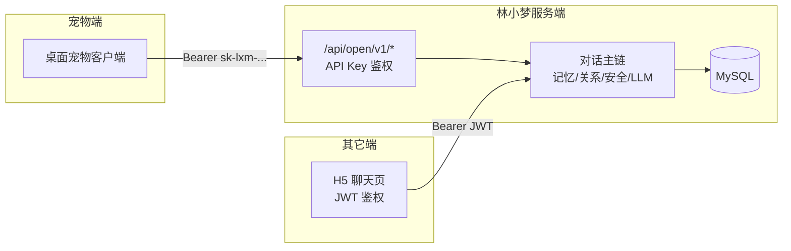
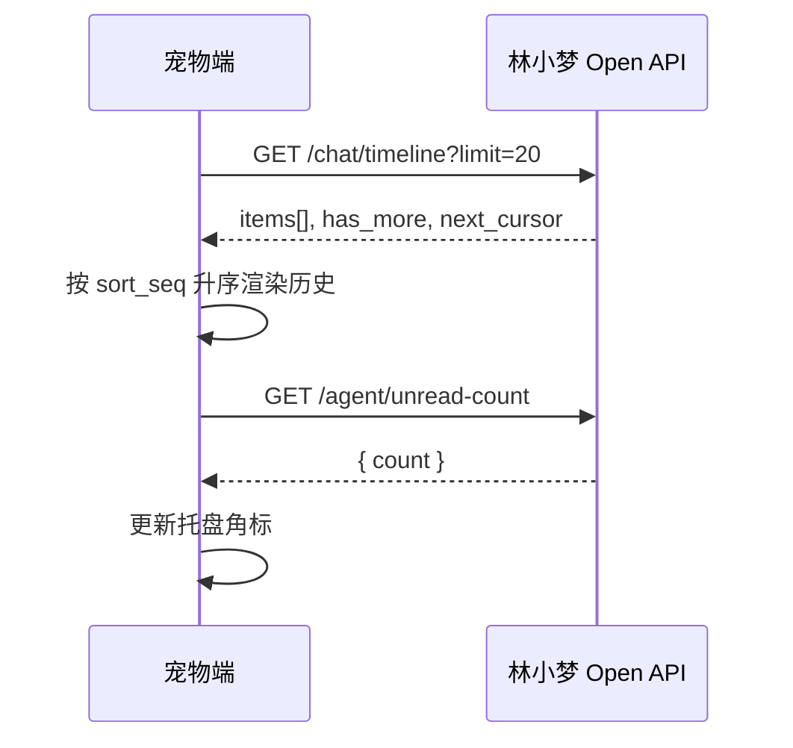
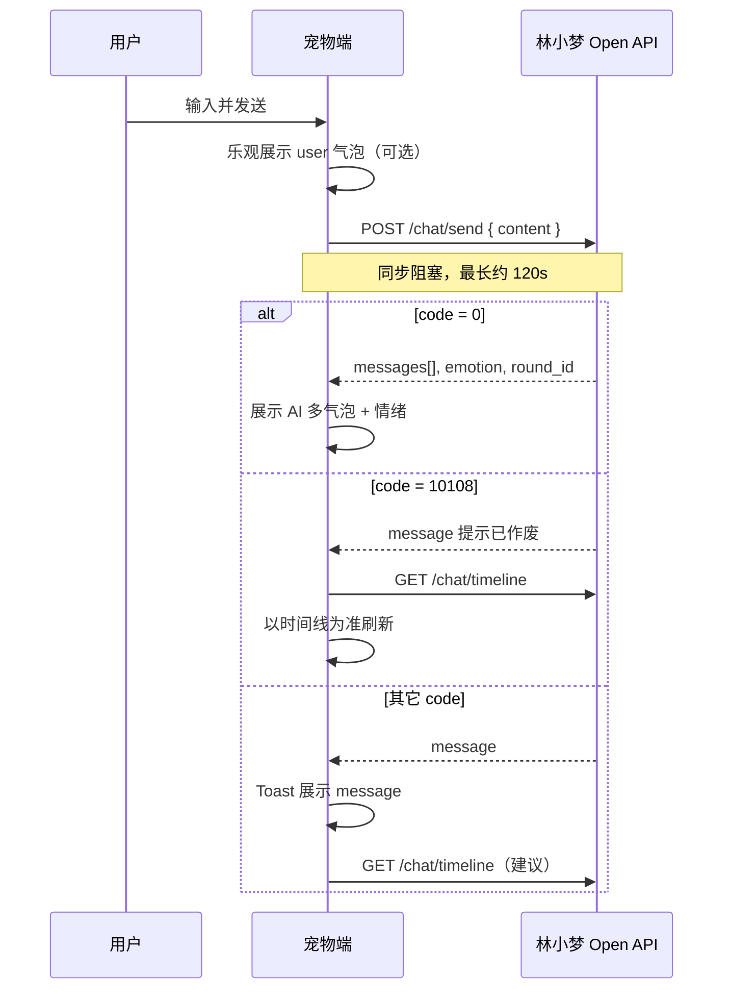
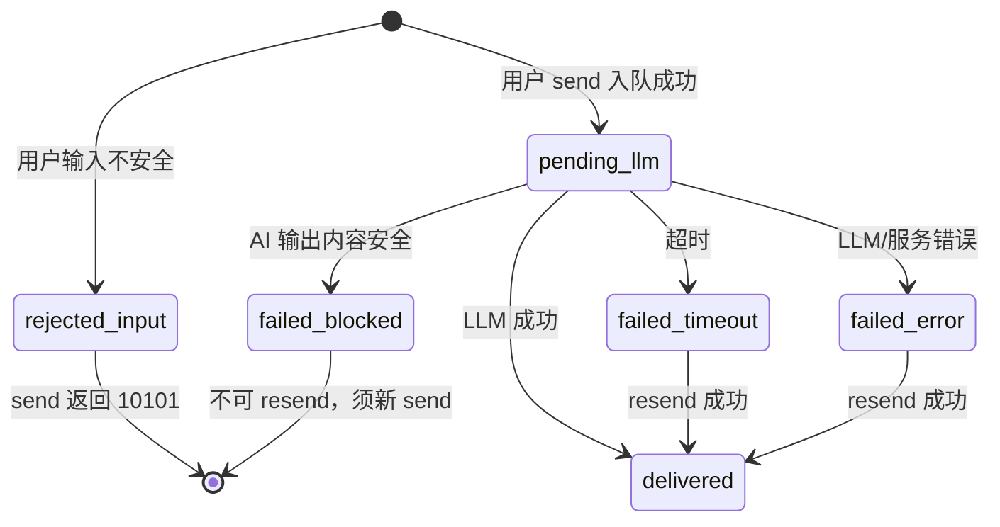
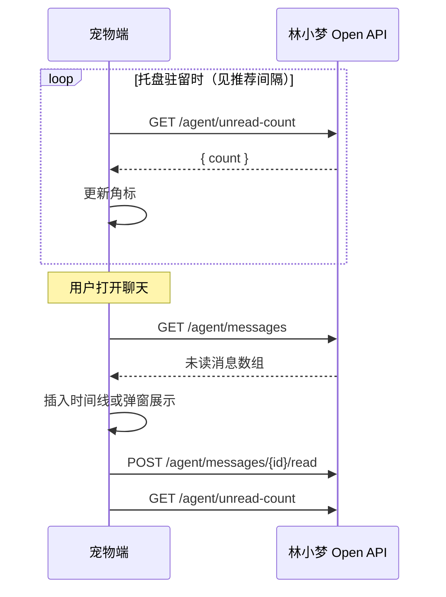

# 林小梦 Open API — 宠物端接入指南

> **文档版本**：v1.1  
> **适用接口**：Open API v1（`/api/open/v1/*`）  
> **最后更新**：2026-06-04（对照代码复核修订）  
> **读者**：第三方桌面宠物 / 客户端开发同学  

本文档说明如何在宠物端配置 **Base URL** 与 **API Key**，调用林小梦对话与主动消息接口，实现与 H5 聊天窗口等价的能力（同步 JSON，非 SSE）。

---

## 目录

1. [能力范围](#1-能力范围)
2. [接入前准备](#2-接入前准备)
3. [环境配置（Base URL）](#3-环境配置base-url)
4. [鉴权](#4-鉴权)
5. [通用约定](#5-通用约定)
6. [推荐客户端流程](#6-推荐客户端流程)
7. [接口说明](#7-接口说明)
8. [时间线字段与状态](#8-时间线字段与状态)
9. [错误码与处理](#9-错误码与处理)
10. [安全要求](#10-安全要求)
11. [联调与验收](#11-联调与验收)
12. [常见问题](#12-常见问题)
13. [附录：curl 示例](#13-附录curl-示例)

---

## 1. 能力范围

### 1.1 本接入包含（6 个接口）

| 能力 | 接口 |
|------|------|
| 发送用户消息（同步等待 AI 回复） | `POST /api/open/v1/chat/send` |
| 失败重发（叹号恢复） | `POST /api/open/v1/chat/resend` |
| 拉取统一时间线（历史、对账、失败态） | `GET /api/open/v1/chat/timeline` |
| 未读主动消息列表 | `GET /api/open/v1/agent/messages` |
| 未读数量（托盘角标） | `GET /api/open/v1/agent/unread-count` |
| 标记主动消息已读 | `POST /api/open/v1/agent/messages/{message_id}/read` |

宠物端通过上述接口即可完成：**用户发消息 → 展示林小梦回复（可多气泡）→ 展示情绪 → 处理失败重试 → 托盘未读角标 → 林小梦主动搭讪**。

### 1.2 本接入不包含

以下能力 **不在 Open API v1**，请勿使用 H5 的 JWT 路由（`/api/chat/*`、`/api/auth/*` 等）：

- 用户注册 / 登录 / Token 刷新  
- 关系等级、亲密值、日记、长期记忆列表  
- SSE 流式对话  
- 管理后台（`/api/admin/*`）  

业务错误提示请 **直接展示** 响应中的 `message` 字段（服务端已配置中文文案）。

### 1.3 数据同源说明

- 每个 API Key 绑定 **一个** 林小梦 H5 用户账号。  
- 宠物端发送的消息、AI 回复、主动消息与 **同一账号** 在 H5 端看到的数据 **完全一致**（同一数据库）。  
- 用户在 H5 发的消息，宠物端拉 `timeline` 可见；反之亦然。



---

## 2. 接入前准备

### 2.1 账号与 API Key（一对一）

| 规则 | 说明 |
|------|------|
| 绑定关系 | **1 个宠物实例 / 1 个终端用户 ↔ 1 个林小梦用户 ↔ 1 个 API Key** |
| Key 签发 | 由林小梦运营在管理后台 **手动生成**，明文 **仅展示一次** |
| Key 格式 | `sk-lxm-` + 随机串，例：`sk-lxm-a1b2c3d4...` |
| 重新生成 | 在后台对该用户再次「生成/重新生成」会 **立即吊销** 旧 Key，宠物端须更新配置 |
| 获取方式 | **联系林小梦运营** 提供对应环境的 Base URL 与 API Key（联调、生产分别申请） |

运营侧操作路径（供对接参考，宠物端无需调用）：管理后台 → 用户管理 → 用户详情 → **Open API Key** → 生成。

### 2.2 宠物端须实现的配置项

在宠物 **设置页** 提供两项可编辑配置（用户粘贴即可，与常见 SaaS 接入方式一致）：

| 配置项 | 说明 | 示例 |
|--------|------|------|
| **服务器地址 / Base URL** | 林小梦服务根地址，**不要**包含 `/api/...` 路径；末尾不要加 `/` | 生产：`http://cllxm.com` |
| **API Key** | 该环境下运营签发的 Key | `sk-lxm-xxxxxxxx` |

**URL 拼接规则：**

```text
完整接口地址 = {Base URL}/api/open/v1/{资源路径}
```

示例：

```text
Base URL:  http://cllxm.com
发送消息:  http://cllxm.com/api/open/v1/chat/send
```

> **重要**：测试环境与生产环境的 **Base URL 与 API Key 必须成对更换**。测试库签发的 Key **不能**用于生产 Base URL。

---

## 3. 环境配置（Base URL）

采用 **「用户粘贴不同 Base URL 切换环境」** 的最简方案，林小梦不在宠物包内写死环境列表。

| 环境 | Base URL（配置值） | API Key |
|------|-------------------|---------|
| **生产** | `http://cllxm.com` | 在生产环境由运营签发 |
| **联调 / 测试** | 联调时由运营 **单独提供**（常见为运营本地 Docker 暴露的地址，如 `http://127.0.0.1` 或内网 IP；**以运营当时提供的为准**） | 在 **同一测试环境** 由运营签发 |

说明：

- 生产公网当前为 **HTTP**（非 HTTPS），见 [§10 安全要求](#10-安全要求)。若后续升级为 HTTPS，只需在宠物设置中把 Base URL 改为 `https://cllxm.com`，Key 不变。  
- 本地 Docker 默认可能通过 `http://localhost`（Nginx 80）或 `http://localhost:8000`（直连 Backend）访问；**联调请以运营提供的 Base URL 为准**，不要自行猜测端口。  
- 文档 **不写死** 测试 Key；实际联调时向运营索取 **一对**「测试 Base URL + 测试 API Key」。

---

## 4. 鉴权

### 4.1 请求头

所有 `/api/open/v1/*` 请求必须携带：

```http
Authorization: Bearer sk-lxm-你的APIKey
Content-Type: application/json
```

- 头名称与 H5 相同（`Authorization: Bearer`），但 **值必须是 API Key**，不是 JWT。  
- 把 API Key 拿去调 `/api/chat/send` 等 H5 接口会 **401**；把 JWT 拿来调 Open 接口也会 **401**。

### 4.2 鉴权失败（HTTP 401）

鉴权失败 **不** 使用业务信封 `{code, data, message}`，而是 FastAPI 标准格式：

```json
{"detail":"未提供 API Key"}
```

| HTTP | `detail` 文案 | 处理建议 |
|------|---------------|----------|
| 401 | `未提供 API Key` | 检查是否携带 `Authorization` |
| 401 | `API Key 无效或已吊销` | 检查 Key 是否粘贴完整、是否已被重新生成 |
| 401 | `账号已被禁用` | 联系运营处理用户状态 |

---

## 5. 通用约定

### 5.1 业务响应信封

除 **401** 外，成功与业务失败均为：

```json
{
  "code": 0,
  "data": {},
  "message": "success"
}
```

| 字段 | 说明 |
|------|------|
| `code` | `0` 表示成功；非 `0` 为业务错误码 |
| `data` | 成功时的业务数据；失败时多为 `null` |
| `message` | 人类可读文案；**失败时请直接展示给用户** |

### 5.2 HTTP 超时

| 接口类型 | 建议客户端超时 |
|----------|----------------|
| `POST .../chat/send`、`POST .../chat/resend` | **≥ 130 秒**（服务端等待 LLM 上限 120 秒） |
| `GET` 类接口 | 10–30 秒 |

### 5.3 参数校验失败（HTTP 422）

例如 `send` 的 `content` 为空或超过 2000 字，可能返回 **422**，body 为 FastAPI 校验详情，**不是** 上表业务信封。宠物端应在本地先做长度校验（1–2000 字），尽量避免 422。

---

## 6. 推荐客户端流程

### 6.1 应用冷启动



1. 读取本地保存的 Base URL、API Key。  
2. 调用 `GET /chat/timeline` 拉最近消息并展示。  
3. 调用 `GET /agent/unread-count` 更新角标（若 `count > 0`，可在用户打开聊天时再拉 `agent/messages`）。

> **与 H5 的差异**：H5 首屏拉 `timeline` 时服务端会尝试后台恢复卡死的队列；**Open API 的 `GET /chat/timeline` 不会触发该恢复**。若长时间看到 `pending_llm`，可再次 `send`（若返回 **10104** 会触发后台补跑）或等待数秒后刷新 timeline，勿仅靠冷启动拉 timeline 自愈。

### 6.2 用户发送消息



**要点：**

- `send` 为 **同步**：一次请求返回完整 AI 回复，无需再收 SSE。  
- `data.messages` 为数组，**按顺序逐条展示**（与线上一致，可能 1–3 条短句）。  
- 每条结构：`{ "type": "text", "content": "..." }`，正文读 **`content`**。  
- `data.emotion`：`{ "label": "开心", "confidence": 0.9 }`，可用于切换宠物表情/氛围（可选）。  
- 用户 **连发** 时，较早的请求可能返回 **10108**，必须以 **timeline 对账** 为准，不要当作最终失败。

### 6.3 失败与叹号重发

**内容安全分两条路径（勿混淆）：**

| 阶段 | 行为 | 同步接口 | timeline user 行 |
|------|------|----------|------------------|
| **用户输入**不安全 | 入队前拦截，**不写入** `pending_llm` | **10101**，展示 `message` | 通常无新行 |
| **AI 输出**不安全 | 已入队生成后拦截 | **10101**，展示 `message` | **`failed_blocked`** |



1. 通过 `timeline` 查看 **user** 行的 `delivery_status`。  
2. 仅当存在 **`failed_timeout`** 或 **`failed_error`** 时，可调用 `POST /chat/resend`（**无 Body**）。  
3. **`failed_blocked` 不可 resend**（同步接口已是 10101）；须提示用户 **重新 `send` 新内容**（不必改原句，新一句即可）。  
4. `resend` 同样为同步等待，规则与 `send` 相同（含 10105、10108）。

### 6.4 主动消息与托盘角标



| 场景 | 推荐做法 |
|------|----------|
| 托盘角标轮询 | `GET /agent/unread-count`，间隔 **60 秒**（应用在前台且聊天窗打开时可 **停止** 轮询，改为发送/已读后立即刷新） |
| 用户点开聊天 | `GET /agent/messages` 拉全文，展示后逐条 `POST .../read` |
| 已读后再查角标 | 再调一次 `unread-count` 置 0 |

`trigger_type` 取值（展示用，不影响接口逻辑）：`P0` 情绪跟进、`P1` 长期沉默、`P2` 日常问候、`P3` 凌晨在线、`P4` 轻度沉默、`FUTURE`（对话中约定的 Future 槽到期）等。

---

## 7. 接口说明

以下 `{base}` 表示 `{Base URL}/api/open/v1`。

### 7.1 POST `{base}/chat/send`

**发送用户消息，同步返回 AI 回复。**

**请求 Body：**

```json
{
  "content": "你好呀"
}
```

| 字段 | 类型 | 约束 |
|------|------|------|
| `content` | string | 必填，1–2000 字（去首尾空格后非空） |

**成功 `code = 0` 时 `data`：**

```json
{
  "messages": [
    { "type": "text", "content": "嗨，我在呢。" }
  ],
  "emotion": {
    "label": "开心",
    "confidence": 0.9
  },
  "round_id": "550e8400-e29b-41d4-a716-446655440000"
}
```

| 字段 | 说明 |
|------|------|
| `messages` | AI 回复气泡列表，按数组顺序展示 |
| `emotion.label` | 林小梦当前情绪标签，如：开心、担心、想念、平静 |
| `emotion.confidence` | 0–1 置信度 |
| `round_id` | 本轮对话 UUID；**仅出现在 `send`/`resend` 成功 `data` 中**，`timeline` 的 `items[]` **不返回**此字段 |

---

### 7.2 POST `{base}/chat/resend`

**对最近一次可重发的失败窗口发起重试。**

- **无请求 Body**（空 POST 即可，`Content-Type: application/json` 可保留）。  
- 成功 `data` 结构与 `send` 相同。  
- 无可重发失败句时返回 **10107**；重发过于频繁返回 **10105**（2 次/分钟量级，与线上一致）。

---

### 7.3 GET `{base}/chat/timeline`

**拉取对话 + 主动消息统一时间线（分页）。**

**Query：**

| 参数 | 类型 | 说明 |
|------|------|------|
| `cursor` | int，可选 | 上一页返回的 `next_cursor`（`sort_seq`） |
| `limit` | int，可选 | 1–50，默认 20 |

**成功 `data`：**

```json
{
  "items": [ /* 见 §8 */ ],
  "next_cursor": 12345,
  "has_more": true
}
```

- `items` 按 **时间正序** 返回（旧 → 新），适合直接 append 到聊天列表。  
- 加载更多：用本次的 `next_cursor` 作为下次请求的 `cursor`（向更早历史翻页）。  
- **只读接口**：不触发队列死锁恢复（见 [§6.1](#61-应用冷启动) 与 H5 的差异说明）。

---

### 7.4 GET `{base}/agent/messages`

**未读主动消息列表（已读的不返回）。**

**成功 `data`：** 数组，元素示例：

```json
{
  "id": 1001,
  "trigger_type": "P4",
  "content": "好久没聊了，有点想你。",
  "action_score": 7,
  "created_at": "2026-06-04T12:00:00"
}
```

---

### 7.5 GET `{base}/agent/unread-count`

**未读主动消息数量（轻量，供托盘轮询）。**

**成功 `data`：**

```json
{
  "count": 2
}
```

---

### 7.6 POST `{base}/agent/messages/{message_id}/read`

**将一条主动消息标为已读。**

- 路径参数 `message_id` 为整数，来自 `agent/messages` 或 timeline 中 `source=agent` 的 `id`。  
- 成功 `code = 0`；消息不存在或不属于当前用户：**10400**，`message` 为「主动消息不存在」。  
- 重复已读仍可能返回成功（`message` 可能为「消息已标记为已读」）。

---

## 8. 时间线字段与状态

### 8.1 `items[]` 单条结构

时间线合并 **用户/AI 对话** 与 **主动消息**，用 `source` 区分：

| `source` | 含义 | 典型字段 |
|----------|------|----------|
| `user` | 用户发送 | `content`, `delivery_status`, `emotion_label` |
| `assistant` | 林小梦回复 | `content`, `emotion_label`；`delivery_status` 为 `null` |
| `agent` | 主动消息 | `content`, `is_read`, `trigger_type` |

**公共字段：**

| 字段 | 类型 | 说明 |
|------|------|------|
| `sort_seq` | int | 全局排序序号，分页游标 |
| `id` | int | 记录 ID |
| `content` | string | 文本内容 |
| `created_at` | string | ISO8601 时间 |
| `emotion_label` | string \| null | 情绪标签 |
| `delivery_status` | string \| null | 仅 **user** 行有意义，见下表 |
| `skipped_in_prompt` | bool \| null | user 行：是否未进入本轮 Prompt |
| `is_read` | bool \| null | agent 行：是否已读 |
| `trigger_type` | string \| null | agent 行：触发类型 P0–P4、`FUTURE` 等 |

> **`round_id` 不在 timeline 中**：库内虽有该字段，但 `GET .../chat/timeline` 的 `items[]` **不包含** `round_id`。多气泡对账请用 `sort_seq` 与 `source=assistant` 的相邻行，或直接使用 `send`/`resend` 返回的 `messages[]`。

### 8.2 `delivery_status`（user 行）

| 值 | 含义 | 宠物端 UI 建议 |
|----|------|----------------|
| `pending_llm` | 等待 AI 生成 | 发送中 / loading |
| `delivered` | 已成功回复 | 正常 |
| `failed_timeout` | 超时 | 显示重试（可调 `resend`） |
| `failed_error` | 服务错误 | 显示重试（可调 `resend`） |
| `failed_blocked` | AI 输出内容安全拦截（用户输入已在入队前单独拦截） | **不要** 走 resend；重新 `send` 新消息 |

**assistant / agent 行** 的 `delivery_status`、`skipped_in_prompt` 键存在但值为 **`null`**。

### 8.3 多气泡与 timeline 对齐

- `send` / `resend` 成功时，优先用响应里的 **`messages[]` 按序展示**（1–3 条短句）。  
- 与 timeline 对账时：同一轮成功回复在 timeline 中表现为 **多条连续的 `source=assistant` 行**，按 **`sort_seq` 升序** 与 `messages[i].content` 一一对应（**勿依赖 `round_id`**，timeline 未暴露该字段）。  
- 若同步接口失败、返回 **10108** 或需刷新历史，**以 `timeline` 为准** 重绘界面，避免重复或漏展示。

---

## 9. 错误码与处理

业务失败时 **HTTP 状态码仍为 200**，请判断 `code` 字段。

| code | 含义 | 建议处理 |
|------|------|----------|
| **0** | 成功 | 解析 `data` |
| **10100** | 内容为空 | 本地校验，提示用户输入 |
| **10101** | 内容安全不通过（**含**用户输入入队前拦截、**或** AI 输出拦截后同步失败） | **展示 `message`**；用户输入场景改措辞重发；AI 输出场景 timeline 可能为 `failed_blocked`，**重新 send** |
| **10102** | LLM 失败/超时 | **展示 `message`**，拉 timeline 看是否 `failed_timeout`/`failed_error`，可 resend |
| **10104** | 待处理消息过多（未闭环 ≥5 且无叹号） | **展示 `message`**；服务端可能已 **后台补跑** bundle，宜 **等待数秒后刷新 timeline**，勿立即连发 |
| **10105** | 重发过于频繁 | **展示 `message`**，稍后重试 |
| **10107** | 当前无可重发 | **展示 `message`**，检查 timeline |
| **10108** | 等待中被新消息取代 | **展示 `message`**，**必须** `GET timeline` 对账 |
| **10400** | 主动消息不存在 | **展示 `message`** |

完整中文 `message` 以服务端返回为准，常见默认值包括：

- 10101：`消息包含不适当内容，请修改后重试`  
- 10104：`待处理消息过多，请先等待或处理失败提示`  
- 10108：`回复已被新消息取代，请拉取时间线查看后再操作`  

---

## 10. 安全要求

1. **传输**：生产当前为 **HTTP**，Bearer 中的 Key 可能被窃听；请仅在受信网络使用，或待 HTTPS 上线后更新 Base URL。  
2. **存储**：API Key 存操作系统凭据库或加密配置，**不要**写进日志、崩溃上报、截图。  
3. **禁止**在浏览器网页中直连 Open API（易泄露 Key）。  
4. **禁止**把 Key 提交到公开仓库。  
5. 客户端日志勿打印完整 `Authorization` 头。

---

## 11. 联调与验收

### 11.1 联调物资（向运营索取）

- [ ] 测试环境 **Base URL**（一对配置）  
- [ ] 测试环境 **API Key**（对应该 Base URL 下签发的用户）  
- [ ] 确认该用户在后台 **未禁用**  

生产上线前另行索取生产 Base URL（`http://cllxm.com`）与生产 Key。

### 11.2 建议验收用例

| # | 步骤 | 预期 |
|---|------|------|
| 1 | 配置 Base URL + Key，拉 timeline | `code=0`，`items` 可渲染 |
| 2 | send 正常短句 | `code=0`，`messages` 非空，`emotion` 有 `label` |
| 3 | send：`""` / 仅空格 / 超长 | `""` → **422**；仅空格经校验后 → **10100**；超长 → **422**（建议本地先校验 1–2000 字） |
| 4 | 故意触发敏感词（若可测） | `code=10101`，展示 `message` |
| 5 | timeline 中 `failed_timeout` 后 resend | `code=0` 或合理失败码 |
| 6 | `failed_blocked` 行点 resend | `code=10107`，须改内容后 send |
| 7 | 快速连发两条 send | 至少一条可能 10108；timeline 最终一致 |
| 8 | unread-count → messages → read | 角标减少，已读不再出现在 messages |
| 9 | 错误 Key | HTTP 401 |
| 10 | 用 Key 调 `/api/chat/send` | HTTP 401（路径隔离） |

---

## 12. 常见问题

**Q：宠物需要帮用户注册林小梦账号吗？**  
A：需要先有 H5 用户账号，再由运营绑定签发 Key；Open API **不提供注册接口**。

**Q：能否一个 Key 给多台设备？**  
A：技术上可以共用同一 Key，但多设备同时发消息会共享同一聊天队列与 10104/10108 规则，**建议一宠一端一 Key**（由运营为每端用户各建账号与 Key）。

**Q：send 很慢是否正常？**  
A：正常。同步等待 LLM + 记忆检索，通常数秒至数十秒，超时上限约 120 秒，客户端超时请设 ≥130 秒。

**Q：H5 能看到的日记、等级，宠物能拉吗？**  
A：不能，本接入仅对话与主动消息六接口。

**Q：重新生成 Key 后旧客户端会怎样？**  
A：旧 Key 立即 401，须让用户更新配置或联系运营重新粘贴。

**Q：timeline 里一直 `pending_llm` 怎么办？**  
A：Open 的 `GET timeline` **不会**像 H5 那样自动触发恢复。可再次 `send`（可能 10104 并触发后台补跑），或等待后刷新 timeline；仍异常请联系运营。

---

## 13. 附录：curl 示例

将 `BASE` 和 `KEY` 替换为实际配置（生产示例）：

```bash
export BASE="http://cllxm.com"
export KEY="sk-lxm-你的Key"
```

**发送消息：**

```bash
curl -sS -X POST "${BASE}/api/open/v1/chat/send" \
  -H "Authorization: Bearer ${KEY}" \
  -H "Content-Type: application/json" \
  -d '{"content":"你好"}' \
  --max-time 130
```

**时间线：**

```bash
curl -sS "${BASE}/api/open/v1/chat/timeline?limit=20" \
  -H "Authorization: Bearer ${KEY}"
```

**未读数：**

```bash
curl -sS "${BASE}/api/open/v1/agent/unread-count" \
  -H "Authorization: Bearer ${KEY}"
```

**重发（无 Body）：**

```bash
curl -sS -X POST "${BASE}/api/open/v1/chat/resend" \
  -H "Authorization: Bearer ${KEY}" \
  -H "Content-Type: application/json" \
  --max-time 130
```

---

## 文档变更

| 版本 | 日期 | 说明 |
|------|------|------|
| v1.1 | 2026-06-04 | 对照代码复核：修正 timeline 无 `round_id`、内容安全双路径、Open timeline 不触发队列恢复、10104 后台补跑、验收用例与 `FUTURE` 触发类型 |
| v1.0 | 2026-06-04 | 首版：宠物端接入说明 |

内部技术摘要见：`docs/design/open-api-v1.md`；服务端契约见：`docs/contract.md`（Open API v1 章节）。
